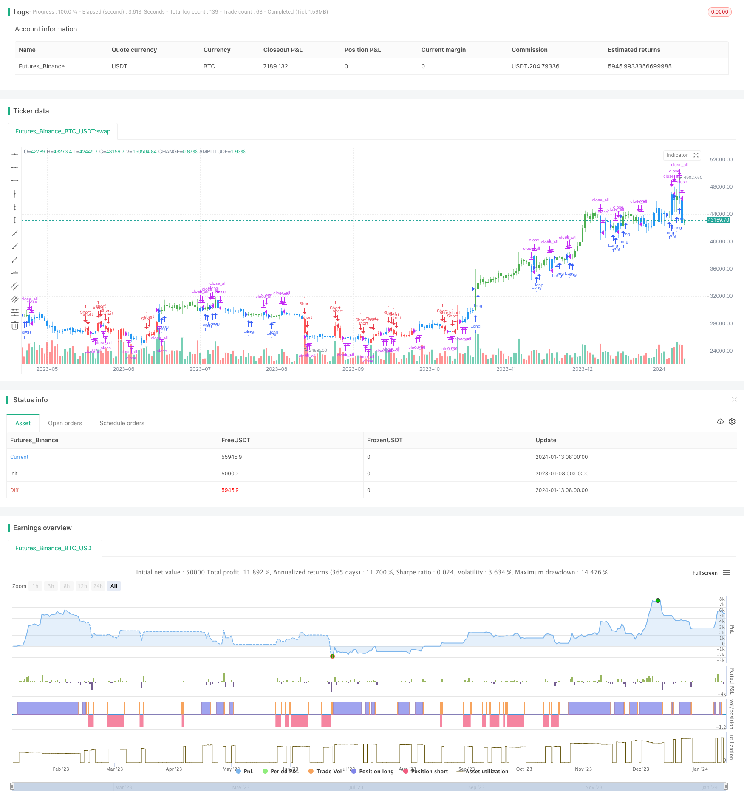

> Name

Dual-Moving-Average-Reversal-Trading-Strategy based on Dual-Moving-Average-Reversal-Trading-Strategy
> Author

ChaoZhang

> Strategy Description


 [trans]

## Overview
The double moving average reversal trading strategy combines the Bollinger Bands reversal trading strategy and the double exponential moving average trading strategy to design a comprehensive signal judgment trading strategy. It can be used in markets such as stocks, forex, cryptocurrencies, and more.
## Strategy Principle
The strategy consists of two parts:
1. Bollinger Bands Reversal Trading Strategy
Use two lines from the Bollinger Bands indicator - %K line and %D line. Go long when the closing price is lower than the previous day for two consecutive days and the %K line is higher than the %D line; go short when the closing price is higher than the previous day for two consecutive days and the %K line is lower than the %D line.
2. Double Exponential Moving Average Strategy
Calculate the double exponential moving average of the 20th and 20th*2. A trading signal is generated when the price crosses below or below the double exponential moving average.
Comprehensive signal judgment rules: When the trading signals of the two strategies are consistent, an actual trading signal is generated.
## Advantage Analysis
The biggest advantage of this combination strategy is its high reliability and few false signals. Because it requires signals from two different types of strategies to be triggered at the same time, it filters out some erroneous signals that may appear in a single strategy.
In addition, due to the combination of reversal strategy and trend strategy, it can capture the short-term reversal and medium-term trend of the underlying security price.
## Risk Analysis
The main risk of this strategy is that when the market is in a long-term shock adjustment, the two strategies may not be able to produce consistent signals, leading to an ineffective market state. At this time, traders need to pause using the strategy and wait for a clear trend to form.
In addition, the double exponential moving average, as a medium and long-term indicator, may also fail when the short-term reverses rapidly. This requires traders to combine more indicators to judge the market trend.
## Optimization direction
This strategy can be optimized from the following aspects:
1. Add more parameters, such as stop loss point, trailing stop loss range, etc., to make the strategy more controllable.
2. Add more indicators to form multiple filtering conditions to eliminate more noise transactions. For example, combined with other indicators such as MACD and KD.
3. Optimize indicator parameters, such as the adjustment of Bollinger Band period, moving average period and other parameters, and find the best parameter combination.
4. Test the effect of the strategy in different varieties (stocks, foreign exchange, cryptocurrencies, etc.) and select the best applicable varieties.
## Summarize
The double moving average reversal strategy uses a combination of reversal strategies and trend strategies to form a more reliable comprehensive trading signal. It is suitable for traders interested in both short-term reversals and medium-term trends in security prices. However, it should be noted that this strategy may fail in long-term volatile market conditions. The practicality of this strategy can be further enhanced by optimizing parameters and adding more indicators.
||

## Overview

The dual moving average reversal trading strategy combines the Bollinger Bands reversal trading strategy and the dual exponential moving average trading strategy to design a comprehensive signal judgment trading strategy. It can be used in markets like stocks, forex, and cryptocurrencies.

## Strategy Principles 

The strategy consists of two parts:

1. Bollinger Bands reversal trading strategy

   Use two lines from the Bollinger Bands indicator - %K line and %D line. Go long when the close price is lower than the previous day's close for two consecutive days and the %K line is above the %D line; go short when the close price is higher than the previous day's close for two consecutive days and the %K line is below the %D line.

2. Dual exponential moving average strategy

   Calculate the 20-day and 20-day*2 dual exponential moving averages. A trading signal is generated when the price crosses over or under the dual moving averages.  

The combined signal judgment rule: A actual trading signal is generated only when the trading signals from both strategies agree.

## Advantage Analysis

The biggest advantage of this combined strategy is its high reliability and few false signals. Because it requires the signals from two different types of strategies to trigger at the same time, which filters out some of the false signals that may appear in a single strategy.

In addition, by combining reversal and trend strategies, it can capture both short-term reversals and medium-term trends of the underlying securities.

## Risk Analysis

The main risk of this strategy is that when the market is in long-term oscillation, the two strategies may fail to produce consistent signals, resulting in invalid market conditions. At this point, traders need to suspend the use of this strategy and wait for a clear trend to form.

In addition, as a medium and long-term indicator, the dual moving average may fail when short-term reversals occur rapidly. This requires traders to judge the broader market trend with more indicators.

## Optimization Directions

The strategy can be optimized in the following ways:

1. Add more parameters like stop loss price, trailing stop loss price range etc to make the strategy more controllable. 

2. Add more indicators to form multiple filter criteria and eliminate more noisy trades. For example, combine with MACD, KD and other indicators.

3. Optimize indicator parameters like Bollinger period, moving average period etc, to find the best parameter combination.  

4. Test the effectiveness of this strategy respectively in different products (stocks, forex, crypto etc) and select the best suitable ones.

## Conclusion

The dual moving average reversal strategy generates relatively reliable combined trading signals by combining reversal and trend strategies. It suits traders who are interested in both short-term reversals and medium-term trends of the securities’ prices. But note that the strategy may fail in long-term range-bound markets. By optimizing parameters and adding more indicators, the practicality of this strategy can be further enhanced.

[/trans]

> Strategy Arguments


|Argument|Default|Description|
|----|----|----|
|v_input_1|14|Length|
|v_input_2|true|KSmoothing|
|v_input_3|3|DLength|
|v_input_4|50|Level|
|v_input_5|20|MA_Length|
|v_input_6|false|Trade reverse|


> Source (PineScript)

``` pinescript
/*backtest
start: 2023-01-08 00:00:00
end: 2024-01-14 00:00:00
period: 1d
basePeriod: 1h
exchanges: [{"eid":"Futures_Binance","currency":"BTC_USDT"}]
*/

//@version=3
////////////////////////////////////////////////////////////
//  Copyright by HPotter v1.0 12/04/2019
// This is combo strategies for get 
// a cumulative signal. Result signal will return 1 if two strategies 
// is long, -1 if all strategies is short and 0 if signals of strategies is not equal.
//
// First strategy
// This System was created from the Book "How I Tripled My Money In The 
// Futures Market" by Ulf Jensen, Page 183. This is reverse type of strategies.
// The strategy buys at market, if close price is higher than the previous close 
// during 2 days and the meaning of 9-days Stochastic Slow Oscillator is lower than 50. 
// The strategy sells at market, if close price is lower than the previous close price 
// during 2 days and the meaning of 9-days Stochastic Fast Oscillator is higher than 50.
//
// Secon strategy
// This indicator plots 2/20 exponential moving average. For the Mov 
// Avg X 2/20 Indicator, the EMA bar will be painted when the Alert criteria is met.
// Please, use it only for learning or paper trading. Do not for real trading.
//
// WARNING:
// - For purpose educate only
// - This script to change bars colors.
////////////////////////////////////////////////////////////
Reversal123(Length, KSmoothing, DLength, Level) =>
    vFast = sma(stoch(close, high, low, Length), KSmoothing) 
    vSlow = sma(vFast, DLength)
    pos = 0.0
    pos := iff(close[2] < close[1] and close > close[1] and vFast < vSlow and vFast > Level, 1,
	         iff(close[2] > close[1] and close < close[1] and vFast > vSlow and vFast < Level, -1, nz(pos[1], 0))) 
	pos

EMA2_20(MA_Length, MA_xPrice) =>
    xXA = ema(MA_xPrice, MA_Length)
    nHH = max(high, high[1])
    nLL = min(low, low[1])
    nXS = iff((nLL > xXA)or(nHH < xXA), nLL, nHH)
    pos = 0.0
    pos := iff(nXS > close[1] , -1, iff(nXS < close[1] , 1, nz(pos[1], 0))) 
    pos

strategy(title="Combo Backtest 123 Reversal and 2/20 EMA", shorttitle="Combo Backtest", overlay = true)
Length = input(14, minval=1)
KSmoothing = input(1, minval=1)
DLength = input(3, minval=1)
Level = input(50, minval=1)
MA_Length = input(20, minval=1)
reverse = input(false, title="Trade reverse")
MA_xPrice = close
posReversal123 = Reversal123(Length, KSmoothing, DLength, Level)
posEMA2_20 = EMA2_20(MA_Length, MA_xPrice)
pos = iff(posReversal123 == 1 and posEMA2_20 == 1 , 1,
	   iff(posReversal123 == -1 and posEMA2_20 == -1, -1, 0)) 
possig = iff(reverse and pos == 1, -1,
          iff(reverse and pos == -1, 1, pos))	   
if (possig == 1) 
    strategy.entry("Long", strategy.long)
if (possig == -1)
    strategy.entry("Short", strategy.short)	 
if (possig == 0) 
    strategy.close_all()
barcolor(possig == -1 ? red: possig == 1 ? green : blue ) 
```

> Detail

https://www.fmz.com/strategy/438787

> Last Modified

2024-01-15 12:35:29
