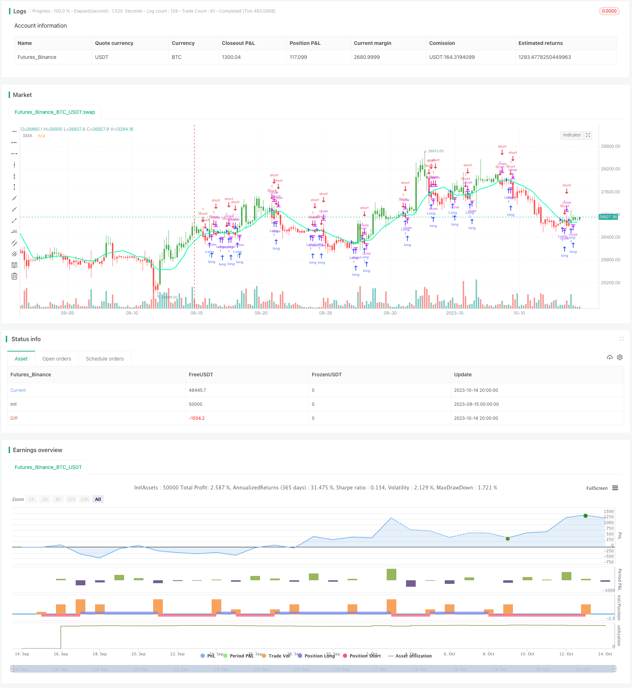

> Name

Dual-Moving-Average-Reversal-Trading-Strategy
> Author

ChaoZhang

> Strategy Description




[trans]


## Overview
The dual moving average reversal trading strategy calculates simple moving averages for two different periods, short-term and long-term, and generates trading signals based on the relationship between price and the moving average. When the short-term moving average crosses the long-term moving average, go long; when the short-term moving average crosses below the long-term moving average, go short. This strategy is a trend following strategy.
## Strategy Principle
This strategy sets two simple moving averages with different period lengths by inputting parameters. The short period line is called the fast line, and the long period line is called the slow line. The fast line responds to price changes more quickly and can capture short-term trends; the slow line responds to price changes more slowly and can filter out short-term market noise and capture the main trend. When the fast line crosses the slow line, it indicates that the price upward momentum is strengthening, so go long; when the fast line crosses the slow line, it indicates that the price downward momentum is strong, so go short.
Specifically, the strategy calculates two moving averages through the sma() function, and assigns the calculation results to xSMA (slow line) and fast line. The strategy uses close prices to calculate moving averages. When the close price goes above xSMA, go long; when the close price goes below xSMA, go short. The strategy also sets a trading time range limit, and trading signals will only be issued within the specified time range.
Set a take-profit and stop-loss point for each transaction, and immediately stop-profit and stop-loss when the take-profit and stop-loss point is reached. At the same time, the strategy displays the relationship between the price and the slow line on the K line through the barcolor function: when going long, the K line is green; when going short, the K line is red; when closing a position, the K line is blue.
## Advantage Analysis
- Use the dual moving average system to effectively track trends and avoid being misled by short-term market noise
- Using fast and slow moving averages to improve the quality of trading signals
- Set take-profit and stop-loss points to control the risk of a single transaction
- Limit the trading time range to avoid huge fluctuations caused by major events
- Mark trading signals on the K line to form visual aids and improve intuitiveness
## Risk Analysis
- The dual moving average system is prone to produce more false signals, and frequent transactions bring pressure on transaction costs.
- It is necessary to set the moving average parameters reasonably, otherwise the smoothing effect will be poor or there will be too many waiting opportunities.
- There is a time lag in the moving average system and the turning point of the trend may be missed.
- Fixed take-profit and stop-loss points may be too arbitrary and cannot be adjusted dynamically
- Limiting the trading time range may miss trading opportunities in other time periods
Risks can be reduced by adjusting moving average parameters, optimizing stop-profit and stop-loss strategies, canceling time limits or setting more reasonable trading time periods. You can also consider combining other indicators as filter conditions to avoid too many false signals.
## Optimization direction
- You can test combinations of different moving average periods to find the best parameters
- You can consider changing the stop-profit and stop-loss to dynamic tracking, such as linking to ATR
- Other indicators, such as MACD, KD, etc., can be introduced as filter signals
- The trading time range can be optimized to capture more trading opportunities
- You can combine breakthrough strategies to find breakthrough signals near the moving average
- A dynamic exit mechanism can be established to proactively stop losses when the price enters the range.
## Summarize
The double moving average reversal trading strategy overall is a simple and practical trend following strategy. It makes full use of the smoothing effect of moving averages to identify trend directions, and generates trading signals in conjunction with fast and slow moving averages. This strategy is easy to implement, has clear ideas, and is suitable for beginners to master. But it may produce more false signals and time lag problems. It can be improved through parameter optimization, introduction of auxiliary indicators and other methods to make the strategy more stable and reliable. If used correctly, this strategy can produce consistent profits and deserves thorough testing and optimization.
||


## Overview

The dual moving average reversal trading strategy generates trading signals by calculating simple moving averages of two different periods - short term and long term. It goes long when the short period moving average crosses above the long period moving average, and goes short when the short period moving average crosses below the long period moving average. This strategy belongs to the trend following strategy category.

## Strategy Logic

This strategy sets two simple moving averages with different period lengths through the input parameters, with the short period MA referred to as the fast line, and the long period MA referred to as the slow line. The fast line reacts faster to price changes and captures short term trends, while the slow line reacts slower to price changes and filters out short term market noise, capturing the major trend. When the fast line crosses above the slow line, it indicates the uptrend is strengthening and a long position is taken. When the fast line crosses below the slow line, it indicates the downtrend is strengthening and a short position is taken.

Specifically, the strategy calculates the two MAs using the sma() function, assigning the result to xSMA (slow line) and fast line. The MAs are calculated based on the close price. When the close price crosses above xSMA, a long position is taken. When the close price crosses below xSMA, a short position is taken. The strategy also sets a trading time range limit, so that trading signals are only generated within the specified time range. 

Take profit and stop loss points are set for each trade, and profit is taken or stop loss triggered immediately when price reaches the take profit or stop loss level. Meanwhile, the strategy plots the price vs MA relationship on the bars using the barcolor function - bars are colored green during long positions, red during short positions, and blue when flat.

## Advantage Analysis

- Using a dual MA system can effectively track trends and avoid being misled by short term market noise
- Combining fast and slow MAs can improve trading signal quality 
- Take profit and stop loss points control risk for each trade
- Limiting trading time range avoids huge swings around major events
- Plotting trading signals on bars creates visual aid and improves intuitiveness

## Risk Analysis

- Dual MA systems tend to generate more false signals, increasing trading frequency and costs
- MA parameters need to be set reasonably, otherwise smoothing effect suffers or too many missed opportunities
- MA systems have lag and may miss trend turning points
- Fixed take profit/stop loss may be too blunt and cannot adjust dynamically 
- Limiting trading time range may miss opportunities in other periods

Risk can be reduced by adjusting MA parameters, optimizing take profit/stop loss strategy, removing time limitations or setting more reasonable trading time periods. Other indicators could also be incorporated as filter conditions to avoid too many false signals.

## Optimization Directions

- Test different MA period combinations to find optimal parameters
- Consider dynamic trailing stop loss/profit, e.g. based on ATR 
- Incorporate other indicators like MACD, KD etc as filter signals
- Optimize trading time range to capture more opportunities
- Combine with breakout strategy, looking for breakout signals around MAs
- Build dynamic exit mechanisms, actively stopping out when price enters range

## Summary

The dual moving average reversal trading strategy overall is a simple and practical trend following strategy. It takes full advantage of the smoothing effect of MAs to identify trend direction, and uses fast/slow MAs to generate trading signals. The strategy is easy to implement with clear logic, suitable for beginners to grasp. However, it may generate excessive false signals and lag issues. Improvements can be made via parameter optimization, adding auxiliary indicators etc to make the strategy more robust. If used properly, this strategy can deliver steady profits and is worth comprehensive testing and optimization.

[/trans]

> Strategy Arguments


|Argument|Default|Description|
|----|----|----|
|v_input_1|D|Resolution|
|v_input_2_close|0|Source: close|high|low|open|hl2|hlc3|hlcc4|ohlc4|
|v_input_3|14|Length|
|v_input_4_close|0|Trigger Price: close|high|low|open|hl2|hlc3|hlcc4|ohlc4|
|v_input_5|50|Take Profit|
|v_input_6|20|Stop Loss|
|v_input_7|false|Use TakeStop|
|v_input_8|true|Painting bars|
|v_input_9|true|Show Line|
|v_input_10|false|Use Alerts|
|v_input_11|15|Time Frame|
|v_input_12|2300-0800|Time Range|
|v_input_13|false|Trade Reverse|


> Source (PineScript)

``` pinescript
/*backtest
start: 2023-09-15 00:00:00
end: 2023-10-15 00:00:00
period: 4h
basePeriod: 15m
exchanges: [{"eid":"Futures_Binance","currency":"BTC_USDT"}]
*/

// This source code is subject to the terms of the Mozilla Public License 2.0 at https://mozilla.org/MPL/2.0/
// © HPotter
//  Simple SMA strategy
//
// WARNING:
//      - For purpose educate only
//      - This script to change bars colors
//@version=4
timeinrange(res, sess) => not na(time(res, sess)) ? 1 : 0

strategy(title="Simple SMA Strategy Backtest", shorttitle="SMA Backtest", precision=6, overlay=true)
Resolution = input(title="Resolution", type=input.resolution, defval="D")
Source = input(title="Source", type=input.source, defval=close)
xSeries = security(syminfo.tickerid, Resolution, Source)
Length = input(title="Length", type=input.integer, defval=14, minval=2)
TriggerPrice = input(title="Trigger Price", type=input.source, defval=close)
TakeProfit = input(50, title="Take Profit", step=0.01)
StopLoss = input(20, title="Stop Loss", step=0.01)
UseTPSL = input(title="Use Take\Stop", type=input.bool, defval=false)
BarColors = input(title="Painting bars", type=input.bool, defval=true)
ShowLine = input(title="Show Line", type=input.bool, defval=true)
UseAlerts = input(title="Use Alerts", type=input.bool, defval=false)
timeframe = input(title="Time Frame", defval="15")
timerange = input(title="Time Range", defval="2300-0800")
reverse = input(title="Trade Reverse", type=input.bool, defval=false)
pos = 0
xSMA = sma(xSeries, Length)
pos := iff(TriggerPrice > xSMA, 1,
         iff(TriggerPrice < xSMA, -1, nz(pos[1], 0)))
nRes = ShowLine ? xSMA : na
alertcondition(UseAlerts == true and pos != pos[1] and pos == 1, title='Signal Buy', message='Strategy to change to BUY')
alertcondition(UseAlerts == true and pos != pos[1] and pos == -1, title='Signal Sell', message='Strategy to change to SELL')
alertcondition(UseAlerts == true and pos != pos[1] and pos == 0, title='FLAT', message='Strategy get out from position')
possig =iff(pos[1] != pos,
         iff(reverse and pos == 1, -1,
           iff(reverse and pos == -1, 1, pos)), 0)
if (possig == 1 and timeinrange(timeframe, timerange))
    strategy.entry("Long", strategy.long)
if (possig == -1 and timeinrange(timeframe, timerange))
    strategy.entry("Short", strategy.short)
if (timeinrange(timeframe, timerange) == 0) 
    strategy.close_all()

if (UseTPSL)    
    strategy.close("Long", when = high > strategy.position_avg_price + TakeProfit, comment = "close buy take profit")
    strategy.close("Long", when = low < strategy.position_avg_price - StopLoss, comment = "close buy stop loss")
    strategy.close("Short", when = low < strategy.position_avg_price - TakeProfit, comment = "close buy take profit")
    strategy.close("Short", when = high > strategy.position_avg_price + StopLoss, comment = "close buy stop loss")
nColor = BarColors ? strategy.position_avg_price != 0  and pos == 1 ? color.green :strategy.position_avg_price != 0 and pos == -1 ? color.red : color.blue : na
barcolor(nColor)
plot(nRes, title='SMA', color=#00ffaa, linewidth=2, style=plot.style_line)
```

> Detail

https://www.fmz.com/strategy/429383

> Last Modified

2023-10-16 15:50:35
