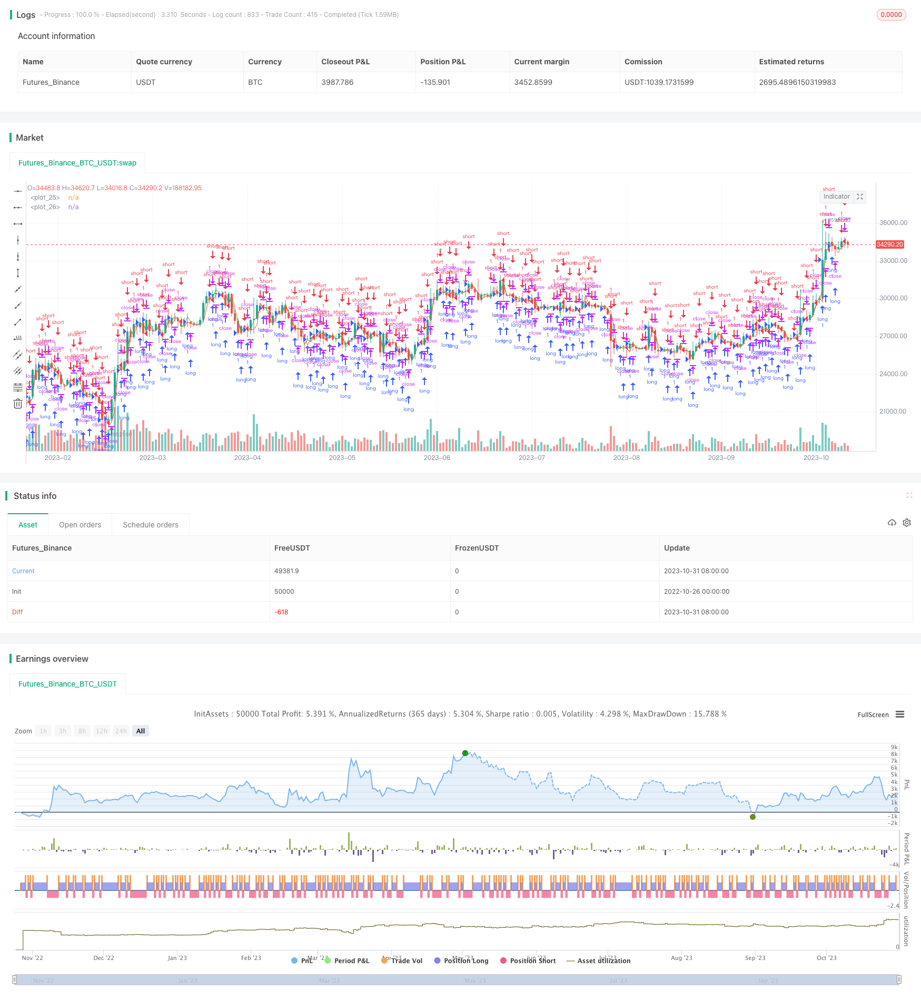

> Name

Short-term dual moving average strategy Dual-Moving-Average-Strategy
> Author

ChaoZhang

> Strategy Description



[trans]

## Overview
The double moving average strategy is a relatively common short-term trading strategy. This strategy determines the market trend direction by calculating the moving averages of different periods and uses this to enter the market. When the short-period moving average crosses the long-period moving average, go long; when the short-period moving average crosses below the long-period moving average, go short.
## Strategy Principle
The core logic of this strategy is:
1. Calculate two moving averages with different periods, one is the long-period moving average and the other is the short-period moving average. Here the moving average of the opening price and closing price is used.
2. Determine whether the short-period moving average has penetrated the long-period moving average. When the short-term line crosses the long-term line, it means that the market is in an upward trend and you can go long; when the short-term line crosses below the long-term line, it means that the market is in a downward trend and you can go short.
3. Enter the market to go long or short based on the trend direction. Specifically, when the short-period moving average crosses the long-period moving average, go long; when the short-period moving average crosses below the long-period moving average, go short.
4. Stop loss and take profit are set according to the actual situation.
The entire strategy uses the trend judgment function of the moving average to judge the relationship between the short-term and long-term trends of the market to capture short, medium and short-term market conditions. The logic of this strategy is simple and clear. It uses the crossover of double moving averages to judge the rhythm transition between market divergence and continuation, so as to conduct trading operations.
## Strategic Advantages
The dual moving average strategy has the following advantages:
1. The idea is simple, easy to understand and implement.
2. Have clear entry timing and exit standards.
3. The moving average parameters can be adjusted to adapt to different market environments.
4. Taking into account both trends and reversals, you can capture certain short- and medium-term market trends.
5. There is stop loss logic to control risks.
## Strategy Risk
The dual moving average strategy also has some risks:
1. When the market is in a volatile consolidation stage, stop loss may be triggered frequently.
2. In a market with large fluctuations, the signals generated by the moving average may be frequent, which is not conducive to holding positions.
3. The double moving average itself has a strong hysteresis and may miss short-term reversal opportunities.
4. Pay attention to parameter optimization and set an appropriate moving average period.
5. There is a certain lag in the moving average crossover, and the timing of entry may be delayed.
## Strategy optimization direction
The following points can be used as optimization directions for this strategy:
1. Optimize the moving average cycle parameters to adapt to different market conditions. Parameter backtest optimization can be done.
2. Add other indicators for filtering to avoid being trapped in volatile market conditions. You can add MACD, KD, etc. as assistance.
3. Add trend judgment indicators to avoid frequent trading when there is no clear trend. You can test adding trend judgment indicators such as EMA.
4. You can consider adding trading volume indicators to determine the direction of the short jump.
5. Optimize the stop loss strategy and set the stop loss near the large-level support level.
## Summarize
The dual moving average strategy is a simple short-term strategy based on moving average crossover to determine the trend. The advantage is that the idea is simple and clear, and it is easy to operate; the disadvantage is that it is easy to be caught by the volatile market and has hysteresis. We can optimize this strategy by improving parameter optimization and adding filtering indicators to make it more adaptable to complex market environments.
||


## Overview

The dual moving average strategy is a commonly used short-term trading strategy. It judges the market trend direction by calculating moving averages of different periods and uses that to enter trades. When the short period moving average crosses above the long period moving average, go long. When the short period moving average crosses below the long period moving average, go short.

## Strategy Logic

The core logic of this strategy is:

1. Calculate two moving averages of different periods, one is the long period MA, the other is the short period MA. Here the opening price and closing price MAs are used.

2. Judge if the short period MA has crossed over the long period MA. When the short MA crosses above the long MA, it indicates an upward trend in the market and we can go long. When the short MA crosses below the long MA, it indicates a downward trend and we can go short.

3. Enter trades according to the trend direction. Specifically, when the short period MA crosses above the long period MA, go long. When the short period MA crosses below the long period MA, go short. 

4. Set stop loss and take profit based on actual market conditions.

The strategy utilizes the trend judging capability of MAs to determine the relationship between short-term and long-term trends, in order to capture shorter-term moves. The logic is simple and clear, using MA crosses to judge rhythm shifts between trend continuation and reversal, and trade based on that.

## Advantages

The dual MA strategy has the following advantages:

1. The logic is simple and easy to understand and implement.

2. It has clear entry and exit criteria.

3. The MA periods can be adjusted to adapt to different market environments. 

4. It captures both trend and mean-reversion, allowing it to profit from medium-term moves.

5. There is a stop loss logic to control risks.

## Risks

There are also some risks with the dual MA strategy:

1. Stop loss can be triggered frequently during range-bound markets.

2. MA signals may be too frequent during volatile markets, making it hard to hold positions.

3. MAs themselves have lag and may miss short-term reversal opportunities. 

4. MA periods need to be optimized for the strategy to work.

5. MA crosses have some lag, causing delayed entries.

## Improvement Directions

Some ways to improve this strategy:

1. Optimize the MA periods for different market conditions through backtesting.

2. Add other indicators as filters to avoid whipsaws in ranging markets. MACD, KD can be considered.

3. Add trend strength indicators to avoid trading when there is no clear trend. Testing EMA and similar indicators.  

4. Consider volume indicators to judge the gap direction.

5. Optimize stop loss near major support/resistance levels.

## Summary

The dual MA strategy is a simple short-term strategy based on MA crosses to determine trend. Pros are its simplicity and ease of use. Cons are that it can be whipsawed by ranging markets and has lags. We can optimize it by parameter tuning, adding filters etc to make it more robust for complex market environments.

[/trans]

> Strategy Arguments


|Argument|Default|Description|
|----|----|----|
|v_input_1|370|tim|
|v_input_2|2017|Backtest Start Year|
|v_input_3|10|Backtest Start Month|
|v_input_4|25|Backtest Start Day|
|v_input_5|7|Backtest Start Hour|
|v_input_6|2017|Backtest Stop Year|
|v_input_7|10|Backtest Stop Month|
|v_input_8|30|Backtest Stop Day|
|v_input_9|13|Backtest stop Hour|


> Source (PineScript)

``` pinescript
/*backtest
start: 2022-10-26 00:00:00
end: 2023-11-01 00:00:00
period: 1d
basePeriod: 1h
exchanges: [{"eid":"Futures_Binance","currency":"BTC_USDT"}]
*/

//@version=2
strategy("GetTrendStrategy timing", overlay=true)
tim=input('370')
 
//////////////////////////////////////////////////////////////////////
// Component Code Start
testStartYear = input(2017, "Backtest Start Year")
testStartMonth = input(10, "Backtest Start Month")
testStartDay = input(25, "Backtest Start Day")
testStartHour = input(7, "Backtest Start Hour")
testPeriodStart = timestamp(testStartYear,testStartMonth,testStartDay,testStartHour,0)
testStopYear = input(2017, "Backtest Stop Year")
testStopMonth = input(10, "Backtest Stop Month")
testStopDay = input(30, "Backtest Stop Day")
testStopHour = input(13, "Backtest stop Hour")
testPeriodStop = timestamp(testStopYear,testStopMonth,testStopDay,testStartHour,0)
 
testPeriod() => true
// Component Code Stop
//////////////////////////////////////////////////////////////////////
 
 
out1 = request.security(syminfo.tickerid, tim, open)
out2 = request.security(syminfo.tickerid, tim, close)
plot(out1,color=red)
plot(out2,color=green)
longCondition = crossover(request.security(syminfo.tickerid, tim, close),request.security(syminfo.tickerid, tim, open))
 
if testPeriod()
    if (longCondition)
        strategy.entry("long", strategy.long)
shortCondition = crossunder(request.security(syminfo.tickerid, tim, close),request.security(syminfo.tickerid, tim, open))
 
if testPeriod()
    if (shortCondition)
        strategy.entry("short", strategy.short)
```

> Detail

https://www.fmz.com/strategy/430856

> Last Modified

2023-11-02 15:10:04
