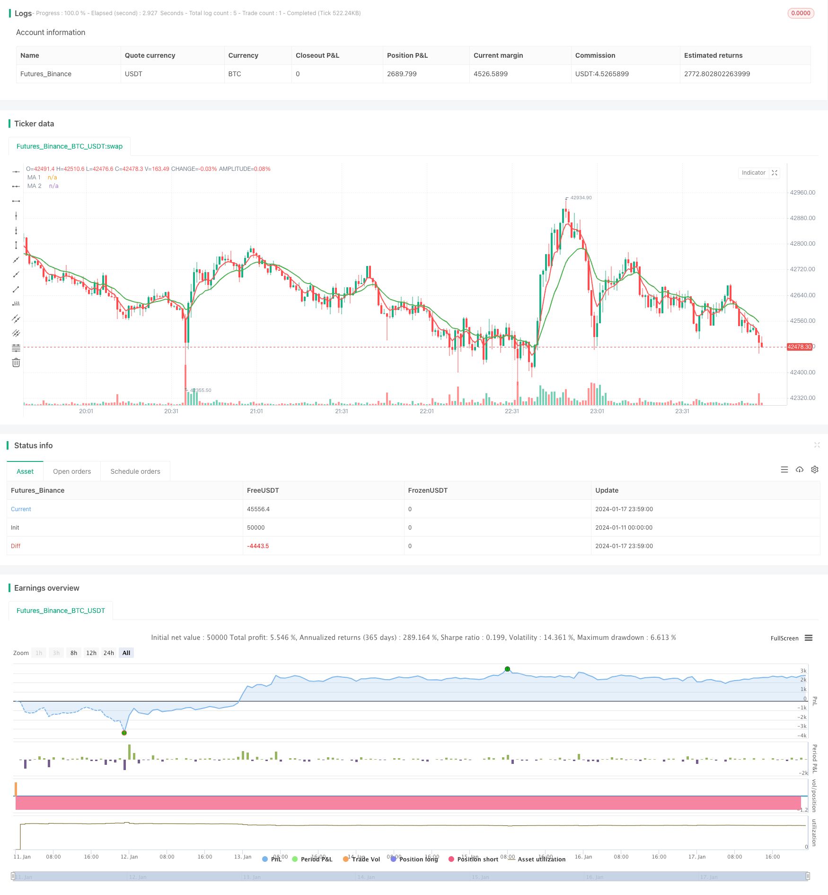

> Name

Dual-Moving-Average-Trading-Strategy Based on Dual-Moving-Average-Trading-Strategy
> Author

ChaoZhang

> Strategy Description


 [trans]
## Overview
Dual Moving Average Trading Strategy is a common quantitative trading strategy. This strategy uses two moving averages with different time periods to generate trading signals based on their intersections. Specifically, when the short-term moving average crosses the long-term moving average, it is considered a buy signal; when the short-term moving average crosses below the long-term moving average, it is considered a sell signal.
## Principle
The core principle of this strategy is that the short-term moving average can reflect the short-term trend of asset prices, and the long-term moving average can reflect the long-term trend of asset prices. When the short-term line crosses the long-term line, it means that the short-term trend has turned up, and you can buy at this time; when the short-term line crosses below the long-term line, it means that the short-term trend has turned down, and you can sell at this time. In this way, you can follow the trend and capture the turning point of the price trend.
Specifically, two moving averages are defined in this strategy: a 5-day short-term moving average to capture short-term price trends; and a 15-day long-term moving average to determine long-term price trends. When the 5-day line crosses the 15-day line from below, it means that the short-term price has begun to rise, which is a buy signal; when the 5-day line crosses the 15-day line from above, it means that the short-term price has begun to fall, which is a sell signal.
## Advantage Analysis
Compared with other strategies, the double moving average strategy has the following advantages:
1. Simple operation, easy to understand and implement, suitable for beginners of quantitative trading
2. Go with the trend and avoid pursuing the root causes of price trends in complex markets.
3. Parameter adjustment is flexible and can be adapted to different market environments by adjusting the period of the moving average.
4. Effectively filter market noise and capture the turning point of long-term and short-term trends
5. Customizable transaction frequency to reduce transaction costs and slippage losses
## Risk Analysis
There are also some risks in the double moving average strategy, mainly including:
1. May generate false signals, moving averages are essentially lagging signals
2. It is necessary to pay attention to both the long and short moving averages, and parameter adjustment and effect testing are more complicated.
3. Unable to handle severe price fluctuations well and easy to stop losses
4. The transaction frequency may be too high or too low, requiring parameter adjustment and optimization.
5. The effect is closely related to the market conditions, and the effect is not good during the overall downturn of the index.
Corresponding solutions:
1. Filter signals in combination with other indicators
2. Optimize moving average parameters and test the effect
3. Set an appropriate stop loss range
4. Adjust moving average parameters and optimize trading frequency
5. Adjust parameters under different market conditions

## Optimization direction
This strategy can be optimized from the following directions:
1. Combine with other indicators to filter signals, such as MACD, KDJ, etc., to avoid generating false signals
2. Introduce adaptive moving averages to dynamically adjust moving average parameters according to the degree of market volatility to improve robustness.
3. Optimize the moving average parameters, find the optimal parameter combination, and improve the strategy effect
4. Add a stop-loss mechanism to avoid loss expansion and improve risk control capabilities
5. Multi-time frame combination, using daily and weekly signals at the same time to improve stability
6. Markov state switching, different market states use different parameters to improve adaptability

## Summary
The double moving average trading strategy is generally a quantitative trading strategy with relatively stable effects. Its trading principle is simple, easy to understand and implement, its parameters can be adjusted flexibly, and it can effectively track market trends. At the same time, there are certain limitations, such as the generation of false signals and difficulty in handling severe market fluctuations. This needs to be controlled by introducing other auxiliary tools and parameter optimization. In general, the double moving average strategy is an effective strategy suitable for beginners in quantitative trading to learn and practice.
||

## Overview
The Dual Moving Average Trading Strategy is a common quantitative trading strategy. This strategy uses two moving averages with different time periods to generate trading signals based on their crossover. Specifically, when the short-term moving average crosses above the long-term moving average, it is considered a buy signal; when the short-term moving average crosses below the long-term moving average, it is considered a sell signal.  

## Principle  
The core principle of this strategy is: the short-term moving average reflects the short-term trend of the asset price, and the long-term moving average reflects the long-term trend of the asset price. When the short-term line crosses above the long-term line, it indicates that the short-term trend has turned to rise, at this time you can buy. When the short-term line crosses below the long-term line, it indicates that the short-term trend has turned to fall, at this time you can sell. Follow the trend, capture the turning point of price trend.  

Specifically, the strategy defines two moving averages: a 5-day short-term moving average to capture short-term price trends; and a 15-day long-term moving average to judge long-term price trends. When the 5-day line moves above the 15-day line, it indicates that the short-term price has started to rise, which is a buy signal; when the 5-day line crosses below the 15-day line, it indicates that the short-term price starting to fall, this is a sell signal.   

## Advantages Analysis  
Compared with other strategies, the dual moving average strategy has the following advantages:  
1. Simple to operate, easy to understand and implement, suitable for quantitative trading novice.  
2. Follow the trend, avoid pursue the fundamental reason of complex market trend.  
3. Flexible parameter adjustment, the moving average period can be adjusted to adapt to different market environment.   
4. Effective filter market noise, capture turning points of long and short term trend.
5. Customizable trading frequency to reduce transaction costs and slippage losses.   

## Risk Analysis
Dual moving average strategy also has some risks, mainly including:  
1. It may generate false signals because the moving average is essentially a lagging signal.  
2. Need to monitor two moving averages simultaneously, parameter adjustment and effect test are complex.
3. Cannot handle scenarios with dramatic price fluctuations well, easily stopped loss.
4. Trading frequency may be too high or too low, parameters need to be optimized.  
5. The effect is highly correlated with market conditions, poor performance during overall bear market.  

Solutions:
1. Combine with other indicators to filter signals. 
2. Optimize moving average parameters and test performances.  
3. Set appropriate stop loss range.
4. Adjust moving average parameters to optimize trading frequency.
5. Adjust parameters under different market conditions.   

## Optimization Directions
The strategy can be optimized in the following directions:  

1. Combine with other indicators like MACD, KDJ to filter false signals.   

2. Introduce adaptive moving average, dynamically adjust parameters based on market volatility to improve robustness.  

3. Optimize moving average parameters to find the best combination and improve strategy performance.   

4. Add stop loss mechanism to limit losses and enhance risk control.   

5. Combination of multiple time frames, utilizing signals from daily and weekly lines to improve stability.

6. Markov state switch, use different parameters under different market states to improve adaptability.  

## Summary  
In general, the dual moving average trading strategy is quite effective and stable. The trading principle is simple to understand and implement, parameters are flexible to adapt to market trends. Meanwhile there are some limitations like generating false signals and difficulty in handling drastic market fluctuations. These can be addressed through introducing other tools and parameter optimization. Overall speaking, this is a practical strategy suitable for quantitative trading beginners to learn and practice.  


[/trans]

> Strategy Arguments


|Argument|Default|Description|
|----|----|----|
|v_input_1_close|0|MA 1 Source: close|high|low|open|hl2|hlc3|hlcc4|ohlc4|
|v_input_2|5|MA 1 Period|
|v_input_3_close|0|MA 2 Source: close|high|low|open|hl2|hlc3|hlcc4|ohlc4|
|v_input_4|15|MA 2 Period|
|v_input_5|true|From Month|
|v_input_6|true|From Day|
|v_input_7|2018|From Year|
|v_input_8|true|To Month|
|v_input_9|true|To Day|
|v_input_10|9999|To Year|


> Source (PineScript)

``` pinescript
//@version=3
strategy("CS: 2 Moving Averages Script - Strategy (Testing)", overlay=true)

// === GENERAL INPUTS ===
// short ma
ma1Source   = input(defval = close, title = "MA 1 Source")
ma1Length   = input(defval = 5, title = "MA 1 Period", minval = 1)
// long ma
ma2Source   = input(defval = close, title = "MA 2 Source")
ma2Length   = input(defval = 15, title = "MA 2 Period", minval = 1)

// === SERIES SETUP ===
/// a couple of ma's..
ma1 = ema(ma1Source, ma1Length)
ma2 = ema(ma2Source, ma2Length)

// === PLOTTING ===
fast = plot(ma1, title = "MA 1", color = red, linewidth = 2, style = line, transp = 30)
slow = plot(ma2, title = "MA 2", color = green, linewidth = 2, style = line, transp = 30)

// === LOGIC ===
enterLong = crossover(ma1, ma2)
exitLong = crossover(ma2, ma1)

// === INPUT BACKTEST RANGE ===
FromMonth = input(defval = 1, title = "From Month", minval = 1, maxval = 12)
FromDay   = input(defval = 1, title = "From Day", minval = 1, maxval = 31)
FromYear  = input(defval = 2018, title = "From Year", minval = 2012)
ToMonth   = input(defval = 1, title = "To Month", minval = 1, maxval = 12)
ToDay     = input(defval = 1, title = "To Day", minval = 1, maxval = 31)
ToYear    = input(defval = 9999, title = "To Year", minval = 2012)

// === FUNCTION EXAMPLE ===
start     = timestamp(FromYear, FromMonth, FromDay, 00, 00)  // backtest start window
finish    = timestamp(ToYear, ToMonth, ToDay, 23, 59)        // backtest finish window
window()  => true // create function "within window of time"

// Entry //
strategy.entry(id="Long Entry", long=true, when=enterLong and window())
strategy.entry(id="Short Entry", long=false, when=exitLong and window())
```

> Detail

https://www.fmz.com/strategy/439338

> Last Modified

2024-01-19 14:10:38
