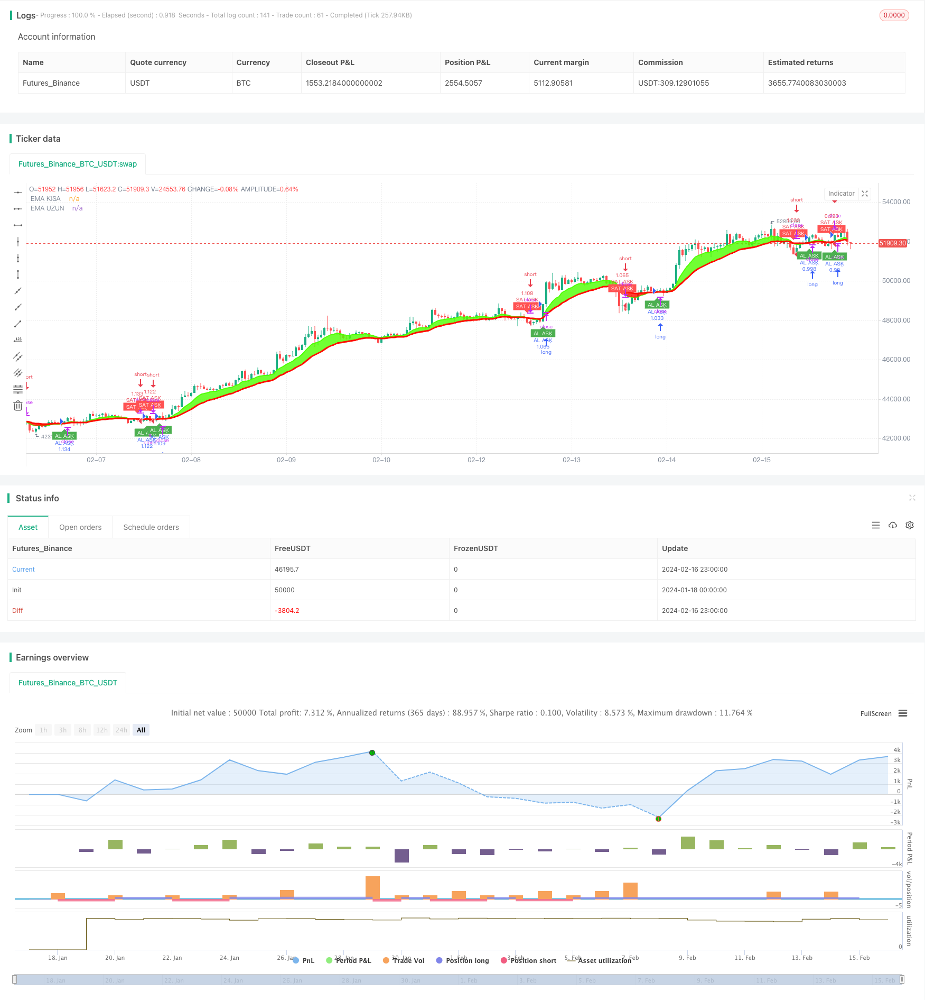

> Name

Adopt Dual-Moving-Average-Trading-Strategy
> Author

ChaoZhang

> Strategy Description


[trans]
## Overview
This strategy uses dual moving averages to form trading signals. When the short-term moving average crosses the long-term moving average, a buy signal is generated; when the short-term moving average crosses below the long-term moving average, a sell signal is generated. This strategy combines the trend tracking function of moving averages to effectively capture price trends and achieve trend trading.
## Strategy Principle
This strategy uses two exponential moving averages (EMA) with different periods. EMA1 is the short-term moving average, and the period is set to 9; EMA2 is the long-term moving average, and the period is set to 21. When the short-term moving average EMA1 crosses the long-term moving average EMA2, a buy signal is generated; when EMA1 crosses below the EMA2, a sell signal is generated.
In this way, the trend tracking function of the moving average can be used to catch signals in time when the price starts a new trend direction, and follow the trend for trading. For example, when prices turn from falling to rising, the short-term moving average will rise before the long-term moving average. The short-term moving average crossing the long-term moving average is an early signal that prices have begun to rise.
## Advantage Analysis
The biggest advantage of this strategy is that it can effectively identify price trends, which is especially suitable for markets with strong trends. The moving average itself has a good trend following function, and the dual moving average strategy further enhances this advantage. In addition, compared with the single moving average strategy, the dual moving average strategy can further filter out false signals and make the signal more reliable.
## Risk Analysis
The biggest risk of this strategy is that when prices fluctuate violently, the moving average will lag, and the best entry or exit opportunities may be missed. In addition, when the market is in a volatile range, this strategy will produce more invalid signals and reduce the stability of the strategy.
In order to reduce risks, the period parameters of the moving average can be appropriately adjusted, or other indicators can be added for filtering. For example, set a threshold based on market volatility indicators to avoid trading when the market fluctuates significantly.
## Optimization direction
The optimization space of this strategy mainly lies in the following aspects:
1. Optimize the moving average cycle parameters and find the optimal parameter combination
2. Add other indicators to perform filtering operations to improve the reliability of the signal.
3. Set adaptive parameters according to different varieties and market environments
4. Determine the specific entry point based on quantity and energy indicators.
5. Optimize the stop loss mechanism
## Summarize
This strategy uses double exponential moving averages to form trading signals. The biggest advantage is its strong price trend tracking ability and can effectively identify price trend turning points. But there are also problems such as moving average lag. The next step can be to optimize the signal quality, determine the specific entry time and stop loss.
||

## Overview

This strategy generates trading signals by using dual moving averages. It sends buy signals when the short-term moving average crosses above the long-term moving average, and sell signals when the reverse happens. This strategy combines the trend-following capability of moving averages to effectively catch price trends and implement trend trading.

## Strategy Logic  

This strategy leverages two exponential moving averages (EMA) with different periods. EMA1 is the short-term MA with a period set to 9, while EMA2 is the long-term MA with the period set to 21. The strategy generates buy signals when the EMA1 crosses above EMA2, and sell signals when it crosses below. 

By doing so, the strategy utilizes the trend-tracking capability of moving averages to capture signals when price starts a new trending direction. For example, when the price bounces up from a drop, the short-term MA would rally earlier than the long-term MA. The crossing above generates an early signal that the uptrend begins.

## Pros  

The biggest strength of this strategy lies in its capability to effectively identify price trends, especially suitable for markets with strong trending tendencies. Moving averages themselves have great trend-following features, and the dual MA mechanism further improves it. Also, comparing to single MA strategies, dual MAs can filter out more false signals and improve reliability.

## Cons  

The biggest risk is that when prices fluctuate dramatically, the lagging nature of MAs may lead to missing best entry or exit points. Also, when markets consolidate in ranges, there can be more invalid signals and lower stability of the strategy.  

To mitigate the risks, parameters like MA periods can be adjusted accordingly, or additional filters can be added. For example, combining volatility index to set a threshold and avoid trading in highly volatile conditions.

## Enhancement  

The optimization space mainly lies in the following aspects:

1. Optimize MA period parameters to find the optimal combination
2. Add other indicators as filters to improve signal reliability  
3. Setup adaptive parameters according to different products and market regimes
4. Combine volume indicators to determine precise entry points
5. Optimize stop loss mechanisms

## Summary  

This strategy generates signals by dual exponential moving averages, with strength in price trend tracking capability to detect trend reversals. But limitations like MA lag do exist. Next step would be enhancing signal quality, entry timing and stop loss from various dimensions.

[/trans]

> Strategy Arguments


|Argument|Default|Description|
|----|----|----|
|v_input_1|9|EMA KISA PERİYOT|
|v_input_2|21|EMA UZUN PERİYOT|
|v_input_3|2024|Backtest Başlangıç Tarihi|


> Source (PineScript)

``` pinescript
/*backtest
start: 2024-01-18 00:00:00
end: 2024-02-17 00:00:00
period: 1h
basePeriod: 15m
exchanges: [{"eid":"Futures_Binance","currency":"BTC_USDT"}]
*/

// This Pine Script™ code is subject to the terms of the Mozilla Public License 2.0 at https://mozilla.org/MPL/2.0/
// © technicalTruff99446

//@version=4
strategy("AhmetMSA", overlay=true, initial_capital = 10000, commission_value = 0.002, default_qty_type = strategy.percent_of_equity, default_qty_value = 100, pyramiding = 0, calc_on_order_fills = true)
//2. DEĞERDEN SONRA GEÇMİŞ HESAPLAMA DEĞERİ, KOMİSYON ORANI, PARANIN TAMAMI, DEĞERLERİ EKLEMDİ

emaShPD = input (title="EMA KISA PERİYOT", defval=9, minval=1)
emaLngPD = input (title="EMA UZUN PERİYOT", defval=21, minval=1)

//input   DEĞİŞKEN DEĞER ATAMA

ema1 = ema (close,emaShPD)
ema2 = ema (close,emaLngPD)

//EMALAR ARASINI BOYAMA upTrend downTrend
upTrend   = plot (ema1, color=#4DFF00, linewidth=2, title= "EMA KISA", transp=0)
downTrend = plot (ema2, color=#FF0C00, linewidth=3, title= "EMA UZUN", transp=0)
//linewidth ÇİZGİ KALINLIĞI
//title     İSİM VERME

//BACKTESTİN BAŞLANGIÇ TARİHİNİ BELİRLEME
yearin = input(2024, title = "Backtest Başlangıç Tarihi")
//longCondition = crossover(ema1, ema2)
//shortCondition = crossover(ema2, ema1)
buy = crossover(ema1, ema2) and yearin >= year
sell = crossover(ema2, ema1) and yearin >= year
//ta.crossunder  KESİŞİM KODU

//Barları BOYAMA
barbuy  = ema1 >= ema2
barsell = ema2 <  ema1


//AL SAT AŞK KUTUCUKLU EKRANA YAZMA
plotshape(buy, title = "AL AŞK", text = 'AL AŞK', style = shape.labelup, location = location.belowbar, color= color.green,   textcolor = color.white, transp = 0, size = size.tiny)
plotshape(sell, title = "SAT AŞK", text = 'SAT AŞK', style = shape.labeldown, location = location.abovebar, color= color.red,   textcolor = color.white, transp = 0, size = size.tiny)

//Barları BOYAMA KOŞULU
barcolor(barbuy? #4DFF00: barsell? #FF0C00: #FF0C00)


fill(upTrend, downTrend, color = ema1 >= ema2?#4DFF00 : #FF0C00, transp = 80, title = "bgcolor")

//longCondition = ta.crossover(ta.sma(close, 14), ta.sma(close, 28))
//shortCondition = ta.crossunder(ta.sma(close, 14), ta.sma(close, 28))
//14 GÜNLÜĞÜN KAPANIŞDEĞERİNİN 28 GÜNLÜK KAPANIŞ DEĞERİNİ KESMESİ KOŞULU


if (buy)
    strategy.entry("AL AŞK", strategy.long)


if (sell)
    strategy.entry("SAT AŞK", strategy.short)

```

> Detail

https://www.fmz.com/strategy/441999

> Last Modified

2024-02-18 15:11:04
