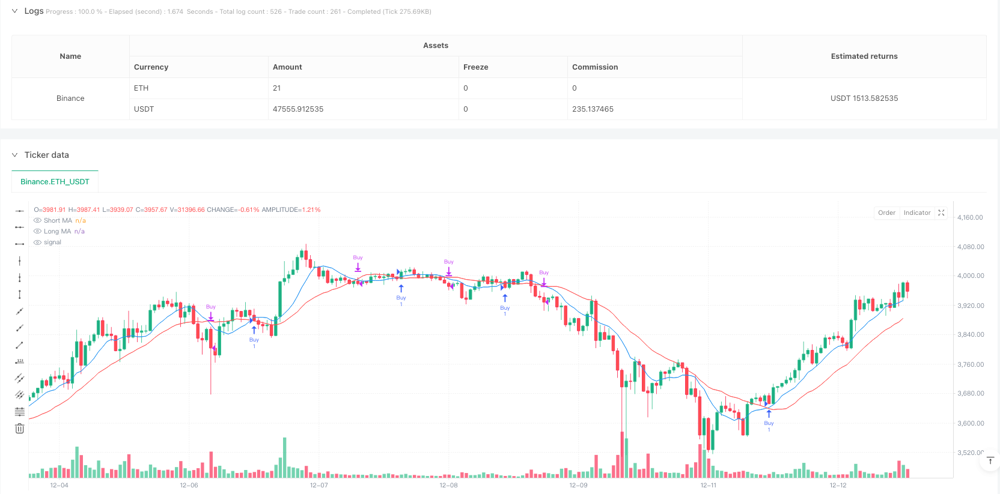
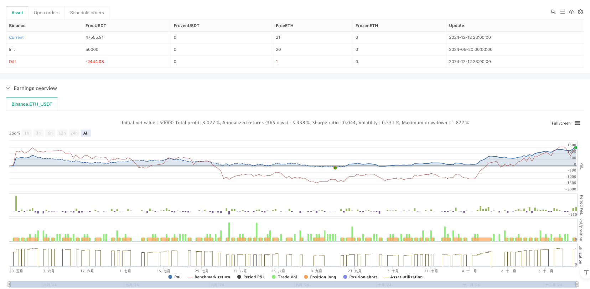

> Name

Dual-Moving-Average-Trend-Crossover-Quantitative-Trading-Strategy-Analysis-and-Optimization
> Author

ianzeng123

> Strategy Description





[trans]
#### Overview
This strategy is a trend following trading system based on double moving average crossover. By comparing the relative positions of short-term and long-term moving averages (9th and 21st respectively), we can capture the conversion timing of market trends. The strategy adopts classic technical analysis theory and combines it with modern quantitative trading methods to achieve a fully automated trading decision-making process.
#### Strategy Principle
The core logic of the strategy is based on the crossover signal of two moving averages with different periods. When the short-term moving average (9 days) crosses the long-term moving average (21 days) upward, the system believes that the market momentum has turned upward, triggering a long signal; when the short-term moving average crosses the long-term moving average downward, the system believes that the market momentum has turned downward, and the position is closed to end the transaction. At the same time, the strategy also includes a transaction statistics function, which can track the total number of transactions, profits and losses in real time, helping traders evaluate the performance of the strategy.
#### Strategic Advantages
1. Simple and clear logic, easy to understand and maintain
2. Completely based on price data, no other complex indicators required
3. Comes with a trend tracking function that can effectively capture mid- to long-term market conditions
4. Equipped with a complete transaction statistics system to facilitate strategy evaluation
5. Fully automated operation, reducing the emotional impact of human intervention
#### Strategy Risk
1. Frequent false signals may occur in volatile markets
2. There is a slight lag in the timing of entry and exit
3. If there is no stop loss mechanism, you may suffer large losses during violent fluctuations.
4. Relying only on moving average indicators and lacking multi-dimensional market analysis
5. The parameters are fixed and difficult to adapt to different market environments.
#### Strategy optimization direction
1. Introduce adaptive moving average cycles to improve the adaptability of the strategy to the market environment
2. Add volatility filter to reduce false signals in volatile markets
3. Design a dynamic stop-loss mechanism to control downside risks
4. Combine with other technical indicators, such as RSI or MACD, to improve signal reliability
5. Develop market environment identification module to realize intelligent parameter adjustment
#### Summary
This is a classic and practical trend following strategy that captures changes in market momentum through double moving average crossovers. Although there is a certain degree of hysteresis and false signal risks, its simple and robust features make it an important tool in the field of quantitative trading. Through the proposed optimization direction, the stability and profitability of the strategy are expected to be further improved. ||
#### Overview
This strategy is a trend-following trading system based on dual moving average crossovers. By comparing the relative positions of short-term and long-term moving averages (9-day and 21-day respectively), it captures market trend reversal opportunities. The strategy combines classical technical analysis theory with modern quantitative trading methods to achieve fully automated trading decisions.

#### Strategy Principle
The core logic relies on crossover signals between two moving averages of different periods. When the short-term MA (9-day) crosses above the long-term MA (21-day), the system identifies upward momentum and triggers a long position; when the short-term MA crosses below the long-term MA, the system recognizes downward momentum and closes the position. Additionally, the strategy includes trade statistics functionality that tracks total trades, winning trades, and losing trades in real-time to help traders evaluate strategy performance.

#### Strategy Advantages
1. Simple and clear logic, easy to understand and maintain
2. Purely price-based, requiring no complex indicators
3. Built-in trend-following capability, effective for capturing medium to long-term trends
4. Complete trade statistics system for strategy evaluation
5. Fully automated operation, reducing emotional interference

#### Strategy Risks
1. Frequent false signals in ranging markets
2. Slight lag in entry and exit timing
3. Absence of stop-loss mechanism, potential for significant losses during volatile periods
4. Reliance solely on moving averages, lacking multi-dimensional market analysis
5. Fixed parameters, difficult to adapt to different market conditions

#### Strategy Optimization Directions
1. Implement adaptive moving average periods to improve market environment adaptability
2. Add volatility filters to reduce false signals in ranging markets
3. Design dynamic stop-loss mechanisms to control downside risk
4. Incorporate additional technical indicators like RSI or MACD to enhance signal reliability
5. Develop market environment recognition modules for intelligent parameter adjustment

#### Summary
This is a classic and practical trend-following strategy that captures market momentum changes through dual moving average crossovers. While it has certain limitations in terms of lag and false signals, its simplicity and robustness make it an important tool in quantitative trading. Through the proposed optimization directions, the strategy's stability and profitability can be further enhanced.[/trans]


> Source (PineScript)

``` pinescript
/*backtest
start: 2024-05-20 00:00:00
end: 2024-12-13 00:00:00
period: 1h
basePeriod: 1h
exchanges: [{"eid":"Binance","currency":"ETH_USDT"}]
*/

//@version=5
strategy("Simple MA Crossover Strategy", overlay=true)

// Input parameters
shortMA = ta.sma(close, 9)
longMA = ta.sma(close, 21)

// Buy/Sell conditions
buyCondition = ta.crossover(shortMA, longMA)
sellCondition = ta.crossunder(shortMA, longMA)

// Plot moving averages
plot(shortMA, color=color.blue, title="Short MA")
plot(longMA, color=color.red, title="Long MA")

// Execute trades
if (buyCondition)
    strategy.entry("Buy", strategy.long)

if (sellCondition)
    strategy.close("Buy")

// Track trades, wins, and losses
var int totalTrades = 0
var int totalWins = 0
var int totalLosses = 0

if (strategy.opentrades > 0)
    totalTrades := totalTrades + 1

if (strategy.opentrades == 0 and strategy.opentrades[1] > 0)
    if (strategy.netprofit > 0)
        totalWins := totalWins + 1
    else
        totalLosses := totalLosses + 1

// Plot trade statistics
var label tradeStats = na
if (not na(tradeStats))
    label.delete(tradeStats)

tradeStats := label.new(bar_index, high, text="Trades: " + str.tostring(totalTrades) + "\nWins: " + str.tostring(totalWins) + "\nLosses: " + str.tostring(totalLosses), style=label.style_label_down, color=color.white, textcolor=color.black)

```

> Detail

https://www.fmz.com/strategy/482789

> Last Modified

2025-02-27 17:48:50
