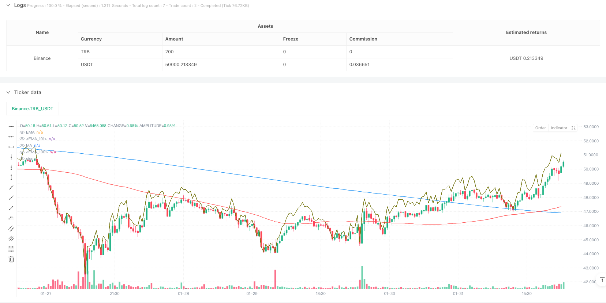
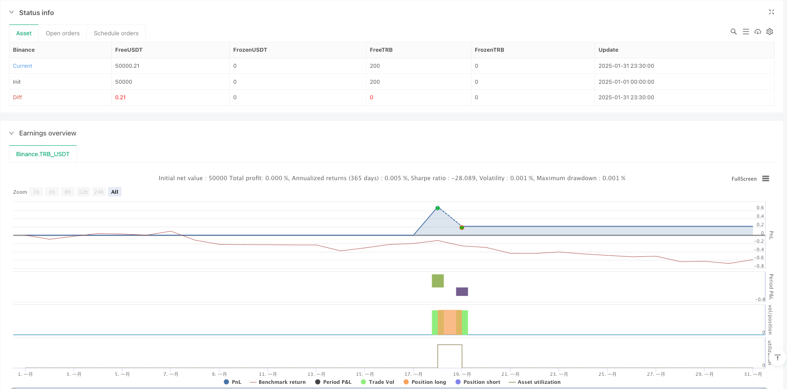

> Name

Dual-Moving-Average-Trend-Following-System-with-Adaptive-Dynamic-Filtering-Strategy
> Author

ianzeng123

> Strategy Description





[trans]
#### Overview
This strategy is a trend following trading system that combines multiple technical indicators. It is mainly based on the cross signals of the simple moving average (SMA) and the exponential moving average (EMA), and integrates multiple advanced features such as the Hull Moving Average (HMA) trend band, William indicator (%R), swing high and low point analysis, etc., and provides more reliable trading signals through a dynamic filtering mechanism.
#### Strategy Principle
The core logic of the strategy is based on the following key elements:
1. Use the SMA with a period of 100 and the EMA with a period of 200 as the main trend judgment indicators.
2. Integrate 70-period HMA trend bands to confirm trend momentum
3. Use William indicator (%R) to calculate dynamic support/resistance levels
4. Detect swing highs and lows through a 20-period lookback window
5. Real-time monitoring and updating of daily high and low points
6. Set early opening filtering and volatility threshold (0.5%) to reduce false signals
Entry conditions must be met at the same time: the price is above both moving averages, the %R indicator rises on three consecutive K lines and is greater than -20, the K line closes positive and the closing price is higher than the previous one, and the price does not exceed the intraday fluctuation threshold.
The exit conditions meet any of the following conditions: the price falls below the double moving average and the %R indicator is below -80.
#### Strategic Advantages
1. Collaborative verification of multiple technical indicators improves the reliability of trading signals
2. The dynamic filtering mechanism effectively reduces false signals during periods of severe fluctuations.
3. Adaptive support and resistance level calculation makes the strategy have good market adaptability
4. Complete intraday trading management mechanism, including early opening filtering and volatility threshold control
5. The parameters are highly adjustable and can be optimized according to different market conditions.
#### Strategy Risk
1. The moving average system may produce frequent false signals in a volatile market.
2. Screening with multiple conditions may result in missing some potential trading opportunities.
3. Fixed moving average periods may behave differently in different market environments.
4. The intraday trading filtering mechanism may miss important opportunities in rapid trends.
5. Excessive parameter optimization may lead to overfitting problems
#### Strategy optimization direction
1. Introduce an adaptive moving average period calculation mechanism to enable the system to better adapt to market fluctuations
2. Add trading volume analysis indicators to improve the reliability of trend confirmation
3. Develop a dynamic stop-loss and stop-profit mechanism to improve the efficiency of fund management
4. Add market volatility indicators and optimize the threshold settings of filter conditions
5. Consider signal collaboration in different time periods to enhance the stability of the system
#### Summary
This is a well-designed trend-following trading system that ensures reliability while maintaining good flexibility through the combination of multiple technical indicators and a strict filtering mechanism. The optimization space of the strategy mainly lies in the adaptability of parameters and the improvement of risk management mechanisms. It is recommended that traders fully test the performance in different market environments and adjust parameter settings according to specific circumstances before using it in real trading. ||
#### Overview
This strategy is a comprehensive trend-following trading system that combines multiple technical indicators. It primarily relies on the crossover signals between Simple Moving Average (SMA) and Exponential Moving Average (EMA), while integrating advanced features such as Hull Moving Average (HMA) ribbon, Williams %R indicator, swing high/low analysis, and dynamic filtering mechanisms to provide more reliable trading signals.

#### Strategy Principles
The core logic is built upon several key elements:
1. Utilizes 100-period SMA and 200-period EMA as primary trend indicators
2. Incorporates 70-period HMA ribbon for trend momentum confirmation
3. Employs Williams %R for dynamic support/resistance calculation
4. Detects swing highs and lows within a 20-period lookback window
5. Monitors and updates intraday high/low levels in real-time
6. Implements opening period filters and volatility threshold (0.5%) to reduce false signals

Entry conditions require: price above both moving averages, %R showing three consecutive periods of improvement above -20, bullish candle closing higher than previous, price within daily volatility threshold.
Exit conditions trigger on either: price falling below both moving averages or %R dropping below -80.

#### Strategy Advantages
1. Multiple technical indicator verification enhances signal reliability
2. Dynamic filtering mechanism effectively reduces false signals during high volatility periods
3. Adaptive support/resistance calculation provides good market adaptability
4. Comprehensive intraday trading management including opening period filters and volatility thresholds
5. Highly customizable parameters for optimization across different market conditions

#### Strategy Risks
1. Moving average system may generate frequent false signals in ranging markets
2. Multiple condition filtering might miss potential trading opportunities
3. Fixed moving average periods may perform inconsistently across different market environments
4. Intraday trading filters might miss crucial opportunities in rapid trend movements
5. Parameter optimization risks overfitting issues

#### Strategy Optimization Directions
1. Introduce adaptive moving average period calculations for better market volatility adaptation
2. Add volume analysis indicators to improve trend confirmation reliability
3. Develop dynamic stop-loss and take-profit mechanisms for improved capital management
4. Incorporate market volatility indicators to optimize filter threshold settings
5. Consider multi-timeframe signal coordination to enhance system stability

#### Summary
This is a well-designed trend-following trading system that maintains good flexibility while ensuring reliability through multiple technical indicators and strict filtering mechanisms. The main areas for optimization lie in parameter adaptability and risk management mechanism refinement. Traders are advised to thoroughly test performance under various market conditions and adjust parameters according to specific circumstances before live trading.[/trans]


> Source (PineScript)

``` pinescript
/*backtest
start: 2025-01-01 00:00:00
end: 2025-01-31 23:59:59
period: 30m
basePeriod: 30m
exchanges: [{"eid":"Binance","currency":"TRB_USDT"}]
*/

//@version=5
strategy(title="EMA & MA Crossover Strategy", shorttitle="EMA & MA Crossover Strategy", overlay=true)

// Inputs
LengthMA = input.int(100, minval=1, title="MA Length")
LengthEMA = input.int(200, minval=1, title="EMA Length")
swingLookback = input.int(20, title="Swing Lookback")
Lengthhmaribbon = input.int(70, minval=1, title="HMA Ribbon")
// Input for ignoring the first `n` candles of the day
ignore_n_candles = input.int(1, "Ignore First N Candles", minval=0)
// Input for percentage threshold to ignore high run-up candles
run_up_threshold = input.float(0.5, "Run-up Threshold (%)", minval=0.0)

//====================================================================
hmacondition = ta.hma(close,Lengthhmaribbon)> ta.hma(close,Lengthhmaribbon)[1]

//====================================================================
// Function to drop the first `n` candles
dropn(src, n) =>
    na(src[n]) ? na : src

// Request data with the first `n` candles dropped
valid_candle = not na(dropn(close, ignore_n_candles))
// Check for run-up condition on the previous candle
prev_run_up = (high[1] - low[1]) / low[1] * 100

// Combine conditions: exclude invalid candles and ignore high run-up candles
valid_entry_condition = valid_candle and prev_run_up <= run_up_threshold

//======================================================
// Define the start of a new day based on time
var is_first = false
var float day_high = na
var float day_low = na

// Use time() to detect the start of a new day
t = time("1440") // 1440 = 60 * 24 (one full day in minutes)
is_first := na(t[1]) and not na(t) or t[1] < t

if is_first and barstate.isnew
    day_high := high
    day_low := low
else
    day_high := nz(day_high[1], high)
    day_low := nz(day_low[1], low)

// Update daily high and low
if high > day_high
    day_high := high

if low < day_low
    day_low := low

//====================================================
previousdayclose = request.security(syminfo.tickerid, "D", close)

day_highrange = previousdayclose*.018
//======================================================
length = input(title="Length", defval=14)
src = input(close, "Source")
_pr(length) =>
	max = ta.highest(length)
	min = ta.lowest(length)
	100 * (src - max) / (max - min)
percentR = _pr(length)

//======================================================
higherline = close* 1+((100-(percentR*-1))/100)
lowerline = close* 1-((100-(percentR*-1))/100)
//======================================================
// Moving Averages
xMA = ta.sma(close, LengthMA)
xEMA = ta.sma(xMA, LengthEMA)

// Plot the MA and EMA lines
plot(xMA, color=color.red, title="MA")
plot(xEMA, color=color.blue, title="EMA")

// Find recent swing high and low
recentHigh = ta.highest(high, swingLookback)
recentLow = ta.lowest(low, swingLookback)
//===============================================
emacondition = ta.ema(close,20)>ta.ema(close,30) and ta.ema(close,30)>ta.ema(close,40) and ta.ema(close,40)>ta.ema(close,50) and close >ta.ema(close,20)
// Define Buy Condition
buyCondition1 = (percentR>percentR[1] and percentR[1]>percentR[2] and percentR[2]>percentR[3]) and percentR>-20 and percentR[1]>-20
buyCondition = (close> xMA and close> xEMA) and (close > open and close > close[1]) or xMA>xEMA and close<day_highrange and hmacondition and emacondition

// Define Sell Conditions
sellCondition = (close < xMA and close < xEMA) or xMA<xEMA or percentR<-80

// Strategy Execution
if (buyCondition and buyCondition1 and valid_entry_condition)
    strategy.entry("Buy", strategy.long)

if (sellCondition)
    strategy.close("Buy")  // Close the long position

// Candle coloring for buy/sell indication
barcolor(buyCondition ? color.green : sellCondition ? color.red : na)
plot(higherline, color=color.olive, title="EMA")
plot(higherline, color=color.black, title="EMA")

```

> Detail

https://www.fmz.com/strategy/482769

> Last Modified

2025-02-27 17:51:58
