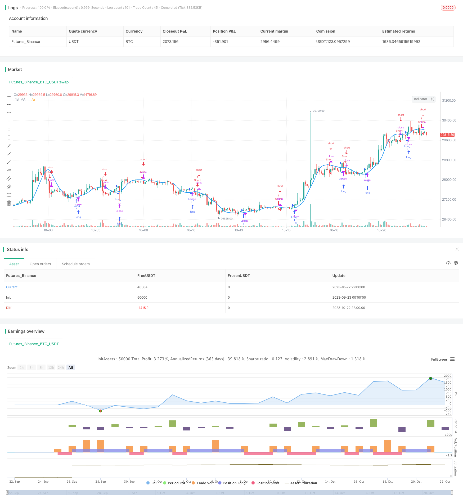

> Name

Dual-Moving-Average-Turning-Point-Strategy
> Author

ChaoZhang

> Strategy Description



[trans]

### Overview
The double moving average reversal point trading strategy is a trading strategy based on moving average crossovers. It uses two moving averages with different parameter settings to determine the timing of entry and exit based on their turns. This strategy is simple, intuitive, easy to implement, and suitable for medium and long-term transactions.
### Strategy Principles
This strategy uses Price as the price input source and calculates two moving averages with different parameters, SMA1 and SMA2. The strategy uses the ROC indicator to determine the reversal of the moving average. When the ROC value of SMA1 exceeds the set positive threshold, SMA1 is considered to be turning upward, and the SMA1 upward signal is recorded; when the ROC value of SMA1 falls below the set negative threshold, SMA1 is considered to be turning downward, and the SMA1 downward signal is recorded. The judgment logic of SMA2 is similar.
When SMA1 turns upward and SMA2, the previous K-line, turns downward, a buy signal is generated and the position is long; when SMA1 turns downward and SMA2, the previous K-line, is turned upward, a sell signal is generated and the position is short.
This strategy uses the turning of two moving averages to determine the trading direction, the turning of one moving average to confirm the entry time, and the crossover of the two moving averages to ensure that the trend changes at the time of entry, which can effectively filter out false breakthroughs.
### Advantage Analysis
- Using double moving average crossover and turning judgment can effectively filter out false breakthroughs and improve the accuracy of entry.
- Moving average reversal combined with ROC indicator can clearly judge the reversal timing and avoid frequent trading.
- Using medium and long-term double moving averages, you can track the main trend and obtain larger trend profits.
- The strategy logic is simple and clear, easy to understand and implement, and is suitable for beginners of quantitative trading.
- The parameters can be customized to adapt to different market environments and have strong adaptability.
### Risk Analysis
- Double moving average crossovers may generate a large number of false signals in volatile markets, leading to losses.
- ROC parameters need to be accurately optimized, otherwise there will be errors in steering recognition and affect strategy performance.
- A volatile market in a large cycle may trigger multiple stop losses, which can be avoided by expanding the stop loss range.
- Based only on moving average indicators, it is difficult to respond to emergencies such as major news, which may lead to losses.
- Pay attention to the problem of over-fitting in parameter optimization. The test period must be long enough and include different market conditions.
### Optimization direction
- Optimize moving average parameters and find the best moving average cycle combination
- Optimize ROC parameters to improve steering recognition accuracy
- Added stop-loss mechanism, which can adopt dynamic stop-loss that breaks through custom price levels
- Add additional conditions, such as trading volume indicator triggering, to avoid false breakthroughs
- Combine with other indicators, such as MACD, BOLL, etc., to improve decision-making effect
- Use machine learning and other methods to automatically optimize parameters and adapt to market changes
### Summarize
The double moving average reversal point strategy is generally a simple and practical trend following strategy. It only requires basic moving average indicators to implement, and its logic is clear and easy to understand. It is very suitable for beginners of quantitative trading to learn and practice. Through parameter optimization and stop-loss mechanism optimization, the stability of the strategy can be greatly improved. Combining it with other auxiliary indicators can further enhance the strategy. This strategy is highly customizable and can be flexibly applied in different market environments. It is a recommended dual moving average trading strategy.
[/trans]

### Overview

The Dual Moving Average Turning Point strategy is a trend following strategy based on moving average crossovers. It uses two moving averages with different parameter settings and determines entry and exit points according to their turning directions. This strategy is simple and intuitive, easy to implement, and suitable for medium-to-long term trading.

### Strategy Logic

The strategy uses Price as the price input source and calculates two moving averages, SMA1 and SMA2, with different parameters. It uses the ROC indicator to determine the turning directions of the moving averages. When SMA1's ROC value exceeds the positive threshold, it is considered an upward turn of SMA1 and an upward signal is recorded. When SMA1's ROC value breaks the negative threshold, it is considered a downward turn of SMA1 and a downward signal is recorded. The judgment logic for SMA2 is similar.

When SMA1 turns upward and the previous bar's SMA2 turns downward, a buy signal is generated to go long. When SMA1 turns downward and the previous bar's SMA2 turns upward, a sell signal is generated to go short.

The strategy uses the turning directions of two moving averages to determine the trading direction and the turning of one moving average to confirm entry timing. The dual moving average crossover ensures the trend has changed when entering the market, which helps avoid false breakouts.

### Advantage Analysis  

- Using dual moving average crossover and turning points can effectively filter out false breakouts and improve entry accuracy.

- Combining moving average turning points with the ROC indicator can clearly identify turning points and avoid frequent trading.

- Adopting medium-to-long-term dual moving averages can track the main trend and achieve sizable trend profits.

- The strategy logic is simple and clear, easy to understand and implement, suitable for quant trading beginners.

- Customizable parameters suit different market environments with strong adaptability.

### Risk Analysis

- Dual moving average crossovers may generate many false signals in ranging markets, leading to losses.

- The ROC parameters need precise optimization, otherwise turn recognition will have errors, affecting strategy performance.

- Large periodic ranging markets may trigger stop loss multiple times. Expanding stop loss range can avoid it.

- Relying solely on moving averages, it's hard to respond to sudden events like major news, which may lead to losses.

- Note the overfitting problem in parameter optimization. Test period should be long enough to include different market conditions.

### Optimization Directions

- Optimize moving average parameters to find the best moving average period combination.

- Optimize ROC parameters to improve turning point recognition accuracy. 

- Add stop loss mechanisms such as dynamic stop loss based on breaking customized price levels.

- Add additional conditions like volume indicators to avoid false breakouts.

- Incorporate other indicators like MACD, BOLL to improve decision making.

- Use machine learning etc. to auto optimize parameters and adapt to market changes.

### Summary

In summary, the Dual Moving Average Turning Point strategy is a simple and practical trend following strategy. It can be implemented with basic moving average indicators and has clear, easy-to-understand logic, making it very suitable for quant trading beginners to learn and practice. With parameter optimization and stop loss optimization, the strategy stability can be greatly improved. Combining with other auxiliary indicators can further enhance the strategy. The highly customizable strategy can be flexibly applied to different market environments and is a recommended dual moving average trading strategy.

[/trans]

> Strategy Arguments


|Argument|Default|Description|
|----|----|----|
|v_input_1_close|0|Source: close|high|low|open|hl2|hlc3|hlcc4|ohlc4|
|v_input_2|25|1st MA Length|
|v_input_3|0|1st MA Type: HMA|EMA|SMA|VWMA|
|v_input_4|true|Lookback 1|
|v_input_5|2.5|Minimum slope magnitude * 100|


> Source (PineScript)

``` pinescript
/*backtest
start: 2023-09-23 00:00:00
end: 2023-10-23 00:00:00
period: 2h
basePeriod: 15m
exchanges: [{"eid":"Futures_Binance","currency":"BTC_USDT"}]
*/

//@version=3
strategy("MA Turning Point Strategy", overlay=true)
src = input(close, title="Source")

price = request.security(syminfo.tickerid, timeframe.period, src)
ma1 = input(25, title="1st MA Length")
type1 = input("HMA", "1st MA Type", options=["SMA", "EMA", "HMA", "VWMA"])
f_hma(_src, _length)=>
    _return = wma((2*wma(_src, _length/2))-wma(_src, _length), round(sqrt(_length)))

price1 = if (type1 == "SMA")
    sma(price, ma1)
else
    if (type1 == "EMA")
        ema(price, ma1)
    else
        if (type1 == "VWMA")
            vwma(price, ma1)
        else
            f_hma(price, ma1)
    
plot(series=price1, style=line,  title="1st MA", color=blue, linewidth=2, transp=0)

lookback1 = input(1, "Lookback 1")
roc1 = roc(price1, lookback1)

ma1up = false
ma1down = false
ma2up = false
ma2down = false

ma1up := nz(ma1up[1])
ma1down := nz(ma1down[1])
ma2up := nz(ma2up[1])
ma2down := nz(ma2down[1])

trendStrength1 = input(2.5, title="Minimum slope magnitude * 100", type=float) * 0.01

if crossover(roc1, trendStrength1)
    ma1up := true
    ma1down := false
    
if crossunder(roc1, -trendStrength1) 
    ma1up := false
    ma1down := true

longCondition = ma1up and ma1down[1]
if (longCondition)
    strategy.entry("Long", strategy.long)

shortCondition = ma1down and ma1up[1]
if (shortCondition)
    strategy.entry("Short", strategy.short)


```

> Detail

https://www.fmz.com/strategy/430020

> Last Modified

2023-10-24 12:19:04
