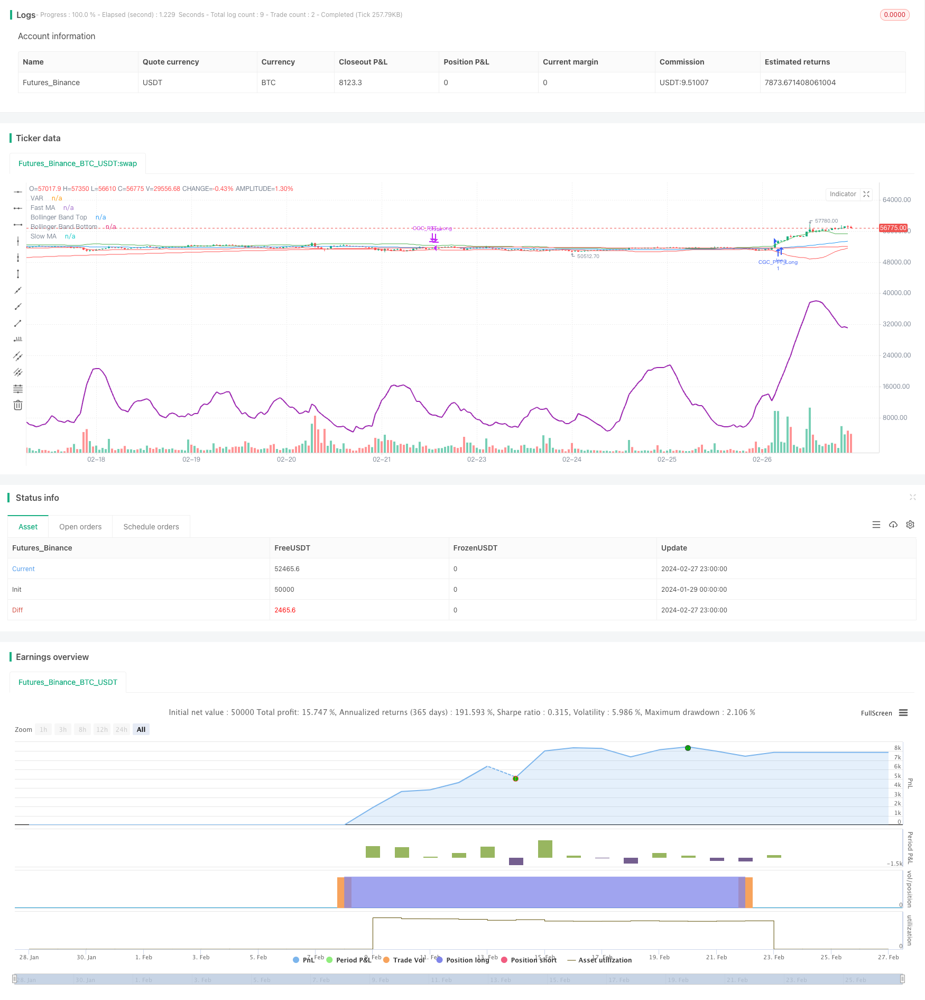

> Name

Dual-Moving-Average-Volatility-Tracking-Strategy based on Dual-Moving-Average-Volatility-Tracking-Strategy
> Author

ChaoZhang

> Strategy Description


[trans]
### Overview
The dual moving average volatility tracking strategy combines the two main ideas of the golden cross and dead cross strategy and the moving average volatility indicator tracking strategy. By calculating simple moving average crossovers in different periods, the golden cross and dead cross are determined. At the same time, the Bollinger fluctuation band and VIDYA indicator are combined to determine the market trend and volatility, achieving a clear judgment of the trend and efficient capture of key points.
### Strategy Principles
The core indicators of this strategy include the Simple Moving Average, Bollinger Bands and VIDYA Volatility Index Moving Average. The strategy sets different periods of fast SMA and slow LMA. The golden cross of the fast and slow lines is used as a long signal, and the dead cross is used as a closing signal. At the same time, the Bollinger fluctuation band determines when the price breaks through the upper and lower rails during the position holding process. VIDYA exponential moving average combines volatility information to determine the direction and strength of the current trend.
Specifically, the signal logic for long positions is that the fast line crosses the slow line, and the price is higher than the VIDYA curve, indicating that the trend is upward and the fluctuations are amplified; the closing signal is that the fast line crosses the slow line or the price is lower than the VIDYA curve, indicating that the trend is reversed or the fluctuations tend to shrink.
### Advantage Analysis
The biggest advantage of the dual moving average volatility tracking strategy is that combining dual indicators to judge the market status can improve the accuracy of decision-making. Specifically, the advantages are reflected in:
1. The golden cross and dead cross strategy is simple and effective, and can clearly determine the turning point of the trend;
2. The volatility indicator VIDYA can dynamically track changes in market fluctuations;
3. Bollinger fluctuation band judgment allows the strategy to respond to price shocks in a timely manner.
To sum up, this strategy integrates information from multiple dimensions such as trend, regression and volatility, and responds faster to market changes, thereby making it more likely to obtain excess returns.
### Risk Analysis
Although this strategy has many advantages, there are also certain risks that you need to be aware of:
1. Improper parameter settings may lead to too frequent transactions, increased transaction costs and slippage losses;
2. When there is a signal conflict in the dual indicator judgment, it is necessary to clarify the priority, otherwise the best entry opportunity may be missed;
3. There is a risk of over-fitting in strategy backtesting, and the actual performance may be significantly different from the backtesting results.
In order to reduce the above risks, it is recommended to optimize parameter settings, clarify the priority of indicator signals, increase slippage control, and verify the robustness of the strategy multiple times in different market environments.
### Optimization direction
The main optimization direction of this strategy focuses on parameter setting and filtering conditions, which can be carried out from the following dimensions:
1. Optimize the moving average cycle parameters of fast and slow lines;
2. Adjust the bandwidth parameters of Bollinger wave band;
3. Optimize the α smoothing parameters in VIDYA;
4. Add abnormal price or trading volume filter conditions.
Through the combination of parameter optimization and rule optimization, the stability and profitability of the strategy can be further improved.
### Summarize
The double moving average volatility tracking strategy comprehensively uses a variety of indicators to judge the market status, and pays attention to price fluctuations while capturing trend turning points. It is an effective strategy that takes into account both risk and return. This strategy has a large room for optimization and is worthy of further exploration and verification. We look forward to achieving considerable excess returns in the real market.
||

### Overview  

The Dual Moving Average Volatility Tracking strategy integrates the ideas of the Golden Cross Dead Cross and Moving Average Volatility Tracking strategies. By calculating the crossover of simple moving averages (SMAs) with different periods, it realizes the golden cross and dead cross to judge trends. Meanwhile, by combining Bollinger Bands and the VIDYA index, it judges market trends and volatility, achieving effective trend identification and efficient capture of key turning points.

### Strategy Logic  

The core indicators of this strategy include Simple Moving Average (SMA), Bollinger Bands and Variable Index Dynamic Average (VIDYA). The strategy sets up fast SMA and slow LMA with different periods. The golden cross of the fast and slow lines serves as the long signal, while the death cross serves as the exit signal. Meanwhile, it monitors the breakout of price above or below the Bollinger Bands during a holding period. The VIDYA, which incorporates volatility information, judges the current trend direction and strength.
 
Specifically, the long signal logic is triggered when the fast SMA crosses over the slow LMA, and the price is above the VIDYA curve, indicating an uptrend and volatility expansion. The exit signal is triggered when the fast SMA crosses below the slow LMA or the price falls below the VIDYA curve, implying a trend reversal or volatility contraction.   

### Advantage Analysis   

The biggest advantage of this strategy is combining dual indicators to judge market conditions, improving decision accuracy. Specifically, the advantages include:  

1. The golden cross and dead cross strategy is simple and effective to identify trend turning points.
2. The VIDYA index dynamically tracks changes in market volatility.
3. The Bollinger Bands timely respond to price fluctuations.
 
In summary, this strategy integrates information from trends, reversion, and volatility dimensions. It responds faster to market changes and has a greater possibility of generating alpha.   

### Risk Analysis  

Although this strategy has many merits, there are still some risks to be aware of:    

1. Improper parameter settings may cause over-trading, increasing costs and slippage.
2. Conflicting signals between dual indicators may lead to missing best entry points.  
3. Backtest overfitting risk exists. Real trading performance could differ much from backtest results.
 
To mitigate the above risks, parameter optimization, priority rules between signals, slippage control, and robustness test under different market environments are recommended.   

### Optimization Directions   

The main optimization dimensions lie in parameter tuning and filter condition setting:   

1. Optimize the SMA and LMA period parameters.  
2. Adjust the bandwidth parameter for Bollinger Bands.
3. Optimize the alpha smoothing parameter in VIDYA.  
4. Add price or volume filter conditions.
 
The combination of parameter optimization and rule refinement could further enhance the stability and profitability.   

### Conclusion  

The Dual Moving Average Volatility Tracking strategy utilizes multiple indicators to determine market conditions, capturing trend turning points while monitoring price fluctuation situations. It is an attractive strategy balancing risk and return. More exploration on parameter optimization and walk-forward analysis are expected to achieve satisfactory profits in live trading.

[/trans]

> Strategy Arguments


|Argument|Default|Description|
|----|----|----|
|v_input_1|50|Fast MA Period|
|v_input_2|200|Slow MA Period|
|v_input_3_close|0|Source: close|high|low|open|hl2|hlc3|hlcc4|ohlc4|
|v_input_4|20|Bollinger Bands Length|
|v_input_5|2|Bollinger Bands Multiplier|
|v_input_string_1|0|Moving Average Type: VAR|EMA|WMA|TMA|SMA|WWMA|ZLEMA|TSF|


> Source (PineScript)

``` pinescript
/*backtest
start: 2024-01-29 00:00:00
end: 2024-02-28 00:00:00
period: 1h
basePeriod: 15m
exchanges: [{"eid":"Futures_Binance","currency":"BTC_USDT"}]
*/

//@version=5
strategy("Combined Golden Cross and Progressive Trend Tracker", shorttitle="GCC-PTT", overlay=true)

// Inputs
fastMA_period = input(50, title="Fast MA Period")
slowMA_period = input(200, title="Slow MA Period")
src = input(close, title="Source")
lengthBB = input(20, title="Bollinger Bands Length")
mult = input(2.0, title="Bollinger Bands Multiplier")
mavType = input.string(title="Moving Average Type", defval="VAR", options=['SMA', 'EMA', 'WMA', 'TMA', 'VAR', 'WWMA', 'ZLEMA', 'TSF'])

// Calculate Moving Averages for Golden Cross
fastMA = ta.sma(src, fastMA_period)
slowMA = ta.sma(src, slowMA_period)
bullish_cross = ta.crossover(fastMA, slowMA)
bearish_cross = ta.crossunder(fastMA, slowMA)

// Progressive Trend Tracker Components (Adjusted for NA assignment issue)
Var_Func(src, length) =>
    valpha = 2 / (length + 1)
    vud1 = src > src[1] ? src - src[1] : 0
    vdd1 = src < src[1] ? src[1] - src : 0
    vUD = math.sum(vud1, length)
    vDD = math.sum(vdd1, length)
    vCMO = (vUD - vDD) / (vUD + vDD)
    VAR = 0.0 // Adjusted here, assign an initial value
    VAR := ta.ema(src * math.abs(vCMO), length)
    VAR

VAR = Var_Func(src, 14) // Example VAR calculation, adjust as needed

// Bollinger Bands for dynamic support and resistance
BBandTop = fastMA + mult * ta.stdev(src, lengthBB)
BBandBot = fastMA - mult * ta.stdev(src, lengthBB)

// Plotting
plot(fastMA, color=color.blue, title="Fast MA")
plot(slowMA, color=color.red, title="Slow MA")
plot(BBandTop, color=color.green, title="Bollinger Band Top")
plot(BBandBot, color=color.red, title="Bollinger Band Bottom")
plot(VAR, color=color.purple, title="VAR", linewidth=2)

// Strategy Logic (Adjusted for strategy use)
// Long Entry when bullish cross and close above VAR
// Exit when bearish cross or close below VAR
if (bullish_cross and close > VAR)
    strategy.entry("CGC_PTT_Long", strategy.long)
if (bearish_cross or close < VAR)
    strategy.close("CGC_PTT_Long")

```

> Detail

https://www.fmz.com/strategy/443096

> Last Modified

2024-02-29 11:15:08
