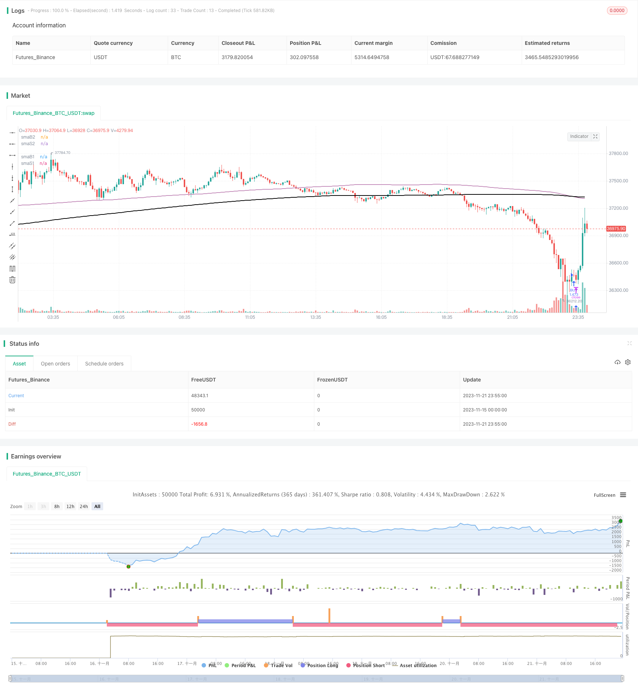

> Name

Dual-SMA-Crossover-Strategy
> Author

ChaoZhang

> Strategy Description

 

[trans]

## Overview
The moving average crossover strategy generates trading signals by calculating the intersection of two SMA moving averages with different parameter settings. When the faster SMA crosses above the slower SMA, a buy signal is generated; when the slower SMA crosses below the faster SMA, a sell signal is generated. This strategy uses two sets of SMA moving average parameters at the same time, one to determine the buying point and the other to determine the selling point.
## Strategy Principle
Two sets of SMA moving average parameters are used in this strategy, namely `smaB1`, `smaB2` and `smaS1`, `smaS2`. `smaB1` and `smaB2` are used to determine buy signals, and they represent the slower and faster moving averages respectively. A buy signal is generated when `smaB1` crosses above `smaB2`. `smaS1` and `smaS2` are used to determine sell signals and also represent slower and faster moving averages respectively. A sell signal is generated when `smaS2` crosses below `smaS1`. This allows you to flexibly adjust buying and selling conditions to adapt to different market environments.
Specifically, this strategy determines the timing of buying and selling by calculating the SMA value of the close price and monitoring the intersection of the two sets of SMA moving averages in real time. When the SMA fast line crosses the slow line, it is believed that the price trend is upward, so go long at this time; when the SMA slow line crosses below the fast line, it is judged that the price trend has turned downward, so the long order is closed.
## Advantage Analysis
This strategy has the following main advantages:
1. Using the double moving average crossover system, you can flexibly adjust buying and selling conditions to adapt to market changes.
2. The SMA moving average itself can filter out some noise and generate more reliable trading signals.
3. Allows customizing SMA parameter combinations and optimizing parameters for different varieties
## Risk Analysis
There are also some risks with this strategy:
1. Moving average crossover signals may lag behind and fail to generate signals immediately before and after the turning point
2. Improperly selected SMA parameter combinations may result in too many false signals
3. Signals generated in sharply volatile markets may not be effective.
In order to control the above risks, improvements can be made by optimizing the SMA parameter combination and combining dynamic stop loss to lock in profits.
## Optimization direction
This strategy can be optimized from the following aspects:
1. Test more SMA parameter combinations to find the best parameters
2. Increase the confirmation of trading volume to avoid generating false signals when prices fluctuate violently.
3. Combine with other indicators (such as MACD, RSI, etc.) to filter SMA cross signals
4. Add a stop-loss strategy to lock in profits and reduce losses
## Summarize
The moving average crossover strategy generates simple and effective trading signals by calculating the intersection of two sets of SMA moving averages. This strategy allows flexible adjustment of parameters and is suitable for different varieties. It is a commonly used trend following strategy. This strategy can be further improved through parameter optimization, signal filtering and other methods to produce more reliable signals.
||

## Overview

The Dual SMA Crossover strategy generates trading signals by calculating the crossover of two SMA lines with different parameter settings. When the faster SMA line crosses above the slower SMA line, a buy signal is generated. When the slower SMA line crosses below the faster SMA line, a sell signal is generated. The strategy uses two sets of SMA parameters at the same time, one set to determine entry points, and the other to determine exit points.

## Strategy Logic  

This strategy uses two sets of SMA parameters, `smaB1`, `smaB2` for buy signals, and `smaS1`, `smaS2` for sell signals, representing slower and faster moving averages respectively. When `smaB1` crosses above `smaB2`, a buy signal is generated. When `smaS2` crosses below `smaS1`, a sell signal is generated. This allows flexible adjustment of entry and exit conditions to adapt to changing market environments.

Specifically, this strategy monitors the crossover situations between the two SMA lines calculated from the close price to determine the timing of buying and selling. When the faster SMA line crosses above the slower SMA line, it is judged that the price trend is upward, so go long at this time. And when the slower SMA line crosses below the faster SMA line, the price trend turns downward, so exit long positions.  

## Advantage Analysis

The main advantages of this strategy are:

1. Using a dual moving average crossover system allows flexible tuning of entry and exit criteria to adapt to market changes
2. The SMA lines themselves can filter out some noise and generate more reliable trading signals  
3. Customizable SMA parameter combinations allow parameter optimization for different products

## Risk Analysis

There are also some risks associated with this strategy:

1. SMA crossover signals may lag and fail to generate timely signals around turning points
2. Improper selection of SMA parameters can lead to too many false signals
3. Signals generated in volatile market conditions may not work well

To control the above risks, methods like SMA parameter optimization, dynamic stop loss to lock in profits, etc. can be used to improve the strategy.

## Optimization Directions

Some optimization directions for this strategy:

1. Test more SMA parameter combinations to find the optimal parameters
2. Add volume confirmation to avoid wrong signals during violent price fluctuations
3. Combine other indicators (e.g. MACD, RSI) to filter SMA crossover signals  
4. Add stop loss strategies to lock in profits and reduce losses

## Summary

The SMA Crossover strategy generates simple and effective trading signals by calculating the crossover situations between two SMA lines. The flexibility to adjust parameters makes this strategy adaptable to different products, and it is a commonly used trend following strategy. Further improvements can be made to this strategy through parameter optimization, signal filtering etc. to generate more reliable signals.

[/trans]

> Strategy Arguments


|Argument|Default|Description|
|----|----|----|
|v_input_1|377|smaB1|
|v_input_2|200|smaB2|
|v_input_3|377|smaS1|
|v_input_4|200|smaS2|
|v_input_5|true|From Month|
|v_input_6|true|From Day|
|v_input_7|2020|From Year|
|v_input_8|true|To Month|
|v_input_9|true|To Day|
|v_input_10|9999|To Year|


> Source (PineScript)

``` pinescript
/*backtest
start: 2023-11-15 00:00:00
end: 2023-11-22 00:00:00
period: 5m
basePeriod: 1m
exchanges: [{"eid":"Futures_Binance","currency":"BTC_USDT"}]
*/

// This source code is subject to the terms of the Mozilla Public License 2.0 at https://mozilla.org/MPL/2.0/
// © melihtuna

//@version=4
strategy("SMA Strategy", overlay=true, default_qty_type=strategy.percent_of_equity, default_qty_value=100, initial_capital=10000, currency=currency.USD, commission_value=0.1, commission_type=strategy.commission.percent)

smaB1 = input(title="smaB1",defval=377)
smaB2 = input(title="smaB2",defval=200)
smaS1 = input(title="smaS1",defval=377)
smaS2 = input(title="smaS2",defval=200)
smawidth = 2

plot(sma(close, smaB1), color = #EFB819, linewidth=smawidth, title='smaB1')
plot(sma(close, smaB2), color = #FF23FD, linewidth=smawidth, title='smaB2')
plot(sma(close, smaS1), color = #000000, linewidth=smawidth, title='smaS1')
plot(sma(close, smaS2), color = #c48dba, linewidth=smawidth, title='smaS2')

// === INPUT BACKTEST RANGE ===
FromMonth = input(defval = 1, title = "From Month", minval = 1, maxval = 12)
FromDay   = input(defval = 1, title = "From Day", minval = 1, maxval = 31)
FromYear  = input(defval = 2020, title = "From Year", minval = 2017)
ToMonth   = input(defval = 1, title = "To Month", minval = 1, maxval = 12)
ToDay     = input(defval = 1, title = "To Day", minval = 1, maxval = 31)
ToYear    = input(defval = 9999, title = "To Year", minval = 2017)

// === FUNCTION EXAMPLE ===
start     = timestamp(FromYear, FromMonth, FromDay, 00, 00)  
finish    = timestamp(ToYear, ToMonth, ToDay, 23, 59)        
window()  => time >= start and time <= finish ? true : false 

longCondition = crossover(sma(close, smaB1),sma(close, smaB2))

if (window() and longCondition)
    strategy.entry("BUY", strategy.long)

shortCondition = crossover(sma(close, smaS2),sma(close, smaS1))

if (window() and shortCondition)
    strategy.entry("SELL", strategy.short)
    
    
    
```

> Detail

https://www.fmz.com/strategy/433020

> Last Modified

2023-11-23 16:42:58
