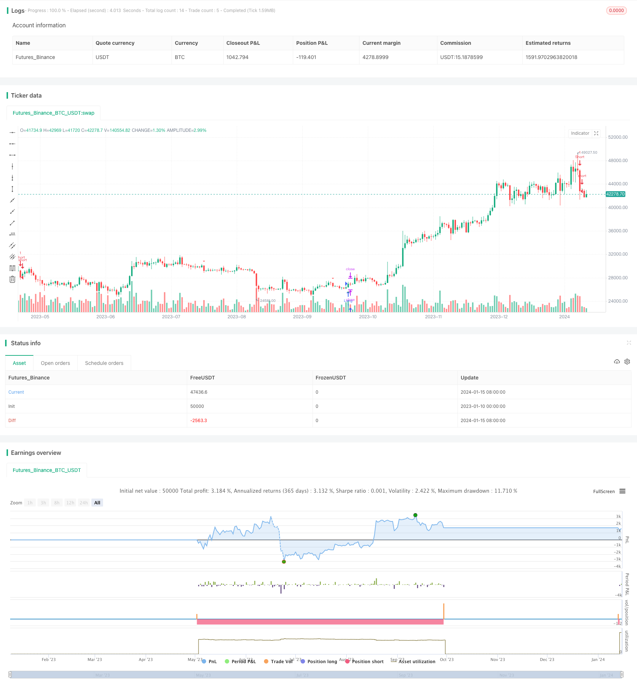

> Name

Dual-SMA-Momentum-Strategy Dual SMA Momentum Strategy
> Author

ChaoZhang

> Strategy Description



[trans]

## Overview

The Dual SMA Momentum strategy is a technical analysis based trading strategy that generates buy and sell signals based on two simple moving average (SMA) indicators. It aims to capture short- to medium-term price momentum in a stock. 

## Strategy Logic

The strategy uses two SMA indicators with short and long time windows - a fast SMA (length 9 periods) and a slow SMA (length 45 periods). 

It generates a long/buy signal when the stock's closing price crosses above both the fast and slow SMA lines, indicating the start of an uptrend. The strategy enters long positions here.

It generates a short/sell signal when the price crosses below both SMA lines, indicating the start of a downtrend. The strategy enters short positions here.

The stop loss levels are set dynamically at the previous day's high (for short trades) and previous day's low (for long trades).

## Advantage Analysis

The main advantages of this strategy are:

1. Uses a combination of short and long term SMAs to capture emerging mid-term trends
2. Adaptive stop loss placement reduces risk and lets profits run
3. Easy to understand and implement
4. Performs well across stocks and markets during trending conditions

However, like all technical analysis strategies, it can underperform during range-bound and whipsaw markets with frequent false signals. An enhancement could be to add other indicators like RSI for additional confirmation. 

## Risk Analysis

The main risks of this strategy are:

1. Prone to whipsaws and false signals: Since it relies solely on SMA crossovers, the strategy can face whipsaws and false signals during sideways or choppy markets, creating unnecessary trading costs. This can be mitigated by combining with other indicators like RSI.

2. Vulnerable to sudden trend reversals: Swift reversals after SMA crossover entries can hit stop loss levels quickly before a trend forms. This risk can be reduced by optimizing SMA lengths or adding other filters.

3. Overoptimization risk from parameter tweaking: Extensive optimization of the SMA lengths and other parameters to curve fit historical data can lead to poor performance in live trading. Robust backtesting over long time frames is essential.

## Enhancement Opportunities

Some ways in which this strategy can be enhanced are:

1. Adding other indicators like RSI for additional trade confirmation to improve timing and accuracy of signals

2. Incorporating dynamic stop loss placement methods like ATR or chandelier exits to better adapt to market volatility

3. Optimizing SMA lengths based on historical volatility and trading time frames for different stocks

4. Adding sound money management and position sizing rules to maximize returns and limit drawdowns

## Conclusion

In summary, the Dual SMA Momentum strategy offers a straightforward approach to trade short- to medium-term trends. While basic in its approach, refinements like additional filters, dynamic stops and prudent optimizations can aid in improving its risk-adjusted returns. Used selectively during stock uptrends and downtrends, it can capture profitable moves.

|| 

## Overview
The Double SMA Momentum Strategy is a trading strategy based on technical analysis that generates buy and sell signals based on two Simple Moving Average (SMA) indicators. It is designed to capture a stock's short- to medium-term price momentum.
## Strategy logic
This strategy uses two SMA indicators, namely short-term and long-term time windows - Fast SMA (9 periods in length) and Slow SMA (45 periods in length).
When the closing price of a stock breaks above the moving averages of the fast SMA and the slow SMA, it indicates the beginning of an uptrend, at which point the strategy generates a long/buy signal and enters a long position.
When the price falls below both SMAs, indicating the beginning of a downtrend, the strategy generates a short/sell signal and enters a short position.
Stop loss levels are dynamically set to the previous day's high (for short trades) and the previous day's low (for long trades).
## Advantage Analysis
The main advantages of this strategy are:
1. Use a combination of short-term and long-term SMAs to capture emerging mid-term trends
2. Adaptive stop placement reduces risk and keeps profits running
3. Easy to understand and implement
4. Outstanding performance in trending market conditions
However, as with all technical analysis strategies, signals are frequently wrong in volatile markets. This can be improved by adding other indicators such as RSI for confirmation.
## Risk Analysis
The main risks of this strategy are:
1. Vulnerable to shocks and erroneous signals: Relying only on SMA crossovers, arbitrary signals may appear during consolidation or oscillations, resulting in unnecessary transaction costs. This can be mitigated by combining with other indicators such as RSI.
2. Vulnerable to sudden trend reversals: A quick reversal after entering the market may quickly penetrate the stop loss level. This risk can be reduced by optimizing SMA length or adding other filters.
3. Risk of overfitting in parameter optimization: Extensive optimization of SMA length and other parameters may lead to poor real performance. Robust backtesting over long time horizons is required.
## Optimization direction
This strategy can be enhanced by:
1. Add other indicators such as RSI for additional confirmation to improve signal accuracy
2. Use dynamic stop loss methods such as ATR or hanging stop loss method to better adapt to market fluctuations
3. Optimize SMA length based on historical volatility and trading time frame of different stocks
4. Add sound money management and position management rules to maximize returns and limit drawdowns
## Summarize
In summary, the Double SMA Momentum Strategy provides a direct way to capture short to medium-term trends. Although its approach is basic, adding additional filters, dynamic stops, and careful optimization can help improve its risk-adjusted returns. Used selectively in rising and falling stock trends, it can capture profitable trends.
[/trans]

> Strategy Arguments


|Argument|Default|Description|
|----|----|----|
|v_input_1|9|Fast SMA Length|
|v_input_2|45|Slow SMA Length|


> Source (PineScript)

``` pinescript
/*backtest
start: 2023-01-10 00:00:00
end: 2024-01-16 00:00:00
period: 1d
basePeriod: 1h
exchanges: [{"eid":"Futures_Binance","currency":"BTC_USDT"}]
*/

//@version=5
strategy("SMA Crossover Strategy", overlay=true)

// Input parameters
fast_length = input(9, title="Fast SMA Length")
slow_length = input(45, title="Slow SMA Length")

// Calculate moving averages
fast_sma = ta.sma(close, fast_length)
slow_sma = ta.sma(close, slow_length)

// Buy condition
buy_condition = ta.crossover(close, fast_sma) and ta.crossover(close, slow_sma)

// Sell condition
sell_condition = ta.crossunder(close, fast_sma) and ta.crossunder(close, slow_sma)

// Calculate stop loss levels
prev_low = request.security(syminfo.tickerid, "1D", low[1], lookahead=barmerge.lookahead_on)
prev_high = request.security(syminfo.tickerid, "1D", high[1], lookahead=barmerge.lookahead_on)

// Plot signals on the chart
plotshape(buy_condition, style=shape.triangleup, location=location.belowbar, color=color.green, size=size.small)
plotshape(sell_condition, style=shape.triangledown, location=location.abovebar, color=color.red, size=size.small)

// Strategy exit conditions
long_stop_loss = sell_condition ? prev_low : na
short_stop_loss = buy_condition ? prev_high : na

strategy.exit("Long Exit", from_entry="Long", when=sell_condition, stop=long_stop_loss)
strategy.exit("Short Exit", from_entry="Short", when=buy_condition, stop=short_stop_loss)

strategy.entry("Long", strategy.long, when=buy_condition)
strategy.entry("Short", strategy.short, when=sell_condition)

```

> Detail

https://www.fmz.com/strategy/439073

> Last Modified

2024-01-17 15:05:08
