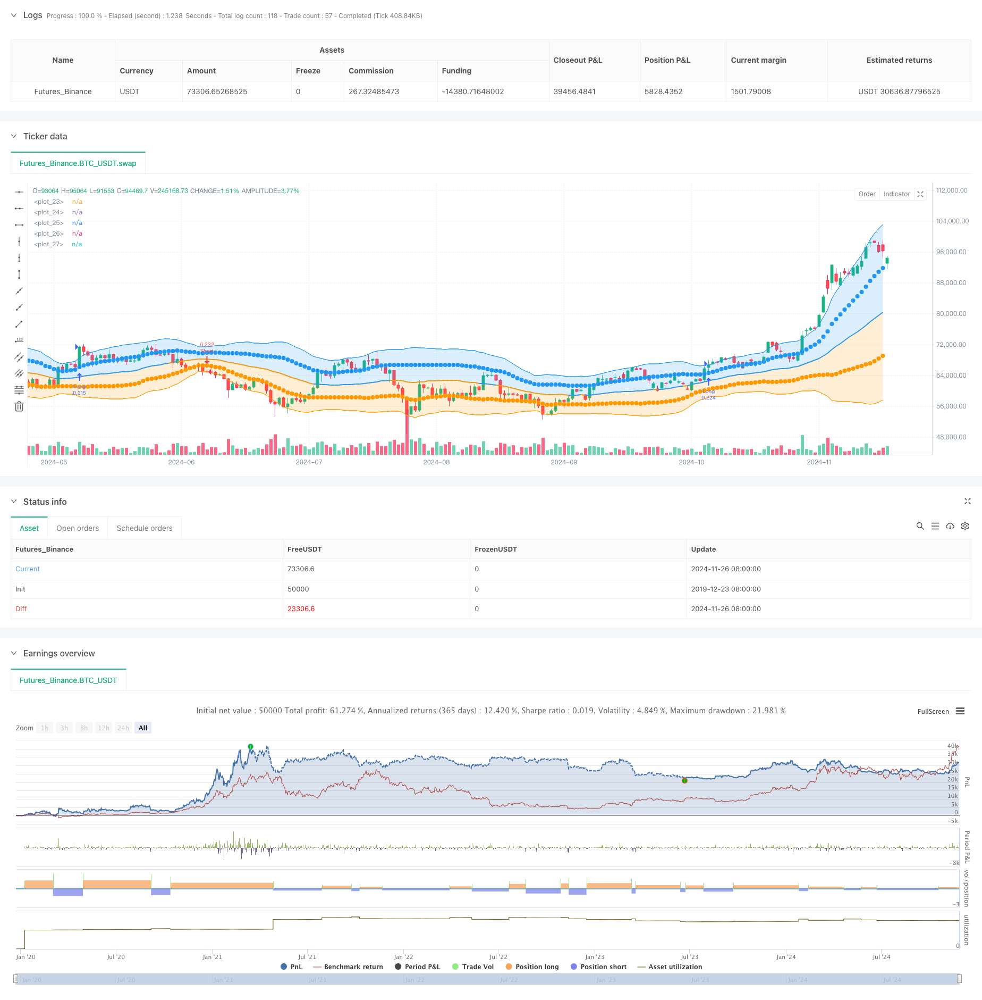

> Name

Double Standard Deviation Bollinger Bands Momentum Breakout Quantitative Strategy-Dual-Standard-Deviation-Bollinger-Bands-Momentum-Breakout-Strategy
> Author

ChaoZhang

> Strategy Description



[trans]
#### Overview
This strategy is based on the innovative application of the Bollinger Bands indicator and captures market momentum by setting up double standard deviation bands. The core of the strategy is to use the Bollinger Bands system constructed with two different standard deviation levels (one standard deviation and two standard deviations) to generate trading signals when the price breaks through the twice standard deviation channel to achieve control of extreme price fluctuations. This strategy provides traders with a systematic trading plan through precise mathematical models and statistical principles.
#### Strategy Principle
The strategy uses the 34-period moving average as the middle track, and calculates one and two standard deviations respectively to form the upper and lower tracks. When the price breaks through the upper band of twice the standard deviation, the system sends a long signal; when the price falls below the lower band of twice the standard deviation, the system sends a short signal. At the same time, the strategy sets an automatic stop-loss mechanism. When the price falls below the lower track when holding a long position or breaks through the upper track when holding a short position, the position will be automatically closed. The strategy uses a fund management system and uses 30% of the account funds for each transaction by default to achieve effective risk control.
#### Strategic Advantages
1. The double standard deviation design provides a more accurate judgment of market extreme values.
2. The automated entry and exit mechanism reduces human judgment errors.
3. A complete fund management system ensures that risks are controllable
4. The parameters are highly adjustable and adaptable to different market environments.
5. High degree of visualization, clear and intuitive trading signals
6. Combines the two trading ideas of trend following and volatility breakthrough
#### Strategy Risk
1. Frequent false breakthroughs may occur in volatile markets
2. Stop loss settings may lead to premature exits in highly volatile markets
3. Fixed proportion position management may increase risks when experiencing continuous losses.
4. Improper parameter settings may cause signal lag
The following methods are recommended for managing risk:
- Combine with other technical indicators for signal confirmation
- Dynamically adjust standard deviation multiples
-Introduction of floating stop loss mechanism
- Dynamically adjust positions based on volatility
#### Strategy optimization direction
1. Introduce an adaptive standard deviation calculation method so that the width of Bollinger Bands can be automatically adjusted according to market volatility
2. Add a trading volume confirmation mechanism to improve the reliability of breakthrough signals
3. Optimize the fund management system and introduce dynamic position control
4. Add trend filters to reduce false signals in volatile markets
5. Develop an intelligent parameter optimization system to realize automatic tuning of strategies
#### Summary
This is an innovative strategy based on the classic Bollinger Bands indicator. Through the design of double standard deviation, it provides a trading system with both theoretical foundation and practicality. While keeping the operation simple and intuitive, the strategy provides traders with a reliable trading tool through strict mathematical models and complete risk control mechanisms. Although there is some room for optimization, its core logic is rigorous and has good practical value. ||
#### Overview
This strategy represents an innovative application of the Bollinger Bands indicator, utilizing dual standard deviation bands for momentum capture. The core mechanism relies on a system of Bollinger Bands constructed using two different standard deviation levels (1SD and 2SD), generating trading signals when price breaks through the 2SD channel. Through precise mathematical modeling and statistical principles, this strategy provides traders with a systematic trading approach.

#### Strategy Principles
The strategy employs a 34-period moving average as the middle band, with upper and lower bands calculated using both single and double standard deviations. Buy signals are generated when price breaks above the 2SD upper band, while sell signals occur when price breaks below the 2SD lower band. The strategy includes automatic stop-loss mechanisms, closing long positions when price breaks below the lower band and short positions when price breaks above the upper band. A money management system is implemented, using 30% of account equity per trade for effective risk control.

#### Strategy Advantages
1. Dual standard deviation design provides more precise market extreme judgments
2. Automated entry/exit mechanisms reduce human judgment errors
3. Comprehensive money management system ensures controlled risk
4. Highly adaptable parameters suitable for different market conditions
5. High degree of visualization with clear trading signals
6. Combines trend following and volatility breakout trading approaches

#### Strategy Risks
1. May generate frequent false breakouts in ranging markets
2. Stop-loss settings might lead to premature exits in highly volatile markets
3. Fixed position sizing might increase risk during consecutive losses
4. Improper parameter settings may result in lagging signals
Risk management recommendations:
- Confirm signals with additional technical indicators
- Dynamically adjust standard deviation multiplier
- Implement trailing stop-loss mechanisms
- Adjust position size based on volatility

#### Optimization Directions
1. Introduce adaptive standard deviation calculation methods for automatic adjustment of band width based on market volatility
2. Add volume confirmation mechanism to improve breakout signal reliability
3. Optimize money management system with dynamic position sizing
4. Implement trend filters to reduce false signals in ranging markets
5. Develop intelligent parameter optimization system for automated strategy tuning

#### Summary
This innovative strategy based on the classic Bollinger Bands indicator provides a trading system with both theoretical foundation and practical utility through its dual standard deviation design. While maintaining operational simplicity and intuitiveness, the strategy offers traders a reliable trading tool through rigorous mathematical modeling and comprehensive risk control mechanisms. Although there is room for optimization, its core logic is sound and demonstrates good practical value.[/trans]


> Source (PineScript)

``` pinescript
/*backtest
start: 2019-12-23 08:00:00
end: 2024-11-27 00:00:00
period: 1d
basePeriod: 1d
exchanges: [{"eid":"Futures_Binance","currency":"BTC_USDT"}]
*/

//@version=5
// Baker Odeh's Strategy - Bollinger Bands : 27/SEP/2014 01:36 : 1.0
// This displays the traditional Bollinger Bands, the difference is
// that the 1st and 2nd StdDev are outlined with two colors and two
// different levels, one for each Standard Deviation

strategy(shorttitle="Baker Odeh's Strategy - Bollinger Bands", title="Baker Odeh's Strategy - Bollinger Bands", overlay=true, currency=currency.NONE, initial_capital=30, default_qty_type=strategy.percent_of_equity, default_qty_value=20)
src = input(close)
length = input.int(34, minval=1)
mult = input.float(2.0, minval=0.001, maxval=50)

basis = ta.sma(src, length)
dev = ta.stdev(src, length)
dev2 = mult * dev

upper1 = basis + dev
lower1 = basis - dev
upper2 = basis + dev2
lower2 = basis - dev2

colorBasis = src >= basis ? color.blue : color.orange

pBasis = plot(basis, linewidth=2, color=colorBasis)
pUpper1 = plot(upper1, color=color.new(color.blue, 0), style=plot.style_circles)
pLower1 = plot(lower1, color=color.new(color.orange, 0), style=plot.style_circles)
pUpper2 = plot(upper2, color=color.new(color.blue, 0))
pLower2 = plot(lower2, color=color.new(color.orange, 0))

fill(pBasis, pUpper2, color=color.new(color.blue, 80))
fill(pUpper1, pUpper2, color=color.new(color.blue, 80))
fill(pBasis, pLower2, color=color.new(color.orange, 80))
fill(pLower1, pLower2, color=color.new(color.orange, 80))

if (close > upper2)
    strategy.entry("Long", strategy.long)

if (close < lower2)
    strategy.entry("Short", strategy.short)

if (close <= lower2)
    strategy.close("Long")

if (close >= upper2)
    strategy.close("Short")

```

> Detail

https://www.fmz.com/strategy/473235

> Last Modified

2024-11-28 15:10:20
