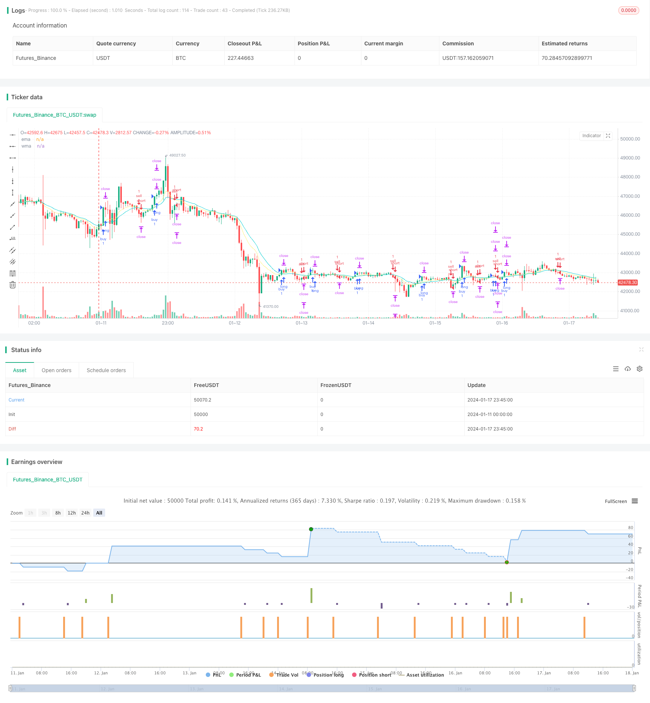

> Name

Dual-Take-Profit-Dual-Stop-Loss-Trailing-Stop-Loss-Bitcoin-Quantitative-Strategy
> Author

ChaoZhang

> Strategy Description


 [trans]

## Overview
This strategy is a Bitcoin quantitative trading strategy based on double take-profit, double stop-loss and trailing stop. This strategy uses the intersection of EMA and WMA as an entry signal, and adopts a risk management method of double take-profit and double stop-loss. After the first take-profit point is reached, a moving stop is adopted to ensure part of the profit and continue to pursue greater profits.
## Strategy Principle
When the EMA crosses the WMA from below, enter the market with a long position; when the EMA crosses the WMA from above, enter the market with a short position.
In terms of take-profit, set two take-profit points. The first take-profit point is set to 20 points above the entry point, and the second take-profit point is set to 40 points above the entry point.
In terms of stop loss, two stop loss points are also set. The first stop loss point is set to 20 points below the entry point, and the second stop loss point is set to the entry point itself.
When the price first touches the first take-profit point, close 50% of the position, move the stop-loss point to the entry point, and continue to pursue greater profits at the second take-profit point.
In this way, this strategy will have three outcomes:
1. The price first hits the stop loss point, resulting in a loss of 2% of the principal;
2. The price first touches the first stop-profit point and obtains 1% profit, then touches the second stop-loss point and finally obtains 1% profit;
3. The price first touches the first profit-taking point and obtains 1% profit. Then it continues to move and touches the second profit-taking point and finally obtains 3% profit.
## Advantage Analysis
The biggest advantage of this strategy is the risk management system. By setting up double take-profit and double stop-loss, you can take a trailing stop loss to lock in the profit after making part of the profit, and continue to pursue greater profits. This can significantly improve profitability.
Another advantage is that this strategy subdivides the results of a single transaction into three situations, reducing the probability of a single loss and making the overall income more stable. Ordinary strategies have only two results, either stop loss and lose 2%, or obtain a profit greater than 2%. This strategy has three results, namely losing 2%, gaining 1% and gaining 3%. This also better controls tail risk.
## Risk Analysis
The risk of this strategy mainly comes from the setting of stop loss points. If the stop loss distance is too loose, it may lead to excessive single losses; if the stop loss distance is too narrow, it is easy to be hit by market noise. This requires setting appropriate stop loss distances based on the characteristics and volatility of different varieties.
Another risk is the risk of loss for the part of the position that is still held after the first take-profit point. If the loss exceeds the profit of the first take profit, it will offset part or all of the profit. This requires strict execution of trailing stops to lock in profits.
## Optimization direction
This strategy can be optimized from the following aspects:
1. Test different parameter combinations to find optimal parameter settings. For example, you can test the take-profit and stop-loss distances of 15 points and 25 points.
2. Try other indicator combinations, such as KDJ, MACD, etc. indicator signals to decide the entry.
3. Optimize the position proportion for closing the first profit-taking point, whether 50% is suitable, 30% or 70% is better.
4. Test the tracking speed setting of the trailing stop to ensure that the loss space is minimized while ensuring profits.
## Summarize
This strategy is very stable overall. Through double take-profit, double stop-loss and trailing stop, it can significantly improve the profit level and reduce tail risk. The space for optimization is also relatively large, and better results can be obtained through parameter adjustment and indicator combination. In general, this strategy is suitable for investors who pursue high and stable returns.
||

## Overview

This is a Bitcoin quantitative trading strategy based on dual take profit, dual stop loss and trailing stop loss. It uses EMA and WMA crossover as entry signals, adopts dual take profit and dual stop loss risk management methodology, and applies trailing stop loss after the first take profit is achieved to lock in partial profits while seeking greater profits.   

## Strategy Logic

Long entry when EMA crosses over WMA from below, and short entry when EMA crosses under WMA from above.

On the profit side, there are two take profit targets. The first take profit is set at 20 pips above the entry price, and the second take profit is set at 40 pips above the entry price.  

On the stop loss side, there are also two stop losses. The first stop loss is set at 20 pips below the entry price, and the second stop loss is set at the entry price itself.

When the first take profit is triggered, 50% of the position will be closed, and stop loss will be trailed to the entry price to lock in profits, while seeking for greater profits from the second take profit target.

As such, there can be three possible outcomes for each trade:
1. Price hits stop loss first, lose 2% capital. 
2. Price hits first take profit first for 1% profit, then hits second stop loss, end up with 1% profit.
3. Price hits first take profit first for 1% profit, continues to run and hits second take profit, end up with 3% profit.  

## Advantage Analysis  

The biggest advantage of this strategy lies in its risk management methodology. By setting dual take profits and dual stop losses, it can lock in partial profits after the first take profit is achieved, while continuing to seek greater profits. This can significantly improve the profitability.  

Another advantage is that by dividing a single trade into three possible outcomes, it lowers the probability of maximum loss, making the overall returns more consistent. Typical strategies have only two outcomes - either hit 2% stop loss or win more than 2%. This strategy has three outcomes - lose 2%, win 1%, and win 3%, which also better controls the tail risks.

## Risk Analysis

The main risks of this strategy come from the stop loss setting. If the stop loss distance is too wide, it may result in oversized single trade loss. If the stop loss distance is too tight, it may get stopped out prematurely by market noises. Proper stop loss distance needs to be set based on the characteristics and volatility of different trading instruments.  

Another risk is the remaining position after first take profit still carries loss risks. If the subsequent loss exceeds the first take profit, it will offset parts or all of the realized profits. This needs to be addressed by strictly trailing the stop loss to protect profits locked. 

## Optimization Directions  

The following areas can be optimized for the strategy:

1. Test different parameter combinations to find optimum parameters, such as testing 15 pips, 25 pips take profit/stop loss distances.  

2. Try other technical indicator combinations for entry signals, such as KDJ, MACD crossover.

3. Optimize percentage of position closed at first take profit, such as 50% may not be optimal, 30% or 70% could perform better potentially.  

4. Test different settings for trailing stop loss speed to balance locking in profits and giving prices enough room to fluctuate.  

## Conclusion  

In conclusion, this is an overall robust strategy, which can significantly improve profitability and reduce tail risks through the dual take profit, dual stop loss and trailing stop loss mechanisms. There is also ample room for optimization via parameter tuning and technical indicator engineering to achieve even better performance. It is suitable for investors who pursue high and steady investment gains.  

[/trans]

> Strategy Arguments


|Argument|Default|Description|
|----|----|----|
|v_input_1|true|Buy|
|v_input_2|true|Sell|
|v_input_3|2020|Start year|
|v_input_4|true|Start month|
|v_input_5|true|Start day|
|v_input_6|false|Start hour|
|v_input_7|false|Start minute|
|v_input_8|false|set end time?|
|v_input_9|2019|end year|
|v_input_10|12|end month|
|v_input_11|31|end day|
|v_input_12|23|end hour|
|v_input_13|59|end minute|
|v_input_14|10|EMA period|
|v_input_15|20|WMA period|
|v_input_16|20|pip|


> Source (PineScript)

``` pinescript
/*backtest
start: 2024-01-11 00:00:00
end: 2024-01-18 00:00:00
period: 45m
basePeriod: 5m
exchanges: [{"eid":"Futures_Binance","currency":"BTC_USDT"}]
*/

//@version=4
strategy("SL1 Pips after TP1 (MA)", commission_type=strategy.commission.cash_per_order, overlay=true)

// Strategy
Buy  = input(true)
Sell = input(true)

// Date Range
start_year    = input(title='Start year'   ,defval=2020)
start_month   = input(title='Start month'  ,defval=1)
start_day     = input(title='Start day'    ,defval=1)
start_hour    = input(title='Start hour'   ,defval=0)
start_minute  = input(title='Start minute' ,defval=0)
end_time      = input(title='set end time?',defval=false)
end_year      = input(title='end year'     ,defval=2019)
end_month     = input(title='end month'    ,defval=12)
end_day       = input(title='end day'      ,defval=31)
end_hour      = input(title='end hour'     ,defval=23)
end_minute    = input(title='end minute'   ,defval=59)

// MA
ema_period = input(title='EMA period',defval=10)
wma_period = input(title='WMA period',defval=20)
ema        = ema(close,ema_period)
wma        = wma(close,wma_period)

// Entry Condition
buy =
 crossover(ema,wma) and
 nz(strategy.position_size) == 0 and Buy
 
sell =
 crossunder(ema,wma) and
 nz(strategy.position_size) == 0 and Sell

// Pips
pip = input(20)*10*syminfo.mintick

// Trading parameters //
var bool  LS  = na
var bool  SS  = na
var float EP  = na
var float TVL = na
var float TVS = na
var float TSL = na
var float TSS = na
var float TP1 = na
var float TP2 = na
var float SL1 = na
var float SL2 = na

if buy or sell and strategy.position_size == 0
    EP  := close
    SL1 := EP - pip     * (sell?-1:1)
    SL2 := EP - pip     * (sell?-1:1)
    TP1 := EP + pip     * (sell?-1:1)
    TP2 := EP + pip * 2 * (sell?-1:1) 
   
// current trade direction    
LS := buy  or strategy.position_size > 0
SS := sell or strategy.position_size < 0

// adjust trade parameters and trailing stop calculations
TVL := max(TP1,open) - pip[1]
TVS := min(TP1,open) + pip[1]
TSL := open[1] > TSL[1] ? max(TVL,TSL[1]):TVL 
TSS := open[1] < TSS[1] ? min(TVS,TSS[1]):TVS

if LS and high > TP1
    if open <= TP1
        SL2:=min(EP,TSL)
    
if SS and low < TP1
    if open >= TP1
        SL2:=max(EP,TSS)

// Closing conditions
close_long  = LS and open < SL2
close_short = SS and open > SL2

// Buy
strategy.entry("buy"  , strategy.long, when=buy and not SS)
strategy.exit ("exit1", from_entry="buy", stop=SL1, limit=TP1, qty_percent=1)
strategy.exit ("exit2", from_entry="buy", stop=SL2, limit=TP2)

// Sell
strategy.entry("sell" , strategy.short, when=sell and not LS)
strategy.exit ("exit3", from_entry="sell", stop=SL1, limit=TP1, qty_percent=1)
strategy.exit ("exit4", from_entry="sell", stop=SL2, limit=TP2)

// Plots
a=plot(strategy.position_size >  0 ? SL1 : na, color=#dc143c, style=plot.style_linebr)
b=plot(strategy.position_size <  0 ? SL1 : na, color=#dc143c, style=plot.style_linebr) 
c=plot(strategy.position_size >  0 ? TP1 : na, color=#00ced1, style=plot.style_linebr) 
d=plot(strategy.position_size <  0 ? TP1 : na, color=#00ced1, style=plot.style_linebr) 
e=plot(strategy.position_size >  0 ? TP2 : na, color=#00ced1, style=plot.style_linebr) 
f=plot(strategy.position_size <  0 ? TP2 : na, color=#00ced1, style=plot.style_linebr) 
g=plot(strategy.position_size >= 0 ? na  : EP, color=#ffffff, style=plot.style_linebr) 
h=plot(strategy.position_size <= 0 ? na  : EP, color=#ffffff, style=plot.style_linebr) 

plot(ema,title="ema",color=#fff176)
plot(wma,title="wma",color=#00ced1)

```

> Detail

https://www.fmz.com/strategy/439360

> Last Modified

2024-01-19 15:07:04
