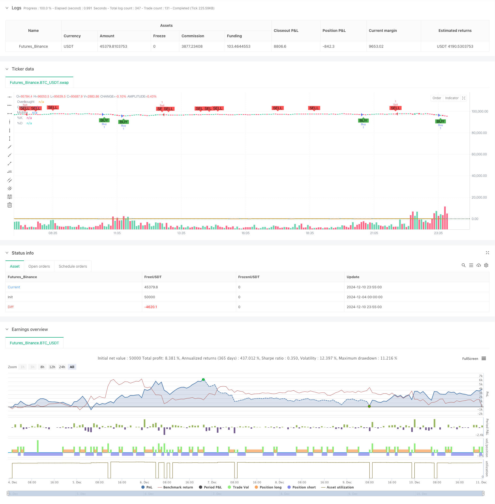

> Name

Dual-Timeframe-Stochastic-Momentum-Trading-Strategy
> Author

ChaoZhang

> Strategy Description



[trans]
#### Overview
This strategy is a dual time period momentum trading system based on the Stochastic indicator. It identifies potential trading opportunities by analyzing the cross signals of stochastic indicators on different time periods, and combines momentum principles and trend tracking methods to achieve more accurate market trend judgment and trading timing. The strategy also integrates risk management mechanisms, including take-profit and stop-loss settings, for better money management.
#### Strategy Principles
The core logic of the strategy is based on the following key elements:
1. Use the stochastic indicator with two time periods: the longer time period is used to confirm the overall trend direction, and the shorter time period is used to generate specific trading signals.
2. Trading signal generation rules:
   - Long signal: When the short-term %K line crosses the %D line upward from the oversold zone (below 20), while the long-term period is in an upward trend.
   - Short signal: When the short-term %K line crosses the %D line downward from the overbought zone (above 80), while the long-term period is in a downward trend.
3. Set 14 periods as the base period of the stochastic indicator and 3 periods as the smoothing factor.
4. Integrated the candle chart form confirmation mechanism to improve the reliability of trading signals.
#### Strategic Advantages
1. Multiple confirmation mechanism: Provide more reliable trading signals through dual time period analysis.
2. Trend following ability: able to effectively capture the turning point of market trends.
3. High flexibility: parameter settings can be adjusted according to different market conditions.
4. Improved risk control: Integrated stop-profit and stop-loss mechanisms.
5. Clear signals: The trading signals are clear and easy to execute.
6. Strong adaptability: can be applied to multiple time period combinations.
#### Strategy Risk
1. False breakthrough risk: False signals may be generated in volatile markets.
2. Lagging risk: Due to the use of moving average as a smoothing factor, the signal may lag behind.
3. Parameter sensitivity: Different parameter settings will significantly affect strategy performance.
4. Market environment dependence: It performs better in markets with obvious trends, but may not perform well in volatile markets.
#### Strategy optimization direction
1. Introduce volatility indicator: ATR indicator can be added to dynamically adjust the stop loss position.
2. Optimize signal filtering: you can increase the trading volume confirmation mechanism.
3. Add trend strength filtering: introduce trend strength indicators such as ADX.
4. Improve risk management: implement a dynamic position management mechanism.
5. Optimization parameter adaptation: dynamically adjust parameters according to market conditions.
#### Summary
This is a trading strategy with complete structure and clear logic, which captures market opportunities through stochastic indicator analysis of dual time periods. The advantage of this strategy lies in the multiple confirmation mechanism and complete risk control, but you also need to pay attention to risks such as false breakthroughs and parameter sensitivity. Through continuous optimization and improvement, this strategy is expected to achieve better trading results. ||
#### Overview
This strategy is a dual timeframe momentum trading system based on the Stochastic indicator. It identifies potential trading opportunities by analyzing Stochastic crossover signals across different timeframes, combining momentum principles and trend-following methods for more accurate market trend judgment and trade timing. The strategy also incorporates risk management mechanisms, including take-profit and stop-loss settings, for better money management.

#### Strategy Principles
The core logic is based on the following key elements:
1. Uses Stochastic indicators on two timeframes: longer timeframe for overall trend confirmation, shorter timeframe for specific trade signal generation.
2. Trade signal generation rules:
   - Long signals: when short-period %K crosses above %D from oversold area (below 20), while longer timeframe shows uptrend.
   - Short signals: when short-period %K crosses below %D from overbought area (above 80), while longer timeframe shows downtrend.
3. Sets 14 periods as the base period for Stochastic indicator, 3 periods as smoothing factor.
4. Integrates candlestick pattern confirmation mechanism to enhance signal reliability.

#### Strategy Advantages
1. Multiple confirmation mechanism: provides more reliable signals through dual timeframe analysis.
2. Trend following capability: effectively captures market trend turning points.
3. High flexibility: parameters can be adjusted for different market conditions.
4. Comprehensive risk control: integrated take-profit and stop-loss mechanisms.
5. Clear signals: trading signals are explicit and easy to execute.
6. Strong adaptability: applicable to multiple timeframe combinations.

#### Strategy Risks
1. False breakout risk: may generate false signals in ranging markets.
2. Lag risk: signals may have some delay due to moving average smoothing factors.
3. Parameter sensitivity: different parameter settings significantly affect strategy performance.
4. Market environment dependency: performs better in trending markets but may underperform in ranging markets.

#### Strategy Optimization Directions
1. Introduce volatility indicators: add ATR indicator for dynamic stop-loss adjustment.
2. Optimize signal filtering: add volume confirmation mechanism.
3. Add trend strength filtering: incorporate trend strength indicators like ADX.
4. Improve risk management: implement dynamic position sizing mechanism.
5. Optimize parameter adaptation: dynamically adjust parameters based on market conditions.

#### Summary
This is a well-structured trading strategy with clear logic, capturing market opportunities through dual timeframe Stochastic indicator analysis. The strategy's strengths lie in its multiple confirmation mechanisms and comprehensive risk control, but attention must be paid to risks such as false breakouts and parameter sensitivity. Through continuous optimization and improvement, the strategy has the potential to achieve better trading results.[/trans]


> Source (PineScript)

``` pinescript
/*backtest
start: 2024-12-04 00:00:00
end: 2024-12-11 00:00:00
period: 5m
basePeriod: 5m
exchanges: [{"eid":"Futures_Binance","currency":"BTC_USDT"}]
*/

//@version=5
strategy("Enhanced Stochastic Strategy", overlay=true)

// Input untuk Stochastic
length = input.int(14, title="Length", minval=1)
OverBought = input(80, title="Overbought Level")
OverSold = input(20, title="Oversold Level")
smoothK = input.int(3, title="Smooth %K")
smoothD = input.int(3, title="Smooth %D")

// Input untuk Manajemen Risiko
tpPerc = input.float(2.0, title="Take Profit (%)", step=0.1)
slPerc = input.float(1.0, title="Stop Loss (%)", step=0.1)

// Hitung Stochastic
k = ta.sma(ta.stoch(close, high, low, length), smoothK)
d = ta.sma(k, smoothD)

// Logika Sinyal
co = ta.crossover(k, d)  // %K memotong %D ke atas
cu = ta.crossunder(k, d) // %K memotong %D ke bawah

longCondition = co and k < OverSold
shortCondition = cu and k > OverBought

// Harga untuk TP dan SL
var float longTP = na
var float longSL = na
var float shortTP = na
var float shortSL = na

if (longCondition)
    longTP := close * (1 + tpPerc / 100)
    longSL := close * (1 - slPerc / 100)
    strategy.entry("Buy", strategy.long, comment="StochLE")
    strategy.exit("Sell Exit", "Buy", limit=longTP, stop=longSL)

if (shortCondition)
    shortTP := close * (1 - tpPerc / 100)
    shortSL := close * (1 + slPerc / 100)
    strategy.entry("Sell", strategy.short, comment="StochSE")
    strategy.exit("Buy Exit", "Sell", limit=shortTP, stop=shortSL)

// Plot Stochastic dan Level
hline(OverBought, "Overbought", color=color.red, linestyle=hline.style_dotted)
hline(OverSold, "Oversold", color=color.green, linestyle=hline.style_dotted)
hline(50, "Midline", color=color.gray, linestyle=hline.style_dotted)

plot(k, color=color.blue, title="%K")
plot(d, color=color.orange, title="%D")

// Tambahkan sinyal visual
plotshape(longCondition, title="Buy Signal", location=location.belowbar, style=shape.labelup, color=color.new(color.green, 0), text="BUY")
plotshape(shortCondition, title="Sell Signal", location=location.abovebar, style=shape.labeldown, color=color.new(color.red, 0), text="SELL")
```

> Detail

https://www.fmz.com/strategy/474833

> Last Modified

2024-12-12 14:19:54
