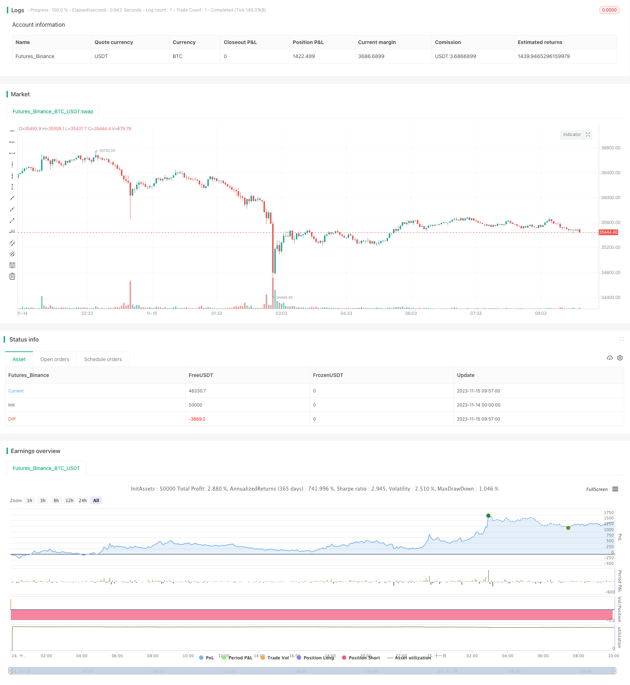

> Name

Dual-track-System-Momentum-Trading-Strategy
> Author

ChaoZhang

> Strategy Description



[trans]


## Overview
This strategy uses a combination of two indicators, MACD and Stoch RSI, to build a dual-track trading system to achieve trend tracking and oversold and overbought judgments. The strategy constructs indicators on the daily line and the 4-hour line at the same time to achieve multi-time frame judgment and reduce the probability of misjudgment.
## Strategy Principle
The strategy combination uses two different types of technical indicators, MACD and Stoch RSI, for configuration. MACD is a differential indicator, which determines the speed of price changes; Stoch RSI is an overbought and oversold indicator, which determines the relative strength of prices.
The strategy first constructs MACD and Stoch RSI indicators on the daily line and 4-hour line respectively to judge the trend and overbought and oversold. When the indicators of the two time periods send out buy/sell signals at the same time, the corresponding buy/sell operations are performed.
Specifically, the MACD indicator is constructed, and the DIF line and the DEA line form a golden cross for judgment; the Stoch RSI indicator is constructed, and the K line and the D line form a golden cross for judgment. A buy signal is generated when both sets of indicators cross golden at the same time, and a sell signal is generated when the indicators cross dead at the same time.
In this way, the strategy comprehensively uses dual-track indicators and multi-time frame judgment to comprehensively judge the speed of price changes and relative strength, which helps to improve decision-making accuracy and obtain better returns.
## Advantage Analysis
This strategy has the following advantages:
1. Combine dual-track indicators to make comprehensive judgments and improve decision-making accuracy
2. Use multiple time frames to reduce the probability of misjudgment
3. Use trend following and overbought and oversold judgments, and comprehensively consider the price change speed and relative strength.
4. Indicator parameters can be adjusted to adapt to different varieties and market environments.
5. The code structure is clear and easy to understand and expand.
## Risk Analysis
This strategy also has some risks:
1. There are systemic risks in the market that cannot be completely avoided.
2. Improper setting of indicator parameters may lead to frequent trading or missed opportunities.
3. The probability of dual-track indicators sending out wrong signals at the same time exists, but it is lower than that of a single indicator.
4. Unable to cope with rapidly changing markets, such as major black swan events
Countermeasures:
1. Optimize parameters, adjust buying and selling conditions, and reduce misjudgments
2. Combine more indicators to increase the basis for judgment.
3. Add a stop-loss strategy to control the risk of a single loss
## Optimization direction
This strategy can also be optimized from the following aspects:
1. Add more indicators to combine and build a multi-indicator strategy
2. Add machine learning algorithms to achieve dynamic parameter optimization
3. Combine sentiment indicators, news and other factors to judge market conditions
4. Add stop-loss and take-profit strategies to optimize fund management
5. Expand more trading varieties and find better trading opportunities
## Summarize
This strategy uses a combination of dual-track indicators and multi-time frame judgment to comprehensively judge the price change speed and relative strength, which can effectively obtain market trends and improve the misjudgment defects of a single indicator. It also has the advantages of flexible parameter adjustment, easy understanding and expansion. Subsequent expansion and optimization can be carried out through multi-index combination, dynamic parameter optimization, introduction of sentiment indicators, etc. to further improve strategy performance.
||

## Overview

This strategy combines the MACD and Stoch RSI indicators to build a dual-rail trading system for trend tracking and oversold/overbought judgment. The strategy also builds indicators on the daily and 4-hour timeframes to make multi-timeframe judgments to reduce misjudgment probability.

## Strategy Principle 

The strategy combines the MACD and Stoch RSI indicators, which are different types of technical indicators, for configuration. MACD is a momentum indicator that judges price change velocity; Stoch RSI is an overbought/oversold indicator that judges relative price strength.

The strategy first constructs the MACD and Stoch RSI indicators on the daily and 4-hour timeframes respectively for trend and overbought/oversold judgments. When signals are triggered on both timeframes, corresponding buy/sell operations are performed.  

Specifically, the MACD indicator is constructed with the DIF and DEA lines forming golden/dead crosses for judgment; the Stoch RSI indicator is constructed with the K and D lines forming golden/dead crosses for judgment. When both indicator pairs have golden crosses, buy signals are generated; when both have dead crosses, sell signals are generated.

Thus, by comprehensively applying the dual-indicator system and multi-timeframe judgments, the strategy judges price velocity and relative strength thoroughly, which helps improve decision accuracy and gain better returns.

## Advantage Analysis

This strategy has the following advantages:

1. Combining dual-indicator system for comprehensive judgment and higher decision accuracy  
2. Applying multi-timeframe to reduce misjudgment probability
3. Adopting trend tracking and overbought/oversold judgment for consideration of both price velocity and relative strength  
4. Flexible indicator parameters adjustable for different products and market environments
5. Clean code structure easy to understand and expand

## Risk Analysis

There are also some risks with this strategy:  

1. There exist systemic market risks that cannot be fully avoided  
2. Inappropriate indicator parameter settings may lead to overtrading or missing opportunities
3. Dual indicators may still give concurrent wrong signals, but less likely than single ones  
4. Unable to cope with drastic market changes like black swan events  

Countermeasures:

1. Optimize parameters and adjust trading conditions to reduce misjudgments  
2. Incorporate more indicators for combined judgments  
3. Add stop loss mechanisms to control single loss risk  

## Optimization Directions

This strategy can also be improved in the following aspects:

1. Incorporate more indicators for multi-indicator strategies  
2. Add machine learning algorithms for dynamic parameter optimization
3. Combine sentiment indicators, news etc. for more comprehensive market condition judgments 
4. Add stop loss, take profit strategies to optimize money management
5. Expand to more trading products to discover better opportunities  

## Conclusion

By combined application of the dual-indicator system and multi-timeframe judgments, this strategy judges price velocity and relative strength thoroughly, which can effectively capture market trends and improve deficiencies of single indicators. It also has advantages like flexible parameter tuning, easy understanding and expansion. Further expansions by multi-indicator combination, dynamic parameter optimization, sentiment indicator incorporation etc. can help boost strategy performance.
[trans]

> Strategy Arguments


|Argument|Default|Description|
|----|----|----|
|v_input_1_close|0|MACD Source:: close|high|low|open|hl2|hlc3|hlcc4|ohlc4|
|v_input_2|12|MACD Fast Length:|
|v_input_3|26|MACD Slow Length:|
|v_input_4|9|MACD Signal Smoothing:|
|v_input_5_close|0|SRSI Source:: close|high|low|open|hl2|hlc3|hlcc4|ohlc4|
|v_input_6|14|SRSI RSI Length:|
|v_input_7|14|SRSI Stoch Length:|
|v_input_8|3|SRSI Smoothing:|
|v_input_9|3|SRSI Signal Smoothing:|
|v_input_10|true|Trade Size in USD:|
|v_input_11|true|Perform buy trading?|
|v_input_12|true|Perform sell trading?|


> Source (PineScript)

``` pinescript
/*backtest
start: 2023-11-14 00:00:00
end: 2023-11-15 10:00:00
period: 3m
basePeriod: 1m
exchanges: [{"eid":"Futures_Binance","currency":"BTC_USDT"}]
*/

//@version=2
strategy(title='[RS]Khizon (UWTI) Strategy V0', shorttitle='K', overlay=false, pyramiding=0, initial_capital=100000, currency=currency.USD)
//  ||  Inputs:
macd_src = input(title='MACD Source:',  defval=close)
macd_fast = input(title='MACD Fast Length:',  defval=12)
macd_slow = input(title='MACD Slow Length:',  defval=26)
macd_signal_smooth = input(title='MACD Signal Smoothing:',  defval=9)
srsi_src = input(title='SRSI Source:',  defval=close)
srsi_rsi_length = input(title='SRSI RSI Length:',  defval=14)
srsi_stoch_length = input(title='SRSI Stoch Length:',  defval=14)
srsi_smooth = input(title='SRSI Smoothing:',  defval=3)
srsi_signal_smooth = input(title='SRSI Signal Smoothing:',  defval=3)
//  ||  Strategy Inputs:
trade_size = input(title='Trade Size in USD:', type=float, defval=1)
buy_trade = input(title='Perform buy trading?', type=bool, defval=true)
sel_trade = input(title='Perform sell trading?', type=bool, defval=true)
//  ||  MACD(close, 12, 26, 9):     ||---------------------------------------------||
f_macd_trigger(_src, _fast, _slow, _signal_smooth)=>
    _macd = ema(_src, _fast) - ema(_src, _slow)
    _signal = sma(_macd, _signal_smooth)
    _return_trigger = _macd >= _signal ? true : false
//  ||  Stoch RSI(close, 14, 14, 3, 3)  ||-----------------------------------------||
f_srsi_trigger(_src, _rsi_length, _stoch_length, _smooth, _signal_smooth)=>
    _rsi = rsi(_src, _rsi_length)
    _stoch = sma(stoch(_rsi, _rsi, _rsi, _stoch_length), _smooth)
    _signal = sma(_stoch, _signal_smooth)
    _return_trigger = _stoch >= _signal ? true : false
//  ||-----------------------------------------------------------------------------||
//  ||-----------------------------------------------------------------------------||
//  ||  Check Directional Bias from daily timeframe:
daily_trigger = security('USOIL', 'D', f_macd_trigger(macd_src, macd_fast, macd_slow, macd_signal_smooth) and f_srsi_trigger(srsi_src, srsi_rsi_length, srsi_stoch_length, srsi_smooth, srsi_signal_smooth))
h4_trigger = security('USOIL', '240', f_macd_trigger(macd_src, macd_fast, macd_slow, macd_signal_smooth) and f_srsi_trigger(srsi_src, srsi_rsi_length, srsi_stoch_length, srsi_smooth, srsi_signal_smooth))

plot(title='D1T', series=daily_trigger?0:na, style=circles, color=blue, linewidth=4, transp=65)
plot(title='H4T', series=h4_trigger?0:na, style=circles, color=navy, linewidth=2, transp=0)

sel_open = sel_trade and not daily_trigger and not h4_trigger
buy_open = buy_trade and daily_trigger and h4_trigger
sel_close = not buy_trade and daily_trigger and h4_trigger
buy_close = not sel_trade and not daily_trigger and not h4_trigger
strategy.entry('sel', long=false, qty=trade_size, comment='sel', when=sel_open)
strategy.close('sel', when=sel_close)
strategy.entry('buy', long=true, qty=trade_size, comment='buy', when=buy_open)
strategy.close('buy', when=buy_close)

```

> Detail

https://www.fmz.com/strategy/432892

> Last Modified

2023-11-22 15:26:28
