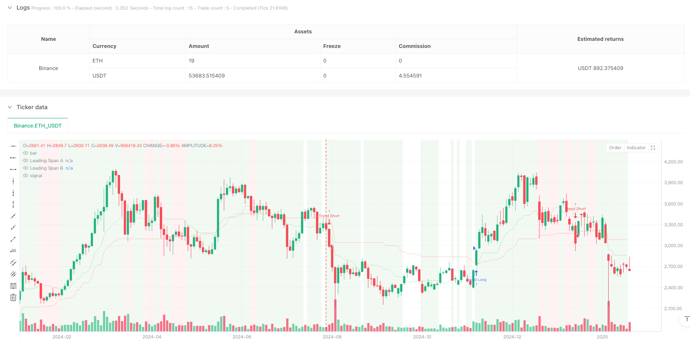
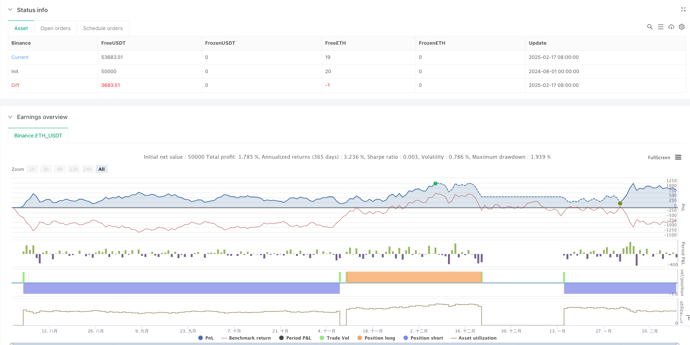

> Name

Dynamic-Adaptive-Multi-Timeframe-Trend-Following-and-Range-Reversal-Hybrid-Strategy
> Author

ianzeng123

> Strategy Description





[trans]
#### Overview
This strategy is a composite trading system that combines trend tracking and range trading. It uses ichimoku cloud charts to identify market status, combines MACD momentum confirmation and RSI overbought and oversold indicators, and uses ATR for dynamic stop loss management. This strategy can capture trend opportunities in trending markets and find reversal opportunities in volatile markets, and has strong adaptability and flexibility.
#### Strategy Principle
The strategy adopts a multi-level signal confirmation mechanism:
1. Use the ichimoku cloud chart as the main basis for judging the market status, and judge whether the market is in a trend or oscillation state through the position relationship between the price and the cloud layer.
2. In a trending market, when the price is above the clouds, RSI>55, and the MACD histogram is positive, enter the market to go long; when the price is below the clouds, RSI<45, and the MACD histogram is negative, enter the market to go short.
3. In a volatile market, when RSI<30 and Stochastic RSI<20, look for long opportunities; when RSI>70 and Stochastic RSI>80, look for short opportunities.
4. Use ATR-based dynamic stop loss to manage risk. The stop loss distance is 2 times the ATR value.
#### Strategic Advantages
1. Strong market adaptability: able to automatically adjust trading strategies according to different market conditions to improve the stability of the strategy
2. High signal reliability: adopt multiple indicator verification mechanisms to reduce the impact of false signals
3. Improved risk control: Through ATR dynamic stop loss, profits can be fully developed and risks can be effectively controlled.
4. Good visualization effect: the market status is marked by background color, which facilitates traders to intuitively understand the market environment.
5. Excellent performance in high time cycles: It has a profit factor of 2.159 on the daily cycle, and the net profit reaches 10.71%
#### Strategy Risk
1. The winning rate is low: the winning rate in each time period is less than 40%, which requires strong mental endurance.
2. Excessive trading in low time periods: 430 trades were executed within a 4-hour period, which was low efficiency
3. Signal lag: due to the use of multiple indicator verifications, some market opportunities may be missed
4. Parameter optimization is difficult: the combination of multiple indicators increases the complexity of strategy optimization
#### Strategy optimization direction
1. Signal filtering optimization: You can improve the winning rate by adjusting the thresholds of each indicator
2. Time cycle adaptation: It is recommended to be mainly used in the daily line and above, and parameters can be adjusted according to different market characteristics.
3. Stop loss optimization: You can consider dynamically adjusting the ATR multiple according to different market conditions.
4. Optimize entry timing: You can increase trading volume confirmation or price pattern confirmation to improve entry accuracy
5. Position management optimization: a dynamic position management system can be designed based on signal strength
#### Summary
This strategy is a comprehensive trading system with reasonable design and clear logic. Through the combined use of multiple indicators, it achieves intelligent identification of market status and accurate capture of trading opportunities. Although there are some problems on low time frames, it performs well on higher time frames such as the daily line. It is recommended that traders pay attention to daily-level signals when using real trading, and reasonably adjust parameters according to their own risk tolerance. Through continuous optimization and adjustment, this strategy is expected to provide traders with stable profit opportunities. ||
#### Overview
This strategy is a hybrid trading system that combines trend following and range trading, using the Ichimoku Cloud for market state identification, MACD for momentum confirmation, RSI for overbought/oversold conditions, and ATR for dynamic stop-loss management. The strategy can capture trending opportunities in trending markets and find reversal opportunities in ranging markets, showing strong adaptability and flexibility.

#### Strategy Principles
The strategy employs a multi-level signal confirmation mechanism:
1. Uses the Ichimoku Cloud as the primary indicator for market state determination, judging whether the market is trending or ranging based on price position relative to the cloud
2. In trending markets, enters long when price is above the cloud with RSI>55 and positive MACD histogram; enters short when price is below the cloud with RSI<45 and negative MACD histogram
3. In ranging markets, looks for long opportunities when RSI<30 and Stochastic RSI<20; looks for short opportunities when RSI>70 and Stochastic RSI>80
4. Uses ATR-based dynamic stop-loss for risk management, with stop-loss distance set at 2 times the ATR value

#### Strategy Advantages
1. Strong market adaptability: Automatically adjusts trading strategy based on different market conditions, improving strategy stability
2. High signal reliability: Uses multiple indicator verification mechanism to reduce false signals
3. Comprehensive risk control: ATR dynamic stop-loss allows profits to develop while effectively controlling risk
4. Good visualization: Market states are marked with background colors for intuitive understanding
5. Excellent performance on higher timeframes: Shows a profit factor of 2.159 with 10.71% net profit on daily timeframe

#### Strategy Risks
1. Low win rate: Win rates below 40% across all timeframes, requiring strong psychological resilience
2. Overtrading on lower timeframes: Executed 430 trades on 4-hour timeframe with lower efficiency
3. Signal lag: Multiple indicator verification may cause missed market opportunities
4. Complex parameter optimization: Multiple indicator combinations increase strategy optimization complexity

#### Strategy Optimization Directions
1. Signal filtering optimization: Adjust indicator thresholds to improve win rate
2. Timeframe adaptation: Recommended for daily and higher timeframes, with parameters adjustable to different market characteristics
3. Stop-loss optimization: Consider dynamic adjustment of ATR multiplier based on market conditions
4. Entry timing optimization: Add volume confirmation or price pattern confirmation to improve entry accuracy
5. Position management optimization: Design dynamic position management system based on signal strength

#### Summary
This strategy is a well-designed, logically clear comprehensive trading system that achieves intelligent market state identification and precise capture of trading opportunities through multiple indicator coordination. While there are some issues on lower timeframes, it performs excellently on higher timeframes like daily. Traders are recommended to focus on daily timeframe signals when using it in live trading and adjust parameters according to their risk tolerance. Through continuous optimization and adjustment, this strategy has the potential to provide stable profit opportunities for traders.[/trans]


> Source (PineScript)

``` pinescript
/*backtest
start: 2024-08-01 00:00:00
end: 2025-02-18 08:00:00
period: 2d
basePeriod: 2d
exchanges: [{"eid":"Binance","currency":"ETH_USDT"}]
*/

// This Pine Script™ code is subject to the terms of the Mozilla Public License 2.0 at https://mozilla.org/MPL/2.0/
// © FIWB

//@version=6
strategy("Refined Ichimoku with MACD and RSI Strategy", overlay=true)

// Inputs for Ichimoku Cloud
conversionLength = input.int(9, title="Conversion Line Length", group="Ichimoku Settings")
baseLength = input.int(26, title="Base Line Length", group="Ichimoku Settings")
laggingSpanLength = input.int(52, title="Lagging Span Length", group="Ichimoku Settings")
displacement = input.int(26, title="Displacement", group="Ichimoku Settings")

// Inputs for MACD
macdFastLength = input.int(12, title="MACD Fast Length", group="MACD Settings")
macdSlowLength = input.int(26, title="MACD Slow Length", group="MACD Settings")
macdSignalLength = input.int(9, title="MACD Signal Length", group="MACD Settings")

// Inputs for RSI/Stochastic RSI
rsiLength = input.int(14, title="RSI Length", group="Momentum Indicators")
stochRsiLength = input.int(14, title="Stochastic RSI Length", group="Momentum Indicators")
stochRsiK = input.int(3, title="%K Smoothing", group="Momentum Indicators")
stochRsiD = input.int(3, title="%D Smoothing", group="Momentum Indicators")

// Inputs for ATR
atrLength = input.int(14, title="ATR Length", group="Risk Management")
atrMultiplier = input.float(2.0, title="ATR Multiplier", group="Risk Management")

// Ichimoku Cloud Calculation
conversionLine = (ta.highest(high, conversionLength) + ta.lowest(low, conversionLength)) / 2
baseLine = (ta.highest(high, baseLength) + ta.lowest(low, baseLength)) / 2
leadingSpanA = (conversionLine + baseLine) / 2
leadingSpanB = (ta.highest(high, laggingSpanLength) + ta.lowest(low, laggingSpanLength)) / 2

// Market Regime Detection Using Ichimoku Cloud
priceAboveCloud = close >= leadingSpanA and close >= leadingSpanB
priceBelowCloud = close <= leadingSpanA and close <= leadingSpanB
priceNearCloud = close > leadingSpanB and close < leadingSpanA

trendingMarket = priceAboveCloud or priceBelowCloud
rangeBoundMarket = priceNearCloud

// MACD Calculation
macdLine = ta.ema(close, macdFastLength) - ta.ema(close, macdSlowLength)
macdSignalLine = ta.sma(macdLine, macdSignalLength)
macdHistogram = macdLine - macdSignalLine

// RSI Calculation
rsiValue = ta.rsi(close, rsiLength)

// Stochastic RSI Calculation
stochRsiKValue = ta.sma(ta.stoch(close, high, low, stochRsiLength), stochRsiK)
stochRsiDValue = ta.sma(stochRsiKValue, stochRsiD)

// Entry Conditions with Tightened Filters
trendLongCondition = trendingMarket and priceAboveCloud and rsiValue > 55 and macdHistogram > 0 and stochRsiKValue > stochRsiDValue
trendShortCondition = trendingMarket and priceBelowCloud and rsiValue < 45 and macdHistogram < 0 and stochRsiKValue < stochRsiDValue

rangeLongCondition = rangeBoundMarket and rsiValue < 30 and stochRsiKValue < 20
rangeShortCondition = rangeBoundMarket and rsiValue > 70 and stochRsiKValue > 80

// Risk Management: Stop-Loss Based on ATR
atrValue = ta.atr(atrLength)
longStopLoss = low - atrMultiplier * atrValue
shortStopLoss = high + atrMultiplier * atrValue

// Strategy Execution: Entries and Exits
if trendLongCondition
    strategy.entry("Trend Long", strategy.long)
    strategy.exit("Exit Trend Long", from_entry="Trend Long", stop=longStopLoss)

if trendShortCondition
    strategy.entry("Trend Short", strategy.short)
    strategy.exit("Exit Trend Short", from_entry="Trend Short", stop=shortStopLoss)

if rangeLongCondition
    strategy.entry("Range Long", strategy.long)
    strategy.exit("Exit Range Long", from_entry="Range Long", stop=longStopLoss)

if rangeShortCondition
    strategy.entry("Range Short", strategy.short)
    strategy.exit("Exit Range Short", from_entry="Range Short", stop=shortStopLoss)

// Visualization: Highlight Market Regimes on Chart Background
bgcolor(trendingMarket ? color.new(color.green, 90) : na)
bgcolor(rangeBoundMarket ? color.new(color.red, 90) : na)

// Plot Ichimoku Cloud for Visualization
plot(leadingSpanA, color=color.new(color.green, 80), title="Leading Span A")
plot(leadingSpanB, color=color.new(color.red, 80), title="Leading Span B")

```

> Detail

https://www.fmz.com/strategy/482841

> Last Modified

2025-02-20 14:48:41
