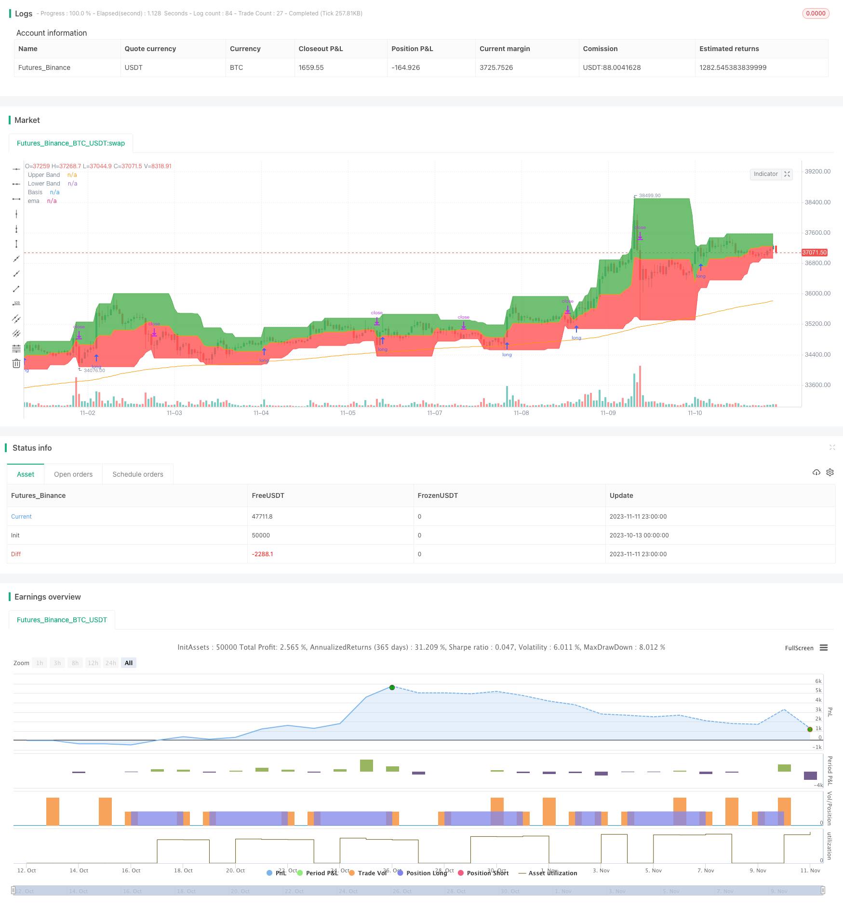

> Name

Dynamic Channel Indicator Breakout Strategy Dynamic-Channel-Breakout-Strategy
> Author

ChaoZhang

> Strategy Description


[trans]


## Overview
This strategy uses dynamic channel indicators to judge the market direction based on the breakthrough of the channel to capture the direction of the trend. This strategy mainly forms an upper and lower channel by calculating the highest price and lowest price within a certain period of time, and generates trading signals when the channel breaks through.
## Strategy Principle
This strategy uses the input function to set the channel cycle length to 20 days. Then calculate the highest price in the last 20 days, highest(high, length), as the upper track, and the lowest price in the last 20 days, lowest(low, length), as the lower track.
The fill color in the channel. Fill green above the upper rail and red below the lower rail to form a dynamic channel.
At the same time, draw the 200-day moving average ema (close, 200) as a reference for judging the trend.
The strategy uses EMA value as the benchmark for judging the general trend. When close is greater than the 200-day line, it is bullish, and when close is less than the 200-day line, it is bearish.
When it is bullish, if the closing price close breaks through the upper band, a long signal is generated; when it is bearish, if the closing price close breaks through the lower band, a short signal is generated.
The long stop loss is set to the lower rail or the middle line according to the long and short rules, and the short stop loss is set to the upper rail or the middle line according to the long and short rules.
## Strategic Advantages
1. Use dynamic channels to capture market changing trends.
2. Generate trading signals based on breakthroughs and follow trend trading ideas.
3. Determine the direction of the general trend based on the moving average and use it in conjunction with channel breakthroughs.
4. The stop loss method is flexible and can be adjusted according to the market.
## Strategy Risk
1. Misjudgment of the general trend may deviate from the market.
2. Improper channel cycle setting will increase the probability of wrong transactions.
3. The stop loss point is close to the channel, which may increase the probability of the stop loss being triggered.
4. There is a certain lag in the breakthrough signal, and the best entry point may be missed.
Countermeasures:
1. Judgment of general trends based on a combination of multiple indicators to reduce the probability of errors.
2. Optimize channel cycle parameters to adapt to different market rhythms.
3. Adjust the stop loss position to ensure there is enough buffer space.
4. Combine with other indicators to filter entry signals.
## Strategy optimization direction
1. Add general trend judgment indicators, form a combination of indicators, and improve judgment accuracy.
2. Add trading volume indicators to avoid false breakthroughs.
3. Optimize the channel cycle parameters to make them more consistent with the characteristics of different varieties.
4. Optimize the stop loss strategy and realize dynamic tracking of the stop loss.
5. Add filters to improve signal quality and reduce unnecessary transactions.
## Summarize
This strategy follows the trend trading idea as a whole and uses dynamic channels to determine the fluctuation range and breakthroughs to form trading signals. It can effectively track trend changes and is a reliable trend following strategy. However, it is still necessary to optimize the general trend judgment and stop loss methods, and add filtering conditions to improve the stability of the strategy. This strategy is suitable for tracking medium and long-term trends, and can be combined with other strategies to form a multi-strategy portfolio to hedge systemic risks.
||

## Overview

This strategy utilizes the dynamic channel indicator to determine market direction based on channel breakouts, aiming to capture trend directionality. It mainly calculates the highest high and lowest low over a certain period to form upper and lower channels, generating trading signals when the price breaks through the channels.

## Strategy Logic

The strategy uses the input function to set the channel period length to 20 days. It then calculates the highest high over the past 20 days as the upper band, and the lowest low over the past 20 days as the lower band. 

The channel is filled with color. The area above the upper band is filled with green, and the area below the lower band is filled with red, forming a dynamic channel.

The 200-day moving average ema(close,200) is also plotted as a reference to determine the overall trend.

The strategy uses the ema as the benchmark to judge the major trend. When close is above the 200-day line, it indicates an uptrend. When close is below, it indicates a downtrend.

In an uptrend, if the closing price close breaks through the upper band, a long signal is generated. In a downtrend, if close breaks the lower band, a short signal is generated.

The long stop loss is set at the lower band or middle line based on the long/short rules. The short stop loss is set at the upper band or middle line.

## Advantage Analysis 

1. The dynamic channel adapts to changing market trends.

2. Trading signals are generated based on breakouts, following the trend trading principle.

3. The major trend is determined by moving average, combined with channel breakouts. 

4. Flexible stop loss placement based on market conditions.

## Risk Analysis

1. Wrong judgement of the major trend may deviate from the market.

2. Improper channel period setting increases incorrect trading.

3. Stop loss being too close to the channel may increase being stopped out.

4. Breakout signals have some lag, possibly missing the best entry point.

Solutions:

1. Use multiple indicators to judge the major trend, reducing errors.

2. Optimize channel period parameters for different market rhythms. 

3. Adjust stop loss position to have enough buffer.

4. Add filters to screen entry signals.

## Optimization Directions

1. Add more indicators to judge the major trend, improving accuracy.

2. Incorporate volume indicators to avoid false breakouts.

3. Optimize channel period parameters for different products. 

4. Implement dynamic trailing stop loss.

5. Add filters to improve signal quality and avoid unnecessary trades.

## Conclusion

This strategy follows the trend trading principle overall, using dynamic channels to determine volatility range and generating signals from breakouts. It can effectively track trend changes and is a reliable trend following strategy. But major trend judgement and stop loss mechanisms need further optimization and filtering conditions should be added to improve robustness. The strategy suits mid-to-long term trend tracking, and can be combined with other strategies in a portfolio to hedge risks.

[/trans]

> Strategy Arguments


|Argument|Default|Description|
|----|----|----|
|v_input_1|20|length|
|v_input_2|0|Long Entry: Higher High|Basis|
|v_input_3|0|Short Entry: Lower Low|Basis|
|v_input_4|0|LONG SL: Lower Low|Basis|
|v_input_5|0|SHORT SL: Higher High|Basis|


> Source (PineScript)

``` pinescript
/*backtest
start: 2023-10-13 00:00:00
end: 2023-11-12 00:00:00
period: 1h
basePeriod: 15m
exchanges: [{"eid":"Futures_Binance","currency":"BTC_USDT"}]
*/

// This source code is subject to the terms of the Mozilla Public License 2.0 at https://mozilla.org/MPL/2.0/
// © pratyush_trades

//@version=4
strategy("Donchian Indexes", overlay=true)

length = input(20)
longRule = input("Higher High", "Long Entry", options=["Higher High", "Basis"])
shortRule = input("Lower Low", "Short Entry", options=["Lower Low", "Basis"])
longSL=input("Lower Low", "LONG SL", options=["Lower Low", "Basis"])
shortSL=input("Higher High", "SHORT SL", options=["Higher High", "Basis"])

hh = highest(high, length)
ll = lowest(low, length)

up = plot(hh, 'Upper Band', color = color.green)
dw = plot(ll, 'Lower Band', color = color.red)
mid = (hh + ll) / 2
midPlot = plot(mid, 'Basis', color = color.orange)
fill(up, midPlot, color=color.green, transp = 95)
fill(dw, midPlot, color=color.red, transp = 95)
plot(ema(close,200), "ema", color=color.orange)

if (close>ema(close,200))
    if (not na(close[length]))
        strategy.entry("Long", strategy.long, stop=longRule=='Basis' ? mid : hh)

if (close<ema(close,200))
    if (not na(close[length]))
        strategy.entry("Short", strategy.short, stop=shortRule=='Basis' ? mid : ll)

if (strategy.position_size>0)
    strategy.exit(id="Longs Exit",stop=longSL=='Basis' ? mid : ll)

if (strategy.position_size<0)
    strategy.exit(id="Shorts Exit",stop=shortSL=='Basis' ? mid : hh)
```

> Detail

https://www.fmz.com/strategy/431895

> Last Modified

2023-11-13 10:33:44
