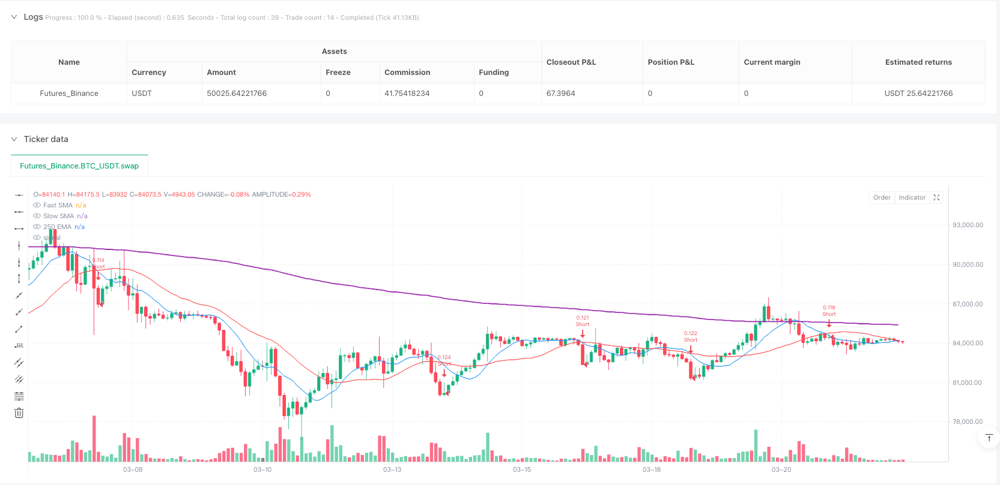
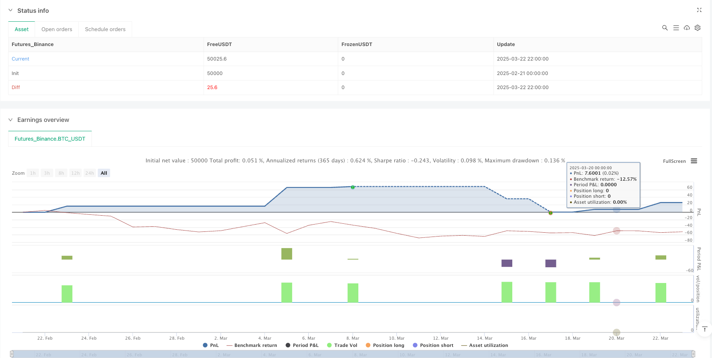

> Name

Dynamic-Crossover-Moving-Average-Trend-Capture-Strategy-with-Risk-Management-System
> Author

ianzeng123

> Strategy Description





[trans]

## Overview
The Dynamic Cross Moving Average Trend Capture Strategy is a quantitative trading system based on technical analysis that combines short-term and long-term moving average crossover signals and a long-term trend confirmation mechanism, while integrating a precise risk management module. The strategy operates on a 5-minute time frame and relies primarily on three core indicators: fast simple moving average (SMA), slow simple moving average, and long-term exponential moving average (EMA) to capture market trends and execute trades. The strategy adopts a trend following idea, and controls the risk exposure of each transaction through a fixed risk amount and dynamic stop loss position, while using the trailing stop loss mechanism to lock in profits.
## Strategy Principle
The core principles of this strategy are based on a moving average system across multiple time frames, combined with precise risk management mechanisms:
1. **Signal Generation System**:
   - Use the crossover of fast SMA (10 period) and slow SMA (25 period) to identify short-term trend changes
   - Use a 250-period EMA as a long-term trend filter
   - Multiple confirmation mechanism: The entry signal will only be triggered when the price is above/below the long-term EMA and the fast SMA forms a golden/death cross with the slow SMA
2. **Entry logic**:
   - Bullish entry: Fast SMA crosses above slow SMA and price is above long-term EMA
   - Short entry: Fast SMA crosses below slow SMA and price is below long-term EMA
   - In order to avoid repeated signals, the strategy has set up a position checking mechanism and only opens positions when there are no positions.
3. **Risk Management System**:
   - Dynamically calculate stop loss distance based on fixed risk amount ($7)
   - Adjustable leverage (up to 125 times), default is 100 times
   - Minimum position size is set to 0.001, ensuring trades can be executed under any market conditions
4. **Exit strategy**:
   - Main exit mechanism: close the position when the price hits the long-term EMA and follow the reversal of the long-term trend
   - Protective exit: fixed stop loss at a fixed risk distance above/below the entry price
   - Profit Lock: Trailing stop is set to 3 times the risk distance and is activated when the price moves beyond this distance
## Strategic Advantages
After in-depth analysis, this strategy has the following significant advantages:
1. **Multi-level trend confirmation**: By combining moving averages of different periods, the strategy can effectively filter out market noise and capture only directional trends, greatly reducing the risk of false breakthroughs.
2. **Precise risk control**: Using a fixed risk amount rather than a fixed percentage makes the actual risk of each transaction consistent and avoids overexposure of funds in highly volatile markets.
3. **Dynamic Position Management**: Dynamically calculate positions based on current price levels and preset risks, allowing the strategy to maintain consistent risk exposure in different price ranges.
4. **Intelligent take-profit mechanism**: Using trailing stop loss rather than fixed take-profit, the strategy can maximize profits in trending markets while locking in existing profits.
5. **Dual exit mechanism**: Combined with EMA hitting position closing and trailing stop loss, it can not only respond quickly to trend reversal, but also maintain positions when the market continues to develop.
6. **Visual trading signals**: The strategy provides a clear graphical interface, including entry signal marks and risk management lines, allowing traders to intuitively understand the trading logic.
7. **Adaptable**: Through parametric design, the strategy can be adjusted for different market conditions and personal risk preferences without modifying the core logic.
## Strategy Risk
Although this strategy is well designed, it still has the following potential risks and limitations:
1. **Rapid Fluctuation Risk**: On the 5-minute time frame, the market may experience extreme fluctuations, causing the price to quickly reverse after the signal is triggered, and may even skip the stop loss price, causing losses beyond expectations. The solution is to reduce the leverage or increase the stop loss distance.
2. **High-frequency trading costs**: Strategies may generate a large number of trading signals in volatile markets, leading to frequent transactions, and accumulated transaction costs may erode profits. It is recommended to add additional signal filtering mechanisms or extend the time frame.
3. **Trend mutation risk**: Major events may suddenly occur in the market, causing drastic changes in trends, causing the moving average system based on historical data to react lagging behind. Consider adding a volatility filter or other auxiliary indicators to enhance risk control.
4. **Parameter Sensitivity**: The performance of the strategy is highly dependent on the selected parameters, especially the moving average period and risk settings. Adequate parameter optimization and backtesting should be carried out for different market environments.
5. **Leverage Risk**: Strategies using high leverage (default 100 times) may amplify losses in adverse market conditions. It is recommended to set leverage levels carefully based on personal risk tolerance, and beginners should consider using lower leverage.
6. **Technical Limitations**: The fixed risk calculation method used in the code may not be accurate enough under extreme market conditions, especially when price volatility is extremely high. Consider introducing a dynamic adjustment mechanism to adjust risk parameters based on historical volatility.
## Strategy optimization direction
Through in-depth analysis of the code, the following are several possible optimization directions:
1. **Add volatility filter**: Integrate the ATR (Average True Range) indicator to dynamically adjust the risk amount and stop loss distance, so that the strategy can adaptively adjust according to the current market volatility. This automatically increases stop loss distance in high volatility environments and tightens stop losses in low volatility environments, improving risk-adjusted returns.
2. **Introduction of Volume Confirmation**: Add volume indicators as additional confirmation of trading signals, and only execute trades when volume increases to reduce the risk of false breakthroughs. Volume is a powerful confirming factor of price changes and can significantly improve signal quality.
3. **Time filter**: Implement trading session filtering to avoid periods of low liquidity or high volatility, such as certain news release times or market opening/closing periods. This can reduce unnecessary trading due to market noise.
4. **Dynamic Parameter Optimization**: Develop an adaptive mechanism to dynamically adjust the moving average cycle parameters according to market status (such as trend strength, volatility cycle, etc.) so that the strategy can adapt to changing market environments. The performance of static parameters varies greatly in different market stages.
5. **Enhance profit locking mechanism**: To improve the current trailing stop design, consider using step-by-step trailing stop, that is, as the price develops in a favorable direction, the stop loss distance will be gradually tightened to lock in profits more effectively.
6. **Integrated market sentiment indicators**: Add RSI, stochastic indicators, etc. as auxiliary filtering conditions to avoid opening positions in over-buying/selling areas and reduce the risk of counter-trend trading. Extreme market sentiment is often a precursor to short-term reversals.
7. **Multiple time frame analysis**: Introduce trend confirmation in higher time frames (such as 1 hour, 4 hours) to ensure that the trading direction is consistent with the larger cycle trend and improve the success rate of transactions. This "top-down" approach to analysis can significantly reduce counter-trend trading.
## Summarize
The dynamic cross moving average trend capturing strategy is a well-structured quantitative trading system that uses a multi-level combination of technical indicators and a sophisticated risk management mechanism to capture short- and medium-term price trends and control trading risks. The core of the strategy is to combine the cross signals of fast and slow SMAs and the trend filtering of EMA, while managing the risk-reward ratio of each transaction by fixing the risk amount and trailing stop loss.
The biggest advantage of this strategy is its comprehensive risk control system and clear trading logic, which makes the trading decision-making process highly systematic and objective. However, it also faces challenges such as rapid market fluctuations, parameter sensitivity and the use of leverage. By adding optimization measures such as volatility filtering, volume confirmation, and multi-time frame analysis, the strategy performance is expected to be further improved.
For quantitative traders looking for short- to medium-term trend trading opportunities, this strategy provides a reliable framework and is particularly suitable for traders who focus on risk management. Through reasonable parameter adjustment and optimization improvements, this strategy has the potential to maintain stable performance in various market environments. ||
## Overview

The Dynamic Crossover Moving Average Trend Capture Strategy is a quantitative trading system based on technical analysis that combines short-term and long-term moving average crossover signals with a long-term trend confirmation mechanism, while integrating a precise risk management module. This strategy operates on a 5-minute timeframe and primarily relies on three core indicators: Fast Simple Moving Average (SMA), Slow Simple Moving Average, and Long-term Exponential Moving Average (EMA) to capture market trends and execute trades. The strategy adopts a trend-following approach and controls risk exposure for each trade through fixed risk amounts and dynamic stop-loss placements, while using trailing stops to secure profits.

## Strategy Principles

The core principles of this strategy are based on a multi-timeframe moving average system combined with precise risk management mechanisms:

1. **Signal Generation System**:
   - Uses crossovers between Fast SMA (10 periods) and Slow SMA (25 periods) to identify short-term trend changes
   - Employs a 250-period EMA as a long-term trend filter
   - Multiple confirmation mechanism: entry signals are triggered only when price is above/below the long-term EMA and the Fast SMA forms golden/death crosses with the Slow SMA

2. **Entry Logic**:
   - Long entry: Fast SMA crosses above Slow SMA and price is above long-term EMA
   - Short entry: Fast SMA crosses below Slow SMA and price is below long-term EMA
   - To avoid duplicate signals, the strategy includes a position check mechanism, opening positions only when no current position exists

3. **Risk Management System**:
   - Dynamically calculates stop-loss distance based on a fixed risk amount ($7)
   - Adjustable leverage (up to 125x), defaulting to 100x
   - Minimum position size set at 0.001 to ensure trades can be executed under any market conditions

4. **Exit Strategy**:
   - Primary exit mechanism: close position when price touches the long-term EMA, following long-term trend reversals
   - Protective exit: fixed stop-loss placed at a set risk distance above/below entry price
   - Profit securing: trailing stop set at 3x the risk distance, activated when price moves beyond this distance

## Strategy Advantages

After deep analysis, this strategy demonstrates the following significant advantages:

1. **Multi-level Trend Confirmation**: By combining moving averages of different periods, the strategy effectively filters out market noise, capturing only directional trend movements, greatly reducing false breakout risks.

2. **Precise Risk Control**: Using a fixed risk amount rather than a fixed percentage ensures consistent actual risk for each trade, avoiding excessive exposure in highly volatile markets.

3. **Dynamic Position Sizing**: Calculates position size dynamically based on current price level and preset risk, allowing the strategy to maintain consistent risk exposure across different price ranges.

4. **Intelligent Profit-Taking Mechanism**: Uses trailing stops instead of fixed take-profit levels, enabling the strategy to maximize returns in trending markets while securing already-gained profits.

5. **Dual Exit Mechanism**: Combines EMA touch exits with trailing stops, allowing both quick response to trend reversals and position maintenance when trends continue.

6. **Visualized Trading Signals**: The strategy provides a clear graphical interface, including entry signal markers and risk management lines, allowing traders to intuitively understand the trading logic.

7. **High Adaptability**: Through parameterized design, the strategy can be adjusted for different market conditions and personal risk preferences without modifying the core logic.

## Strategy Risks

Despite its rational design, the strategy still has the following potential risks and limitations:

1. **Rapid Volatility Risk**: On a 5-minute timeframe, the market may experience extreme fluctuations, causing prices to quickly reverse after triggering signals, potentially bypassing stop-loss levels and resulting in losses exceeding expectations. The solution is to reduce leverage or widen stop-loss distances.

2. **High-Frequency Trading Costs**: The strategy may generate numerous trading signals in volatile markets, leading to frequent trading and accumulated transaction costs that could erode profits. It's advisable to add additional signal filtering mechanisms or extend the timeframe.

3. **Trend Mutation Risk**: The market may suddenly experience major events causing dramatic trend changes, making moving average systems based on historical data react with a lag. Consider adding volatility filters or other auxiliary indicators to enhance risk control.

4. **Parameter Sensitivity**: Strategy performance highly depends on selected parameters, especially moving average periods and risk settings. Sufficient parameter optimization and backtesting should be conducted for different market environments.

5. **Leverage Risk**: The strategy's use of high leverage (default 100x) may amplify losses in unfavorable market conditions. It's recommended to set leverage levels carefully according to individual risk tolerance, with beginners considering lower leverage.

6. **Technical Limitations**: The fixed risk calculation method used in the code may not be precise enough in extreme market conditions, especially when price volatility is exceptionally high. Consider introducing dynamic adjustment mechanisms based on historical volatility to adjust risk parameters.

## Strategy Optimization Directions

Through in-depth analysis of the code, here are several possible optimization directions:

1. **Add Volatility Filter**: Integrate ATR (Average True Range) indicator to dynamically adjust risk amount and stop-loss distance, allowing the strategy to adaptively adjust based on current market volatility. This can automatically increase stop-loss distance in high-volatility environments and tighten stops in low-volatility environments, improving risk-adjusted returns.

2. **Introduce Volume Confirmation**: Add volume indicators as additional confirmation for trading signals, executing trades only when volume increases, to reduce false breakout risks. Volume is a powerful confirming factor for price movements and can significantly improve signal quality.

3. **Time Filter**: Implement trading session filtering to avoid low liquidity or high volatility periods, such as certain news release times or market opening/closing sessions. This can reduce unnecessary trades caused by market noise.

4. **Dynamic Parameter Optimization**: Develop adaptive mechanisms to dynamically adjust moving average period parameters based on market states (such as trend strength, volatility cycles), enabling the strategy to adapt to changing market environments. Static parameters perform very differently across various market phases.

5. **Enhanced Profit-Locking Mechanism**: Improve the current trailing stop design by considering a stepped trailing stop approach, gradually tightening the stop-loss distance as price moves favorably, more effectively securing profits.

6. **Integrate Market Sentiment Indicators**: Add indicators such as RSI and Stochastic as auxiliary filtering conditions to avoid opening positions in overbought/oversold areas, reducing counter-trend trading risks. Extreme market sentiment is often a precursor to short-term reversals.

7. **Multi-Timeframe Analysis**: Introduce trend confirmation from higher timeframes (such as 1-hour, 4-hour) to ensure trading direction aligns with larger cycle trends, increasing trade success rates. This "top-down" analysis approach can significantly reduce counter-trend trading.

## Summary

The Dynamic Crossover Moving Average Trend Capture Strategy is a well-structured quantitative trading system that aims to capture medium to short-term price trends and control trading risk through multi-level technical indicator combinations and refined risk management mechanisms. The strategy's core lies in combining crossover signals from Fast and Slow SMAs with EMA trend filtering, while managing the risk-reward ratio of each trade through fixed risk amounts and trailing stops.

The strategy's greatest advantage is its comprehensive risk control system and clear trading logic, making the trading decision process highly systematic and objective. However, it also faces challenges such as rapid market fluctuations, parameter sensitivity, and leverage use. Through adding volatility filters, volume confirmation, multi-timeframe analysis, and other optimization measures, strategy performance can be further improved.

For quantitative traders seeking medium to short-term trend trading opportunities, this strategy provides a reliable framework, particularly suitable for those emphasizing risk management. With reasonable parameter adjustments and optimization improvements, the strategy has the potential to maintain stable performance across various market environments.[/trans]


> Source (PineScript)

``` pinescript
/*backtest
start: 2025-02-21 00:00:00
end: 2025-03-23 00:00:00
period: 2h
basePeriod: 2h
exchanges: [{"eid":"Futures_Binance","currency":"BTC_USDT"}]
*/

//@version=5
strategy("crypto strat", overlay=true, initial_capital=100, default_qty_type=strategy.cash, default_qty_value=100)

// Input parameters
fastSMA = input.int(10, "Fast SMA Period", minval=1)
slowSMA = input.int(25, "Slow SMA Period", minval=1)
emaLength = input.int(250, "EMA Length", minval=1)
riskAmount = input.float(7, "Risk Amount in USD", minval=1)
leverage = input.int(100, "Leverage", minval=1, maxval=125)

// Calculate indicators
fastMA = ta.sma(close, fastSMA)
slowMA = ta.sma(close, slowSMA)
longEMA = ta.ema(close, emaLength)

// Plot indicators
plot(fastMA, "Fast SMA", color=color.blue)
plot(slowMA, "Slow SMA", color=color.red)
plot(longEMA, "250 EMA", color=color.purple, linewidth=2)

// Entry conditions
longCondition = ta.crossover(fastMA, slowMA) and close > longEMA and strategy.position_size == 0
shortCondition = ta.crossunder(fastMA, slowMA) and close < longEMA and strategy.position_size == 0

// Exit conditions - close when price touches 250 EMA
exitLongCondition = low <= longEMA and strategy.position_size > 0
exitShortCondition = high >= longEMA and strategy.position_size < 0

// Position sizing based on risk
positionSize = math.max((100 * leverage) / close, 0.001) // Minimum 0.001 BTC
stopLossDistance = riskAmount / positionSize // $7 risk in price terms

// Entry logic
if (longCondition)
    entryPrice = close
    strategy.entry("Long", strategy.long, qty=positionSize)
    strategy.exit("Long Exit", "Long", 
                 stop=entryPrice - stopLossDistance,
                 trail_points=stopLossDistance * 3,
                 trail_offset=stopLossDistance)

if (shortCondition)
    entryPrice = close
    strategy.entry("Short", strategy.short, qty=positionSize)
    strategy.exit("Short Exit", "Short", 
                 stop=entryPrice + stopLossDistance,
                 trail_points=stopLossDistance * 3,
                 trail_offset=stopLossDistance)

// Exit logic - close when price touches 250 EMA
if (exitLongCondition)
    strategy.close("Long", comment="EMA Exit")

if (exitShortCondition)
    strategy.close("Short", comment="EMA Exit")

// Visualize entry signals
plotshape(longCondition, "Buy Signal", location=location.belowbar, color=color.green, style=shape.triangleup, size=size.small)
plotshape(shortCondition, "Sell Signal", location=location.abovebar, color=color.red, style=shape.triangledown, size=size.small)
```

> Detail

https://www.fmz.com/strategy/487999

> Last Modified

2025-03-24 11:59:09
