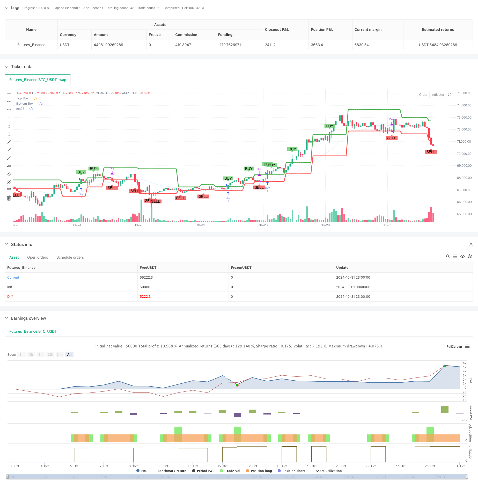

> Name

Dynamic-Darvas-Box-Breakout-with-Moving-Average-Trend-Confirmation-Trading-System
> Author

ChaoZhang

> Strategy Description



[trans]
#### Overview
This article introduces a trend following trading system that combines the Darvas Box and the 25-period moving average (MA25). This strategy identifies the box formed by the price consolidation range and combines it with the moving average trend confirmation to capture the strong market when it breaks through. The system design fully considers trend continuity and false breakthrough filtering, providing traders with a complete market entry and exit framework.
#### Strategy Principle
The strategy mainly consists of three core components:
1. Construction of Davas box: The system determines the box boundary by calculating the highest price and lowest price in the past 5 periods. The top of the box is determined by the new high point, and the bottom is determined by the lowest point in the corresponding range.
2. Moving average trend confirmation: Introduce the 25-period simple moving average as a trend filter, and only consider opening a position when the price is above MA25.
3. Trading signal generation:
   - Buy signal: price breaks through the top of the box and is above MA25
   - Sell signal: price falls below the bottom of the box
#### Strategic Advantages
1. Strong trend following ability:
   - Capture the start of a trend through box breakouts
   - Combined with MA25 filtering to ensure trading in the main trend direction
2. Signal quality optimization:
   - Double confirmation mechanism reduces the risk of false breakthroughs
   - Clear entry and exit conditions to avoid subjective judgment
3. Improved risk control:
   - A stop loss level is naturally formed at the bottom of the box
   - MA25 provides additional trend protection
#### Strategy Risk
1. Risk of volatile market:
   - Frequent breakouts may result in consecutive stops
   - Recommended for use in strong trending markets
2. Lag risk:
   - It takes time for the box to form, and you may miss part of the market.
   - MA25, as a mid-term moving average, has a certain lag
3. Fund management risks:
   - The capital ratio for each transaction needs to be set appropriately
   - It is recommended to dynamically adjust positions based on volatility
#### Strategy optimization direction
1. Parameter optimization:
   - The box cycle can be adjusted according to different market characteristics
   - MA cycle can be adjusted according to market cycle characteristics
2. Signal enhancement:
   - A trading volume confirmation mechanism can be added
   - Consider introducing a dynamic stop loss mechanism
3. Enhanced risk control:
   - Added volatility filter
   - Implement dynamic position management
#### Summary
This strategy builds a robust trading system by combining the classic Davos box theory and moving average trend tracking. The main advantage of the system is that it can effectively capture trending market conditions while controlling risks through multiple filtering mechanisms. Although there is a certain lag, this strategy can achieve stable performance in trending markets through reasonable parameter optimization and risk management. It is recommended that traders focus on the selection of market environment when using real trading, and dynamically adjust parameter settings according to the actual situation.
|| 

#### Overview
This article introduces a trend following trading system that combines Darvas Box and 25-period Moving Average (MA25). The strategy identifies price consolidation zones through box formation and confirms trends with moving averages to capture strong market movements during breakouts. The system design thoroughly considers trend continuation and false breakout filtering, providing traders with a complete framework for market entry and exit.

#### Strategy Principles
The strategy consists of three core components:
1. Darvas Box Construction: The system determines box boundaries by calculating the highest and lowest prices over 5 periods. The box top is determined by new highs, while the bottom is set by the lowest point within the corresponding range.
2. Moving Average Trend Confirmation: A 25-period simple moving average is introduced as a trend filter, only considering positions when price is above MA25.
3. Trade Signal Generation:
   - Buy Signal: Price breaks above box top and is above MA25
   - Sell Signal: Price breaks below box bottom

#### Strategy Advantages
1. Strong Trend Following Capability:
   - Captures trend initiation through box breakouts
   - MA25 filtering ensures trading in primary trend direction
2. Signal Quality Optimization:
   - Dual confirmation mechanism reduces false breakout risk
   - Clear entry and exit conditions avoid subjective judgment
3. Comprehensive Risk Control:
   - Box bottom naturally forms stop-loss level
   - MA25 provides additional trend protection

#### Strategy Risks
1. Choppy Market Risk:
   - Frequent breakouts may lead to consecutive stops
   - Recommended for use in strong trend markets
2. Lag Risk:
   - Box formation requires time, may miss initial moves
   - MA25 as medium-term average has inherent lag
3. Money Management Risk:
   - Requires proper allocation of capital per trade
   - Suggested to dynamically adjust position size with volatility

#### Strategy Optimization Directions
1. Parameter Optimization:
   - Box period adjustable based on market characteristics
   - MA period can be adjusted to market cycle features
2. Signal Enhancement:
   - Can add volume confirmation mechanism
   - Consider implementing dynamic stop-loss
3. Risk Control Enhancement:
   - Add volatility filter
   - Implement dynamic position sizing

#### Summary
The strategy builds a robust trading system by combining classic Darvas Box theory with moving average trend following. Its main advantage lies in effectively capturing trending markets while controlling risk through multiple filtering mechanisms. Although there is some inherent lag, the strategy can achieve stable performance in trending markets through proper parameter optimization and risk management. Traders are advised to focus on market environment selection and dynamically adjust parameters based on actual conditions when implementing the strategy.
[/trans]


> Source (PineScript)

``` pinescript
/*backtest
start: 2024-10-01 00:00:00
end: 2024-10-31 23:59:59
period: 1h
basePeriod: 1h
exchanges: [{"eid":"Futures_Binance","currency":"BTC_USDT"}]
*/

//@version=5
strategy("DARVAS BOX with MA25 Buy Condition", overlay=true, shorttitle="AEG DARVAS")

// Input for box length
boxp = input.int(5, "BOX LENGTH")

// Calculate 25-period moving average
ma25 = ta.sma(close, 25)

// Lowest low and highest high within the box period
LL = ta.lowest(low, boxp)
k1 = ta.highest(high, boxp)
k2 = ta.highest(high, boxp - 1)
k3 = ta.highest(high, boxp - 2)

// New high detection
NH = ta.valuewhen(high > k1[1], high, 0)

// Logic to detect top and bottom of Darvas Box
box1 = k3 < k2
TopBox = ta.valuewhen(ta.barssince(high > k1[1]) == boxp - 2 and box1, NH, 0)
BottomBox = ta.valuewhen(ta.barssince(high > k1[1]) == boxp - 2 and box1, LL, 0)

// Plot the top and bottom Darvas Box lines
plot(TopBox, linewidth=3, color=color.green, title="Top Box")
plot(BottomBox, linewidth=3, color=color.red, title="Bottom Box")
plot(ma25, color=#2195f31e, linewidth=2, title="ma25")

// --- Buy and Sell conditions ---

// Buy when price breaks above the Darvas Box AND MA15
buyCondition = ta.crossover(close, TopBox) and close > ma25

// Sell when price drops below the Darvas Box
sellCondition = ta.crossunder(close, BottomBox)

// --- Buy and Sell Signals ---

// Plot BUY+ and SELL labels
plotshape(series=buyCondition, title="Buy+ Signal", location=location.abovebar, color=#72d174d3, style=shape.labeldown, text="BUY")
plotshape(series=sellCondition, title="Sell Signal", location=location.belowbar, color=color.rgb(234, 62, 62, 28), style=shape.labelup, text="SELL")

// --- Strategy execution ---

if (buyCondition)
    strategy.entry("Buy", strategy.long)

if (sellCondition)
    strategy.close("Buy")

```

> Detail

https://www.fmz.com/strategy/472252

> Last Modified

2024-11-18 16:02:45
