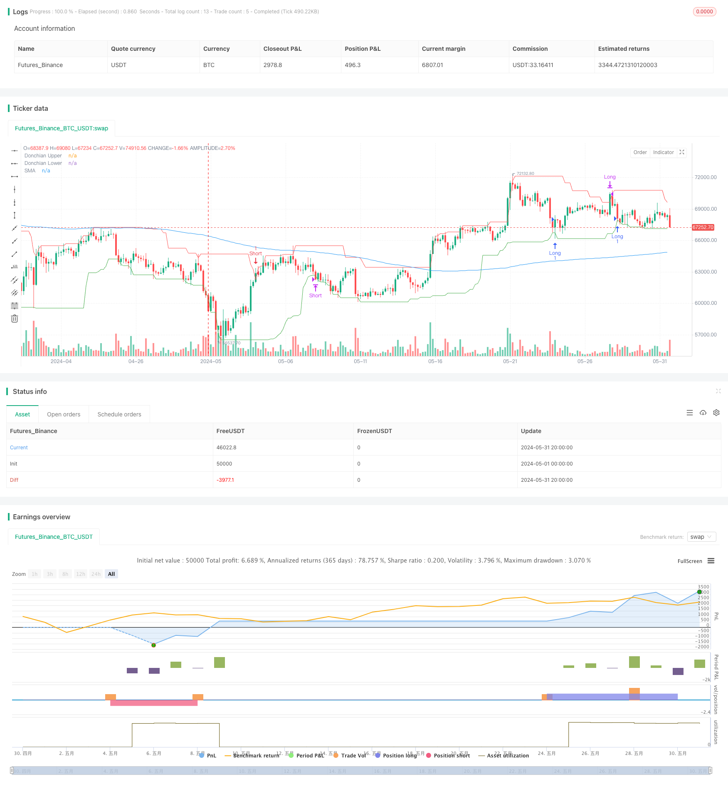

> Name

Dynamic-Donchian-Channel-and-Simple-Moving-Average-Combination-Quantitative-Strategy
> Author

ChaoZhang

> Strategy Description


[trans]
#### Overview
This strategy combines two technical indicators, the Donchian Channel and the Simple Moving Average. Open a long position when the price breaks through the lower track of the Donchian Channel and is above the simple moving average, and open a short position when the price breaks through the upper track of the Donchian Channel and is below the simple moving average. Long positions are closed when the price hits the upper track of the Donchian Channel, and short positions are closed when the price hits the lower track of the Donchian Channel. This strategy is suitable for markets with strong trends.
#### Strategy Principles
1. Calculate the upper and lower rails of Tangqian Channel. The upper track of Donchian Channel is the highest price in the past n periods, and the lower track is the lowest price in the past n periods.
2. Calculate the simple moving average. The simple moving average is the arithmetic mean of the closing prices in the past m periods.
3. Open a long position: When the price is lower than the lower track of the Donchian Channel and the closing price is higher than the simple moving average, open a long position.
4. Open a short position: Open a short position when the price is higher than the upper track of the Donchian Channel and the closing price is lower than the simple moving average.
5. Close long positions: When the price touches the upper track of Tang Qian Channel, close long positions.
6. Close short positions: When the price touches the lower track of Tang Qian Channel, close short positions.
#### Strategic Advantages
1. Combine the two market elements of trend and volatility. The simple moving average captures the trend, and the Donchian channel captures the fluctuations, which can better grasp the retracement opportunities in the trend market.
2. Clear profit-taking conditions help lock in profits in a timely manner. Long and short positions are closed when the price hits the upper and lower rails of the Donchian Channel respectively, which allows them to close profitable positions in a timely manner before the trend reverses.
3. Fewer parameters make optimization difficult. This strategy has only three parameters: Donchian channel period, offset and simple moving average period, making it easy to optimize.
#### Strategy Risk
1. Frequent transactions. This strategy has a high frequency of opening and closing positions, which will drag down returns in markets with high transaction costs. The number of transactions can be reduced by moderately relaxing the opening conditions or increasing the time frame.
2. Poor performance in volatile markets. When the trend is unclear, this strategy may suffer more losses. Volatility indicators can be used to identify volatile markets and suspend strategies.  
3. Insufficient parameter stability. Depending on the target and period, the optimal parameters may vary greatly, the parameter stability may be poor, and the actual performance may not be as good as backtesting. Sufficient out-of-sample testing and sensitivity analysis need to be conducted to confirm that the parameters are robust.
#### Strategy optimization direction
1. Add optional opening conditions combined with other indicators, such as requiring ADX in DMI to be greater than a certain threshold before opening a position, or opening a long position only when RSI leaves the oversold zone to increase the winning rate of opening a position.
2. Use the dynamic take-profit line to replace the fixed Tang Qian channel line take-profit, thereby realizing the profit tracking function. For example, bulls can close their positions at the ATR take-profit line or SAR take-profit line after the price hits the upper track of the Tang Qian channel.
3. Dynamically adjust the Donchian Channel cycle according to the volatility level, shorten the Donchian Channel cycle under high volatility market conditions, and lengthen the cycle under low volatility market conditions. This helps adapt to different markets.
#### Summary
The dynamic Donchian channel and simple moving average strategy is a simple and easy-to-use quantitative trading strategy framework. It constructs position opening and closing logic from two perspectives: trend tracking and volatility breakthrough, and is suitable for varieties with strong trends. However, this strategy performs poorly in frequently volatile markets, and its parameters are generally robust. The adaptability and robustness of this strategy can be improved by introducing auxiliary opening conditions, dynamic take-profit and parameter adaptive mechanisms. In general, this strategy can be used as a basic strategy framework, on which further modifications and improvements can be made to create more advanced quantitative strategies.
|| 

#### Overview
This strategy combines two technical indicators: Donchian Channel and Simple Moving Average (SMA). It opens a long position when the price breaks below the lower band of the Donchian Channel and closes above the SMA. Conversely, it opens a short position when the price breaks above the upper band of the Donchian Channel and closes below the SMA. The long position is closed when the price reaches the upper band of the Donchian Channel, while the short position is closed when the price reaches the lower band. This strategy is suitable for markets with strong trends.

#### Strategy Principle
1. Calculate the upper and lower bands of the Donchian Channel. The upper band is the highest high over the past n periods, and the lower band is the lowest low over the past n periods.
2. Calculate the Simple Moving Average. The SMA is the arithmetic mean of the closing prices over the past m periods.
3. Long entry: Open a long position when the price is below the lower band of the Donchian Channel and the closing price is above the SMA.
4. Short entry: Open a short position when the price is above the upper band of the Donchian Channel and the closing price is below the SMA.
5. Long exit: Close the long position when the price reaches the upper band of the Donchian Channel.
6. Short exit: Close the short position when the price reaches the lower band of the Donchian Channel.

#### Strategy Advantages
1. Combines two market elements: trend and volatility. The SMA captures the trend, while the Donchian Channel captures the volatility, enabling the strategy to seize pullback opportunities in trending markets.
2. Clear profit-taking conditions help lock in profits in a timely manner. Long and short positions are closed when the price reaches the upper and lower bands of the Donchian Channel, respectively, allowing the strategy to exit profitable trades before the trend reverses.
3. Few parameters make optimization easier. The strategy only has three parameters: Donchian Channel period, offset, and SMA period, which simplifies optimization.

#### Strategy Risks
1. Frequent trading. The strategy has a high frequency of position entries and exits, which can erode returns in markets with high trading costs. This can be mitigated by moderately relaxing entry conditions or increasing the timeframe.
2. Poor performance in rangebound markets. The strategy may suffer more losses when the trend is unclear. Volatility indicators can be used to identify rangebound markets and suspend the strategy.
3. Insufficient parameter stability. The optimal parameters may vary significantly across different instruments and timeframes, indicating poor parameter stability. The live performance may not match the backtest. Extensive out-of-sample testing and sensitivity analysis are needed to confirm parameter robustness.

#### Strategy Optimization Directions
1. Add optional entry conditions combined with other indicators. For example, require the ADX of the DMI to be above a certain threshold for entry, or only enter long when the RSI leaves the oversold zone. This can improve the win rate of entries.
2. Use dynamic profit-taking lines instead of fixed Donchian Channel lines to achieve a profit-trailing function. For example, after the price reaches the upper band of the Donchian Channel for a long position, switch to closing the position at the ATR stop-loss line or the SAR stop-loss line.
3. Dynamically adjust the Donchian Channel period based on volatility levels. Shorten the Donchian Channel period in high-volatility market conditions and lengthen the period in low-volatility conditions. This helps adapt to different markets.

#### Summary
The Dynamic Donchian Channel and Simple Moving Average Combination Strategy is a simple and easy-to-use quantitative trading strategy framework. It constructs entry and exit logic from the perspectives of trend following and volatility breakout, making it suitable for instruments with strong trends. However, the strategy performs poorly in frequently rangebound markets, and its parameter robustness is mediocre. The adaptability and robustness of the strategy can be improved by introducing auxiliary entry conditions, dynamic profit-taking, and parameter self-adaptation mechanisms. Overall, this strategy can serve as a basic strategy framework to be further modified and improved upon to create more advanced quantitative strategies.

[/trans]


> Source (PineScript)

``` pinescript
/*backtest
start: 2024-05-01 00:00:00
end: 2024-05-31 23:59:59
period: 4h
basePeriod: 15m
exchanges: [{"eid":"Futures_Binance","currency":"BTC_USDT"}]
*/

//@version=5
strategy("FBK Donchian Channel Strategy", overlay=true)

// Inputs
donchian_period = input.int(20, title="Donchian Channel Period")
donchian_offset = input.int(1, title="Donchian Channel Offset")
sma_period = input.int(200, title="SMA Period")
start_date = input(timestamp("2023-01-01 00:00 +0000"), title="Start Date")
end_date = input(timestamp("2023-12-31 23:59 +0000"), title="End Date")
trade_type = input.string("Both", title="Trade Type", options=["Buy Only", "Sell Only", "Both"])

// Calculate indicators
donchian_upper = ta.highest(high, donchian_period)[donchian_offset]
donchian_lower = ta.lowest(low, donchian_period)[donchian_offset]
sma = ta.sma(close, sma_period)

// Plot indicators
plot(donchian_upper, color=color.red, title="Donchian Upper")
plot(donchian_lower, color=color.green, title="Donchian Lower")
plot(sma, color=color.blue, title="SMA")

// Helper function to check if within testing period
is_in_testing_period() => true

// Entry conditions
long_condition = low <= donchian_lower and close > sma
short_condition = high >= donchian_upper and close < sma

// Exit conditions
exit_long_condition = high >= donchian_upper
exit_short_condition = low <= donchian_lower

// Open long position
if (is_in_testing_period() and (trade_type == "Buy Only" or trade_type == "Both") and long_condition)
    strategy.entry("Long", strategy.long)

// Close long position
if (is_in_testing_period() and exit_long_condition)
    strategy.close("Long")

// Open short position
if (is_in_testing_period() and (trade_type == "Sell Only" or trade_type == "Both") and short_condition)
    strategy.entry("Short", strategy.short)

// Close short position
if (is_in_testing_period() and exit_short_condition)
    strategy.close("Short")

// Close all positions at the end of the testing period
if not is_in_testing_period()
    strategy.close_all()

```

> Detail

https://www.fmz.com/strategy/454371

> Last Modified

2024-06-17 17:29:48
