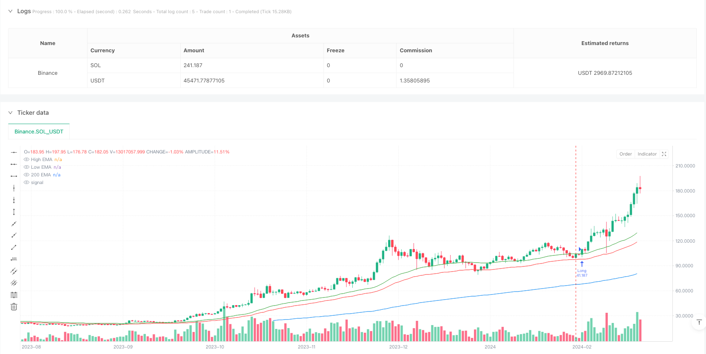
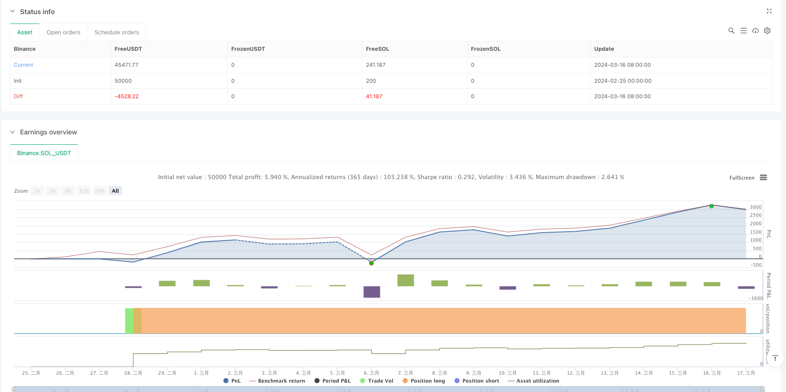

> Name

Dynamic Dual-EMA Trend Following Strategy-Dynamic-Dual-EMA-Trend-Following-Strategy
> Author

ianzeng123

> Strategy Description





[trans]
#### Overview
This strategy is a trend following trading system based on dual exponential moving averages (EMA). The strategy uses two EMA lines of 44 periods and 200 periods, combined with price breakout signals to determine the trading direction. At the same time, it integrates risk management mechanisms, including dynamic position calculation and trailing stop loss.
#### Strategy Principle
The core logic of the strategy is based on the interaction between price and double EMA lines. Use the 44-period EMA to apply to the highest and lowest prices respectively to form upper and lower channels, and the 200-period EMA as a long-term trend filter. When the closing price breaks through the upper EMA and meets the 200EMA filtering conditions, the system generates a long signal; when the closing price falls below the lower EMA and meets the 200EMA filtering conditions, the system generates a shorting signal. The strategy uses dynamic position management based on account equity, and automatically calculates the number of open positions based on the risk percentage of each transaction. Stop loss is set to the corresponding EMA line position.
#### Strategic Advantages
1. The trend tracking logic is clear and provides reliable trend confirmation through dual EMA channels and long-term moving average filtering.
2. Flexible trading direction selection, you can choose only long, only short or two-way trading
3. Complete risk control mechanism, including dynamic position calculation and trailing stop loss
4. The parameters are highly adjustable, making it easy to optimize for different market environments.
5. The calculation process is simple and efficient, suitable for real-time transaction execution
#### Strategy Risk
1. The EMA indicator is lagging and may produce delayed signals in violently volatile markets.
2. A sideways market may produce frequent false breakthrough signals
3. The stop loss level may be too wide under rapid market reversal, resulting in a large retracement.
4. Position calculation depends on price volatility, and excessive positions may occur in a high-volatility environment.
#### Strategy optimization direction
1. Add trading volume confirmation indicators to improve the reliability of breakthrough signals
2. Introduce volatility adaptive mechanism and dynamically adjust EMA parameters
3. Optimize the stop loss mechanism and consider introducing ATR dynamic stop loss
4. Add profit target management and set dynamic moving take-profit
5. Add market environment filters to identify market conditions that are not suitable for trading
#### Summary
This is a trend following strategy with complete structure and clear logic. It provides trading signals through dual EMA channels and long-term trend filtering, combined with a complete risk management mechanism, and has good practicality. The optimization space of the strategy mainly lies in signal confirmation, dynamic parameter adjustment and the improvement of risk management mechanism. In practical applications, it is recommended to fully test parameter sensitivity and conduct targeted optimization based on the characteristics of specific trading varieties. ||
#### Overview
This strategy is a trend following trading system based on dual Exponential Moving Averages (EMA). It utilizes 44-period and 200-period EMAs, combined with price breakout signals to determine trading direction. The system integrates risk management mechanisms, including dynamic position sizing and trailing stop-loss.

#### Strategy Principle
The core logic is based on price interaction with dual EMAs. The 44-period EMA is applied to both high and low prices to form a channel, while the 200-period EMA serves as a long-term trend filter. Long signals are generated when the closing price breaks above the upper EMA and satisfies the 200 EMA filter condition; short signals are generated when the closing price breaks below the lower EMA and meets the 200 EMA filter condition. The strategy employs dynamic position sizing based on account equity, automatically calculating position size according to risk percentage per trade. Stop-loss levels are set at respective EMA positions.

#### Strategy Advantages
1. Clear trend following logic with reliable trend confirmation through dual EMA channel and long-term moving average filter
2. Flexible trade direction options, allowing long-only, short-only, or bidirectional trading
3. Comprehensive risk control mechanisms including dynamic position sizing and trailing stops
4. Highly adjustable parameters for optimization in different market environments
5. Simple and efficient calculations suitable for real-time trading execution

#### Strategy Risks
1. EMA indicators have inherent lag, potentially generating delayed signals in volatile markets
2. Range-bound markets may produce frequent false breakout signals
3. Stop-loss placement may be too wide during quick reversals, leading to larger drawdowns
4. Position sizing depends on price volatility, potentially generating oversized positions in highly volatile environments

#### Strategy Optimization Directions
1. Add volume confirmation indicators to improve breakout signal reliability
2. Implement volatility adaptive mechanisms for dynamic EMA parameter adjustment
3. Optimize stop-loss mechanism, consider introducing ATR-based dynamic stops
4. Add profit target management with dynamic trailing take-profit
5. Incorporate market environment filters to identify unsuitable trading conditions

#### Summary
This is a well-structured trend following strategy with clear logic. It provides trading signals through dual EMA channels and long-term trend filtering, coupled with comprehensive risk management mechanisms, demonstrating good practicality. Strategy optimization opportunities mainly lie in signal confirmation, dynamic parameter adjustment, and risk management mechanism enhancement. In practical application, it is recommended to thoroughly test parameter sensitivity and optimize specifically based on the characteristics of the traded instrument.[/trans]


> Source (PineScript)

``` pinescript
/*backtest
start: 2024-02-25 00:00:00
end: 2024-03-17 00:00:00
period: 1d
basePeriod: 1d
exchanges: [{"eid":"Binance","currency":"SOL_USDT"}]
*/

//@version=5
strategy("RENTABLE Dual EMA Breakout TSLA ", overlay=true)

// Inputs for EMA lengths and risk per trade
length = input(44, title="EMA Length")
longTermLength = input(200, title="Long-Term EMA Length")
riskPerTrade = input.float(1.0, title="Risk per Trade (%)", minval=0.1, maxval=10.0)

// Additional inputs for strategy customization
useFilter = input.bool(true, title="Use 200 EMA Filter")
tradeDirection = input.string("Both", title="Trade Direction", options=["Long", "Short", "Both"])

// EMAs based on the high and low prices and long-term EMA
emaHigh = ta.ema(high, length)
emaLow = ta.ema(low, length)
ema200 = ta.ema(close, longTermLength)

// Plotting EMAs on the chart
plot(emaHigh, color=color.green, title="High EMA")
plot(emaLow, color=color.red, title="Low EMA")
plot(ema200, color=color.blue, title="200 EMA")

// Entry conditions with optional EMA filter
longCondition = close > emaHigh and (useFilter ? close > ema200 : true)
shortCondition = close < emaLow and (useFilter ? close < ema200 : true)

// Calculating stop-loss and position size
longStop = emaLow
shortStop = emaHigh
riskPerShareLong = close - longStop
riskPerShareShort = shortStop - close
equity = strategy.equity

// Ensure risk per share is positive for calculations
riskPerShareLong := riskPerShareLong > 0 ? riskPerShareLong : 0.01
riskPerShareShort := riskPerShareShort > 0 ? riskPerShareShort : 0.01

positionSizeLong = (equity * riskPerTrade / 100) / riskPerShareLong
positionSizeShort = (equity * riskPerTrade / 100) / riskPerShareShort

// Ensure position sizes are positive before entering trades
if (longCondition and (tradeDirection == "Long" or tradeDirection == "Both") and positionSizeLong > 0)
    strategy.entry("Long", strategy.long, qty= positionSizeLong)
if (shortCondition and (tradeDirection == "Short" or tradeDirection == "Both") and positionSizeShort > 0)
    strategy.entry("Short", strategy.short, qty=positionSizeShort)

// Applying the stop-loss to strategy
strategy.exit("Exit Long", "Long", stop=longStop)
strategy.exit("Exit Short", "Short", stop=shortStop) 
////Usar en  1,2 3 4 HRS TSLA
```

> Detail

https://www.fmz.com/strategy/483503

> Last Modified

2025-02-27 16:50:42
