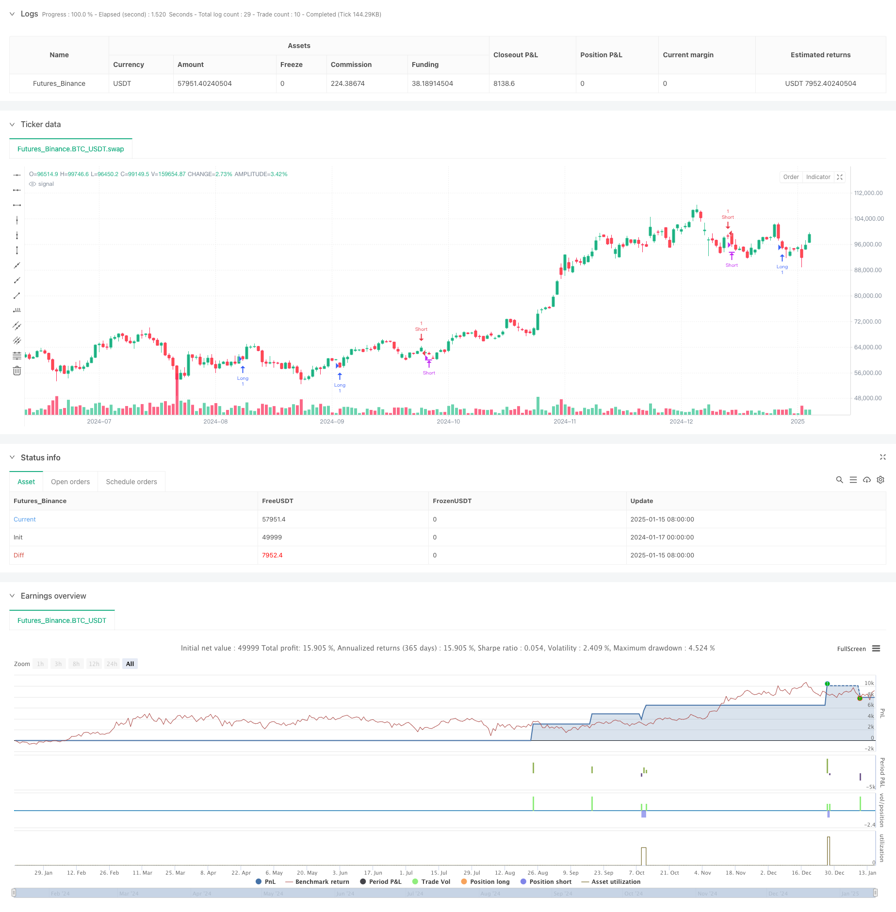

> Name

Dynamic-Dual-Indicator-Momentum-Trend-Quantitative-Strategy-System
> Author

ChaoZhang

> Strategy Description



[trans]
#### Overview
This strategy is a quantitative trading system that combines the Relative Strength Index (RSI) and the Moving Average (MA), which uses the synergy of the two indicators to identify market trends and trading opportunities. The system also integrates volume and volatility filters to increase the reliability of trading signals. The core idea of ​​the strategy is to determine the trend direction through the intersection of the fast moving average and the slow moving average, while using RSI to confirm momentum, and ultimately form a complete trading decision-making framework.
#### Strategy Principle
The strategy adopts a two-layer signal confirmation mechanism:
1. Trend confirmation layer: Use the intersection of the fast moving average (FastMA) and the slow moving average (SlowMA) to determine the market trend. When the fast line breaks through the slow line from below, the upward trend is deemed to be established; when the fast line falls below the slow line from above, the downtrend is deemed to be established.
2. Momentum Confirmation Layer: Use the RSI indicator as a momentum confirmation tool. In an upward trend, the RSI is required to be below 50, indicating that the market still has room to rise; in a downward trend, the RSI is required to be above 50, indicating that the market has room to fall.
3. Trading filter: Filter out trading signals with insufficient liquidity or insufficient volatility by setting minimum thresholds for trading volume and ATR volatility.
#### Strategic Advantages
1. Multi-dimensional signal confirmation: By combining trend and momentum indicators, the probability of false signals is reduced.
2. Improved risk management: Integrated stop loss and take profit functions, risk control points can be set based on percentages.
3. Flexible filtering mechanism: Volume and volatility filters can be flexibly turned on or off according to market conditions.
4. Automatic closing mechanism: Automatically close positions when a reversal signal occurs to avoid excessive positions.
#### Strategy Risk
1. Risk of volatile market: In a volatile market, false breakthrough signals may appear frequently.
2. Slippage risk: When the market fluctuates violently, the actual transaction price may deviate greatly from the signal trigger price.
3. Parameter sensitivity: The effect of the strategy is highly dependent on the setting of parameters. Different market environments may require different parameter combinations.
#### Strategy optimization direction
1. Dynamic parameter adjustment: An adaptive parameter mechanism can be introduced to dynamically adjust the moving average period and RSI threshold according to market fluctuations.
2. Signal weighting system: Establish a signal strength scoring system and assign different weights according to the performance of different indicators.
3. Market environment classification: Add a market environment identification module to use different trading strategies under different market conditions.
4. Enhanced risk control: Introduce a dynamic stop-loss mechanism to automatically adjust the stop-loss position according to market volatility.
#### Summary
This strategy establishes a relatively complete trading system by comprehensively using trend and momentum indicators. The advantage of the system lies in the multi-level signal confirmation mechanism and complete risk management system. However, in practical applications, it is necessary to pay attention to the impact of the market environment on strategy performance and optimize parameters according to the actual situation. Through continuous improvement and optimization, this strategy is expected to maintain stable performance in different market environments. ||
#### Overview
This strategy is a quantitative trading system that combines the Relative Strength Index (RSI) and Moving Averages (MA) to identify market trends and trading opportunities. The system also incorporates volume and volatility filters to enhance the reliability of trading signals. The core concept is to determine trend direction through the crossover of fast and slow moving averages while using RSI for momentum confirmation, ultimately forming a complete trading decision framework.

#### Strategy Principle
The strategy employs a dual-signal confirmation mechanism:
1. Trend Confirmation Layer: Uses the crossover of Fast Moving Average (FastMA) and Slow Moving Average (SlowMA) to determine market trends. When the fast line crosses above the slow line, an uptrend is established; when the fast line crosses below the slow line, a downtrend is established.
2. Momentum Confirmation Layer: Uses RSI as a momentum confirmation tool. In uptrends, RSI should be below 50, indicating upward potential; in downtrends, RSI should be above 50, indicating downward potential.
3. Trading Filters: Sets minimum thresholds for volume and ATR volatility to filter out signals with insufficient liquidity or volatility.

#### Strategy Advantages
1. Multi-dimensional Signal Confirmation: Combines trend and momentum indicators to reduce the probability of false signals.
2. Comprehensive Risk Management: Integrates stop-loss and take-profit functions with percentage-based risk control points.
3. Flexible Filtering Mechanism: Volume and volatility filters can be enabled or disabled based on market conditions.
4. Automatic Position Closing: Closes positions automatically when reversal signals appear to avoid overholding.

#### Strategy Risks
1. Choppy Market Risk: False breakout signals may frequently occur in range-bound markets.
2. Slippage Risk: During volatile market conditions, actual execution prices may significantly deviate from signal trigger prices.
3. Parameter Sensitivity: Strategy performance highly depends on parameter settings, different market environments may require different parameter combinations.

#### Strategy Optimization Directions
1. Dynamic Parameter Adjustment: Introduce adaptive parameter mechanisms to dynamically adjust moving average periods and RSI thresholds based on market volatility.
2. Signal Weighting System: Establish a signal strength scoring system, assigning different weights based on indicator performance.
3. Market Environment Classification: Add market state identification modules to employ different trading strategies under different market conditions.
4. Enhanced Risk Control: Introduce dynamic stop-loss mechanisms to automatically adjust stop-loss positions based on market volatility.

#### Summary
This strategy establishes a comprehensive trading system through the integrated use of trend and momentum indicators. The system's strengths lie in its multi-layered signal confirmation mechanism and comprehensive risk management framework. However, practical application requires attention to the impact of market conditions on strategy performance and parameter optimization based on actual circumstances. Through continuous improvement and optimization, this strategy has the potential to maintain stable performance across different market environments.[/trans]


> Source (PineScript)

``` pinescript
/*backtest
start: 2024-01-17 00:00:00
end: 2025-01-16 00:00:00
period: 1d
basePeriod: 1d
exchanges: [{"eid":"Futures_Binance","currency":"BTC_USDT","balance":49999}]
*/

// © Boba2601
//@version=5
strategy("RSI-MA Synergy", overlay=true, margin_long=100, margin_short=100)

// === Налаштування індикаторів ===
length_rsi = input.int(14, title="RSI Period", group="Індикатори")
fastMALength = input.int(9, title="Fast MA Length", group="Індикатори")
slowMALength = input.int(21, title="Slow MA Length", group="Індикатори")

// === Налаштування стоп-лосу і тейк-профіту ===
useStopLossTakeProfit = input.bool(true, title="Використовувати стоп-лос і тейк-профіт", group="Стоп-лос і Тейк-профіт")
stopLossPercent = input.float(2.0, title="Стоп-лос (%)", minval=0.1, step=0.1, group="Стоп-лос і Тейк-профіт")
takeProfitPercent = input.float(4.0, title="Тейк-профіт (%)", minval=0.1, step=0.1, group="Стоп-лос і Тейк-профіт")

// === Налаштування об'єму та волатильності ===
useVolumeFilter = input.bool(false, title="Використовувати фільтр об'єму", group="Об'єм та Волатильність")
volumeThreshold = input.int(50000, title="Мінімальний об'єм", group="Об'єм та Волатильність")
useVolatilityFilter = input.bool(false, title="Використовувати фільтр волатильності", group="Об'єм та Волатильність")
atrLength = input.int(14, title="Період ATR для волатильності", group="Об'єм та Волатильність")
volatilityThreshold = input.float(1.5, title="Мінімальна волатильність (ATR)", step=0.1, group="Об'єм та Волатильність")


// === Розрахунок індикаторів ===
rsiValue = ta.rsi(close, length_rsi)
fastMA = ta.sma(close, fastMALength)
slowMA = ta.sma(close, slowMALength)

// === Розрахунок об'єму та волатильності ===
averageVolume = ta.sma(volume, 20)
atrValue = ta.atr(atrLength)

// === Умови входу в позицію ===
longCondition = ta.crossover(fastMA, slowMA) and rsiValue < 50
if useVolumeFilter
    longCondition := longCondition and volume > volumeThreshold
if useVolatilityFilter
    longCondition := longCondition and atrValue > volatilityThreshold

shortCondition = ta.crossunder(fastMA, slowMA) and rsiValue > 50
if useVolumeFilter
    shortCondition := shortCondition and volume > volumeThreshold
if useVolatilityFilter
    shortCondition := shortCondition and atrValue > volatilityThreshold

// === Логіка входу та виходу з позиції ===
if (longCondition)
    strategy.entry("Long", strategy.long)
    if (useStopLossTakeProfit)
        stopLossPrice = close * (1 - stopLossPercent / 100)
        takeProfitPrice = close * (1 + takeProfitPercent / 100)
        strategy.exit("Exit Long", "Long", stop = stopLossPrice, limit = takeProfitPrice)

if (shortCondition)
    strategy.entry("Short", strategy.short)
    if (useStopLossTakeProfit)
        stopLossPrice = close * (1 + stopLossPercent / 100)
        takeProfitPrice = close * (1 - takeProfitPercent / 100)
        strategy.exit("Exit Short", "Short", stop = stopLossPrice, limit = takeProfitPrice)

// === Закриття позицій за зворотнім сигналом ===
if (strategy.position_size > 0 and (ta.crossunder(fastMA, slowMA) or rsiValue > 50))
    strategy.close("Long", comment="Закрито по сигналу")

if (strategy.position_size < 0 and (ta.crossover(fastMA, slowMA) or rsiValue < 50))
    strategy.close("Short", comment="Закрито по сигналу")
```

> Detail

https://www.fmz.com/strategy/478749

> Last Modified

2025-01-17 16:41:17
