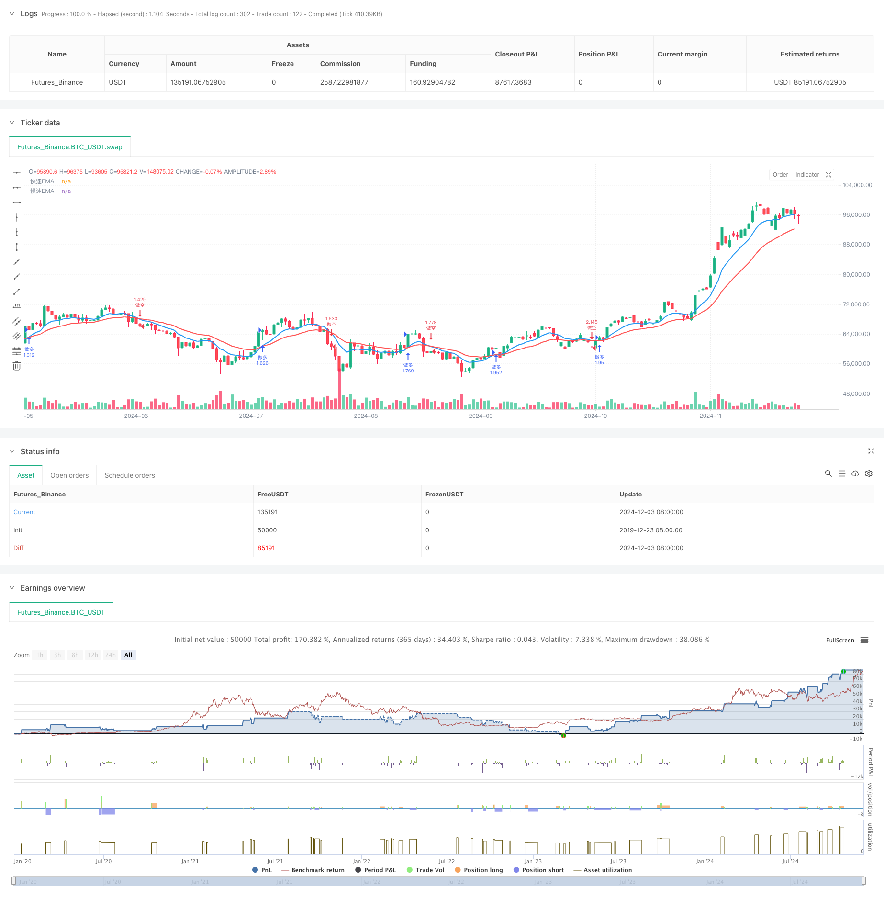

> Name

Dynamic-Dual-Moving-Average-Breakthrough-Trading-System-Dynamic-Dual-Moving-Average-Breakthrough-Trading-System
> Author

ChaoZhang

> Strategy Description



[trans]
#### Overview
This is an automated trading strategy system based on double moving average crossovers. This system uses the 9-period and 21-period exponential moving averages (EMA) as the core indicator, and trades by capturing the crossover signals of the two moving averages. The system integrates stop-profit and stop-loss management, and also provides visual interface support, which can intuitively display trading signals and key price levels.
#### Strategy Principle
The strategy uses fast EMA (9 periods) and slow EMA (21 periods) to build a trading system. When the fast EMA crosses the slow EMA upwards, the system generates a long signal; when the fast EMA crosses the slow EMA downwards, the system generates a short signal. Each time a position is opened, the system will automatically set the take-profit and stop-loss prices based on the preset take-profit and stop-loss percentages. Transaction execution uses percentage position management, and 100% of the account's funds are used for transactions by default.
#### Strategic Advantages
1. Clear signal: Use moving average crossover as a trading signal. The signal is clear and easy to understand and execute.
2. Risk controllable: Integrated stop-profit and stop-loss management system, each transaction has preset risk control measures
3. Visual support: Provides transaction label display function, including key information such as entry time, price, stop loss and take profit levels
4. Flexible parameters: Allows adjustment of parameters such as EMA cycle, take-profit and stop-loss ratio, to adapt to different market environments
5. Complete position closing mechanism: Automatically close positions when reverse signals appear to avoid positions canceling each other out.
#### Strategy Risk
1. Volatile market risk: False breakthrough signals may frequently occur in sideways and volatile markets, leading to continuous losses.
2. Slippage risk: When the market fluctuates violently, the actual transaction price may deviate from the ideal price due to slippage.
3. Fund management risk: Using 100% funds for transactions by default may bring excessive risks
4. Signal lag: EMA itself has a certain lag, which may miss the best entry opportunity or cause delayed exit.
5. Reliance on a single indicator: Relying only on double moving average crossovers may ignore other important market information.
#### Strategy optimization direction
1. Add trend confirmation indicators: It is recommended to add ADX or trend strength indicators to filter out false signals in volatile markets.
2. Optimize fund management: It is recommended to add dynamic position management functions and adjust the opening ratio according to market fluctuations
3. Improve the stop loss mechanism: You can consider adding a trailing stop loss function to better protect profits
4. Add market environment filtering: Add volatility indicator to automatically stop trading in market environments that are not suitable for trading.
5. Optimize the signal confirmation mechanism: You can consider increasing trading volume confirmation or other technical indicators.
#### Summary
This is a moving average crossover strategy system with reasonable design and clear logic. By combining EMA cross signals and risk management mechanisms, this strategy can gain profits in trending markets. Although there are some inherent risks, the stability and reliability of the strategy can be further improved through the suggested optimization directions. This strategy is particularly suitable for tracking mid- to long-term trends and is a good choice for patient traders. ||
#### Overview
This is an automated trading strategy system based on dual moving average crossover. The system utilizes 9-period and 21-period Exponential Moving Averages (EMA) as core indicators, generating trading signals through their crossovers. It incorporates stop-loss and take-profit management, along with a visual interface that displays trading signals and key price levels.

#### Strategy Principle
The strategy employs a fast EMA (9-period) and a slow EMA (21-period) to construct the trading system. Long signals are generated when the fast EMA crosses above the slow EMA, while short signals occur when the fast EMA crosses below the slow EMA. The system automatically sets stop-loss and take-profit levels based on preset percentages for each trade. Position sizing uses a percentage-based approach, defaulting to 100% of account equity.

#### Strategy Advantages
1. Clear Signals: Uses moving average crossovers as trading signals, which are clear and easy to understand
2. Risk Control: Integrated stop-loss and take-profit management system for every trade
3. Visual Support: Provides trade label display featuring entry time, price, stop-loss, and take-profit levels
4. Flexible Parameters: Allows adjustment of EMA periods and risk management parameters to adapt to different market conditions
5. Complete Exit Mechanism: Automatically closes positions on contrary signals to avoid position offsetting

#### Strategy Risks
1. Choppy Market Risk: May generate frequent false breakout signals in sideways markets, leading to consecutive losses
2. Slippage Risk: Actual execution prices may deviate from intended levels during high volatility periods
3. Position Sizing Risk: Default 100% equity allocation may expose the account to excessive risk
4. Signal Lag: EMAs inherently lag price action, potentially missing optimal entry points or causing delayed exits
5. Single Indicator Dependency: Reliance solely on moving average crossovers may ignore other important market information

#### Optimization Directions
1. Add Trend Confirmation: Consider incorporating ADX or trend strength indicators to filter false signals
2. Improve Money Management: Add dynamic position sizing based on market volatility
3. Enhanced Stop-Loss Mechanism: Consider implementing trailing stops to better protect profits
4. Market Environment Filtering: Add volatility indicators to suspend trading in unfavorable conditions
5. Optimize Signal Confirmation: Consider adding volume confirmation or complementary technical indicators

#### Summary
This is a well-designed, logically sound moving average crossover strategy system. By combining EMA crossover signals with risk management mechanisms, the strategy can capture profits in trending markets. While inherent risks exist, the suggested optimizations can further enhance the strategy's stability and reliability. This strategy is particularly suitable for tracking medium to long-term trends and represents a solid choice for patient traders.
[/trans]


> Source (PineScript)

``` pinescript
/*backtest
start: 2019-12-23 08:00:00
end: 2024-12-04 00:00:00
period: 1d
basePeriod: 1d
exchanges: [{"eid":"Futures_Binance","currency":"BTC_USDT"}]
*/

//@version=5
//
//  ██╗         █████╗         ██████╗     ██████╗     ██╗   ██╗    ██╗
//  ██║        ██╔══██╗       ██╔═══██╗    ██╔══██╗    ██║   ██║    ██║
//  ██║        ███████║       ██║   ██║    ██║  ██║    ██║   ██║    ██║
//  ██║        ██╔══██║       ██║   ██║    ██║  ██║    ██║   ██║    ██║
//  ███████╗   ██║  ██║       ╚██████╔╝    ██████╔╝    ╚██████╔╝    ██║
//  ╚══════╝   ╚═╝  ╚═╝        ╚═════╝     ╚═════╝      ╚═════╝     ╚═╝
//
//  BTC-EMA做多策略(5分钟确认版) - 作者：LAODUI
//  版本：2.0
//  最后更新：2024
// ═══════════════════════════════════════════════════════════════════════════

strategy("EMA Cross Strategy", overlay=true, initial_capital=10000, default_qty_type=strategy.percent_of_equity, default_qty_value=100)

// 添加策略参数设置
var showLabels = input.bool(true, "显示标签", group="显示设置")
var stopLossPercent = input.float(5.0, "止损百分比", minval=0.1, maxval=20.0, step=0.1, group="风险管理")
var takeProfitPercent = input.float(10.0, "止盈百分比", step=0.1, group="风险管理")

// EMA参数设置
var emaFastLength = input.int(9, "快速EMA周期", minval=1, maxval=200, group="EMA设置")
var emaSlowLength = input.int(21, "慢速EMA周期", minval=1, maxval=200, group="EMA设置")

// 计算EMA
ema_fast = ta.ema(close, emaFastLength)
ema_slow = ta.ema(close, emaSlowLength)

// 绘制EMA线
plot(ema_fast, "快速EMA", color=color.blue, linewidth=2)
plot(ema_slow, "慢速EMA", color=color.red, linewidth=2)

// 检测交叉
crossOver = ta.crossover(ema_fast, ema_slow)  
crossUnder = ta.crossunder(ema_fast, ema_slow)

// 格式化时间显示 (UTC+8)
utc8Time = time + 8 * 60 * 60 * 1000
timeStr = str.format("{0,date,MM-dd HH:mm}", utc8Time)

// 计算止损止盈价格
longStopLoss = strategy.position_avg_price * (1 - stopLossPercent / 100)
longTakeProfit = strategy.position_avg_price * (1 + takeProfitPercent / 100)
shortStopLoss = strategy.position_avg_price * (1 + stopLossPercent / 100)
shortTakeProfit = strategy.position_avg_price * (1 - takeProfitPercent / 100)

// 交易逻辑
if crossOver
    if strategy.position_size < 0  
        strategy.close("做空")     
    strategy.entry("做多", strategy.long)  
    if showLabels
        label.new(bar_index, high, text="做多入场\n" + timeStr + "\n入场价: " + str.tostring(close) + "\n止损价: " + str.tostring(longStopLoss) + "\n止盈价: " + str.tostring(longTakeProfit), color=color.green, textcolor=color.white, style=label.style_label_down, yloc=yloc.abovebar)

if crossUnder
    if strategy.position_size > 0  
        strategy.close("做多")     
    strategy.entry("做空", strategy.short)  
    if showLabels
        label.new(bar_index, low, text="做空入场\n" + timeStr + "\n入场价: " + str.tostring(close) + "\n止损价: " + str.tostring(shortStopLoss) + "\n止盈价: " + str.tostring(shortTakeProfit), color=color.red, textcolor=color.white, style=label.style_label_up, yloc=yloc.belowbar)

// 设置止损止盈
if strategy.position_size > 0  // 多仓止损止盈
    strategy.exit("多仓止损止盈", "做多", stop=longStopLoss, limit=longTakeProfit)
    
if strategy.position_size < 0  // 空仓止损止盈
    strategy.exit("空仓止损止盈", "做空", stop=shortStopLoss, limit=shortTakeProfit) 
```

> Detail

https://www.fmz.com/strategy/474051

> Last Modified

2024-12-05 16:22:32
