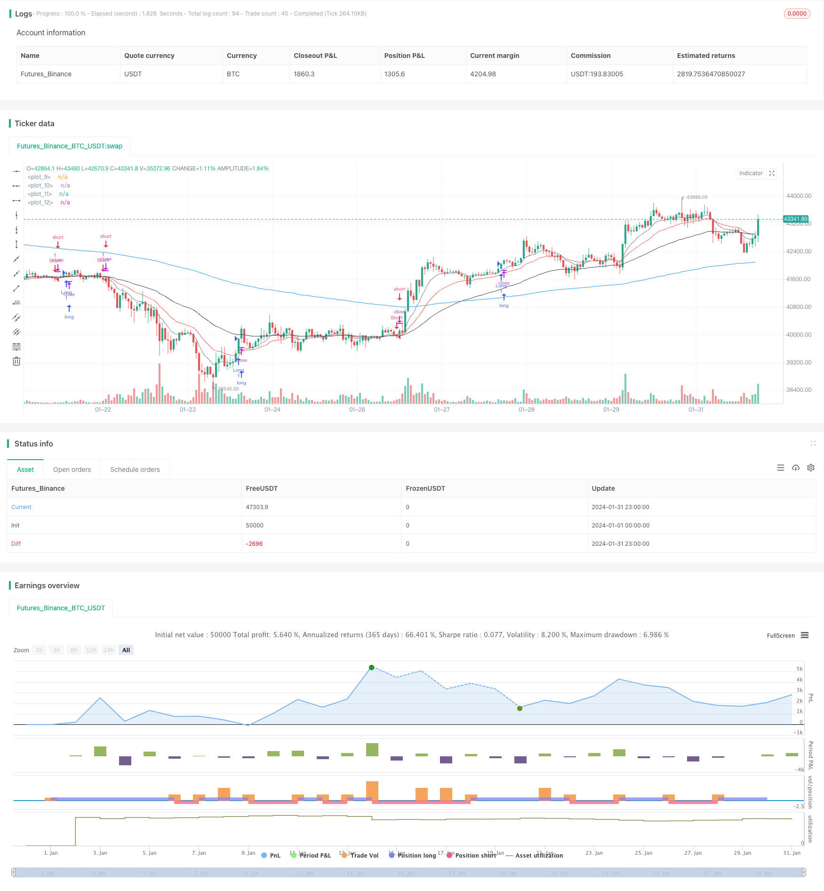

> Name

Dynamic-Dual-Moving-Average-Trailing-Stop-Strategy based on dynamic dual-moving average tracking stop loss strategy
> Author

ChaoZhang

> Strategy Description


[trans]
## Overview
This strategy is a dynamic stop-loss tracking strategy based on dual EMA moving averages. It uses the 9-day line and the 20-day line to determine the market trend direction, and combines it with the RSI indicator to filter out false breaks. At the same time, use the ATR indicator to calculate dynamic stop loss and take profit levels. This strategy is suitable for medium and long-term positions.
## Strategy Principle
This strategy uses the 9-day EMA as the short-term moving average and the 20-day EMA as the mid-term moving average to determine the price trend. When the price crosses the short-term moving average, and the closing price is higher than the previous day's highest price, and the RSI is higher than 30, go long; when the price crosses the short-term moving average, and the closing price is lower than the previous day's lowest price, and the RSI is lower than 70, go short.
The stop loss level is set to the closing price minus 1.5 times the ATR value, and the take profit level is the closing price plus the ATR value multiplied by the take profit coefficient. At the same time, use 2 times the ATR to set a trend trailing stop loss.
## Strategic Advantages
1. Use double EMA to determine the main market trend and avoid being pressured by noise.
2. Combine with RSI indicator to filter out false breakthroughs and improve entry accuracy.
3. Dynamic stop loss and take profit, the stop loss and take profit levels can be adjusted according to the degree of market fluctuations
4. Trend following and stop loss to maximize profits
## Risk Analysis
1. The EMA moving average is lagging and may miss short-term opportunities.
2. Improper RSI parameter settings may lead to missed entry opportunities
3. The stop-loss and take-profit ratios are improperly set, and may be too loose or strict.
4. When the market fluctuates violently, the stop loss may be breached
## Optimization direction
1. Test EMA combinations with different parameters and find the optimal parameters
2. Optimize RSI parameters and balance the relationship between entry accuracy and seizing opportunities
3. Test different stop-loss and take-profit ratios to find the optimal configuration
4. Add more filtering indicator conditions to reduce the probability of stop loss being breached
## Summarize
Overall, this strategy is a relatively stable medium- and long-term holding strategy. It combines double EMA to determine the main market trends and avoid being affected by short-term market noise in decision-making. The addition of the RSI indicator also filters out false breakthroughs to a certain extent. In addition, the dynamic stop-loss and take-profit mechanism also allows this strategy to adjust its stop-loss and take-profit levels according to the degree of market volatility. However, this strategy also has certain risks, such as the lag of the moving average and the possibility of stop loss breakthrough. This requires us to find the best configuration through different parameter adjustments and optimizations in practical applications.
||

## Overview

This is a dynamic trailing stop strategy based on dual EMA lines. It uses 9-day and 20-day EMAs to determine market trend direction, combined with RSI indicator to filter false breaks. It also uses ATR indicator to calculate dynamic stop loss and take profit levels. This strategy is suitable for medium to long term holdings.

## Strategy Logic

The strategy uses 9-day EMA as the short term line and 20-day EMA as the medium term line to determine price trend. It goes long when price crosses above the short term line and closing price is higher than previous day's high, with RSI lower than 70 and close higher than 20-day EMA minus 1 ATR. It goes short when price crosses below the short term line and closing price is lower than previous day's low, with RSI higher than 30 and close higher than 20-day EMA minus 1 ATR.

The stop loss is set at closing price minus 1.5 times ATR. Take profit is set at closing price plus ATR multiplied by a take profit coefficient. It also uses 2 times ATR to set trend trailing stop loss.

## Advantage Analysis

1. Using dual EMAs to determine major market trend, avoids being pressured by noise  
2. Combining RSI indicator to filter false breaks, improves entry accuracy
3. Dynamic stop loss and take profit adapts to market volatility  
4. Trend trailing stop loss maximizes profits

## Risk Analysis  

1. EMA lines have lagging effect, may miss short term opportunities
2. Improper RSI parameter setting may miss entries
3. Improper stop loss/take profit ratio may be too loose or strict  
4. Stop loss may be penetrated during violent market swings

## Optimization Directions

1. Test different EMA combinations to find optimal parameters
2. Optimize RSI parameters to balance entry accuracy and catching opportunities 
3. Test different stop loss/take profit ratios to find optimal configuration  
4. Add more filter conditions to reduce stop loss penetration probability  

## Summary

Overall this is a relatively stable medium to long term holding strategy. It uses dual EMAs to determine major market trend, avoiding being affected by short term noise. The addition of RSI also filters false breaks to some extent. Moreover, the dynamic stop loss/take profit mechanism allows the strategy to adjust based on market volatility. However, there are still risks like lagging of moving averages and potential of stop loss penetration. We need to find the optimum configuration through parameter tuning and optimization during practical application.

[/trans]

> Strategy Arguments


|Argument|Default|Description|
|----|----|----|
|v_input_1|2|Take Profit Multiplier|


> Source (PineScript)

``` pinescript
/*backtest
start: 2024-01-01 00:00:00
end: 2024-01-31 23:59:59
period: 1h
basePeriod: 15m
exchanges: [{"eid":"Futures_Binance","currency":"BTC_USDT"}]
*/

//@version=4
strategy("CJTrade", overlay=true)

short = ema(close, 9)
medium = ema(close, 20)
long = ema(close, 50)
very_long = ema(close, 200)

plot(short, color=color.gray, linewidth=1)
plot(medium, color=color.red, linewidth=1)
plot(long, color=color.black, linewidth=1)
plot(very_long, color=color.blue, linewidth=1)

rsiValue = rsi(close, 14)

near20EMA = close > medium - atr(14)

longCond = crossover(close[1], short) and close >= high[1] and rsiValue < 70 and near20EMA
shortCond = crossunder(close[1], short) and close <= low[1] and rsiValue > 30 and near20EMA

strategy.entry("Long", strategy.long, when=longCond)
strategy.entry("Short", strategy.short, when=shortCond)

atrValue = atr(14)
stopLossLevel = close - atrValue * 1.5

// Dynamic take profit level based on ATR
takeProfitMultiplier = input(2, title="Take Profit Multiplier", minval=0.1, maxval=10, step=0.1)
takeProfitLevel = close + atrValue * takeProfitMultiplier

// Trailing stop loss for long positions
longTrailingStop = close - atrValue * 2
strategy.exit("LongTrailingStop", from_entry="Long", loss=longTrailingStop)

// Trailing stop loss for short positions
shortTrailingStop = close + atrValue * 2
strategy.exit("ShortTrailingStop", from_entry="Short", loss=shortTrailingStop)

strategy.exit("Take Profit/Stop Loss", from_entry="Long", loss=stopLossLevel, profit=takeProfitLevel)
strategy.exit("Take Profit/Stop Loss", from_entry="Short", loss=stopLossLevel, profit=takeProfitLevel)

```

> Detail

https://www.fmz.com/strategy/442816

> Last Modified

2024-02-26 11:13:17
