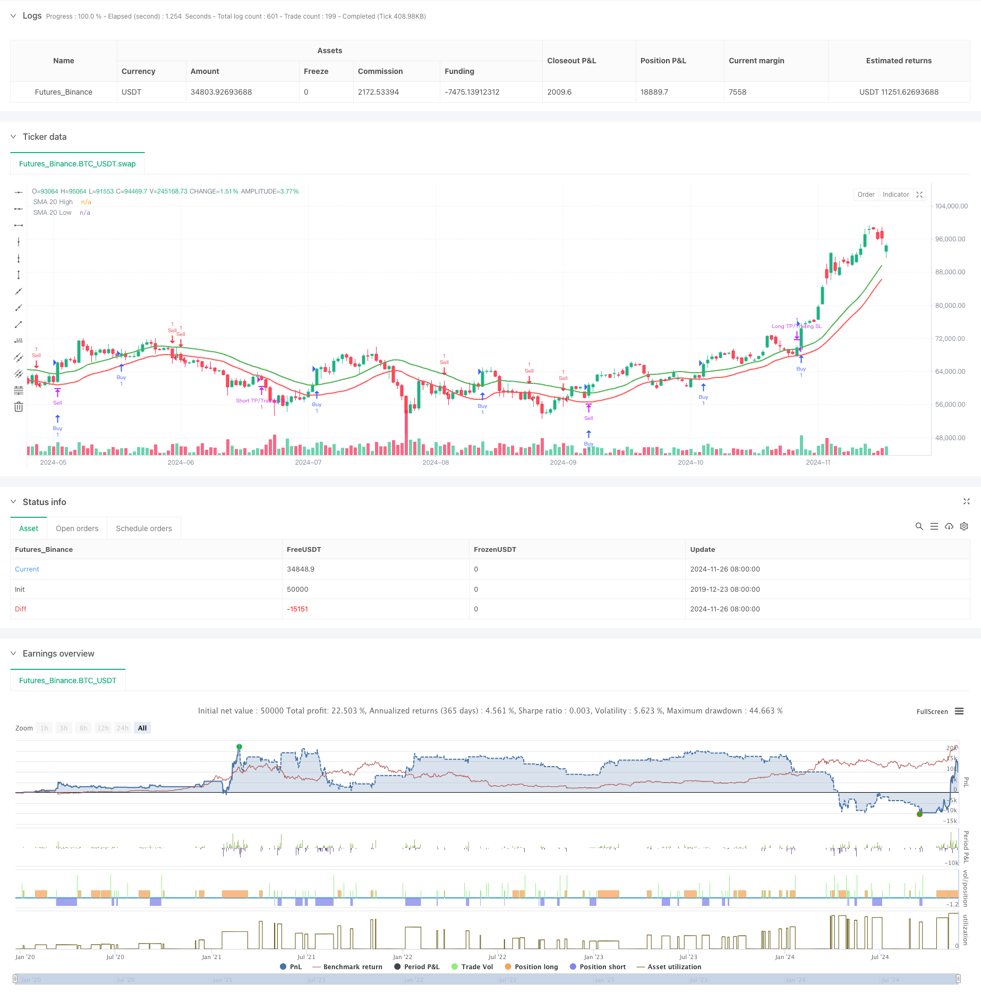

> Name

Dynamic-Dual-SMA-Trend-Following-Strategy-with-Smart-Risk-Management
> Author

ChaoZhang

> Strategy Description



[trans]
#### Overview
This strategy is an intelligent trend tracking system based on dual moving averages. It identifies market trends by calculating the moving averages of high points and low points and slope indicators, and combines it with a dynamic stop-profit and stop-loss mechanism for risk management. The core of the strategy is to filter false signals through the slope threshold, and at the same time use the trailing stop dynamic tracking method to lock in profits, achieving an organic combination of trend tracking and risk control.
#### Strategy Principle
The strategy uses the dual moving average system as the core trading logic, and calculates moving averages on the highest price and lowest price sequences respectively. When the price breaks through the upper moving average and the slope of the moving average is significantly upward, the system generates a long signal; when the price falls below the lower moving average and the slope of the moving average is significantly downward, the system generates a short signal. In order to avoid frequent trading in volatile markets, the strategy introduces a slope threshold mechanism. The validity of the trend is only confirmed when the change in the average slope exceeds the set threshold. In terms of risk management, the strategy designed a dynamic take-profit and stop-loss mechanism, initially setting a relatively aggressive take-profit target, while using trailing stop-loss to protect the profits already obtained.
#### Strategic Advantages
1. High accuracy of trend identification: through the combination of double moving average and slope threshold, false signals in sideways fluctuations can be effectively filtered out
2. Improved risk control: the dynamic stop loss mechanism can automatically adjust with price changes, which not only protects profits but also gives the trend enough room for development.
3. Flexible and adjustable parameters: Key parameters of the strategy, such as moving average period, take-profit and stop-loss ratio, slope threshold, etc., can be flexibly adjusted according to different market characteristics.
4. The logic is clear and simple: the strategy logic is intuitive and easy to understand, easy to maintain and optimize
5. Strong adaptability: can be applied to different time periods and trading varieties
#### Strategy Risk
1. Trend reversal risk: When the trend suddenly reverses, trailing stop may not be able to lock in all profits in time.
2. Parameter sensitivity: Strategy performance is more sensitive to parameter settings, and different market environments may require different parameter combinations.
3. Performance in volatile markets: Although there is slope filtering, false signals may still be generated in violently volatile markets.
4. Impact of slippage: During periods of severe volatility, the actual transaction price may deviate greatly from the signal price.
#### Strategy optimization direction
1. Introduce a volatility adaptive mechanism: consider dynamically adjusting the slope threshold and stop loss distance based on ATR
2. Add market environment filtering: add trend strength indicators and use different parameter combinations in different market environments
3. Optimize the take-profit and stop-loss mechanism: you can design multi-level take-profit targets and gradually lock in part of the profits
4. Add trading volume analysis: verify the validity of the trend based on trading volume data
5. Introduce time filtering: avoid trading during periods of high market volatility
#### Summary
This is a quantitative trading strategy that organically combines trend following and risk management. Through the cooperation of the dual moving average system and the slope threshold, the strategy can more accurately capture market trends, while the dynamic stop-profit and stop-loss mechanism provides complete risk control. Although the strategy still has room for improvement in terms of parameter selection and market adaptability, its clear logical framework and flexible parameter system provide a good foundation for subsequent optimization. It is recommended that traders need to fully backtest and optimize various parameters based on specific market characteristics and their own risk preferences when applying them in real markets. ||
#### Overview
This strategy is an intelligent trend-following system based on dual moving averages, which identifies market trends by calculating moving averages of highs and lows along with slope indicators, combined with dynamic profit-taking and stop-loss mechanisms for risk management. The strategy's core lies in filtering false signals through slope thresholds while using trailing stops to lock in profits, achieving an organic combination of trend following and risk control.

#### Strategy Principles
The strategy employs a dual moving average system as its core trading logic, calculating moving averages on both high and low price series. Long signals are generated when price breaks above the upper average with a significantly positive slope, while short signals occur when price breaks below the lower average with a significantly negative slope. To avoid frequent trading in oscillating markets, the strategy incorporates a slope threshold mechanism, confirming trend validity only when the moving average slope change exceeds the set threshold. For risk management, the strategy implements dynamic profit-taking and stop-loss mechanisms, setting initially aggressive profit targets while using trailing stops to protect gained profits.

#### Strategy Advantages
1. High accuracy in trend identification: The combination of dual moving averages and slope thresholds effectively filters out false signals in sideways markets
2. Comprehensive risk control: Dynamic stop-loss mechanism automatically adjusts with price movement, both protecting profits and allowing trends to develop
3. Flexible parameters: Key parameters such as moving average period, profit/loss ratios, and slope threshold can be adjusted for different market characteristics
4. Clear and simple logic: Strategy logic is intuitive and easy to understand, facilitating maintenance and optimization
5. High adaptability: Applicable to different timeframes and trading instruments

#### Strategy Risks
1. Trend reversal risk: During sudden trend reversals, trailing stops may not lock in all profits in time
2. Parameter sensitivity: Strategy performance is sensitive to parameter settings, different market environments may require different parameter combinations
3. Oscillating market performance: Despite slope filtering, false signals may still occur in highly volatile markets
4. Slippage impact: During highly volatile periods, actual execution prices may significantly deviate from signal prices

#### Optimization Directions
1. Introduce volatility adaptive mechanism: Consider dynamically adjusting slope thresholds and stop-loss distances based on ATR
2. Add market environment filtering: Include trend strength indicators to use different parameter combinations in different market conditions
3. Optimize profit-taking and stop-loss mechanisms: Design multi-level profit targets to gradually lock in partial profits
4. Add volume analysis: Incorporate volume data to verify trend validity
5. Introduce time filtering: Avoid trading during highly volatile market periods

#### Summary
This is a quantitative trading strategy that organically combines trend following with risk management. Through the cooperation of a dual moving average system and slope thresholds, the strategy can accurately capture market trends, while dynamic profit-taking and stop-loss mechanisms provide comprehensive risk control. Although there is room for improvement in parameter selection and market adaptability, its clear logical framework and flexible parameter system provide a good foundation for subsequent optimization. It is recommended that traders thoroughly backtest and optimize various parameters according to specific market characteristics and their own risk preferences when applying the strategy in live trading.[/trans]


> Source (PineScript)

``` pinescript
/*backtest
start: 2019-12-23 08:00:00
end: 2024-11-27 08:00:00
period: 1d
basePeriod: 1d
exchanges: [{"eid":"Futures_Binance","currency":"BTC_USDT"}]
*/

//@version=5
strategy("SMA Buy/Sell Strategy with Significant Slope", overlay=true)

// Parametri configurabili
smaPeriod = input.int(20, title="SMA Period", minval=1)
initialTPPercent = input.float(5.0, title="Initial Take Profit (%)", minval=0.1)  // Take Profit iniziale (ambizioso)
trailingSLPercent = input.float(1.0, title="Trailing Stop Loss (%)", minval=0.1) // Percentuale di trailing SL
slopeThreshold = input.float(0.05, title="Slope Threshold (%)", minval=0.01)    // Soglia minima di pendenza significativa

// SMA calcolate su HIGH e LOW
smaHigh = ta.sma(high, smaPeriod)
smaLow = ta.sma(low, smaPeriod)

// Funzioni per pendenza significativa
isSignificantSlope(sma, threshold) =>
    math.abs(sma - sma[5]) / sma[5] > threshold / 100

slopePositive(sma) =>
    sma > sma[1] and isSignificantSlope(sma, slopeThreshold)

slopeNegative(sma) =>
    sma < sma[1] and isSignificantSlope(sma, slopeThreshold)

// Condizioni di BUY e SELL
buyCondition = close > smaHigh and low < smaHigh and close[1] < smaHigh and slopePositive(smaHigh)
sellCondition = close < smaLow and high > smaLow and close[1] > smaLow and slopeNegative(smaLow)

// Plot delle SMA
plot(smaHigh, color=color.green, linewidth=2, title="SMA 20 High")
plot(smaLow, color=color.red, linewidth=2, title="SMA 20 Low")

// Gestione TP/SL dinamici
longInitialTP = strategy.position_avg_price * (1 + initialTPPercent / 100)
shortInitialTP = strategy.position_avg_price * (1 - initialTPPercent / 100)

// Trailing SL dinamico
longTrailingSL = close * (1 - trailingSLPercent / 100)
shortTrailingSL = close * (1 + trailingSLPercent / 100)

// Chiusura di posizioni attive su segnali opposti
if strategy.position_size > 0 and sellCondition
    strategy.close("Buy", comment="Close Long on Sell Signal")
if strategy.position_size < 0 and buyCondition
    strategy.close("Sell", comment="Close Short on Buy Signal")

// Apertura di nuove posizioni con TP iniziale e Trailing SL
if buyCondition
    strategy.entry("Buy", strategy.long, comment="Open Long")
    strategy.exit("Long TP/Trailing SL", from_entry="Buy", limit=longInitialTP, stop=longTrailingSL)

if sellCondition
    strategy.entry("Sell", strategy.short, comment="Open Short")
    strategy.exit("Short TP/Trailing SL", from_entry="Sell", limit=shortInitialTP, stop=shortTrailingSL)

```

> Detail

https://www.fmz.com/strategy/473321

> Last Modified

2024-11-29 11:06:38
