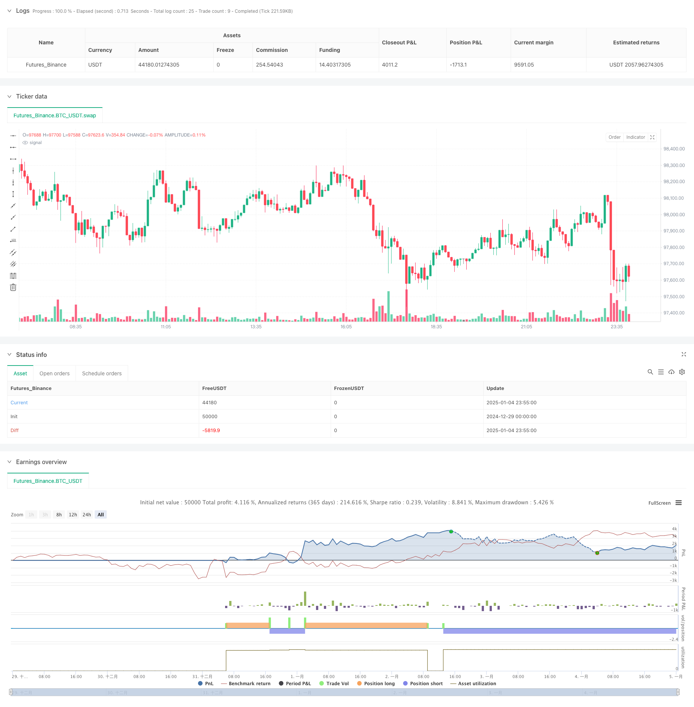

> Name

Dynamic-Dual-Technical-Indicator-Oversold-Overbought-Confirmation-Trading-Strategy
> Author

ChaoZhang

> Strategy Description



[trans]
#### Overview
This strategy is a dual technical analysis trading system based on RSI (Relative Strength Index) and CCI (Conditional Trend Index). It builds a complete trading decision-making framework by combining the overbought and oversold signals of these two classic technical indicators, combined with the risk-reward ratio and fixed stop loss. The core of the strategy is to improve the reliability of trading signals through cross-confirmation of dual indicators, while incorporating a complete risk management mechanism.
#### Strategy Principle
The strategy mainly operates based on the following core principles:
1. Use the 14-period RSI indicator and the 20-period CCI indicator as the basis for signal generation
2. Trigger conditions for entry signals:
   - Long entry: RSI below 20 (oversold) and CCI below -200
   - Short entry: RSI above 80 (overbought) and CCI above 200
3. Risk management design:
   - Use a fixed percentage stop loss (default 1%)
   - Automatically calculate take profit position based on risk reward ratio (default 2.0)
4. Visualization system:
   - Mark buy and sell signal points on the chart
   - Draw stop loss and take profit reference lines
#### Strategic Advantages
1. High signal reliability: Through the double confirmation mechanism of RSI and CCI, false signals can be effectively filtered
2. Improved risk control: integrated dual protection mechanism of fixed stop loss and dynamic stop profit
3. Flexible and adjustable parameters: the main indicator parameters can be optimized according to different market characteristics
4. Clear visual feedback: trading signals and risk management positions are intuitively displayed
5. High degree of automation: from signal generation to position management, the entire process is automated.
#### Strategy Risk
1. Signal lag: Technical indicators inherently have a certain lag and may miss the best entry point
2. Not applicable to volatile markets: too many false signals may be generated in range-bound markets
3. Fixed stop loss risk: A uniform stop loss percentage may not be suitable for all market environments
4. Parameter dependence: Over-reliance on preset parameters may lead to inaccurate performance when the market environment changes.
Solution:
- Dynamically adjust parameters based on market volatility
- Added trend filter to reduce false signals in volatile markets
-Introducing adaptive stop loss mechanism
#### Strategy optimization direction
1. Introduce volatility indicator:
   - Use indicators such as ATR to dynamically adjust the stop loss distance
   - Adjust trigger thresholds for RSI and CCI based on volatility
2. Add trend confirmation mechanism:
   - Add moving average as trend filter
   - Introduce trend strength indicator to optimize entry timing
3. Improve risk management:
   - Implement dynamic risk-reward ratio calculations
   - Added some take-profit mechanisms
4. Optimize signal generation:
   - Added transaction volume confirmation mechanism
   -Introducing price structure analysis
#### Summary
This is a complete trading system that combines classic technical indicators with modern risk management concepts. The confirmation mechanism of dual technical indicators improves signal reliability, and combined with strict risk control measures, a trading strategy with strict logic and strong practicality is formed. Although there are certain limitations, through continuous optimization and improvement, this strategy has good practical application prospects. Continuing to optimize volatility perception, trend confirmation and risk management will further enhance the stability and practicality of the strategy. ||
#### Overview
This strategy is a dual technical analysis trading system based on RSI (Relative Strength Index) and CCI (Commodity Channel Index). It combines the overbought and oversold signals from these two classic technical indicators, coupled with risk-reward ratio and fixed stop-loss mechanisms, to build a complete trading decision framework. The core strength lies in improving trading signal reliability through dual indicator confirmation while incorporating comprehensive risk management mechanisms.

#### Strategy Principles
The strategy operates based on the following core principles:
1. Uses 14-period RSI and 20-period CCI indicators as the foundation for signal generation
2. Entry signal trigger conditions:
   - Long entry: RSI below 20 (oversold) and CCI below -200
   - Short entry: RSI above 80 (overbought) and CCI above 200
3. Risk management design:
   - Fixed percentage stop-loss (default 1%)
   - Automatic take-profit calculation based on risk-reward ratio (default 2.0)
4. Visualization system:
   - Buy/sell signal annotations on chart
   - Stop-loss and take-profit reference lines

#### Strategy Advantages
1. High signal reliability: Effectively filters false signals through RSI and CCI dual confirmation mechanism
2. Comprehensive risk control: Integrates dual protection of fixed stop-loss and dynamic take-profit
3. Flexible parameters: Major indicator parameters can be optimized for different market characteristics
4. Clear visual feedback: Intuitive display of trading signals and risk management positions
5. High automation: Fully automated execution from signal generation to position management

#### Strategy Risks
1. Signal lag: Technical indicators inherently have some lag, potentially missing optimal entry points
2. Unsuitable for ranging markets: May generate excessive false signals in sideways markets
3. Fixed stop-loss risk: Uniform stop-loss percentage may not suit all market conditions
4. Parameter dependency: Over-reliance on preset parameters may lead to poor performance when market conditions change
Solutions:
- Dynamically adjust parameters based on market volatility
- Add trend filters to reduce false signals in ranging markets
- Introduce adaptive stop-loss mechanisms

#### Strategy Optimization Directions
1. Introduce volatility indicators:
   - Use ATR to dynamically adjust stop-loss distances
   - Adjust RSI and CCI trigger thresholds based on volatility
2. Add trend confirmation mechanism:
   - Add moving averages as trend filters
   - Introduce trend strength indicators to optimize entry timing
3. Enhance risk management:
   - Implement dynamic risk-reward ratio calculation
   - Add partial profit-taking mechanisms
4. Optimize signal generation:
   - Add volume confirmation mechanism
   - Incorporate price structure analysis

#### Summary
This is a complete trading system that combines classic technical indicators with modern risk management concepts. Through dual technical indicator confirmation mechanisms, it improves signal reliability while incorporating strict risk control measures, forming a logically rigorous and practical trading strategy. Although certain limitations exist, through continuous optimization and improvement, this strategy has good practical application prospects. Continued optimization in volatility awareness, trend confirmation, and risk management will further enhance the strategy's stability and practicality.[/trans]


> Source (PineScript)

``` pinescript
/*backtest
start: 2024-12-29 00:00:00
end: 2025-01-05 00:00:00
period: 5m
basePeriod: 5m
exchanges: [{"eid":"Futures_Binance","currency":"BTC_USDT"}]
*/

// TradingView Pine Script for RSI & CCI-Based Strategy
//@version=6
strategy("RSI & CCI Strategy", overlay=true)

// User Inputs
rsiLength = input.int(14, title="RSI Length")
rsiOverbought = input.int(80, title="RSI Overbought Level")
rsiOversold = input.int(20, title="RSI Oversold Level")

cciLength = input.int(20, title="CCI Length")
cciOverbought = input.int(200, title="CCI Overbought Level")
cciOversold = input.int(-200, title="CCI Oversold Level")

riskRewardRatio = input.float(2.0, title="Risk-Reward Ratio")
fixedStopLoss = input.float(1.0, title="Fixed Stop Loss (Percentage)", minval=0.1)

// RSI and CCI Calculations
rsi = ta.rsi(close, rsiLength)
cci = ta.cci(close, cciLength)

// Entry Conditions
longCondition = (rsi < rsiOversold) and (cci < cciOversold)
shortCondition = (rsi > rsiOverbought) and (cci > cciOverbought)

// Initialize variables for stop loss and take profit
var float longStopLoss = na
var float longTakeProfit = na
var float shortStopLoss = na
var float shortTakeProfit = na

// Plot Buy and Sell Signals
if (longCondition)
    label.new(bar_index, low, "BUY", style=label.style_label_up, color=color.green, textcolor=color.white)
    longEntryPrice = close
    longStopLoss := longEntryPrice * (1 - fixedStopLoss / 100)
    longTakeProfit := longEntryPrice + (longEntryPrice - longStopLoss) * riskRewardRatio
    // line.new(bar_index, longEntryPrice, bar_index, longStopLoss, color=color.red, width=1, extend=extend.none)
    // line.new(bar_index, longEntryPrice, bar_index, longTakeProfit, color=color.green, width=1, extend=extend.none)

if (shortCondition)
    label.new(bar_index, high, "SELL", style=label.style_label_down, color=color.red, textcolor=color.white)
    shortEntryPrice = close
    shortStopLoss := shortEntryPrice * (1 + fixedStopLoss / 100)
    shortTakeProfit := shortEntryPrice - (shortStopLoss - shortEntryPrice) * riskRewardRatio
    // line.new(bar_index, shortEntryPrice, bar_index, shortStopLoss, color=color.green, width=1, extend=extend.none)
    // line.new(bar_index, shortEntryPrice, bar_index, shortTakeProfit, color=color.red, width=1, extend=extend.none)

// Strategy Information and Alerts
if (longCondition)
    strategy.entry("Long", strategy.long)
    strategy.exit("Take Profit/Stop Loss", from_entry="Long", limit=longTakeProfit, stop=longStopLoss)

if (shortCondition)
    strategy.entry("Short", strategy.short)
    strategy.exit("Take Profit/Stop Loss", from_entry="Short", limit=shortTakeProfit, stop=shortStopLoss)

```

> Detail

https://www.fmz.com/strategy/477535

> Last Modified

2025-01-06 11:54:50
