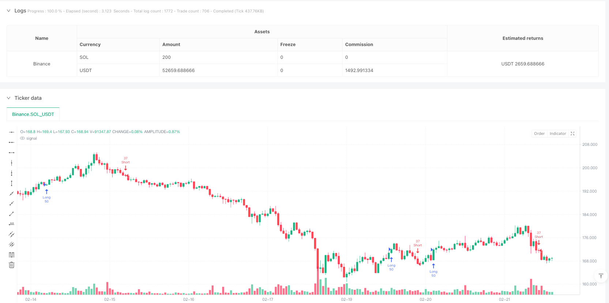
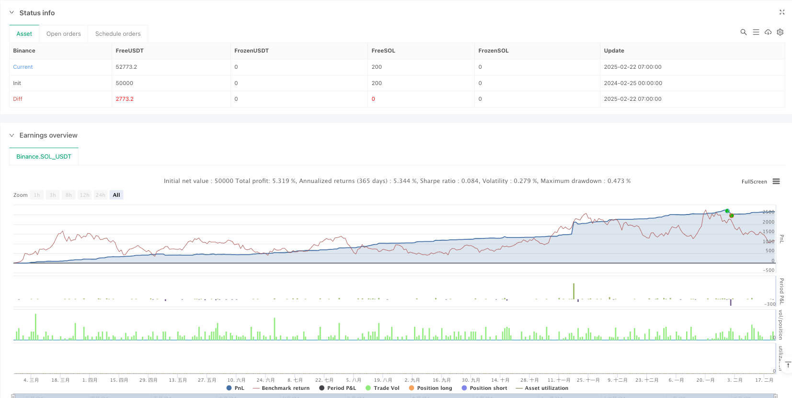

> Name

Dynamic-EMA-Trend-Following-with-Volatility-Adaptive-Nasdaq-Futures-Trading-Strategy
> Author

ianzeng123

> Strategy Description





[trans]
#### Overview
This is a day trading strategy designed specifically for Nasdaq 100 Micro Futures. The core of the strategy uses a dual moving average system combined with the volume weighted average price (VWAP) as trend confirmation, and dynamically adjusts the stop loss position through the true fluctuation range (ATR). This strategy captures market trends through strict risk control and dynamic position management while maintaining the safety of funds.
#### Strategy Principle
The strategy is mainly based on the following core components:
1. The signal system uses the intersection of the 9-period and 21-period exponential moving averages (EMA) to identify the trend direction. When the short-term moving average crosses the long-term moving average upward, a long signal is generated, and vice versa, a short signal is generated.
2. Use VWAP as a trend confirmation indicator. The price needs to be above VWAP to open a long position, and below VWAP to open a short position.
3. The risk management system uses dynamic stop loss based on ATR. The stop loss for long positions is set to 2 times ATR and for short positions is 1.5 times ATR.
4. The profit target adopts an asymmetric design, with a profit-risk ratio of 3:1 for long positions and a profit-risk ratio of 2:1 for short positions.
5. The trailing stop loss and capital-guaranteed stop-loss mechanisms are set up. When the price reaches 50% of the target profit, the stop-loss point moves up to the cost level.
#### Strategic Advantages
1. Strong dynamic adaptability - By adjusting stop loss and trailing stop loss parameters through ATR, the strategy can automatically adapt to different market fluctuation environments.
2. Perfect risk control - the risk of each transaction is limited to US$1,500, and a maximum weekly loss limit of US$7,500 is set.
3. Asymmetric return design - taking into account market characteristics, the long-short strategy adopts different return-to-risk ratios and position sizes, which is more in line with the actual market conditions.
4. Multiple confirmation mechanism - combines EMA crossover and VWAP confirmation to effectively reduce false breakout signals.
5. Complete stop loss system - including triple protection of fixed stop loss, trailing stop loss and capital-guaranteed stop loss.
#### Strategy Risk
1. Risk of volatile market - In a volatile market, moving average crossover signals may produce more false signals.
2. Slippage risk - In rapid market conditions, the actual transaction price may deviate greatly from the signal price.
3. Systemic risk - When a major event occurs in the market, stop loss may become invalid.
4. Overtrading risk - Frequent signals may lead to increased trading costs.
5. Fund management risk - If the initial capital is small, a complete position management plan may not be effectively executed.
#### Strategy optimization direction
1. Introduce volume filter - you can add a volume confirmation mechanism to only execute transactions when the volume meets the conditions.
2. Optimize time filtering - Consider adding specific trading time windows to avoid volatile opening and closing periods.
3. Dynamically adjust parameters - the moving average period and ATR multiple can be automatically adjusted according to different market environments.
4. Add market sentiment indicators - introduce volatility indicators such as VIX to adjust trading frequency and position size.
5. Improve trailing stop loss - you can design a more flexible trailing stop loss algorithm to improve your ability to grasp trends.
#### Summary
This strategy establishes a robust trend tracking system through the cooperation of the moving average system and VWAP, and protects the safety of funds through a multi-level risk control mechanism. The biggest feature of the strategy is its adaptability and risk management capabilities. Through ATR, various parameters are dynamically adjusted to enable it to maintain stable performance in different market environments. This strategy is particularly suitable for intraday trading of Nasdaq 100 micro futures, but it requires traders to strictly implement risk control rules and adjust parameters in a timely manner according to market changes. ||
#### Overview
This is a day trading strategy designed for Nasdaq 100 micro futures. The strategy core utilizes a dual EMA system combined with Volume Weighted Average Price (VWAP) for trend confirmation, and dynamically adjusts stop-loss positions through Average True Range (ATR). While maintaining capital safety, the strategy captures market trends through strict risk control and dynamic position management.

#### Strategy Principles
The strategy is based on several core components:
1. The signal system uses crossovers of 9-period and 21-period Exponential Moving Averages (EMA) to identify trend direction. Long signals are generated when the short-term EMA crosses above the long-term EMA, and vice versa.
2. VWAP is used as a trend confirmation indicator, requiring price to be above VWAP for long positions and below VWAP for short positions.
3. The risk management system uses ATR-based dynamic stops, with stop-loss set at 2x ATR for longs and 1.5x ATR for shorts.
4. Profit targets employ asymmetric design, using a 3:1 reward-risk ratio for longs and 2:1 for shorts.
5. Implements trailing stops and break-even mechanisms, moving the stop-loss to entry when price reaches 50% of target profit.

#### Strategy Advantages
1. Strong Dynamic Adaptability - Adjusts stops and trailing stops through ATR, automatically adapting to different market volatility environments.
2. Comprehensive Risk Control - Limits risk to $1,500 per trade with a $7,500 weekly maximum loss limit.
3. Asymmetric Return Design - Adopts different reward-risk ratios and position sizes for longs and shorts, better reflecting market characteristics.
4. Multiple Confirmation Mechanism - Combines EMA crossovers with VWAP confirmation, effectively reducing false breakout signals.
5. Complete Stop-Loss System - Includes fixed stops, trailing stops, and break-even stops for triple protection.

#### Strategy Risks
1. Ranging Market Risk - EMA crossover signals may generate numerous false signals in sideways markets.
2. Slippage Risk - Actual execution prices may significantly deviate from signal prices in fast markets.
3. Systemic Risk - Stops may fail during major market events.
4. Overtrading Risk - Frequent signals may increase transaction costs.
5. Capital Management Risk - Small initial capital may prevent effective execution of the complete position management plan.

#### Strategy Optimization Directions
1. Introduce Volume Filters - Add volume confirmation mechanisms, executing trades only when volume conditions are met.
2. Optimize Time Filters - Consider adding specific trading time windows to avoid high-volatility opening and closing periods.
3. Dynamic Parameter Adjustment - Automatically adjust EMA periods and ATR multipliers based on different market conditions.
4. Add Market Sentiment Indicators - Incorporate volatility indicators like VIX to adjust trading frequency and position sizes.
5. Enhance Trailing Stops - Design more flexible trailing stop algorithms to improve trend capture capability.

#### Summary
The strategy establishes a robust trend-following system through the combination of EMAs and VWAP, protecting capital through multi-layered risk control mechanisms. Its key features are adaptability and risk management capability, maintaining stability across different market environments through ATR-based dynamic parameter adjustment. The strategy is particularly suitable for day trading Nasdaq 100 micro futures, but requires traders to strictly execute risk control rules and adjust parameters according to market changes.[/trans]


> Source (PineScript)

``` pinescript
/*backtest
start: 2024-02-25 00:00:00
end: 2025-02-22 08:00:00
period: 1h
basePeriod: 1h
exchanges: [{"eid":"Binance","currency":"SOL_USDT"}]
*/

//@version=5
strategy("Nasdaq 100 Micro - Optimized Risk Management", overlay=true, default_qty_type=strategy.percent_of_equity, default_qty_value=100)

// === INPUTS ===
riskPerTrade = input(1500, title="Max Risk Per Trade ($)")
profitTarget = input(3000, title="Target Profit Per Trade ($)")
maxWeeklyLoss = input(7500, title="Max Weekly Loss ($)")
emaShort = input(9, title="Short EMA Period")
emaLong = input(21, title="Long EMA Period")
vwapEnabled = input(true, title="Use VWAP?")
contractSizeMax = input(50, title="Max Micro Contracts per Trade")
atrLength = input(14, title="ATR Length")

// === INDICATORS ===
emaFast = ta.ema(close, emaShort)
emaSlow = ta.ema(close, emaLong)
vwapLine = ta.vwap(close)
atrValue = ta.atr(atrLength)

// === CONDITIONS ===
// Long Entry: EMA Crossover + Above VWAP
longCondition = ta.crossover(emaFast, emaSlow) and (not vwapEnabled or close > vwapLine)

// Short Entry: EMA Crossunder + Below VWAP
shortCondition = ta.crossunder(emaFast, emaSlow) and (not vwapEnabled or close < vwapLine)

// Position Size Calculation (Adjusted for Shorts)
riskPerPoint = 5 // MNQ Micro Futures = $5 per point per contract
stopLossPointsLong = atrValue * 2   // More room for longs
stopLossPointsShort = atrValue * 1.5 // Tighter for shorts
contractsLong = math.min(contractSizeMax, math.floor(riskPerTrade / (stopLossPointsLong * riskPerPoint)))
contractsShort = math.min(math.floor(contractsLong * 0.75), contractSizeMax) // Shorts use 75% of long size

// Stop Loss & Take Profit
longSL = close - stopLossPointsLong
longTP = close + (stopLossPointsLong * 3) // 1:3 Risk-Reward for longs
shortSL = close + stopLossPointsShort
shortTP = close - (stopLossPointsShort * 2) // 1:2 Risk-Reward for shorts

// === BREAK-EVEN STOP MECHANISM ===
longBE = close + (stopLossPointsLong * 1.5) // If price moves 50% to TP, move SL to entry
shortBE = close - (stopLossPointsShort * 1) // More aggressive on shorts

// === TRAILING STOP LOGIC ===
trailStopLong = close - (atrValue * 1.5)
trailStopShort = close + (atrValue * 1)

// === EXECUTION ===
// Check for weekly loss limit
weeklyLoss = strategy.netprofit < -maxWeeklyLoss

if (longCondition and not weeklyLoss)
    strategy.entry("Long", strategy.long, contractsLong)
    strategy.exit("TakeProfitLong", from_entry="Long", limit=longTP, stop=longSL, trail_points=atrValue * 1.5, trail_offset=atrValue * 0.5)
    strategy.exit("BreakEvenLong", from_entry="Long", stop=longBE, when=close >= longBE)

if (shortCondition and not weeklyLoss)
    strategy.entry("Short", strategy.short, contractsShort)
    strategy.exit("TakeProfitShort", from_entry="Short", limit=shortTP, stop=shortSL, trail_points=atrValue * 1, trail_offset=atrValue * 0.5)
    strategy.exit("BreakEvenShort", from_entry="Short", stop=shortBE, when=close <= shortBE)

// === STOP TRADING IF WEEKLY LOSS EXCEEDED ===
if (weeklyLoss)
    strategy.close_all()

```

> Detail

https://www.fmz.com/strategy/483527

> Last Modified

2025-02-27 16:44:56
