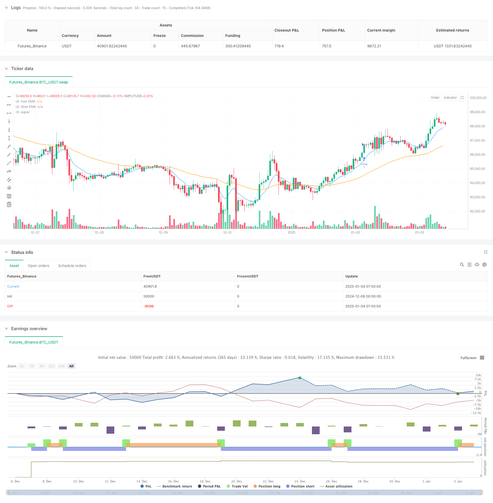

> Name

Daily trend judgment analysis of dynamic filtering moving average crossing strategy-Dynamic-Filtering-EMA-Cross-Strategy-for-Daily-Trend-Analysis
> Author

ChaoZhang

> Strategy Description



[trans]
#### Overview
This strategy uses a dual moving average system for trend judgment and trading decisions, and identifies the beginning, continuation or end of the market trend through the relative position of the fast moving average and the slow moving average at a specific time point. The strategy checks the positional relationship between the fast EMA and the slow EMA at a fixed time every day. When the fast line is above the slow line, a long position is established, and when the fast line is below the slow line, a short position is established, thereby realizing trend following transactions.
#### Strategy Principle
The core of the strategy is to judge the trend based on two exponential moving averages (EMA) with different periods. The fast EMA (default period is 10) is more sensitive to price changes and can capture market trends faster; the slow EMA (default period is 50) reflects longer-term trends. The strategy checks the positional relationship between the two moving averages at the specified time of each trading day (default is 9:00), and uses the moving average crossover signals to determine the market trend direction and conduct transactions. When the fast EMA crosses above the slow EMA, it indicates that the short-term upward momentum has increased, and you should enter the market to go long; when the fast EMA crosses below the slow EMA, it indicates that the short-term downward momentum has increased, and you should enter the market to go short.
#### Strategic Advantages
1. The transaction logic is clear and simple, easy to understand and execute
2. Filter noise signals and reduce false transactions through daily fixed time checks
3. Use percentage position management to effectively control risks
4. Combined with the fast and slow moving averages, it can effectively capture the start and reversal of the trend.
5. The strategy parameters are highly adjustable and suitable for different market environments.
6. High degree of automation, no manual intervention required
#### Strategy Risk
1. A volatile market may result in frequent transactions and increase transaction costs.
2. Fixed entry timing may miss important price changes
3. The moving average system has hysteresis, which may cause delays in entry or exit.
4. Large retracements may occur in violently volatile markets
5. Improper parameter selection may affect strategy performance
#### Strategy optimization direction
1. Introduce volatility indicators to adjust positions during periods of high volatility
2. Add trend confirmation indicators, such as MACD or RSI, to improve signal reliability
3. Optimize the entry time mechanism and consider dynamically adjusting the inspection time according to market characteristics.
4. Add a stop-loss and stop-profit mechanism to better control risks
5. Consider adding transaction volume analysis to improve signal quality
6. Develop an adaptive parameter mechanism to make the strategy more flexible
#### Summary
This strategy implements a simple and effective trend following trading system by combining a fast and slow dual moving average system and a fixed time check mechanism. The advantage of the strategy is clear logic and high degree of automation, but it also has limitations such as moving average lag and fixed time entry. There is still room for improvement in the strategy by introducing additional technical indicators, optimizing parameter selection mechanisms and adding risk control means. Overall, this is a basic strategic framework with practical value that can be further improved and optimized according to specific needs. ||
#### Overview
This strategy employs a dual moving average system for trend determination and trading decisions, utilizing the relative position of fast and slow exponential moving averages (EMAs) at specific time points to identify trend initiation, continuation, or termination. The strategy checks the relationship between fast and slow EMAs at a fixed time daily, establishing long positions when the fast line is above the slow line and short positions when it's below.

#### Strategy Principle
The core of the strategy is based on two EMAs with different periods for trend determination. The fast EMA (default period 10) is more sensitive to price changes, capable of capturing market movements quickly; the slow EMA (default period 50) reflects longer-term trends. The strategy checks the position relationship between these two lines at a specified time each trading day (default 9:00), using EMA crossover signals to determine market trend direction and execute trades. A long position is entered when the fast EMA crosses above the slow EMA, indicating strengthening upward momentum, while a short position is entered when the fast EMA crosses below the slow EMA, indicating strengthening downward momentum.

#### Strategy Advantages
1. Clear and simple trading logic, easy to understand and execute
2. Filters noise signals through daily fixed-time checks, reducing false trades
3. Employs percentage-based position sizing for effective risk control
4. Combines fast and slow moving averages to effectively capture trend initiation and reversal
5. Highly adjustable strategy parameters, suitable for different market environments
6. High degree of automation, requiring no manual intervention

#### Strategy Risks
1. May generate frequent trades in choppy markets, increasing transaction costs
2. Fixed entry timing might miss important price movements
3. Moving average systems have inherent lag, potentially causing delayed entries or exits
4. May experience significant drawdowns in highly volatile markets
5. Improper parameter selection can affect strategy performance

#### Strategy Optimization Directions
1. Incorporate volatility indicators to adjust position sizing during high volatility periods
2. Add trend confirmation indicators like MACD or RSI to improve signal reliability
3. Optimize entry timing mechanism, considering dynamic time checks based on market characteristics
4. Add stop-loss and take-profit mechanisms for better risk control
5. Consider incorporating volume analysis to improve signal quality
6. Develop adaptive parameter mechanisms for increased flexibility

#### Summary
The strategy achieves a simple yet effective trend-following trading system by combining a dual EMA system with fixed-time check mechanisms. Its strengths lie in clear logic and high automation, though it faces limitations from moving average lag and fixed entry timing. There remains significant room for improvement through the introduction of additional technical indicators, optimization of parameter selection mechanisms, and enhanced risk control measures. Overall, this represents a practical basic strategy framework that can be further refined and optimized according to specific requirements.[/trans]


> Source (PineScript)

``` pinescript
/*backtest
start: 2024-12-06 00:00:00
end: 2025-01-04 08:00:00
period: 1h
basePeriod: 1h
exchanges: [{"eid":"Futures_Binance","currency":"BTC_USDT"}]
*/

//@version=5
strategy("Daily EMA Comparison Strategy", shorttitle="Daily EMA cros Comparison", overlay=true)

//------------------------------------------------------------------------------
// Inputs
//------------------------------------------------------------------------------
fastEmaLength = input.int(10, title="Fast EMA Length", minval=1)  // Fast EMA period
slowEmaLength = input.int(50, title="Slow EMA Length", minval=1)  // Slow EMA period
checkHour = input.int(9, title="Check Hour (24h format)", minval=0, maxval=23)  // Hour to check
checkMinute = input.int(0, title="Check Minute", minval=0, maxval=59)  // Minute to check

//------------------------------------------------------------------------------
// EMA Calculation
//------------------------------------------------------------------------------
fastEMA = ta.ema(close, fastEmaLength)
slowEMA = ta.ema(close, slowEmaLength)

//------------------------------------------------------------------------------
// Time Check
//------------------------------------------------------------------------------
// Get the current bar's time in the exchange's timezone
currentTime = timestamp("GMT-0", year, month, dayofmonth, checkHour, checkMinute)
// Check if the bar's time equals or passes the daily check time
isCheckTime = (time >= currentTime and time < currentTime + 60 * 1000)  // 1-minute tolerance

//------------------------------------------------------------------------------
// Entry Conditions
//------------------------------------------------------------------------------
// Buy if Fast EMA is above Slow EMA at the specified time
buyCondition = isCheckTime and fastEMA > slowEMA

// Sell if Fast EMA is below Slow EMA at the specified time
sellCondition = isCheckTime and fastEMA < slowEMA

//------------------------------------------------------------------------------
// Strategy Execution
//------------------------------------------------------------------------------
// Enter Long
if buyCondition
    strategy.entry("Long", strategy.long)

// Enter Short
if sellCondition
    strategy.entry("Short", strategy.short)

//------------------------------------------------------------------------------
// Plot EMAs
//------------------------------------------------------------------------------
plot(fastEMA, color=color.blue, title="Fast EMA")
plot(slowEMA, color=color.orange, title="Slow EMA")

```

> Detail

https://www.fmz.com/strategy/477524

> Last Modified

2025-01-06 11:16:35
