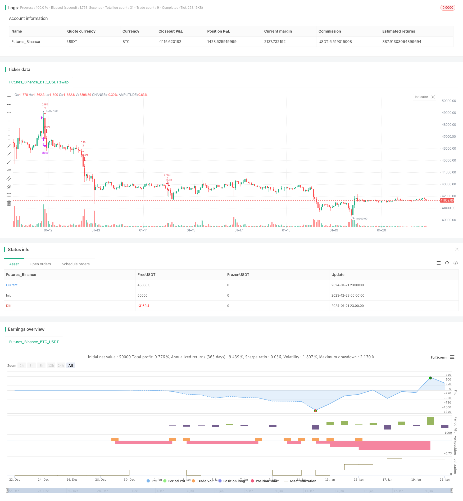

> Name

Based on Dynamic Grid Trading StrategyDynamic-Grid-Trading-Strategy
> Author

ChaoZhang

> Strategy Description


 [trans]

### Overview
This strategy realizes grid trading by setting multiple parallel buy and sell orders within the price range, and adjusts the grid range and lines according to market fluctuations to achieve profitability.
### Strategy Principles
1. Set the upper and lower bounds of the grid, which can be set manually or automatically calculated based on the high and low prices in the recent period.
2. Calculate the width of the grid interval based on the set number of grids.
3. Generate a grid line price array of the corresponding quantity.
4. When the price is lower than a certain grid line, open a long order below the line; when the price is higher than a certain grid line, close a short order above the line.
5. Dynamically adjust the upper and lower bounds of the grid, interval width and grid line price to adapt to market changes.
### Advantage Analysis
1. Able to achieve stable profits in sideways and volatile markets, without being affected by unilateral market conditions.
2. Supports manual setting and automatic calculation of grid intervals, with strong adaptability.  
3. You can optimize the income by adjusting the number of grids, grid width and commission volume.
4. Built-in position control can control risks.
5. Supports dynamic adjustment of the grid range, making the strategy highly adaptable.
### Risk Analysis
1. When a large trend occurs, large losses may occur.
2. Improper grid number and position settings may lead to risk amplification.
3. The automatic calculation of the grid interval may fail in extreme market conditions.
Risk solutions:
1. Optimize grid parameters and strictly control the total position.  
2. Close the strategy before the big market moves.
3. Use trend indicators to judge the market situation and close the strategy when necessary.
### Optimization direction
1. Select the optimal number of grids based on market characteristics and fund size.
2. Test the automatic calculation parameters of the optimized grid in different time periods.  
3. Optimize the calculation method of commission quantity to obtain more stable income.
4. Combine with other indicators to judge the sharp market trend and set the closing conditions of the strategy.
### Summarize
This dynamic grid trading strategy adapts to market changes by dynamically adjusting grid interval parameters to achieve profits in sideways and volatile markets. At the same time, setting appropriate position controls can control risks. The stability of the strategy can be further improved by optimizing grid parameters and combining trend judgment indicators.
||

### Overview  

This strategy implements grid trading by placing multiple parallel buy and sell orders within a price range. It adjusts the grid range and lines based on market fluctuations to profit.  

### Strategy Logic  

1. Set upper and lower bounds of the grid, which can be manually configured or automatically calculated based on recent high and low prices.  
2. Calculate grid interval width according to specified number of grid lines.  
3. Generate grid line prices array with corresponding quantity.   
4. When price drops below a grid line, open long order below it; when price rises above a grid line, close short order above it.   
5. Dynamically adjust bounds, interval width and grid line prices to adapt the strategy to market changes.   

### Advantage Analysis 

1. Can steadily profit in range-bound and volatile market, regardless of trend direction.   
2. Supports both manual and automatic parameter settings for strong adaptability.     
3. Optimizable parameters like grid quantity, interval width and order size for better reward. 
4. Embedded position control for lower risk.     
5. Dynamic grid range adjustment enhances adaptability.  

### Risk Analysis  

1. Severe loss may occur in strong trending market.  
2. Improper grid quantity and position settings may amplify risk.   
3. Auto calculated grid range may fail in extreme price swings.  

Risk Management:
1. Optimize grid parameters and strictly control total position.
2. Close strategy before significant price move.  
3. Judge market condition with trend indicators, close strategy when necessary.   

### Optimization Directions  

1. Choose optimal grid quantity based on market character and capital scale.  
2. Test different periods to optimize auto parameters.   
3. Optimize order size calculation for more steady reward.  
4. Add indicators for trend identification and strategy close conditions.  

### Summary   

The dynamic grid trading strategy adapts to the market by adjusting grid parameters. It profits in range-bound and volatile market. With proper position control, the risk is mitigated. Optimizing grid settings and incorporating trend judgment indicators can further improve the strategy's stability.  

[/trans]

> Strategy Arguments


|Argument|Default|Description|
|----|----|----|
|v_input_1|true|(?Grid Bounds)Use Auto Bounds?|
|v_input_2|0|(Auto) Bound Source: Hi & Low|Average|
|v_input_3|250|(Auto) Bound Lookback|
|v_input_4|0.1|(Auto) Bound Deviation|
|v_input_5|0.285|(Auto) Upper Boundry|
|v_input_6|0.225|(Auto) Lower Boundry|
|v_input_7|8|(?Grid Lines)Grid Line Quantity|


> Source (PineScript)

``` pinescript
/*backtest
start: 2023-12-23 00:00:00
end: 2024-01-22 00:00:00
period: 1h
basePeriod: 15m
exchanges: [{"eid":"Futures_Binance","currency":"BTC_USDT"}]
*/

//@version=4
strategy("sarasa srinivasa kumar", overlay=true, pyramiding=14, close_entries_rule="ANY", default_qty_type=strategy.cash, initial_capital=100.0, currency="USD", commission_type=strategy.commission.percent, commission_value=0.1)
i_autoBounds    = input(group="Grid Bounds", title="Use Auto Bounds?", defval=true, type=input.bool)                             // calculate upper and lower bound of the grid automatically? This will theorhetically be less profitable, but will certainly require less attention
i_boundSrc      = input(group="Grid Bounds", title="(Auto) Bound Source", defval="Hi & Low", options=["Hi & Low", "Average"])     // should bounds of the auto grid be calculated from recent High & Low, or from a Simple Moving Average
i_boundLookback = input(group="Grid Bounds", title="(Auto) Bound Lookback", defval=250, type=input.integer, maxval=500, minval=0) // when calculating auto grid bounds, how far back should we look for a High & Low, or what should the length be of our sma
i_boundDev      = input(group="Grid Bounds", title="(Auto) Bound Deviation", defval=0.10, type=input.float, maxval=1, minval=-1)  // if sourcing auto bounds from High & Low, this percentage will (positive) widen or (negative) narrow the bound limits. If sourcing from Average, this is the deviation (up and down) from the sma, and CANNOT be negative.
i_upperBound    = input(group="Grid Bounds", title="(Auto) Upper Boundry", defval=0.285, type=input.float)                      // for manual grid bounds only. The upperbound price of your grid
i_lowerBound    = input(group="Grid Bounds", title="(Auto) Lower Boundry", defval=0.225, type=input.float)                      // for manual grid bounds only. The lowerbound price of your grid.
i_gridQty       = input(group="Grid Lines",  title="Grid Line Quantity", defval=8, maxval=15, minval=3, type=input.integer)       // how many grid lines are in your grid

f_getGridBounds(_bs, _bl, _bd, _up) =>
    if _bs == "Hi & Low"
        _up ? highest(close, _bl) * (1 + _bd) : lowest(close, _bl)  * (1 - _bd)
    else
        avg = sma(close, _bl)
        _up ? avg * (1 + _bd) : avg * (1 - _bd)

f_buildGrid(_lb, _gw, _gq) =>
    gridArr = array.new_float(0)
    for i=0 to _gq-1
        array.push(gridArr, _lb+(_gw*i))
    gridArr

f_getNearGridLines(_gridArr, _price) =>
    arr = array.new_int(3)
    for i = 0 to array.size(_gridArr)-1
        if array.get(_gridArr, i) > _price
            array.set(arr, 0, i == array.size(_gridArr)-1 ? i : i+1)
            array.set(arr, 1, i == 0 ? i : i-1)
            break
    arr

var upperBound      = i_autoBounds ? f_getGridBounds(i_boundSrc, i_boundLookback, i_boundDev, true) : i_upperBound  // upperbound of our grid
var lowerBound      = i_autoBounds ? f_getGridBounds(i_boundSrc, i_boundLookback, i_boundDev, false) : i_lowerBound // lowerbound of our grid
var gridWidth       = (upperBound - lowerBound)/(i_gridQty-1)                                                       // space between lines in our grid
var gridLineArr     = f_buildGrid(lowerBound, gridWidth, i_gridQty)                                                 // an array of prices that correspond to our grid lines
var orderArr        = array.new_bool(i_gridQty, false)                                                              // a boolean array that indicates if there is an open order corresponding to each grid line

var closeLineArr    = f_getNearGridLines(gridLineArr, close)                                                        // for plotting purposes - an array of 2 indices that correspond to grid lines near price
var nearTopGridLine = array.get(closeLineArr, 0)                                                                    // for plotting purposes - the index (in our grid line array) of the closest grid line above current price
var nearBotGridLine = array.get(closeLineArr, 1)                                                                    // for plotting purposes - the index (in our grid line array) of the closest grid line below current price
strategy.initial_capital = 50000
for i = 0 to (array.size(gridLineArr) - 1)
    if close < array.get(gridLineArr, i) and not array.get(orderArr, i) and i < (array.size(gridLineArr) - 1)
        buyId = i
        array.set(orderArr, buyId, true)
        strategy.entry(id=tostring(buyId), long=true, qty=(strategy.initial_capital/(i_gridQty-1))/close, comment="#"+tostring(buyId))
    if close > array.get(gridLineArr, i) and i != 0
        if array.get(orderArr, i-1)
            sellId = i-1
            array.set(orderArr, sellId, false)
            strategy.close(id=tostring(sellId), comment="#"+tostring(sellId))

if i_autoBounds
    upperBound  := f_getGridBounds(i_boundSrc, i_boundLookback, i_boundDev, true)
    lowerBound  := f_getGridBounds(i_boundSrc, i_boundLookback, i_boundDev, false)
    gridWidth   := (upperBound - lowerBound)/(i_gridQty-1)
    gridLineArr := f_buildGrid(lowerBound, gridWidth, i_gridQty)

closeLineArr    := f_getNearGridLines(gridLineArr, close)
nearTopGridLine := array.get(closeLineArr, 0)
nearBotGridLine := array.get(closeLineArr, 1)


```

> Detail

https://www.fmz.com/strategy/439698

> Last Modified

2024-01-23 10:53:05
