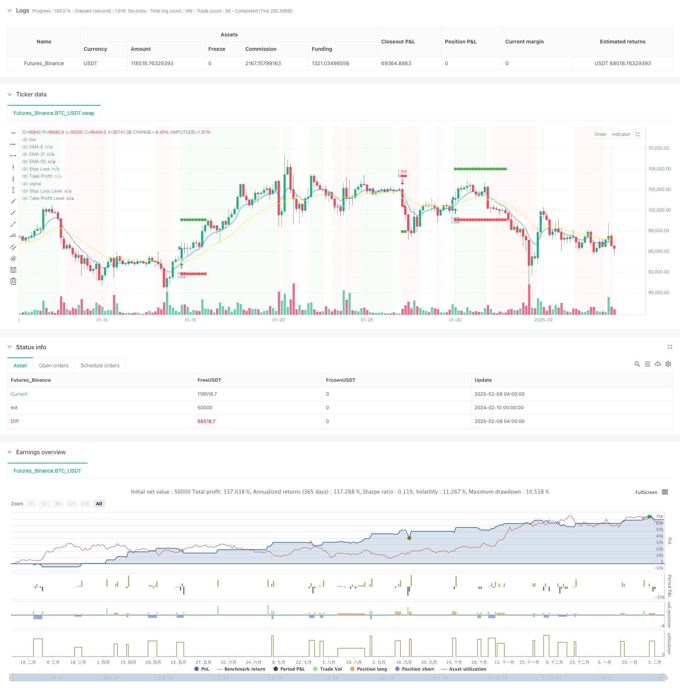

> Name

Dynamic-Indicator-Driven-Trend-Following-Strategy-with-Risk-Management-System
> Author

ChaoZhang

> Strategy Description



[trans]
#### Overview
This is a trend following strategy based on multiple technical indicators and risk management. This strategy comprehensively uses multiple technical indicators such as moving averages, relative strength index (RSI), and trend indicator (DMI) to identify market trends, and protects the safety of funds through risk control methods such as dynamic stop loss, position management, and maximum monthly drawdown limits. The core of the strategy is to confirm the validity of the trend through multi-dimensional technical indicators while strictly controlling risk exposure.
#### Strategy Principle
The strategy adopts a multi-level trend confirmation mechanism:
1. Determine the trend direction through the 8/21/50 period exponential moving average (EMA)
2. Use the price channel midline as a trend filter
3. Combine with the movement of the RSI moving average (5 periods) in the 35-65 range to filter out false breakthroughs
4. Confirm trend strength through DMI indicator (14 periods)
5. Use momentum indicators (8 periods) and volume amplification to verify the continuity of the trend
6. Use ATR-based dynamic stop loss to control risk
7. Implement position management with a fixed risk model, and the risk limit for each transaction is 5% of the initial capital.
8. Set a maximum monthly drawdown limit of 10% to avoid excessive losses
#### Strategic Advantages
1. Cross-validation of multiple technical indicators improves the accuracy of trend judgment
2. Dynamic stop loss mechanism effectively controls single transaction risk
3. The fixed-risk position management method makes the utilization of funds more reasonable.
4. The maximum monthly drawdown limit provides systemic risk protection
5. Combined with trading volume indicators, it enhances the reliability of trend confirmation.
6. The profit-loss ratio setting of 2:1 improves long-term profitability
#### Strategy Risk
1. The use of multiple indicators may cause signal lag
2. Frequent false signals may occur in volatile markets
3. Fixed risk models may not be flexible enough when volatility changes drastically
4. Monthly drawdown limits may result in missing important trading opportunities
5. May suffer a larger retracement when the trend reverses
#### Strategy optimization direction
1. Introduce adaptive indicator parameters to adapt to different market environments
2. Develop more flexible position management solutions that take into account changes in market volatility
3. Increase quantitative assessment of trend strength and optimize entry timing
4. Design a smarter monthly risk limit mechanism
5. Add the market environment identification module to adjust strategy parameters under different market conditions
#### Summary
This strategy establishes a relatively complete trend tracking trading system through the comprehensive use of multi-dimensional technical indicators. The strength of the strategy is its comprehensive risk management framework, including dynamic stops, position management and drawdown control. Although there is a certain degree of hysteresis risk, through optimization and improvement, the strategy is expected to maintain stable performance in different market environments. The key is to maintain the core logic of the strategy while enhancing its adaptability to the market environment. ||
#### Overview
This is a trend-following strategy based on multiple technical indicators and risk management. The strategy combines moving averages, Relative Strength Index (RSI), Directional Movement Index (DMI), and other technical indicators to identify market trends, while protecting capital through dynamic stop-loss, position management, and monthly maximum drawdown limits. The core concept lies in confirming trend validity through multi-dimensional technical indicators while strictly controlling risk exposure.

#### Strategy Principles
The strategy employs a multi-layered trend confirmation mechanism:
1. Uses 8/21/50 period Exponential Moving Averages (EMA) to determine trend direction
2. Utilizes price channel midline as a trend filter
3. Incorporates RSI moving average (5-period) movement within 35-65 range to filter false breakouts
4. Confirms trend strength through DMI indicator (14-period)
5. Verifies trend continuation using momentum indicator (8-period) and volume expansion
6. Implements ATR-based dynamic stop-loss for risk control
7. Applies fixed-risk position sizing with 5% risk per trade of initial capital
8. Sets 10% monthly maximum drawdown limit to prevent excessive losses

#### Strategy Advantages
1. Multiple technical indicators cross-validation improves trend judgment accuracy
2. Dynamic stop-loss mechanism effectively controls single trade risk
3. Fixed-risk position sizing enables more rational capital utilization
4. Monthly maximum drawdown limit provides systemic risk protection
5. Volume indicator integration enhances trend confirmation reliability
6. 2:1 reward-to-risk ratio improves long-term profitability

#### Strategy Risks
1. Multiple indicators may lead to signal lag
2. May generate frequent false signals in ranging markets
3. Fixed-risk approach may lack flexibility during dramatic volatility changes
4. Monthly drawdown limit might cause missing important trading opportunities
5. May experience significant drawdowns during trend reversals

#### Strategy Optimization Directions
1. Introduce adaptive indicator parameters to suit different market environments
2. Develop more flexible position sizing schemes considering volatility changes
3. Add quantitative trend strength assessment to optimize entry timing
4. Design smarter monthly risk limit mechanisms
5. Include market environment recognition module to adjust strategy parameters under different market conditions

#### Summary
The strategy establishes a relatively complete trend-following trading system through the comprehensive use of multi-dimensional technical indicators. Its strength lies in the comprehensive risk management framework, including dynamic stop-loss, position sizing, and drawdown control. While there are certain lag risks, the strategy has the potential to maintain stable performance across different market environments through optimization and improvement. The key is to enhance its adaptability to market environments while maintaining the core strategy logic.[/trans]


> Source (PineScript)

``` pinescript
/*backtest
start: 2024-02-10 00:00:00
end: 2025-02-08 08:00:00
period: 4h
basePeriod: 4h
exchanges: [{"eid":"Futures_Binance","currency":"BTC_USDT"}]
*/

//@version=5
strategy("High Win-Rate Crypto Strategy with Drawdown Limit", overlay=true, initial_capital=10000, default_qty_type=strategy.fixed, process_orders_on_close=true)

// Moving Averages
ema8 = ta.ema(close, 8)
ema21 = ta.ema(close, 21)
ema50 = ta.ema(close, 50)

// RSI settings
rsi = ta.rsi(close, 14)
rsi_ma = ta.sma(rsi, 5)

// Momentum and Volume
mom = ta.mom(close, 8)
vol_ma = ta.sma(volume, 15)
high_vol = volume > vol_ma * 1

// Trend Strength
[diplus, diminus, _] = ta.dmi(14, 14)
strong_trend = diplus > 20 or diminus > 20

// Price channels
highest_15 = ta.highest(high, 15)
lowest_15 = ta.lowest(low, 15)
mid_channel = (highest_15 + lowest_15) / 2

// Trend Conditions
uptrend = ema8 > ema21 and close > mid_channel
downtrend = ema8 < ema21 and close < mid_channel

// Entry Conditions
longCondition = uptrend and ta.crossover(ema8, ema21) and rsi_ma > 35 and rsi_ma < 65 and mom > 0 and high_vol and diplus > diminus
shortCondition = downtrend and ta.crossunder(ema8, ema21) and rsi_ma > 35 and rsi_ma < 65 and mom < 0 and high_vol and diminus > diplus

// Dynamic Stop Loss based on ATR
atr = ta.atr(14)
stopSize = atr * 1.3

// Calculate position size based on fixed risk
riskAmount = strategy.initial_capital * 0.05

getLongPosSize(riskAmount, stopSize) => riskAmount / stopSize    
getShortPosSize(riskAmount, stopSize) => riskAmount / stopSize

// Monthly drawdown tracking
var float peakEquity = na
var int currentMonth = na
var float monthlyDrawdown = na
maxDrawdownPercent = 10

// Variables for SL and TP
var float stopLoss = na
var float takeProfit = na
var bool inTrade = false
var string tradeType = na

// Reset monthly metrics
monthNow = month(time)
if na(currentMonth) or currentMonth != monthNow
    currentMonth := monthNow
    peakEquity := strategy.equity
    monthlyDrawdown := 0.0

// Update drawdown metrics
peakEquity := math.max(peakEquity, strategy.equity)
monthlyDrawdown := math.max(monthlyDrawdown, (peakEquity - strategy.equity) / peakEquity * 100)

// Trading condition
canTrade = monthlyDrawdown < maxDrawdownPercent

// Entry and Exit Logic
if strategy.position_size == 0
    inTrade := false
    if longCondition and canTrade
        stopLoss := low - stopSize
        takeProfit := close + (stopSize * 2)
        posSize = getLongPosSize(riskAmount, stopSize)
        strategy.entry("Long", strategy.long, qty=posSize)
        strategy.exit("Long Exit", "Long", stop=stopLoss, limit=takeProfit)
        inTrade := true
        tradeType := "long"
    if shortCondition and canTrade
        stopLoss := high + stopSize
        takeProfit := close - (stopSize * 2)
        posSize = getShortPosSize(riskAmount, stopSize)
        strategy.entry("Short", strategy.short, qty=posSize)
        strategy.exit("Short Exit", "Short", stop=stopLoss, limit=takeProfit)
        inTrade := true
        tradeType := "short"

// Plot variables
plotSL = inTrade ? stopLoss : na
plotTP = inTrade ? takeProfit : na

// EMA Plots
plot(ema8, "EMA 8", color=color.blue, linewidth=1)
plot(ema21, "EMA 21", color=color.yellow, linewidth=1)
plot(ema50, "EMA 50", color=color.white, linewidth=1)

// SL and TP Plots
plot(plotSL, "Stop Loss", color=color.red, style=plot.style_linebr, linewidth=1)
plot(plotTP, "Take Profit", color=color.green, style=plot.style_linebr, linewidth=1)

// Signal Plots
plotshape(longCondition and canTrade, "Buy Signal", style=shape.triangleup, location=location.belowbar, color=color.green, size=size.small)
plotshape(shortCondition and canTrade, "Sell Signal", style=shape.triangledown, location=location.abovebar, color=color.red, size=size.small)

// SL/TP Markers with correct y parameter syntax
plot(inTrade ? stopLoss : na, "Stop Loss Level", style=plot.style_circles, color=color.red, linewidth=2)
plot(inTrade ? takeProfit : na, "Take Profit Level", style=plot.style_circles, color=color.green, linewidth=2)

// Background Color
noTradingMonth = monthlyDrawdown >= maxDrawdownPercent
bgcolor(noTradingMonth ? color.new(color.gray, 80) : uptrend ? color.new(color.green, 95) : downtrend ? color.new(color.red, 95) : na)

// Drawdown Label
var label drawdownLabel = na
label.delete(drawdownLabel)
drawdownLabel := label.new(bar_index, high, "Monthly Drawdown: " + str.tostring(monthlyDrawdown, "#.##") + "%\n" + (noTradingMonth ? "NO TRADING" : "TRADING ALLOWED"), style=label.style_label_down, color=noTradingMonth ? color.red : color.green, textcolor=color.white, size=size.small)
```

> Detail

https://www.fmz.com/strategy/481341

> Last Modified

2025-02-10 14:20:44
