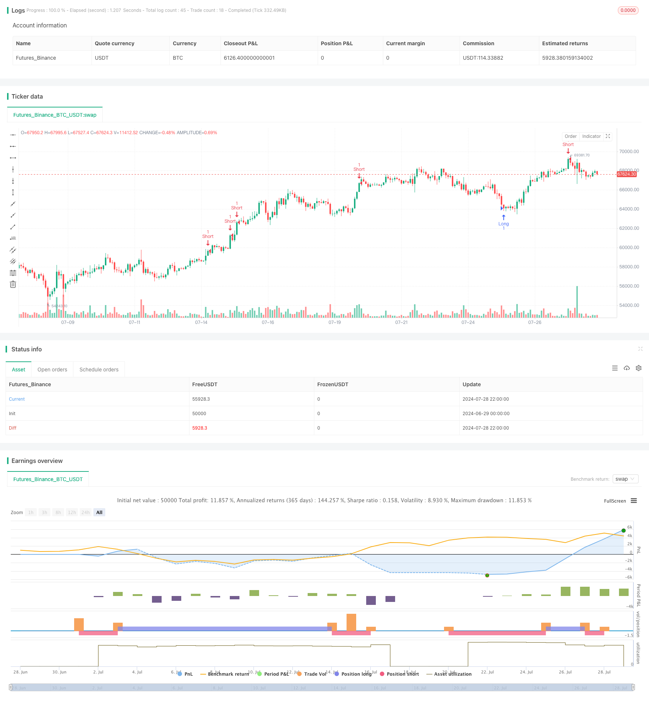

> Name

Dynamic mean reversion and momentum strategy-Dynamic-Mean-Reversion-and-Momentum-Strategy
> Author

ChaoZhang

> Strategy Description



[trans]
#### Overview
Dynamic mean reversion and momentum strategy is a quantitative trading strategy that combines the concepts of mean reversion and momentum. This strategy uses technical indicators such as the Relative Strength Index (RSI), Bollinger Bands, and Average True Range (ATR) to identify overbought and oversold conditions in the market, capturing opportunities for price reversion to the mean, while taking into account market momentum to achieve more robust trading decisions. The strategy also incorporates dynamic stop loss and take profit levels to adapt to changes in market volatility.
#### Strategy Principle
1. Mean reversion principle: The strategy uses Bollinger Bands to identify the extent to which prices deviate from the mean. When the price touches the lower band and the RSI is in the oversold area, it is considered a long signal; when the price touches the upper band and the RSI is in the overbought area, it is considered a short signal.
2. Momentum analysis: Evaluate price momentum through the RSI indicator. An RSI below 30 is considered oversold, and above 70 is considered overbought. This setup helps confirm the possibility of a price reversal.
3. Dynamic risk management: The strategy uses ATR to set dynamic stop loss and profit levels. This approach allows the strategy to adjust exposure to changes in market volatility.
4. Entry and exit logic:
   - Conditions for going long: the price is below the Bollinger Bands and the RSI is below 30
   - Short selling conditions: price is above the upper Bollinger Band and RSI is above 70
   - Stop loss setting: entry price plus or minus 2 times ATR
   - Profit setting: entry price plus or minus 2 times ATR
#### Strategic Advantages
1. Multiple confirmation mechanism: Combining Bollinger Bands and RSI to confirm trading signals, reducing the risk of false breakthroughs.
2. Adapt to market fluctuations: Dynamically adjust stop loss and profit levels through ATR so that the strategy can better adapt to different market conditions.
3. Balanced trading perspective: Taking into account mean reversion and momentum factors simultaneously, it provides a more comprehensive market analysis.
4. Risk management integration: Built-in stop-loss and profit-taking mechanisms help control the risk of each transaction.
5. Flexibility: Strategy parameters can be optimized and adjusted according to different markets and time frames.
#### Strategy Risk
1. False signal risk: In a sideways market, frequent false signals may occur, leading to over-trading.
2. Trending market performance: In a strong trending market, the mean reversion strategy may frequently encounter stop losses.
3. Parameter sensitivity: Strategy performance may be highly sensitive to the parameter settings of RSI, Bollinger Bands and ATR.
4. Slippage and liquidity risk: In volatile or illiquid markets, you may face serious slippage problems.
5. Systemic risk: Reliance entirely on technical indicators may ignore the impact of fundamental factors on the market.
#### Strategy optimization direction
1. Introduce trend filters: such as adding moving averages or MACD indicators to identify the general trend direction and avoid counter-trend trading in strong trends.
2. Optimize parameter selection: Find the optimal parameter combination by backtesting different time periods and market environments.
3. Introduce volume analysis: Integrate volume indicators, such as OBV or CMF, to enhance signal reliability.
4. Improve risk management: Consider using a percentage risk model instead of a fixed ATR multiple to better control risk on each trade.
5. Add time filtering: Introduce trading time window restrictions to avoid periods of greater volatility or poor liquidity.
6. Consider fundamental factors: Add consideration of important economic data or events into the strategy to improve the comprehensiveness of the strategy.
#### Summarize
The Dynamic Mean Reversion and Momentum Strategy is a comprehensive trading system that combines multiple technical analysis concepts. Through the synergy of Bollinger Bands, RSI and ATR, this strategy is designed to capture trading opportunities in price fluctuations while providing a dynamic risk management mechanism. Although the strategy has shown certain advantages, such as the reliability of signal confirmation and adaptability to market fluctuations, there are still some potential risks, such as false signals and parameter sensitivity.
In order to further improve the robustness and performance of the strategy, you can consider introducing trend filters, optimizing parameter selection, adding trading volume analysis and other improvement measures. In addition, combining fundamental analysis with more sophisticated risk management methods can help strategies stay competitive in different market environments.
Overall, this strategy provides traders with an interesting starting point and, with continued optimization and tweaking, has the potential to become a reliable trading system. However, in practical application, traders need to carefully evaluate the performance of the strategy under different market conditions and make appropriate adjustments based on personal risk tolerance and trading goals.
|| 

#### Overview

The Dynamic Mean Reversion and Momentum Strategy is a quantitative trading approach that combines mean reversion and momentum concepts. This strategy utilizes technical indicators such as the Relative Strength Index (RSI), Bollinger Bands (BB), and Average True Range (ATR) to identify overbought and oversold market conditions, capture opportunities for price reversion to the mean, while also considering market momentum to make more robust trading decisions. The strategy also incorporates dynamic stop-loss and take-profit levels to adapt to changes in market volatility.

#### Strategy Principles

1. Mean Reversion Principle: The strategy uses Bollinger Bands to identify the degree of price deviation from the mean. A long signal is generated when the price touches the lower band and the RSI is in the oversold zone; a short signal is generated when the price touches the upper band and the RSI is in the overbought zone.

2. Momentum Analysis: The RSI indicator is used to assess price momentum. An RSI below 30 is considered oversold, while above 70 is considered overbought. This setup helps confirm the likelihood of price reversals.

3. Dynamic Risk Management: The strategy employs ATR to set dynamic stop-loss and take-profit levels. This approach allows the strategy to adjust risk exposure based on changes in market volatility.

4. Entry and Exit Logic:
   - Long Condition: Price below the lower Bollinger Band and RSI below 30
   - Short Condition: Price above the upper Bollinger Band and RSI above 70
   - Stop-Loss Setting: Entry price plus or minus 2 times ATR
   - Take-Profit Setting: Entry price plus or minus 2 times ATR

#### Strategy Advantages

1. Multiple Confirmation Mechanism: Combining Bollinger Bands and RSI for trade signal confirmation reduces the risk of false breakouts.

2. Adaptation to Market Volatility: Dynamic adjustment of stop-loss and take-profit levels through ATR enables the strategy to better adapt to different market conditions.

3. Balanced Trading Perspective: Considering both mean reversion and momentum factors provides a more comprehensive market analysis.

4. Integrated Risk Management: Built-in stop-loss and take-profit mechanisms help control risk for each trade.

5. Flexibility: Strategy parameters can be optimized and adjusted for different markets and time frames.

#### Strategy Risks

1. False Signal Risk: In ranging markets, frequent false signals may lead to overtrading.

2. Performance in Trending Markets: Mean reversion strategies may frequently encounter stop-losses in strong trending markets.

3. Parameter Sensitivity: Strategy performance may be highly sensitive to RSI, Bollinger Bands, and ATR parameter settings.

4. Slippage and Liquidity Risk: In highly volatile or illiquid markets, significant slippage issues may arise.

5. Systematic Risk: Relying solely on technical indicators may overlook the impact of fundamental factors on the market.

#### Strategy Optimization Directions

1. Introduce Trend Filters: Add indicators like moving averages or MACD to identify broader trend directions and avoid counter-trend trading in strong trends.

2. Optimize Parameter Selection: Conduct backtests across different time periods and market environments to find optimal parameter combinations.

3. Incorporate Volume Analysis: Integrate volume indicators such as OBV or CMF to enhance signal reliability.

4. Improve Risk Management: Consider using a percentage risk model instead of fixed ATR multiples to better control risk for each trade.

5. Add Time Filters: Introduce trading time window restrictions to avoid periods of high volatility or low liquidity.

6. Consider Fundamental Factors: Incorporate consideration of important economic data or events into the strategy to improve comprehensiveness.

#### Conclusion

The Dynamic Mean Reversion and Momentum Strategy is a comprehensive trading system that combines multiple technical analysis concepts. Through the synergy of Bollinger Bands, RSI, and ATR, this strategy aims to capture trading opportunities in price fluctuations while providing dynamic risk management mechanisms. While the strategy demonstrates certain advantages, such as reliability in signal confirmation and adaptability to market volatility, it still faces potential risks like false signals and parameter sensitivity.

To further enhance the strategy's robustness and performance, considerations can be made to introduce trend filters, optimize parameter selection, and incorporate volume analysis. Additionally, integrating fundamental analysis and more refined risk management methods can help the strategy maintain competitiveness across different market environments.

Overall, this strategy provides traders with an interesting starting point that has the potential to evolve into a reliable trading system through continuous optimization and adjustment. However, in practical application, traders need to carefully evaluate the strategy's performance under different market conditions and make appropriate adjustments based on individual risk tolerance and trading objectives.

[/trans]


> Source (PineScript)

``` pinescript
/*backtest
start: 2024-06-29 00:00:00
end: 2024-07-29 00:00:00
period: 2h
basePeriod: 15m
exchanges: [{"eid":"Futures_Binance","currency":"BTC_USDT"}]
*/

// This Pine Script™ code is subject to the terms of the Mozilla Public License 2.0 at https://mozilla.org/MPL/2.0/
// © baranbay

//@version=5
strategy("BARONES - Mean Reversion and Momentum Strategy", overlay=true)

// İndikatör parametreleri
rsi_length = input.int(14, title="RSI Length")
rsi_overbought = input.int(70, title="RSI Overbought Level")
rsi_oversold = input.int(30, title="RSI Oversold Level")
bb_length = input.int(20, title="Bollinger Bands Length")
bb_mult = input.float(2.0, title="Bollinger Bands Multiplier")

// RSI ve Bollinger Bantları hesaplama
rsi = ta.rsi(close, rsi_length)
basis = ta.sma(close, bb_length)
dev = bb_mult * ta.stdev(close, bb_length)
upper = basis + dev
lower = basis - dev

// Giriş ve çıkış sinyalleri
if (close < lower and rsi < rsi_oversold)
    strategy.entry("Long", strategy.long)
if (close > upper and rsi > rsi_overbought)
    strategy.entry("Short", strategy.short)

// Dinamik stop-loss seviyeleri (ATR kullanarak)
atr_length = input.int(14, title="ATR Length")
atr = ta.atr(atr_length)
stop_loss_long = close - 2 * atr
take_profit_long = close + 2 * atr
stop_loss_short = close + 2 * atr
take_profit_short = close - 2 * atr

// Kar ve zarar durdurma seviyeleri
strategy.exit("Take Profit/Stop Loss", "Long", limit=take_profit_long, stop=stop_loss_long)
strategy.exit("Take Profit/Stop Loss", "Short", limit=take_profit_short, stop=stop_loss_short)

```

> Detail

https://www.fmz.com/strategy/458145

> Last Modified

2024-07-30 12:12:27
