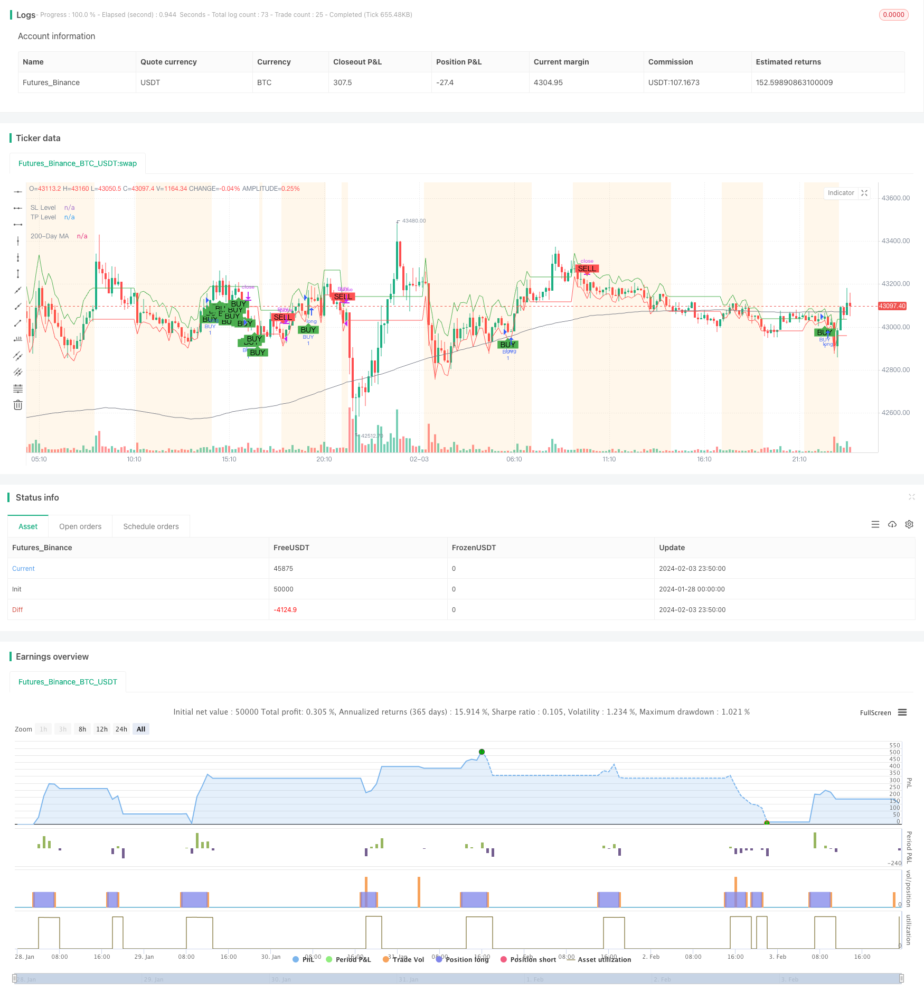

> Name

Dynamic-Moving-Average-Crossover-Combo-Strategy
> Author

ChaoZhang

> Strategy Description


[trans]
## Overview
The Dynamic Moving Average Crossover Combo Strategy is a compound trading strategy that integrates multiple technical indicators and market stage detection. It dynamically calculates the volatility of the market and determines the three stages of the market based on the distance and volatility between the price and the long-term moving average: shock, trend and consolidation. In different market stages, the strategy adopts different market entry and exit rules, and combines multiple indicators such as EMA/SMA crossover, MACD and Bollinger Bands to issue buy and sell signals.
## Strategy Principle
### Calculate market volatility
Calculate the market's intraday volatility over the last 14 days using the ATR (Average True Range) indicator. Then filter with the 100-day simple moving average to get the average volatility.
### Determine the market stage
Calculate the price's distance from the 200-day simple moving average. If the distance exceeds 1.5 times the average volatility and the direction is clear, it is judged to be a trend market. If the current volatility exceeds 1.5 times the average volatility, it is judged to be a volatile market.
### EMA/SMA Crossover
The fast EMA period is 10 days, and the slow SMA period is 30 days. When the fast EMA crosses above the slow SMA, a buy signal is generated.
### MACD

Calculate 12, 26, and 9 parameter MACD. A buy signal is generated when the MACD histogram turns positive.
### Bollinger Bands

Calculate the standard deviation Channel within 20 days. If the Channel width is smaller than its own 20-day SMA, it is judged to be a consolidation period.
### Admission rules
During the shock period: when the fast and slow lines cross or the MACD column turns positive, and the closing price is within the Bollinger Bands, enter the market to go long.
Trend period: When the fast and slow lines cross or the MACD column becomes positive, enter the market to do long.
During the consolidation period: when the fast and slow lines cross, and the closing price is higher than the Lower Band, enter the market to go long.
### Rules of appearance
If the following conditions are met, the position will be closed: MACD has been negative for two consecutive K lines, and the closing price has fallen for two consecutive days.
Shock period: In addition, when StockRSI enters the overbought zone, it will exit the market.
Consolidation period: In addition, when the price is lower than the Upper Band, it will exit the market.
## Advantage Analysis
This is an intelligent trading strategy based on market environment judgment and has the following advantages:
1. Systematic operation to reduce subjective intervention.
2. Adjust the strategy parameters based on the market environment to make it more adaptable.
3. Multiple indicator combinations to increase signal certainty.
4. Bollinger Bands automatically stop losses and reduce risks.
5. Comprehensive condition judgment and filtering out false signals.
6. Dynamic stop loss and profit, follow the trend to make profits.
## Risk Analysis
The main risks are as follows:
1. Improper parameter settings may cause the strategy to fail. It is recommended to optimize the parameter combination.
2. Unexpected events cause model failure. It is recommended to update the strategy logic in time.
3. Transaction fees compress profit margins. It is recommended to choose a broker with low handling fees.
4. Multi-indicator combination increases strategy complexity. It is recommended to choose core indicators.
## Optimization direction
You can continue to optimize from the following dimensions:
1. Optimize market environment judgment standards and improve accuracy.
2. Add a machine learning module to realize parameter adaptation.
3. Combine text processing to determine major event risks.
4. Multi-market backtesting to find the best combination parameters.
5. Add the trailing stop strategy of taking profit.
## Summarize
The dynamic moving average crossover strategy is a multi-indicator intelligent trading strategy. It can adjust parameters in combination with the market environment and realize conditional systematic transactions. It has strong adaptability and certainty. However, caution is required in parameter settings and new modules to avoid increasing the complexity of the strategy. Overall, this is a feasible quantitative strategy idea.
||

## Overview

The Dynamic Moving Average Crossover Combo Strategy is a combined trading strategy that integrates multiple technical indicators and market condition detections. It dynamically calculates the market volatility and determines three market phases based on the price distance from the long term moving average and volatility: volatile, trending and consolidating. Under different market conditions, the strategy adopts different entry and exit rules and generates buy and sell signals with a combination of indicators like EMA/SMA crossover, MACD and Bollinger Bands.  

## Strategy Logic  

### Calculate Market Volatility  

Use ATR indicator to measure the market volatility of recent 14 days. Then apply a 100-day SMA filter to get the average volatility.

### Determine Market Phases  

Calculate the distance between price and 200-day SMA. If the absolute distance exceeds 1.5 times of average volatility with a clear direction, it is determined as a trending market. If current volatility exceeds 1.5 times of average, it is a volatile market.  

### EMA/SMA Crossover  

Fast EMA period is 10 days. Slow SMA period is 30 days. A buying signal is generated when fast EMA crosses above slow SMA.

### MACD  

Calculate MACD with 12, 26, 9 parameters. A positive MACD histogram gives buying signal.  

### Bollinger Bands  

Calculate 20-day standard deviation channel. If channel width is smaller than 20-day SMA of itself, it is consolidating.   

### Entry Rules  

Volatile: Enter long when crossover or MACD positive with price inside bands.  

Trending: Enter long when crossover or MACD positive.  

Consolidating: Enter long when crossover and price above lower band.

### Exit Rules

General: Exit when MACD negative for 2 bars and price drops 2 days. 

Volatile: Plus exit when StockRSI overbought.  

Consolidating: Plus exit when price below upper band.

## Advantages  

The strategy has the following strengths:

1. Systematic operations with less subjective interventions.  

2. Adaptive parameters adjusted based on market conditions.  

3. Higher signal accuracy with multiple indicator combo.  

4. Lower risk with Bollinger Bands auto stop loss.

5. All rounded condition filtering to avoid false signals.  

6. Dynamic stop loss and take profit to follow trends.

## Risks

The main risks are:

1. Invalid strategy if improper parameter tuning. Optimization suggested.

2. Model failure due to sudden events. Logic update recommended.  

3. Compressed profit margin from trading cost. Low commission broker advised. 

4. Higher complexity with multiple modules. Core indicators advised.

## Enhancement  

Potential directions of optimization:

1. Improve criteria for market environment judgment.

2. Introduce machine learning for automatic parameter adaption.  

3. Add text analytics to detect events.

4. Multi-market backtesting to find best parameters.  

5. Implement trailing stop strategy for better profit.

## Conclusion  

The Dynamic Moving Average Crossover Combo strategy is an intelligent multi-indicator quantitative trading system. It adjusts parameters dynamically based on market conditions to implement systematic rule-based trading. The strategy is highly adaptive and deterministic. But parameters and additional modules need to be introduced carefully to avoid over complexity. Overall this is a feasible quantitative strategy idea.

[/trans]


> Source (PineScript)

``` pinescript
/*backtest
start: 2024-01-28 00:00:00
end: 2024-02-04 00:00:00
period: 10m
basePeriod: 1m
exchanges: [{"eid":"Futures_Binance","currency":"BTC_USDT"}]
*/

//@version=5
strategy("Improved Custom Strategy", shorttitle="ICS", overlay=true)

// Volatility
volatility = ta.atr(14)
avg_volatility_sma = ta.sma(volatility, 100)
avg_volatility = na(avg_volatility_sma) ? 0 : avg_volatility_sma

// Market Phase detection
long_term_ma = ta.sma(close, 200)
distance_from_long_term_ma = close - long_term_ma
var bool isTrending = math.abs(distance_from_long_term_ma) > 1.5 * avg_volatility and not na(distance_from_long_term_ma)
var bool isVolatile = volatility > 1.5 * avg_volatility

// EMA/MA Crossover
fast_length = 10
slow_length = 30
fast_ma = ta.ema(close, fast_length)
slow_ma = ta.sma(close, slow_length)
crossover_signal = ta.crossover(fast_ma, slow_ma)

// MACD
[macdLine, signalLine, macdHistogram] = ta.macd(close, 12, 26, 9)
macd_signal = crossover_signal or (macdHistogram > 0)

// Bollinger Bands
source = close
basis = ta.sma(source, 20)
upper = basis + 2 * ta.stdev(source, 20)
lower = basis - 2 * ta.stdev(source, 20)
isConsolidating = (upper - lower) < ta.sma(upper - lower, 20)

// StockRSI
length = 14
K = 100 * (close - ta.lowest(close, length)) / (ta.highest(close, length) - ta.lowest(close, length))
D = ta.sma(K, 3)
overbought = 75
oversold = 25

var float potential_SL = na
var float potential_TP = na
var bool buy_condition = na
var bool sell_condition = na

// Buy and Sell Control Variables
var bool hasBought = false
var bool hasSold = true

// Previous values tracking
prev_macdHistogram = macdHistogram[1]
prev_close = close[1]

// Modify sell_condition with the new criteria
if isVolatile
    buy_condition := not hasBought and crossover_signal or macd_signal and (close > lower) and (close < upper)
    sell_condition := hasBought and (macdHistogram < 0 and prev_macdHistogram < 0) and (close < prev_close and prev_close < close[2])
    potential_SL := close - 0.5 * volatility
    potential_TP := close + volatility

if isTrending
    buy_condition := not hasBought and crossover_signal or macd_signal
    sell_condition := hasBought and (macdHistogram < 0 and prev_macdHistogram < 0) and (close < prev_close and prev_close < close[2])
    potential_SL := close - volatility
    potential_TP := close + 2 * volatility

if isConsolidating
    buy_condition := not hasBought and crossover_signal and (close > lower)
    sell_condition := hasBought and (close < upper) and (macdHistogram < 0 and prev_macdHistogram < 0) and (close < prev_close and prev_close < close[2])
    potential_SL := close - 0.5 * volatility
    potential_TP := close + volatility

// Update the hasBought and hasSold flags
if buy_condition
    hasBought := true
    hasSold := false

if sell_condition
    hasBought := false
    hasSold := true

// Strategy Entry and Exit
if buy_condition
    strategy.entry("BUY", strategy.long, stop=potential_SL, limit=potential_TP)
    strategy.exit("SELL_TS", from_entry="BUY", trail_price=close, trail_offset=close * 0.05)

if sell_condition
    strategy.close("BUY")
    
// Visualization
plotshape(series=buy_condition, style=shape.labelup, location=location.belowbar, color=color.green, text="BUY", size=size.small)
plotshape(series=sell_condition, style=shape.labeldown, location=location.abovebar, color=color.red, text="SELL", size=size.small)

plot(long_term_ma, color=color.gray, title="200-Day MA", linewidth=1)
plot(potential_SL, title="SL Level", color=color.red, linewidth=1, style=plot.style_linebr)
plot(potential_TP, title="TP Level", color=color.green, linewidth=1, style=plot.style_linebr)

bgcolor(isVolatile ? color.new(color.purple, 90) : isTrending ? color.new(color.blue, 90) : isConsolidating ? color.new(color.orange, 90) : na)

```

> Detail

https://www.fmz.com/strategy/441045

> Last Modified

2024-02-05 10:23:10
