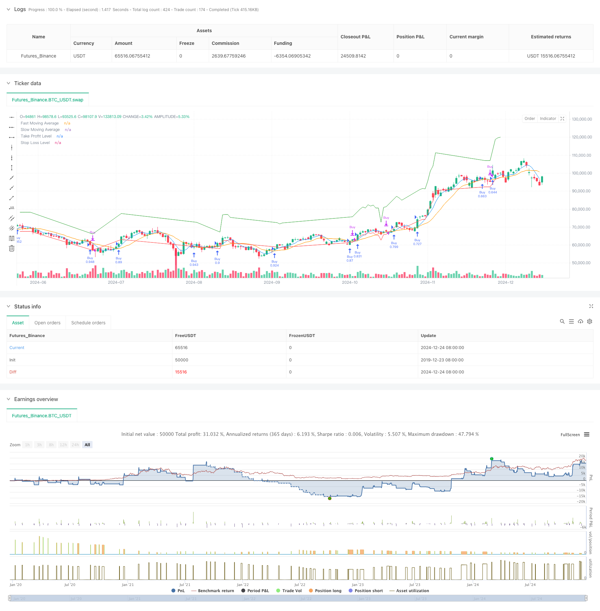

> Name

Dynamic-Moving-Average-Crossover-Trend-Following-Strategy-with-Adaptive-Risk-Management
> Author

ChaoZhang

> Strategy Description



[trans]
#### Overview
This strategy is a trend following system based on double moving average crossover signals, combined with a dynamic stop-profit and stop-loss mechanism. The strategy uses 5-period and 12-period simple moving averages (SMA) to generate trading signals, and optimizes the risk-return ratio through dynamic adjustments to take-profit and stop-loss levels. The initial take profit is set to 10% and the stop loss is set to 5%. When the price moves in a favorable direction, the take profit level is adjusted to 20% and the stop loss is tightened to 2.5% to protect profits.
#### Strategy Principle
The core logic of the strategy is based on the intersection relationship between the fast moving average (5 periods) and the slow moving average (12 periods). When the fast line crosses the slow line from bottom to top, the system generates a long signal and opens a position; when the fast line crosses the slow line from top to bottom, the system closes the position and exits. The uniqueness of the strategy lies in its dynamic risk management mechanism: once a position is opened, the system will monitor price trends in real time and dynamically adjust the stop-profit and stop-loss levels according to price changes to maximize profits while controlling risks.
#### Strategic Advantages
1. The system adopts the classic double moving average crossover strategy, with clear signals and easy to understand and execute.
2. The dynamic stop-profit and stop-loss mechanism can effectively protect realized profits and avoid retracements.
3. Strategy parameters can be flexibly adjusted according to different market characteristics and are highly adaptable.
4. The risk management mechanism is perfect and can effectively control the risk of a single transaction.
5. The code structure is clear and easy to maintain and optimize.
#### Strategy Risk
1. A volatile market may produce false signals, leading to frequent trading
2. A large retracement may occur under rapid market reversal.
3. Improper parameter settings may affect strategy performance
4. Insufficient market liquidity may affect stop loss execution
The following measures are recommended to manage risk:
- Add trend filter
- Optimize parameter selection
- Monitor market liquidity in real time
- Establish a sound fund management system
#### Strategy optimization direction
1. Introduce trend strength indicators to filter volatile market signals
2. Consider adding trading volume factors to improve signal reliability
3. Optimize take-profit and stop-loss parameters to improve risk-return ratio
4. Increase market volatility adaptive mechanism
5. Improve the warehouse management system
#### Summary
This strategy achieves effective grasp of trends and dynamic control of risks by combining classic moving average crossover signals and innovative dynamic risk management mechanisms. The strategic design concept is clear, the implementation method is simple and effective, and has good practicality and scalability. Through continuous optimization and improvement, this strategy is expected to achieve stable income performance in actual transactions. ||
#### Overview
This strategy is a trend-following system based on dual moving average crossover signals, incorporating a dynamic take-profit and stop-loss mechanism. It utilizes 5-period and 12-period Simple Moving Averages (SMA) to generate trading signals, optimizing risk-reward ratio through dynamic adjustment of take-profit and stop-loss levels. Initial take-profit is set at 10% and stop-loss at 5%, with levels adjusting to 20% and 2.5% respectively when price moves favorably.

#### Strategy Principles
The core logic relies on the crossover relationship between fast (5-period) and slow (12-period) moving averages. A buy signal is generated when the fast MA crosses above the slow MA, while positions are closed when the fast MA crosses below the slow MA. The strategy's uniqueness lies in its dynamic risk management mechanism: after position entry, the system continuously monitors price movement and dynamically adjusts take-profit and stop-loss levels to maximize profits while controlling risk.

#### Strategy Advantages
1. Employs classic dual MA crossover strategy with clear signals, easy to understand and execute
2. Dynamic take-profit/stop-loss mechanism effectively protects realized profits and prevents drawdowns
3. Strategy parameters can be flexibly adjusted for different market characteristics
4. Comprehensive risk management mechanism effectively controls single-trade risk
5. Clear code structure facilitates maintenance and optimization

#### Strategy Risks
1. May generate false signals in ranging markets, leading to frequent trading
2. Potential significant drawdowns in quick reversal scenarios
3. Improper parameter settings may affect strategy performance
4. Market liquidity issues may impact stop-loss execution
Risk management recommendations:
- Add trend filters
- Optimize parameter selection
- Monitor market liquidity in real-time
- Establish comprehensive money management system

#### Optimization Directions
1. Introduce trend strength indicators to filter ranging market signals
2. Consider incorporating volume factors to improve signal reliability
3. Optimize take-profit/stop-loss parameters to enhance risk-reward ratio
4. Add market volatility adaptation mechanism
5. Improve position sizing system

#### Summary
This strategy effectively captures trends and dynamically controls risk by combining classic moving average crossover signals with innovative dynamic risk management. The strategy design is clear, implementation is efficient, and it demonstrates good practicality and scalability. Through continuous optimization and improvement, this strategy shows promise for achieving stable returns in actual trading.[/trans]


> Source (PineScript)

``` pinescript
/*backtest
start: 2019-12-23 08:00:00
end: 2024-12-25 08:00:00
period: 1d
basePeriod: 1d
exchanges: [{"eid":"Futures_Binance","currency":"BTC_USDT"}]
*/

//@version=6
strategy("My Moving Average Crossover Strategy with Take Profit and Stop Loss", overlay=true, default_qty_type=strategy.percent_of_equity, default_qty_value=100)
//risk_free_rate = float(request.security("IRUS", "D", close)/request.security("IRUS", "D", close[1]) - 1  ))


// MA periods
fastLength = input.int(5, title="Fast MA Length")
slowLength = input.int(12, title="Slow MA Length")


// Take Profit and Stop Loss
takeProfitLevel = input(10, title="Take Profit (пункты)") // Take profit % from the last price
stopLossLevel = input(5, title="Stop Loss (пункты)") // Stop loss  % from the last price
takeProfitLevel_dyn = input(20, title="Dynamic Take Profit (пункты)") // Move TP if current_price higher buy_px
stopLossLevel_dyn =  input(2.5, title="Dynamic Stop Loss (пункты)") // S Move SL if current_price higher buy_px


// Вычисление скользящих средних
fastMA = ta.sma(close, fastLength)
slowMA= ta.sma(close, slowLength)


// Conditions for Sell and Buy
longCondition = ta.crossover (fastMA, slowMA) // покупаем, если короткая MA персекает длинную снизу-вверх
shortCondition = ta.crossunder(fastMA, slowMA) // продаем, если короткая MA персекает длинную сверху-вниз


// Buy position condition
if (longCondition)
    strategy.entry("Buy", strategy.long)


// Dynamic TP SL leveles
takeProfitPrice = strategy.position_avg_price * (1+ takeProfitLevel / 100)
stopLossPrice = strategy.position_avg_price * (1-stopLossLevel / 100)


entryPrice = strategy.position_avg_price


if (strategy.position_size > 0) // если есть открытая позиция


    // takeProfitPrice := entryPrice * (1+ takeProfitLevel / 100)
    // stopLossPrice := entryPrice * (1-stopLossLevel / 100)


    // // Перемещение Stop Loss и Take Profit
    if (close > entryPrice)
   
        takeProfitPrice := close * (1+ takeProfitLevel_dyn / 100)
        stopLossPrice := close * (1- stopLossLevel_dyn/ 100)


if (shortCondition)
    strategy.close("Buy")


strategy.exit("Take Profit/Stop loss", "Buy", limit=takeProfitPrice, stop=stopLossPrice)


// Drawing MA lines
plot(fastMA, color=color.blue, title="Fast Moving Average")
plot(slowMA, color=color.orange, title="Slow Moving Average")


// Визуализация
plot(longCondition ? na : takeProfitPrice, title="Take Profit Level", color=color.green, linewidth=1, style=plot.style_line)
plot(longCondition ? na: stopLossPrice, title="Stop Loss Level", color=color.red, linewidth=1, style=plot.style_line)


```

> Detail

https://www.fmz.com/strategy/476263

> Last Modified

2024-12-27 15:08:40
