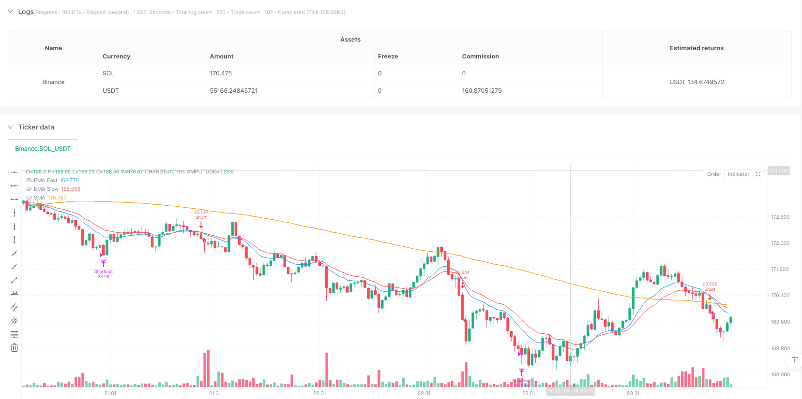
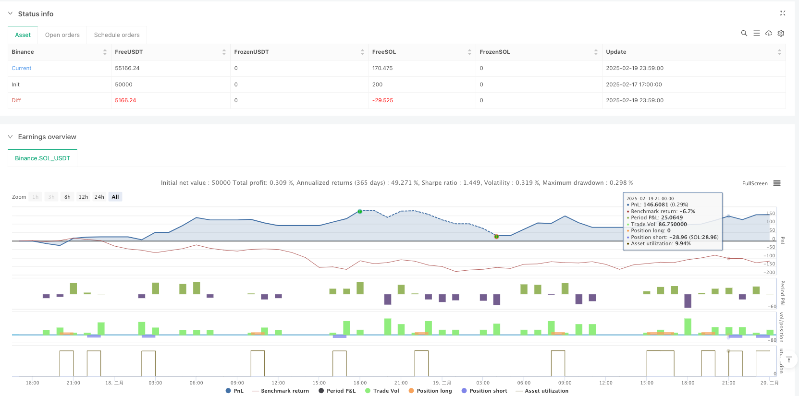

> Name

Dynamic Moving Average Crossover Trend Following Combination Strategy-Dynamic-Moving-Average-Crossover-Trend-Following-Strategy
> Author

ianzeng123

> Strategy Description





[trans]
#### Overview
This strategy is a trend following system based on multiple moving average crossovers that combines SMA and EMA indicators to capture market trends. The strategy builds a complete trend following trading system through the use of a simple moving average (SMA) and two exponential moving averages (EMA) with a custom period. At the same time, it integrates dynamic stop loss and profit target management mechanisms to effectively control risks and lock in profits.
#### Strategy Principle
The strategy is mainly based on the dynamic relationship of three moving averages for trading decisions. The system determines the trend direction by monitoring the relative position of price and SMA, as well as the intersection of fast EMA and slow EMA. There are two triggering methods for entry signals: one is when the price is above (below) the SMA and the fast EMA crosses above (or below) the slow EMA; the other is when the price breaks through the SMA and the previous price continues to remain above (below) the SMA. The strategy adopts a dynamic stop loss mechanism. The initial stop loss is based on the EMA position or a fixed percentage. As profits increase, the stop loss position will be adjusted accordingly.
#### Strategic Advantages
1. The combined use of multiple moving averages improves the accuracy of trend judgment and reduces losses caused by false breakthroughs.
2. The design of dual entry conditions can not only capture opportunities in the early stages of the trend, but also track the continuity of the established trend.
3. The dynamic stop loss mechanism not only protects existing profits, but also gives the trend room to fully develop.
4. The take-profit and stop-loss ratios are set reasonably, achieving a good balance between risk control and profit space.
5. Moving average crossover serves as an additional closing condition, helping to avoid trend reversal risks in a timely manner
#### Strategy Risk
1. Frequent trading may lead to losses in volatile markets
2. Multiple moving average systems may produce lags in rapidly volatile markets
3. Fixed stop loss multiples may not be suitable for all market environments
4. In volatile markets, trailing stops may lock in profits prematurely
5. Excessive parameter optimization may cause the strategy to perform worse than the backtest results in real trading.
#### Strategy optimization direction
1. Introduce volatility indicators to dynamically adjust stop loss and take profit multiples to better adapt the strategy to different market environments
2. Add trading volume indicators as auxiliary confirmation to improve the reliability of entry signals
3. Dynamically adjust the moving average cycle according to market fluctuation characteristics to improve strategy adaptability
4. Add trend strength filter to avoid frequent trading in weak trend environment
5. Develop an adaptive moving stop loss mechanism to dynamically adjust the stop loss distance according to market volatility
#### Summary
This strategy builds a complete trend tracking system through the use of multiple moving averages, with detailed rule designs in terms of entry, exit, and risk management. The advantage of the strategy is its ability to effectively identify and track trends while protecting profits through a dynamic stop-loss mechanism. Although there are some inherent risks, the stability and adaptability of the strategy can be further improved through the proposed optimization direction. The overall design of the strategy is reasonable and has good practical value and room for optimization. ||
#### Overview
This strategy is a trend following system based on multiple moving average crossovers, combining SMA and EMA indicators to capture market trends. The strategy utilizes a customizable period Simple Moving Average (SMA) and two Exponential Moving Averages (EMA) to construct a complete trend following trading system. It also integrates dynamic stop-loss and profit target management mechanisms to effectively control risk and lock in profits.

#### Strategy Principles
The strategy primarily makes trading decisions based on the dynamic relationships between three moving averages. The system determines trend direction by monitoring price position relative to SMA and crossovers between fast and slow EMAs. Entry signals are triggered in two ways: first, when price is above (below) SMA and fast EMA crosses above (below) slow EMA; second, when price breaks through SMA and previous price action consistently remains above (below) SMA. The strategy employs a dynamic stop-loss mechanism, with initial stops based on EMA position or fixed percentage, adjusting as profits increase.

#### Strategy Advantages
1. Multiple moving averages working together improve trend identification accuracy and reduce losses from false breakouts
2. Dual entry conditions design captures both early trend opportunities and confirmed trend continuations
3. Dynamic stop-loss mechanism protects profits while allowing trends sufficient room to develop
4. Reasonable profit-to-loss ratio settings achieve good balance between risk control and profit potential
5. Moving average crossovers as additional exit conditions help avoid trend reversal risks

#### Strategy Risks
1. May generate frequent trades resulting in losses in ranging markets
2. Multiple moving average system may lag in rapidly volatile markets
3. Fixed stop-loss multipliers may not suit all market conditions
4. Trailing stops may lock in profits too early in highly volatile markets
5. Over-optimization of parameters may lead to poorer live performance compared to backtests

#### Optimization Directions
1. Introduce volatility indicators to dynamically adjust stop-loss and take-profit multipliers for better market adaptation
2. Add volume indicators as confirmation to improve entry signal reliability
3. Dynamically adjust moving average periods based on market volatility characteristics
4. Implement trend strength filters to avoid frequent trading in weak trend environments
5. Develop adaptive trailing stop mechanisms that dynamically adjust stop distances based on market volatility

#### Summary
The strategy constructs a complete trend following system through the coordination of multiple moving averages, with detailed rules for entries, exits, and risk management. Its strengths lie in effective trend identification and following, while protecting profits through dynamic stop-loss mechanisms. Though inherent risks exist, the proposed optimization directions can further enhance strategy stability and adaptability. The overall design is reasonable, offering good practical value and optimization potential.[/trans]


> Source (PineScript)

``` pinescript
/*backtest
start: 2025-02-17 17:00:00
end: 2025-02-20 00:00:00
period: 1m
basePeriod: 1m
exchanges: [{"eid":"Binance","currency":"SOL_USDT"}]
*/

//@version=5
strategy("交易策略（自定义EMA/SMA参数）", overlay=true, initial_capital=100000, currency=currency.EUR, default_qty_type=strategy.percent_of_equity, default_qty_value=10)

// 输入参数：可调的 SMA 和 EMA 周期
smaLength     = input.int(120, "SMA Length", minval=1, step=1)
emaFastPeriod = input.int(13, "EMA Fast Period", minval=1, step=1)
emaSlowPeriod = input.int(21, "EMA Slow Period", minval=1, step=1)

// 计算均线
smaVal   = ta.sma(close, smaLength)
emaFast  = ta.ema(close, emaFastPeriod)
emaSlow  = ta.ema(close, emaSlowPeriod)

// 绘制均线
plot(smaVal, color=color.orange, title="SMA")
plot(emaFast, color=color.blue, title="EMA Fast")
plot(emaSlow, color=color.red, title="EMA Slow")

// 入场条件 - 做多
// 条件1：收盘价高于SMA 且 EMA Fast 向上穿越 EMA Slow
longTrigger1 = (close > smaVal) and ta.crossover(emaFast, emaSlow)
// 条件2：收盘价上穿SMA 且前5根K线的最低价均高于各自的SMA
longTrigger2 = ta.crossover(close, smaVal) and (low[1] > smaVal[1] and low[2] > smaVal[2] and low[3] > smaVal[3] and low[4] > smaVal[4] and low[5] > smaVal[5])
longCondition = longTrigger1 or longTrigger2

// 入场条件 - 做空
// 条件1：收盘价低于SMA 且 EMA Fast 向下穿越 EMA Slow
shortTrigger1 = (close < smaVal) and ta.crossunder(emaFast, emaSlow)
// 条件2：收盘价下穿SMA 且前5根K线的最高价均低于各自的SMA
shortTrigger2 = ta.crossunder(close, smaVal) and (high[1] < smaVal[1] and high[2] < smaVal[2] and high[3] < smaVal[3] and high[4] < smaVal[4] and high[5] < smaVal[5])
shortCondition = shortTrigger1 or shortTrigger2

// 定义变量记录入场时的价格与EMA Fast值，用于计算止损
var float entryPriceLong      = na
var float entryEMA_Fast_Long   = na
var float entryPriceShort     = na
var float entryEMA_Fast_Short = na

// 入场与初始止盈止损设置 - 做多
// 止损取“开仓时的EMA Fast价格”与“0.2%止损”中较大者；止盈为止损的5倍
if (longCondition and strategy.position_size == 0)
    entryPriceLong      := close
    entryEMA_Fast_Long  := emaFast
    strategy.entry("Long", strategy.long)
    stopPercLong = math.max(0.002, (entryPriceLong - entryEMA_Fast_Long) / entryPriceLong)
    stopLong     = entryPriceLong * (1 - stopPercLong)
    tpLong       = entryPriceLong * (1 + 5 * stopPercLong)
    strategy.exit("LongExit", "Long", stop=stopLong, limit=tpLong)

// 入场与初始止盈止损设置 - 做空
// 止损取“开仓时的EMA Fast价格”与“0.2%止损”中较大者；止盈为止损的5倍
if (shortCondition and strategy.position_size == 0)
    entryPriceShort      := close
    entryEMA_Fast_Short  := emaFast
    strategy.entry("Short", strategy.short)
    stopPercShort = math.max(0.002, (entryEMA_Fast_Short - entryPriceShort) / entryPriceShort)
    stopShort     = entryPriceShort * (1 + stopPercShort)
    tpShort       = entryPriceShort * (1 - 5 * stopPercShort)
    strategy.exit("ShortExit", "Short", stop=stopShort, limit=tpShort)

// 移动止损逻辑
// 当持仓盈利达到0.8%时更新止损和止盈，保持止盈为止损的5倍
var float longHighest = na
if (strategy.position_size > 0)
    longHighest := na(longHighest) ? high : math.max(longHighest, high)
    if (high >= entryPriceLong * 1.008)
        newLongStop = longHighest * (1 - 0.003)
        newPerc     = (entryPriceLong - newLongStop) / entryPriceLong
        newLongTP   = entryPriceLong * (1 + 5 * newPerc)
        strategy.exit("LongExit", "Long", stop=newLongStop, limit=newLongTP)
else
    longHighest := na

var float shortLowest = na
if (strategy.position_size < 0)
    shortLowest := na(shortLowest) ? low : math.min(shortLowest, low)
    if (low <= entryPriceShort * 0.992)
        newShortStop  = shortLowest * (1 + 0.003)
        newPercShort  = (newShortStop - entryPriceShort) / entryPriceShort
        newShortTP    = entryPriceShort * (1 - 5 * newPercShort)
        strategy.exit("ShortExit", "Short", stop=newShortStop, limit=newShortTP)
else
    shortLowest := na

// 额外平仓条件
// 如果持多仓时EMA Fast下穿EMA Slow，则立即平多
if (strategy.position_size > 0 and ta.crossunder(emaFast, emaSlow))
    strategy.close("Long", comment="EMA下穿平多")
// 如果持空仓时EMA Fast上穿EMA Slow，则立即平空
if (strategy.position_size < 0 and ta.crossover(emaFast, emaSlow))
    strategy.close("Short", comment="EMA上穿平空")

```

> Detail

https://www.fmz.com/strategy/483509

> Last Modified

2025-02-24 09:46:10
