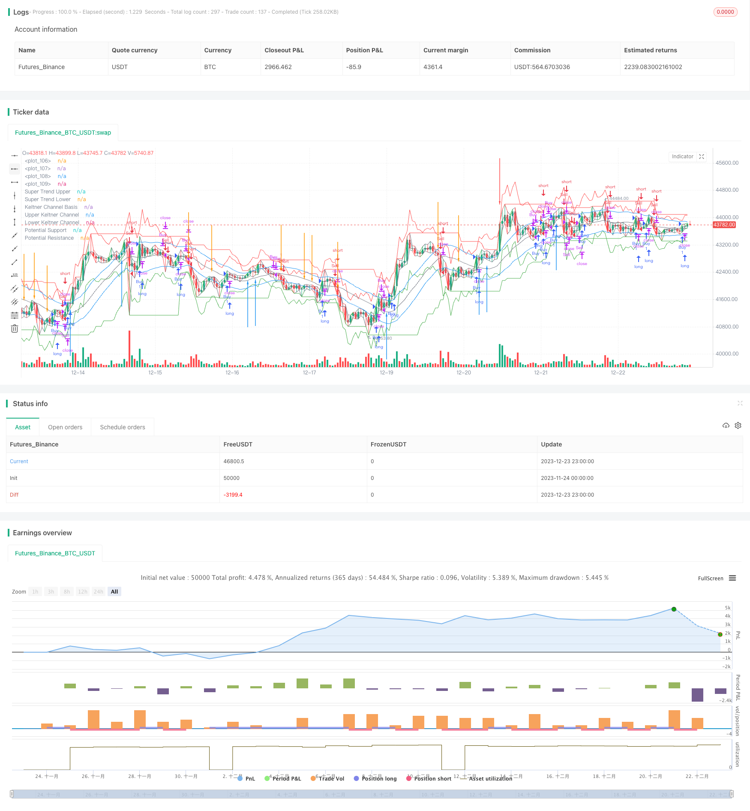

> Name

Dynamic-Moving-Averages-and-Keltner-Channel-Trading-Strategy
> Author

ChaoZhang

> Strategy Description


[trans]

Overview:
This strategy comprehensively uses dynamic moving averages, super trend indicators, potential support and resistance levels and Celtic channels to make multi-level judgments on price changes and achieve automated trend following transactions. The advantage of the strategy is that the trading signals are clearly generated and the winning rate is high. At the same time, combined with risk management measures, the risk of a single transaction can be controlled.
Strategy principle:
This strategy uses dynamic moving averages to determine the short- and medium-term price trend direction. Specifically, the script uses either a simple moving average or an exponential moving average, depending on user selection. When the highest price, lowest price and closing price are all higher than yesterday, it is determined to be a bull trend; when the highest price, lowest price and closing price are all lower than yesterday, it is determined to be a short trend. Based on this, combined with the position of the dynamic moving average, buy and sell signals are generated.
In addition, the strategy uses the Super Trend indicator to identify long-term trends. The super trend indicator combines the average true fluctuation range to generate a buy signal when the price runs above the upper rail and yesterday's closing price is lower than the upper rail. A sell signal is generated when the price falls below the lower band and yesterday's closing price is above the lower band.
In order to filter out false signals, this strategy uses the Cort channel to draw the upper and lower rails of the channel. Combined with channel ranges and the Super Trend Indicator, trend following trading can be achieved. Specifically, when the price breaks through the upper rail from bottom to top, and yesterday's closing price is lower than the upper rail, a strong buy signal is generated; when the price breaks through the lower rail from top to bottom, and yesterday's closing price is higher than the lower rail, a strong sell signal is generated.
In addition, the script also assists in drawing potential support and resistance levels to further determine key price levels. Overall, the multi-layer indicator combination and strict breakthrough conditions fundamentally improve the quality of trading signals.
Strategic advantages:
1. Multi-strategy indicator combination, clear trading signals are generated. The Celtic Channel determines the key price range, combines the dynamic moving average and super trend indicators to strictly determine the trend direction, and effectively filters out false market breakthroughs.
2. Strict breakthrough conditions ensure the quality of trading signals. The price needs to truly break through the upper and lower rails of the channel, and at the same time, combine the position of yesterday's closing price to avoid being trapped.
3. Super trend indicators can capture long-term trends and track long-term directional market trends.
4. Potential support and resistance levels assist in determining key price points and can identify reversal opportunities.
5. The overall transaction frequency is moderate and will not be too intensive. Only sending high-quality signals at key points has a higher winning rate.
Strategy risks:
1. In volatile market conditions, indicators may send misleading signals, leading to invalid breakthrough trading losses. SetPosition can be exited by adjusting parameters for optimization or manual intervention.
2. The stop loss point for breaking through the upper and lower rails of the channel may be too large, and the risk of single loss is high. The stop loss range can be appropriately narrowed or a time stop loss can be used.
3. When tracking the long-term trend, you may miss some short-term and medium-term reversal opportunities. It can assist in using oscillators to judge local adjustments.
4. Moving average systems sometimes respond slowly to unexpected events. At this time, you can consider reducing the moving average parameters or using other indicators to assist.
Strategy optimization direction:
According to different market environments and trading preferences, this strategy can be optimized in the following directions:
1. Adjust the moving average parameters and optimize the sensitivity of the indicator system to price changes.
2. Adjust the ATR period and factor parameters of the super trend indicator to optimize the role of the super trend indicator.
3. Adjust the stop loss point to balance the profit and loss ratio of each order. You can also use time stop loss to further control the risk of single loss.
4. Add other auxiliary indicators, such as Bollinger Bands, KD indicators, etc., to further determine local adjustment and reversal opportunities.
5. Use open, close and other variables to draw K-line graphics and intuitively judge the price trend.
6. Carry out parameter optimization and backtest to compare the effects of different parameter combinations.
Summary:
This strategy comprehensively uses multiple indicators such as dynamic moving averages, super trend indicators, and Celtic channels to achieve automated trend following transactions. The key advantages are: clear signal generation and high winning rate; tracking long-term trends and capturing directional opportunities; reasonable stop loss points and controlling the risk of single loss. The effective multi-indicator combination strictly filters out false breakthroughs, ensuring that the trading signals issued are of high quality and suitable for automated trading. Through parameter adjustment and optimization, this strategy can adapt to different market environments and assist manual decision-making in finding trading opportunities.
||

Overview:
This strategy integrates dynamic moving averages, Super Trend indicator, potential support and resistance levels, and Keltner Channels to conduct multi-level judgments on price fluctuations and achieve automated trend-following trading. The advantages of this strategy are clear trading signal generation, relatively high win rate, and incorporation of risk management measures to control per trade risks.

Strategy Logic:  
This strategy utilizes dynamic moving averages to determine the medium-term trend direction of prices. Specifically, based on user’s selection, the script adopts Simple Moving Average (SMA) or Exponential Moving Average (EMA). When the highest price, lowest price and closing price are all higher than previous day, it indicates a bullish trend. When they are all lower than previous day, it indicates a bearish trend. Based on this, combined with the position of dynamic moving averages, buy and sell signals are generated.

In addition, the strategy also employs the Super Trend indicator to identify long-term trends. The Super Trend indicator incorporates Average True Range (ATR) and generates buy signals when prices run above the upper band while previous close was below the upper band. It generates sell signals when prices break below the lower band while previous close was above the lower band.  

To filter false signals, this strategy utilizes Keltner Channels to plot upper and lower channel bands. Combined with the channel range and Super Trend indicator, it can achieve trend-following trading. Specifically, when prices break out the upper band upside and yesterday's close was below the upper band, strong buy signals are generated. When prices break down the lower band and yesterday's close was above the lower band, strong sell signals are triggered.

Also, the script assists plotting potential support and resistance levels to further determine key price levels. Overall, the combination of multiple indicators and strict breakout conditions fundamentally improves the quality of trading signals.  

Advantages:

1. Combination of multiple strategy indicators generates clear trading signals. Keltner Channels determine key price range. Combined with dynamic moving averages and Super Trend indicator, it strictly judges trend direction and effectively filters false breakouts in the market.

2. Strict breakout conditions ensure quality of trading signals. Prices need to truly breakout upper or lower channel bands, combined with the position of yesterday’s close to avoid traps.  

3. Super Trend indicator can capture long-term trends and track directional trends.

4. Potential support and resistance levels assist in determining key price points and discovering reversal opportunities.  

5. Overall trading frequency is moderate without overly intensive trading. It only issues high quality signals at critical points with relatively high win rate.

Risks:

1. In ranging markets, indicators may issue misleading signals, resulting in ineffective breakout losses. This can be optimized through parameter adjustments or manually intervening to exit positions.

2. Stop loss points when breaking out channel bands may be too wide with high per trade risks. Stop loss range can be reduced or adopt time-based stop loss.  

3. When tracking long-term trends, some medium-term reversal opportunities may be missed out. Oscillators can be adopted to assist judging local corrections.

4. Moving average systems sometimes react slower to sudden events. Solutions include lowering moving average parameters or incorporating other assisting indicators.

Optimization Directions:
Based on different market environments and trading preferences, this strategy can be optimized in the following aspects:  

1. Adjust moving average parameters to optimize indicator system’s sensitivity to price changes.

2. Adjust ATR period and factor parameters of Super Trend indicator to optimize its functionality.  

3. Adjust stop loss points to balance risk/reward ratio per trade. Time-based stop loss can further control per trade loss risks.

4. Incorporate other assisting indicators like Bollinger Bands and KD to further judge local corrections and reversal opportunities.

5. Utilize open, close etc. to plot candlestick patterns for intuitive visual judgment of price actions.

6. Conduct parameter optimization and backtesting to compare results of different parameter combinations.

Conclusion:
This strategy integrates dynamic moving averages, Super Trend indicator, Keltner Channels and other multiple indicators to achieve automated trend-following trading. Key advantages include: clear signal generation, relatively high win rate; tracking long-term trends and capturing directional opportunities; reasonable stop loss points to control per trade risks. Effective multi-indicator combinations strictly filter false breakouts and ensure relatively high quality of trading signals, suitable for automated trading. Through parameter tuning and optimization, this strategy can adapt to different market environments and assist manual decisions in finding trading opportunities.

[/trans]

> Strategy Arguments


|Argument|Default|Description|
|----|----|----|
|v_input_1|SMA|Moving Average Type|
|v_input_int_1|20|SMA Length|
|v_input_int_2|20|EMA Length|
|v_input_int_3|7|ATR Length for Super Trend|
|v_input_int_4|2|Factor for Super Trend|


> Source (PineScript)

``` pinescript
/*backtest
start: 2023-11-24 00:00:00
end: 2023-12-24 00:00:00
period: 1h
basePeriod: 15m
exchanges: [{"eid":"Futures_Binance","currency":"BTC_USDT"}]
*/

// This Pine Script™ code is subject to the terms of the Mozilla Public License 2.0 at https://mozilla.org/MPL/2.0/
// © mahesh_linux1989

//@version=5
strategy("Intraday Trend Identifier with Dynamic Moving Averages, Super Trend, VWAP, and Keltner Signals", overlay=true, shorttitle="ITI Keltner")

// Input for Moving Average Type
maType = input("SMA", title="Moving Average Type")

// Input for SMA Length
smaLength = input.int(20, title="SMA Length", minval=1, maxval=200)

// Input for EMA Length
emaLength = input.int(20, title="EMA Length", minval=1, maxval=200)

// Selecting Moving Average
selectedMA = maType == "SMA" ? ta.sma(close, smaLength) : ta.ema(close, emaLength)

// Bullish conditions
bullish = high > high[1] and low > low[1] and close > high[1]

// Bearish conditions
bearish = high < high[1] and low < low[1] and close < low[1]

// Strategy logic
longCondition = bullish and not bearish and close > selectedMA
shortCondition = bearish and not bullish and close < selectedMA

if (longCondition)
    strategy.entry("Buy", strategy.long)

if (shortCondition)
    strategy.entry("Sell", strategy.short)

// Exit conditions
bullishExit = close < selectedMA
bearishExit = close > selectedMA

if (bullishExit)
    strategy.close("Buy")

if (bearishExit)
    strategy.close("Sell")

// Keltner Channels
basisKC = maType == "SMA" ? ta.sma(close, smaLength) : ta.ema(close, emaLength)
atrKC = ta.atr(14)
upperKC = basisKC + atrKC
lowerKC = basisKC - atrKC

// Super Trend
atrLengthST = input.int(7, title="ATR Length for Super Trend")
factorST = input.int(2, title="Factor for Super Trend")

atrValueST = ta.atr(atrLengthST)

var float upperST = na
var float lowerST = na

if (close[1] > upperST[1])
    upperST := close[1] - factorST * atrValueST
else
    upperST := close - factorST * atrValueST

if (close[1] < lowerST[1])
    lowerST := close[1] + factorST * atrValueST
else
    lowerST := close + factorST * atrValueST

// Potential Support and Resistance
potentialSupport = ta.lowest(low, smaLength)
potentialResistance = ta.highest(high, smaLength)

// VWAP
//vwapValue = ta.vwap(close, volume)

// Keltner Signals
buySignalKC = close > upperKC and close[1] <= upperKC[1]
sellSignalKC = close < lowerKC and close[1] >= lowerKC[1]

// Super Trend Signals
buySignalST = close > upperST and close[1] <= upperST[1]
sellSignalST = close < lowerST and close[1] >= lowerST[1]

// Plotting
plot(basisKC, color=color.gray, title="Keltner Channel Basis")
plot(upperKC, color=color.blue, title="Upper Keltner Channel")
plot(lowerKC, color=color.blue, title="Lower Keltner Channel")

plot(upperST, color=color.green, title="Super Trend Upper")
plot(lowerST, color=color.red, title="Super Trend Lower")

plot(potentialSupport, color=color.green, title="Potential Support")
plot(potentialResistance, color=color.red, title="Potential Resistance")

//plot(vwapValue, color=color.orange, title="VWAP")

// Plot Bullish and Bearish arrows
plotarrow(buySignalST ? 1 : na, colorup=color.green, offset=-1, title="Bullish Arrow ST")
plotarrow(sellSignalST ? -1 : na, colordown=color.red, offset=-1, title="Bearish Arrow ST")

plotarrow(buySignalKC ? 1 : na, colorup=color.blue, offset=-1, title="Bullish Arrow KC")
plotarrow(sellSignalKC ? -1 : na, colordown=color.orange, offset=-1, title="Bearish Arrow KC")

// Plot candlesticks
plot(open, color=color.gray)
plot(close, color=bullish ? color.green : bearish ? color.red : color.gray)
plot(high, color=bullish ? color.green : bearish ? color.red : color.gray)
plot(low, color=bullish ? color.green : bearish ? color.red : color.gray)
```

> Detail

https://www.fmz.com/strategy/436502

> Last Modified

2023-12-25 13:36:40
