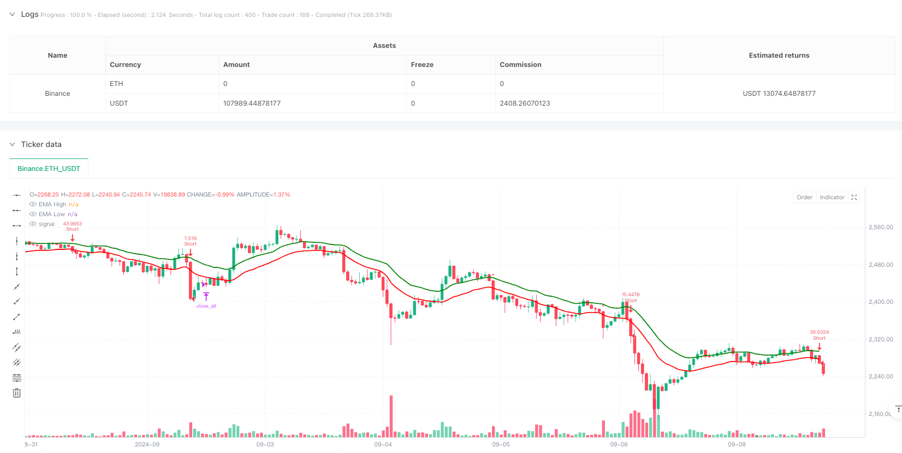
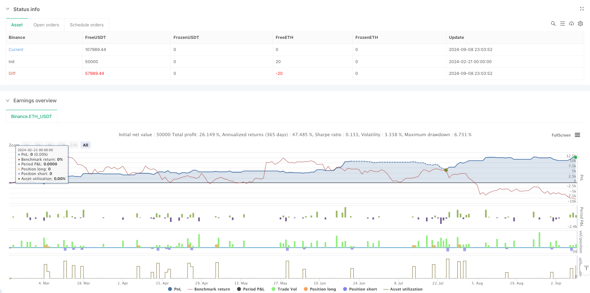

> Name

Dynamic-Multi-Indicator-Intraday-Trend-Following-Strategy
> Author

ianzeng123

> Strategy Description





[trans]
#### Overview
This is an intraday trading strategy based on multiple technical indicators, mainly using multiple signals such as EMA channel, RSI overbought and oversold, and MACD trend confirmation for trading. The strategy operates on a 3-minute cycle, captures market trends through the EMA high and low tracks combined with the cross confirmation of RSI and MACD, and sets dynamic stop loss and take profit based on ATR, as well as a fixed closing time.
#### Strategy Principle
The strategy uses the 20-period EMA to calculate the highest price and lowest price to form a channel. When the price breaks through the channel and meets the following conditions, enter the market:
1. Bullish entry: The closing price crosses the EMA high track, the RSI is between 50-70, and the MACD line crosses the signal line
2. Short entry: the closing price crosses the EMA low track, the RSI is between 30-50, and the MACD line crosses the signal line
3. Use ATR to dynamically calculate the stop loss position and set the take profit according to the risk-return ratio of 2.5 times.
4. The risk of each transaction is 1% of the account, and the position size is dynamically calculated based on the stop loss distance.
5. Forced liquidation of all positions at 15:00 IST
#### Strategic Advantages
1. Cross-validation of multiple technical indicators to improve the reliability of trading signals
2. Dynamic stop loss is based on the ATR indicator to better adapt to market fluctuations
3. Fixed risk ratio and risk-return ratio to effectively control risks
4. Consider transaction costs, including handling fee calculations
5. It is prohibited to add positions in the same direction to avoid the risk of excessive position holdings
6. Fixed closing time to avoid overnight risks
#### Strategy Risk
1. Multiple indicators may cause signal lag and affect the timing of entry.
2. The EMA channel may produce frequent false breakthroughs in sideways markets.
3. A fixed risk-benefit ratio may not be flexible enough in different market environments.
4. RSI range limits may miss some major trends
5. Forced liquidation at closing may force you to exit at a critical position
#### Strategy optimization direction
1. Consider adding trading volume indicators as auxiliary confirmation
2. The risk-return ratio can be dynamically adjusted according to the fluctuation characteristics of different periods.
3. Introduce market volatility indicator to dynamically adjust RSI threshold
4. Consider adding a trend strength filter to reduce false breakouts
5. You can consider adjusting parameters according to the characteristics of different periods of the day.
6. Add historical volatility analysis to optimize position management
#### Summary
This strategy builds a relatively complete trading system through the combined use of multiple technical indicators. The advantage of the strategy is that the risk control is relatively complete, including mechanisms such as dynamic stop loss, fixed risk and closing positions. Although there is a certain degree of hysteresis risk, the strategy performance can be further improved through parameter optimization and the addition of auxiliary indicators. The strategy is particularly suitable for the volatile intraday trading market, and can obtain stable returns through strict risk control and multiple signal confirmations. ||
#### Overview
This is an intraday trading strategy based on multiple technical indicators, primarily utilizing EMA channels, RSI overbought/oversold levels, and MACD trend confirmation signals. The strategy operates on a 3-minute timeframe, capturing market trends through EMA high-low channels combined with RSI and MACD crossover confirmations, featuring ATR-based dynamic stop-loss and take-profit levels, and a fixed session closing time.

#### Strategy Principles
The strategy uses 20-period EMAs on high and low prices to form a channel, entering positions when price breaks the channel and meets the following conditions:
1. Long Entry: Close above EMA high, RSI between 50-70, MACD line crosses above signal line
2. Short Entry: Close below EMA low, RSI between 30-50, MACD line crosses below signal line
3. Uses ATR for dynamic stop-loss calculation, with 2.5:1 risk-reward ratio for take-profit
4. Risks 1% of account per trade, with position sizing based on stop-loss distance
5. Forces position closure at 15:00 IST

#### Strategy Advantages
1. Multiple technical indicator cross-validation improves signal reliability
2. Dynamic stop-loss based on ATR better adapts to market volatility
3. Fixed risk percentage and risk-reward ratio for effective risk control
4. Considers trading costs with commission calculations
5. Prevents pyramiding to avoid excessive position risk
6. Fixed closing time eliminates overnight risk

#### Strategy Risks
1. Multiple indicators may lead to delayed signals affecting entry timing
2. EMA channels might generate frequent false breakouts in ranging markets
3. Fixed risk-reward ratio may lack flexibility in different market conditions
4. RSI range restrictions might miss some strong trend movements
5. Forced closure at session end may lead to premature exits at critical levels

#### Strategy Optimization Directions
1. Consider adding volume indicators for additional confirmation
2. Implement dynamic risk-reward ratios based on different session volatility characteristics
3. Introduce volatility-based dynamic RSI thresholds
4. Add trend strength filters to reduce false breakouts
5. Consider parameter adjustments based on intraday session characteristics
6. Incorporate historical volatility analysis for position sizing optimization

#### Summary
The strategy constructs a relatively complete trading system through the combination of multiple technical indicators. Its strength lies in comprehensive risk control, including dynamic stops, fixed risk parameters, and session-end closure mechanisms. While there are inherent lag risks, performance can be further enhanced through parameter optimization and additional confirmatory indicators. The strategy is particularly suited for volatile intraday markets, achieving stable returns through strict risk control and multiple signal confirmation.[/trans]


> Source (PineScript)

``` pinescript
/*backtest
start: 2024-02-21 00:00:00
end: 2024-09-09 00:00:00
period: 1h
basePeriod: 1h
exchanges: [{"eid":"Binance","currency":"ETH_USDT"}]
*/

//@version=6
strategy("Intraday 3min EMA HL Strategy v6", 
     overlay=true,
     margin_long=100, 
     margin_short=100,
     initial_capital=100000,
     default_qty_type=strategy.percent_of_equity,
     default_qty_value=100,
     commission_type=strategy.commission.percent,
     commission_value=0.05,
     calc_on_every_tick=false,
     process_orders_on_close=true,
     pyramiding=0)

// Input Parameters
i_emaLength = input.int(20, "EMA Length", minval=5, group="Strategy Parameters")
i_rsiLength = input.int(14, "RSI Length", minval=5, group="Strategy Parameters")
i_atrLength = input.int(14, "ATR Length", minval=5, group="Risk Management")
i_rrRatio = input.float(2.5, "Risk:Reward Ratio", minval=1, maxval=10, step=0.5, group="Risk Management")
i_riskPercent = input.float(1, "Risk % per Trade", minval=0.1, maxval=5, step=0.1, group="Risk Management")

// Time Exit Parameters (IST)
i_exitHour = input.int(15, "Exit Hour (IST)", minval=0, maxval=23, group="Session Rules")
i_exitMinute = input.int(0, "Exit Minute (IST)", minval=0, maxval=59, group="Session Rules")

// Indicator Calculations
emaHigh = ta.ema(high, i_emaLength)
emaLow = ta.ema(low, i_emaLength)

rsi = ta.rsi(close, i_rsiLength)
atr = ta.atr(i_atrLength)

fastMA = ta.ema(close, 12)
slowMA = ta.ema(close, 26)
macdLine = fastMA - slowMA
signalLine = ta.ema(macdLine, 9)

// Time Calculations (UTC to IST Conversion)
istHour = (hour(time) + 5) % 24  // UTC+5
istMinute = minute(time) + 30    // 30 minute offset
istHour += istMinute >= 60 ? 1 : 0
istMinute := istMinute % 60

// Exit Condition
timeExit = istHour > i_exitHour or (istHour == i_exitHour and istMinute >= i_exitMinute)

// Entry Conditions (Multi-line formatting fix)
longCondition = close > emaHigh and
     rsi > 50 and
     rsi < 70 and
     ta.crossover(macdLine, signalLine)

shortCondition = close < emaLow and
     rsi < 50 and
     rsi > 30 and
     ta.crossunder(macdLine, signalLine)

// Risk Calculations
var float entryPrice = na
var float stopLoss = na
var float takeProfit = na
var float posSize = na

// Strategy Logic
if longCondition and not timeExit and strategy.position_size == 0
    entryPrice := close
    stopLoss := math.min(low, entryPrice - atr)
    takeProfit := entryPrice + (entryPrice - stopLoss) * i_rrRatio
    posSize := strategy.equity * i_riskPercent / 100 / (entryPrice - stopLoss)
    strategy.entry("Long", strategy.long, qty=posSize)
    strategy.exit("Long Exit", "Long", stop=stopLoss, limit=takeProfit)

if shortCondition and not timeExit and strategy.position_size == 0
    entryPrice := close
    stopLoss := math.max(high, entryPrice + atr)
    takeProfit := entryPrice - (stopLoss - entryPrice) * i_rrRatio
    posSize := strategy.equity * i_riskPercent / 100 / (stopLoss - entryPrice)
    strategy.entry("Short", strategy.short, qty=posSize)
    strategy.exit("Short Exit", "Short", stop=stopLoss, limit=takeProfit)

// Force Close at Session End
if timeExit
    strategy.close_all()

// Visual Components
plot(emaHigh, "EMA High", color=color.rgb(0, 128, 0), linewidth=2)
plot(emaLow, "EMA Low", color=color.rgb(255, 0, 0), linewidth=2)

plotshape(longCondition, "Long Signal", shape.triangleup, 
  location.belowbar, color=color.green, size=size.small)
plotshape(shortCondition, "Short Signal", shape.triangledown, 
  location.abovebar, color=color.red, size=size.small)

// Debugging Table
var table infoTable = table.new(position.top_right, 3, 3)
if barstate.islast
    table.cell(infoTable, 0, 0, "EMA High: " + str.tostring(emaHigh, "#.00"))
    table.cell(infoTable, 0, 1, "EMA Low: " + str.tostring(emaLow, "#.00"))
    table.cell(infoTable, 0, 2, "Current RSI: " + str.tostring(rsi, "#.00"))
```

> Detail

https://www.fmz.com/strategy/483090

> Last Modified

2025-02-21 13:15:30
