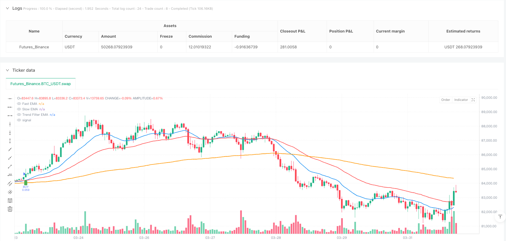
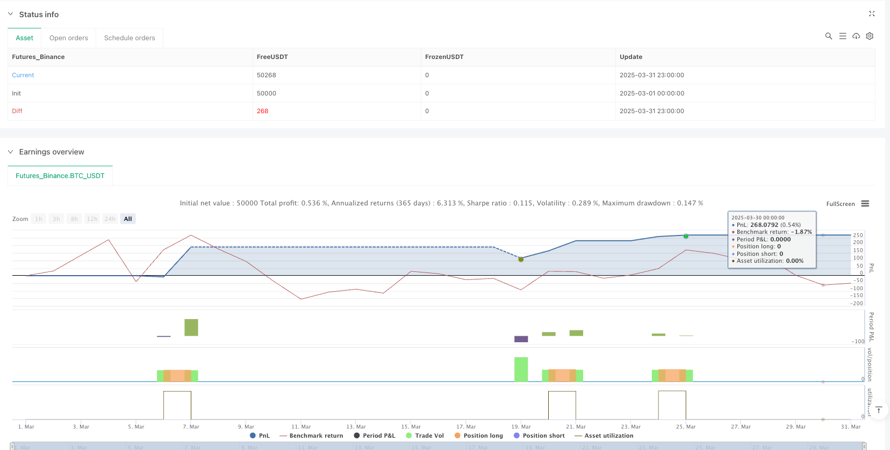

> Name

Dynamic-Multi-Indicator-Trend-Momentum-Enhanced-Trading-Strategy
> Author

ianzeng123

> Strategy Description





[trans]

## Strategy Overview
The Dynamic Multi-Indicator Trend Momentum Optimization Trading Strategy is a trading system that combines multiple indicators from technical analysis to capture market trends and enhance the reliability of trading signals through momentum confirmation. This strategy is mainly based on the exponential moving average (EMA) crossover to determine the entry point, while using the relative strength indicator (RSI) and the moving average convergence divergence indicator (MACD) as momentum confirmation tools, coupled with dynamic stop loss based on the true range (ATR) and an adjustable risk-reward ratio to form a complete trading system.
#### Strategy Principle
The core logic of this strategy revolves around multi-level technical indicator confirmation:
1. **Trend Identification**: The strategy uses three exponential moving averages (EMA) with different periods - fast EMA (20 periods), slow EMA (50 periods) and trend filtered EMA (200 periods). The intersection of the fast and slow lines provides the main entry signal, while the 200-period EMA determines the overall market trend direction.
2. **Momentum Confirmation**: To avoid false signals, the strategy combines RSI and MACD indicators for secondary confirmation. In an uptrend, consider buying only when the RSI value is greater than 55 and the MACD line is above the signal line; in a downtrend, consider selling when the RSI value is less than 45 and the MACD line is below the signal line.
3. **Risk Management**: The strategy adopts a dynamic stop-loss mechanism based on ATR. The stop-loss point is set by multiplying the current ATR value by a user-defined multiplier (default 1.5) to ensure that the stop-loss position can adapt to the current market volatility.
4. **Risk to reward ratio**: The system allows users to set the ideal risk to reward ratio (default is 1:2), and automatically calculates profit targets based on the stop loss distance.
The strategy adopts clear conditional logic in transaction execution: when the fast EMA crosses the slow EMA, the RSI is greater than 55, the MACD line crosses the signal line, and the price is above the 200-period EMA, a buy signal is triggered; the opposite combination of conditions triggers a sell signal. At the same time, each entry will set a stop loss based on ATR and a corresponding profit target.
#### Strategic Advantages
1. **Multiple confirmation mechanism**: Combined with trend and momentum indicators, the strategy requires multiple technical conditions to be met at the same time before the transaction can be executed, which greatly reduces false signals and improves transaction accuracy.
2. **Adapt to market volatility**: By using ATR as the stop loss basis, the strategy can dynamically adjust the stop loss distance according to the current market fluctuations, provide a looser stop loss space when the fluctuations are large, and tighten the stop loss to protect profits when the fluctuations are small.
3. **Flexible risk control**: Users can adjust the ATR multiplier and risk-reward ratio according to their own risk preferences to achieve personalized risk management strategies suitable for different trading styles.
4. **Trend Filter**: Use the 200-period EMA as the overall trend indicator to ensure that the strategy only opens positions in the direction of a clear trend and avoids frequent trading in consolidating markets.
5. **Visualized trading results**: The strategy has a built-in backtest result display function, which allows you to view the number of transactions, the number of profits and losses, and the overall profit situation in real time, which facilitates strategy evaluation and optimization.
#### Strategy Risk
1. **Lagging Risk**: All strategies based on moving averages have a certain degree of lag, which may lead to less than ideal entry points, especially in rapidly changing markets. The solution is to consider adjusting EMA parameters or adding price action analysis to optimize entry timing.
2. **False breakthrough risk**: Despite the use of multiple confirmation mechanisms, the market may still experience false breakthroughs, causing stop loss to be triggered. It is recommended to consider increasing volume confirmations or using a volatility filter to reduce this type of risk.
3. **Parameter sensitivity**: Strategy performance is more sensitive to parameter settings, especially the selection of EMA period and ATR multiplier. It is recommended to conduct extensive backtesting in different market environments to find the most stable parameter combination.
4. **Trend reversal risk**: In the event of a strong trend reversal, the strategy may not be able to adapt quickly, resulting in a larger retracement. Consider adding a trend strength indicator or volatility mutation detection to identify possible reversal signals in advance.
5. **Over-trading risk**: In sideways markets, EMA crossovers may occur frequently, which may still lead to over-trading even with RSI and MACD filtering. It is recommended to add trading frequency limits or sideways market recognition capabilities to avoid such situations.
#### Strategy optimization direction
1. **Increase trading volume confirmation**: The current strategy only makes decisions based on price derivative indicators and lacks confirmation of the trading volume dimension. It is recommended to add volume indicators such as OBV (On-Balance Volume) or Volume Weighted Moving Average (VWMA) to enhance signal reliability, because healthy trends are usually accompanied by corresponding volume support.
2. **Optimize trend identification mechanism**: You can consider adding an adaptive moving average or introducing a trend strength indicator such as ADX (Average Direction Index) to more accurately identify trend strength and direction and avoid frequent trading in weak trends or sideways markets.
3. **Introducing market status classification**: Develop a market status recognition algorithm to divide the market into different statuses such as trend, consolidation and high volatility, and use differentiated parameter settings or trading strategies for different statuses to improve the adaptability of the strategy.
4. **Take-profit strategy optimization**: The current strategy uses a fixed risk-reward ratio to set the profit-taking point. You can consider introducing a trailing stop or a dynamic stop-profit based on support/resistance levels to capture more profits in a strong trend.
5. **Optimize entry timing**: Consider adding price callback confirmation or waiting for hour-level confirmation after the EMA cross signal is triggered to obtain a better entry price and reduce the risk of immediate reversal.
6. **Add time frame confirmation**: Implement multi-time frame analysis function, requiring the trend direction of the larger time frame to be consistent with the trading direction, increasing the probability of successful trading.
#### Summarize
The dynamic multi-indicator trend momentum optimization trading strategy forms a relatively complete trading system by integrating trend tracking, momentum confirmation and dynamic risk management. The strategy uses the EMA crossover as the primary entry signal and the RSI and MACD as momentum confirmations, while utilizing ATR-based stops and an adjustable risk-to-reward ratio to manage risk on each trade.
This strategy performs better in markets with clear trends, but can face challenges in sideways or highly volatile market environments. By increasing trading volume confirmation, optimizing trend identification, introducing market status classification, improving take-profit strategies, and implementing multi-time frame analysis, the adaptability and stability of the strategy can be further improved.
Ultimately, this strategy, which integrates multiple technical indicators and risk management techniques, provides traders with a reliable framework that can not only capture market trends, but also effectively control the risk of each transaction, suitable for mid- to long-term trend following trading. ||
## Strategy Overview

The Dynamic Multi-Indicator Trend-Momentum Enhanced Trading Strategy is a trading system that combines multiple technical analysis indicators to capture market trends and enhance signal reliability through momentum confirmation. This strategy primarily uses Exponential Moving Average (EMA) crossovers to determine entry points, while employing the Relative Strength Index (RSI) and Moving Average Convergence Divergence (MACD) as momentum confirmation tools. It also incorporates Average True Range (ATR)-based dynamic stop-losses and an adjustable risk-reward ratio to form a comprehensive trading system.

#### Strategy Principles

The core logic of this strategy revolves around multi-layered technical indicator confirmation:

1. **Trend Identification**: The strategy employs three different period EMAs—a fast EMA (20-period), a slow EMA (50-period), and a trend filter EMA (200-period). The crossover of the fast and slow lines provides the primary entry signal, while the 200-period EMA determines the overall market trend direction.

2. **Momentum Confirmation**: To avoid false signals, the strategy incorporates RSI and MACD indicators for secondary confirmation. In an uptrend, buy signals are only considered when the RSI is above 55 and the MACD line is above the signal line; in a downtrend, sell signals are considered when the RSI is below 45 and the MACD line is below the signal line.

3. **Risk Management**: The strategy adopts an ATR-based dynamic stop-loss mechanism, setting the stop-loss point by multiplying the current ATR value by a user-defined multiplier (default 1.5), ensuring that the stop-loss position adapts to current market volatility.

4. **Risk-Reward Ratio**: The system allows users to set their desired risk-reward ratio (default 1:2), automatically calculating profit targets based on the stop-loss distance.

The strategy executes trades based on clear conditional logic: a buy signal is triggered when the fast EMA crosses above the slow EMA, the RSI is above 55, the MACD line crosses above the signal line, and the price is above the 200-period EMA. The opposite combination of conditions triggers a sell signal. Each entry is accompanied by an ATR-based stop-loss and corresponding profit target.

#### Strategy Advantages

1. **Multiple Confirmation Mechanisms**: By combining trend and momentum indicators, the strategy requires multiple technical conditions to be met simultaneously before executing a trade, greatly reducing false signals and improving trading accuracy.

2. **Adapting to Market Volatility**: By using ATR as the basis for stop-losses, the strategy can dynamically adjust stop-loss distances based on current market volatility, providing more room for stop-losses in highly volatile markets and tightening protection in less volatile ones.

3. **Flexible Risk Control**: Users can adjust the ATR multiplier and risk-reward ratio according to their risk preferences, implementing personalized risk management strategies suitable for different trading styles.

4. **Trend Filtering**: Using the 200-period EMA as an overall trend indicator ensures that the strategy only opens positions in clearly defined trend directions, avoiding frequent trading in range-bound markets.

5. **Visualization of Trading Results**: The strategy includes built-in backtest result display functionality, allowing real-time viewing of trade counts, win/loss records, and overall profitability, facilitating strategy evaluation and optimization.

#### Strategy Risks

1. **Lag Risk**: All strategies based on moving averages have a certain amount of lag, which may lead to less than ideal entry points, especially in rapidly reversing markets. The solution is to consider adjusting EMA parameters or adding price action analysis to optimize entry timing.

2. **False Breakout Risk**: Despite using multiple confirmation mechanisms, the market may still experience false breakouts, triggering stop-losses. Consider adding volume confirmation or using volatility filters to reduce this type of risk.

3. **Parameter Sensitivity**: Strategy performance is sensitive to parameter settings, especially the choice of EMA periods and ATR multiplier. It's advisable to conduct extensive backtesting in different market environments to find the most stable parameter combinations.

4. **Trend Reversal Risk**: In strong trend reversal situations, the strategy may not adapt quickly enough, leading to significant drawdowns. Consider adding trend strength indicators or volatility change detection to identify potential reversal signals in advance.

5. **Overtrading Risk**: In range-bound markets, EMA crossovers may occur frequently, potentially leading to overtrading even with RSI and MACD filtering. Consider adding trading frequency limitations or range-bound market identification functions to avoid such situations.

#### Strategy Optimization Directions

1. **Add Volume Confirmation**: The current strategy makes decisions based solely on price-derived indicators, lacking confirmation from the volume dimension. Consider adding volume indicators such as On-Balance Volume (OBV) or Volume-Weighted Moving Average (VWMA) to enhance signal reliability, as healthy trends are typically supported by corresponding volume.

2. **Optimize Trend Identification Mechanism**: Consider adding adaptive moving averages or introducing trend strength indicators such as Average Directional Index (ADX) to more accurately identify trend strength and direction, avoiding frequent trading in weak trend or range-bound markets.

3. **Introduce Market State Classification**: Develop a market state recognition algorithm to classify the market into different states such as trending, ranging, and high volatility, and use differentiated parameter settings or trading strategies for different states to improve the strategy's adaptability.

4. **Optimize Take Profit Strategy**: The current strategy uses a fixed risk-reward ratio to set take profit points. Consider introducing trailing stops or dynamic take profit based on support/resistance levels to capture more profit in strong trends.

5. **Optimize Entry Timing**: Consider adding price pullback confirmation or waiting for hourly-level confirmation after EMA crossover signals to obtain better entry prices and reduce the risk of immediate reversal.

6. **Add Timeframe Confirmation**: Implement multi-timeframe analysis, requiring the trend direction of larger timeframes to be consistent with the trading direction, increasing the probability of successful trades.

#### Summary

The Dynamic Multi-Indicator Trend-Momentum Enhanced Trading Strategy forms a relatively complete trading system by integrating trend following, momentum confirmation, and dynamic risk management. The strategy uses EMA crossovers as the primary entry signal, RSI and MACD as momentum confirmation, and ATR-based stop-losses with an adjustable risk-reward ratio to manage the risk of each trade.

This strategy performs well in clearly trending markets but may face challenges in range-bound or highly volatile market environments. By adding volume confirmation, optimizing trend identification, introducing market state classification, improving take profit strategies, and implementing multi-timeframe analysis, the strategy's adaptability and stability can be further enhanced.

Ultimately, this strategy, which combines multiple technical indicators and risk management techniques, provides traders with a reliable framework that not only captures market trends but also effectively controls the risk of each trade, making it suitable for medium to long-term trend following trading.[/trans]


> Source (PineScript)

``` pinescript
/*backtest
start: 2025-03-01 00:00:00
end: 2025-03-31 23:59:59
period: 1h
basePeriod: 1h
exchanges: [{"eid":"Futures_Binance","currency":"BTC_USDT"}]
*/

//@version=5
strategy("High-Win Trend & Momentum Strategy", overlay=true, default_qty_type=strategy.percent_of_equity, default_qty_value=10)

// === INPUT PARAMETERS ===
ema_fast_length = input(20, title="Fast EMA Length")
ema_slow_length = input(50, title="Slow EMA Length")
ema_trend_filter = input(200, title="Trend Filter EMA")
atr_length = input(14, title="ATR Length for Stop-Loss")
risk_reward_ratio = input(2, title="Risk-Reward Ratio (1:X)")
atr_multiplier = input(1.5, title="ATR Multiplier for Stop-Loss")

// === CALCULATE INDICATORS ===
ema_fast = ta.ema(close, ema_fast_length)
ema_slow = ta.ema(close, ema_slow_length)
ema_200 = ta.ema(close, ema_trend_filter)
rsi = ta.rsi(close, 14)
macd_line = ta.ema(close, 12) - ta.ema(close, 26)
signal_line = ta.ema(macd_line, 9)
atr = ta.atr(atr_length)

// === TREND & MOMENTUM CONDITIONS ===
is_uptrend = close > ema_200
is_downtrend = close < ema_200

// === ENTRY CONDITIONS ===
buy_condition = ta.crossover(ema_fast, ema_slow) and rsi > 55 and macd_line > signal_line and is_uptrend
sell_condition = ta.crossunder(ema_fast, ema_slow) and rsi < 45 and macd_line < signal_line and is_downtrend

// === ATR-BASED STOP-LOSS & TAKE-PROFIT ===
stop_loss = close - (atr * atr_multiplier)
take_profit = close + ((close - stop_loss) * risk_reward_ratio)

// === EXECUTE TRADES ===
if buy_condition
    strategy.entry("BUY", strategy.long)
    strategy.exit("TP/SL", from_entry="BUY", stop=stop_loss, limit=take_profit)

// === PLOT INDICATORS ===
plot(ema_fast, title="Fast EMA", color=color.blue, linewidth=2)
plot(ema_slow, title="Slow EMA", color=color.red, linewidth=2)
plot(ema_200, title="Trend Filter EMA", color=color.orange, linewidth=2)

// === PLOT BUY/SELL SIGNALS ===
plotshape(series=buy_condition, location=location.belowbar, color=color.green, style=shape.labelup, size=size.small, title="BUY")
plotshape(series=sell_condition, location=location.abovebar, color=color.red, style=shape.labeldown, size=size.small, title="SELL")


```

> Detail

https://www.fmz.com/strategy/489041

> Last Modified

2025-04-01 14:41:16
