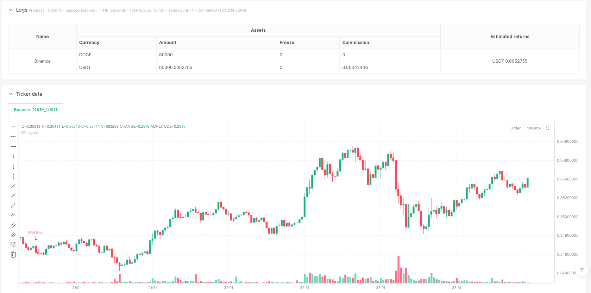
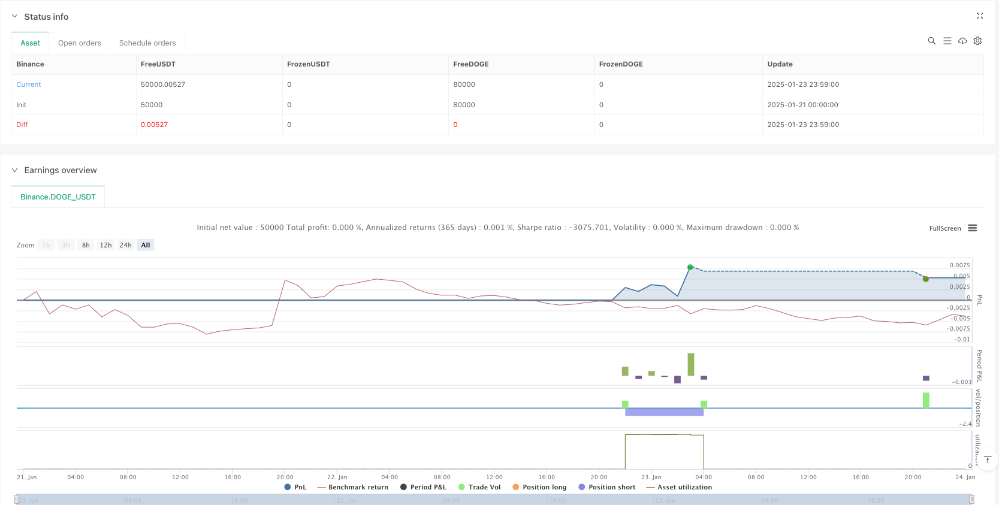

> Name

High-frequency dynamic opening range breakout trading strategy-Dynamic-Opening-Range-Breakout-High-Frequency-Trading-Strategy
> Author

ianzeng123

> Strategy Description





[trans]
#### Overview
This strategy is a high-frequency trading system based on the opening range breakout, focusing on the price range formed between 9:30-9:45 in the morning of the trading day. The strategy makes trading decisions by observing whether the price breaks through this 15-minute range, and combines dynamic stop loss and profit settings to achieve the optimal ratio of risk and return. The system also includes a trading day filtering function, which can selectively conduct transactions based on market characteristics in different time periods.
#### Strategy Principle
The core logic of the strategy is to establish a price range within 15 minutes after the opening of each trading day (9:30-9:45 EST), and record the highest and lowest prices during this period. Once the range is formed, the strategy will monitor the price for a breakthrough before 12 o'clock on the day:
- When the price breaks through the upper track of the range, open a long position, the stop loss is set to 0.5 times the range size, and the take profit is set to 3 times the stop loss
- When the price breaks through the lower track of the range, open a short position. The setting principles of stop loss and take profit are the same.
The strategy also includes a mechanism to prevent double trading, ensuring that only one trade is executed per day and that all positions are closed at the close.
#### Strategic Advantages
1. Time efficiency: The strategy focuses on the most active trading period after the opening of the market and can capture opportunities for large fluctuations in early trading.
2. Risk control: Use dynamic stop-loss and stop-profit settings to determine risk management parameters based on the actual fluctuation range
3. Trading flexibility: Provides the function of selecting trading days on a weekly basis, which can avoid unfavorable trading days in specific market environments.
4. Clear execution: clear trading signals, clear entry and exit conditions, and are not affected by subjective judgments
5. High degree of automation: the entire process is automated to reduce the emotional impact of human intervention
#### Strategy Risk
1. Risk of false breakthrough: The first breakthrough after the opening range is formed may be a false breakthrough, leading to stop-loss exit.
2. Time decay: The strategy only trades in the morning session and may miss good opportunities in other time periods.
3. Volatility dependence: On days when the market is less volatile, the strategy may have difficulty obtaining sufficient profit margins.
4. Impact of slippage: As a high-frequency trading strategy, you may face large slippage losses during the execution process.
5. Market environment dependence: Strategy performance may be significantly affected by the overall market environment
#### Strategy optimization direction
1. Introducing trading volume indicators: false breakthrough signals can be filtered by observing the trading volume at the time of breakthrough
2. Dynamically adjust trading time: optimize the trading time window according to the active period characteristics of different varieties
3. Add trend filtering: combine trend judgment with a larger time period to improve the accuracy of trading direction
4. Optimize stop loss settings: You can consider using the dynamic ATR indicator to set the stop loss distance
5. Add volatility filtering: evaluate volatility levels before the market opens to decide whether to execute day trading
#### Summary
This is a well-designed and logically rigorous opening range breakout strategy that captures trading opportunities by focusing on the most active periods of the market. The advantage of the strategy lies in its clear trading logic and complete risk control mechanism, but at the same time, we need to pay attention to potential risks such as false breakthroughs and market environment dependence. Through continuous optimization and improvement, this strategy is expected to achieve stable returns in actual transactions.
||

#### Overview
This strategy is a high-frequency trading system based on opening range breakouts, focusing on the price range formed during the early trading session from 9:30-9:45. The strategy makes trading decisions by observing whether the price breaks through this 15-minute range, combining dynamic stop-loss and profit-taking settings to optimize the risk-reward ratio. The system also includes trading day selection functionality to selectively trade based on different time period market characteristics.

#### Strategy Principles
The core logic of the strategy is to establish a price range within the first 15 minutes after market opening (9:30-9:45 EST), recording the highest and lowest prices during this period. Once the range is formed, the strategy monitors price breakouts until noon:
- When price breaks above the range, open a long position with stop-loss set at 0.5 times the range size and take-profit at 3 times the stop-loss
- When price breaks below the range, open a short position with similar stop-loss and take-profit settings
The strategy also includes mechanisms to prevent duplicate trades, ensuring only one trade per day, and closes all positions at market close.

#### Strategy Advantages
1. Time Efficiency: Focuses on the most active trading period after market opening, capturing significant early session volatility
2. Risk Control: Employs dynamic stop-loss and take-profit settings based on actual volatility
3. Trading Flexibility: Provides weekly trading day selection to avoid unfavorable market conditions
4. Clear Execution: Clear trading signals with definitive entry and exit conditions, minimizing subjective judgment
5. High Automation: Fully automated execution reduces emotional interference

#### Strategy Risks
1. False Breakout Risk: Initial breakouts after range formation may be false, leading to stop-loss exits
2. Time Decay: Trading only during morning session may miss opportunities in other periods
3. Volatility Dependence: Strategy may struggle to generate sufficient profits on low volatility days
4. Slippage Impact: As a high-frequency strategy, may face significant slippage losses
5. Market Environment Dependence: Strategy performance may be significantly affected by overall market conditions

#### Strategy Optimization Directions
1. Incorporate Volume Indicators: Filter false breakouts by observing volume at breakout points
2. Dynamic Trading Time Adjustment: Optimize trading windows based on different instrument characteristics
3. Add Trend Filters: Combine larger timeframe trend analysis to improve directional accuracy
4. Optimize Stop-Loss Settings: Consider using dynamic ATR indicators for stop-loss distances
5. Add Volatility Filters: Evaluate volatility levels before market opening to determine daily trading execution

#### Summary
This is a well-designed and logically rigorous opening range breakout strategy that captures trading opportunities during the market's most active period. The strategy's strengths lie in its clear trading logic and comprehensive risk control mechanisms, while attention must be paid to potential risks such as false breakouts and market environment dependence. Through continuous optimization and improvement, this strategy has the potential to achieve stable returns in actual trading.[/trans]


> Source (PineScript)

``` pinescript
/*backtest
start: 2025-01-21 00:00:00
end: 2025-01-24 00:00:00
period: 1m
basePeriod: 1m
exchanges: [{"eid":"Binance","currency":"DOGE_USDT"}]
args: [["MaxCacheLen",580,358374]]
*/

// This Pine Script™ code is subject to the terms of the Mozilla Public License 2.0 at https://mozilla.org/MPL/2.0/
// © UKFLIPS69

//@version=6
strategy("ORB", overlay=true, fill_orders_on_standard_ohlc = true)

trade_on_monday = input(false, "Trade on Monday") 
trade_on_tuesday = input(true, "Trade on Tuesday") 
trade_on_wednesday = input(true, "Trade on Wednesday")
trade_on_thursday = input(false, "Trade on Thursday")
trade_on_friday = input(true, "Trade on Friday")
// Get the current day of the week (1=Monday, ..., 6=Saturday, 0=Sunday)
current_day = dayofweek(time) 
current_price = request.security(syminfo.tickerid, "1", close)
// Define trading condition based on the day of the week
is_trading_day = (trade_on_monday and current_day == dayofweek.monday) or
                 (trade_on_tuesday and current_day == dayofweek.tuesday) or
                 (trade_on_wednesday and current_day == dayofweek.wednesday) or
                 (trade_on_thursday and current_day == dayofweek.thursday) or
                 (trade_on_friday and current_day == dayofweek.friday)
// ─── Persistent variables ─────────────────────────
var line  orHighLine       = na   // reference to the drawn line for the OR high
var line  orLowLine        = na   // reference to the drawn line for the OR low
var float orHigh           = na   // stores the open-range high
var float orLow            = na   // stores the open-range low
var int   barIndex930      = na   // remember the bar_index at 9:30
var bool  rangeEstablished = false
var bool  tradeTakenToday  = false  // track if we've opened a trade for the day

// ─── Detect times ────────────────────────────────
is930  = (hour(time, "America/New_York") == 9 and minute(time, "America/New_York") == 30)
is945  = (hour(time, "America/New_York") == 9 and minute(time, "America/New_York") == 45)

// Between 9:30 and 9:44 (inclusive of 9:30 bar, exclusive of 9:45)?
inSession = (hour(time, "America/New_York") == 9 and minute(time, "America/New_York") >= 30 and minute(time, "America/New_York") < 45)

// ─── Reset each day at 9:30 ─────────────────────
if is930
    // Reset orHigh / orLow
    orHigh := na
    orLow  := na
    rangeEstablished := false
    tradeTakenToday  := false
    // Record the bar_index for 9:30
    barIndex930 := bar_index
// ─── ONLY FORM OR / TRADE IF TODAY IS ALLOWED ─────────────────────
if is_trading_day
// ─── Accumulate the OR high/low from 9:30 to 9:44 ─
    if inSession
        orHigh := na(orHigh) ? high : math.max(orHigh, high)
        orLow  := na(orLow)  ? low  : math.min(orLow, low)

// ─── Exactly at 9:45, draw the lines & lock range ─
    if is945 and not na(orHigh) and not na(orLow)

    // Mark that the OR is established
        rangeEstablished := true

// ─── TRADING LOGIC AFTER 9:45, but BEFORE NOON, and if NO trade taken ─
    if rangeEstablished and not na(orHigh) and not na(orLow) 
    // Only trade if it's still BEFORE 12:00 (noon) EST and we haven't taken a trade today
        if hour(time, "America/New_York") < 12 and (not tradeTakenToday)
        // 1) Compute distances for stops & targets
            float stopSize   = 0.5 * (orHigh - orLow)      // half the OR size
            float targetSize = 3 * stopSize      // 3x the stop => 1.5x the entire OR
    
        // 2) Check if price breaks above OR => go long
            if close > orHigh 
            // Only enter a new long if not already in a long position (optional)
                if strategy.position_size <= 0
                    strategy.entry("ORB Long", strategy.long)
                    strategy.exit("Long Exit", from_entry = "ORB Long", stop = orHigh - stopSize, limit  = strategy.position_avg_price + targetSize)
                // Flag that we've taken a trade today
                    tradeTakenToday := true
    
        // 3) Check if price breaks below OR => go short
            if close < orLow 
            // Only enter a new short if not already in a short position (optional)
                if strategy.position_size >= 0
                    strategy.entry("ORB Short", strategy.short)
                    strategy.exit("Short Exit", from_entry = "ORB Short", stop = orLow + stopSize, limit  = strategy.position_avg_price - targetSize)
                // Flag that we've taken a trade today
                    tradeTakenToday := true
if hour(time, "America/New_York") == 16 and minute(time, "America/New_York") == 0
    strategy.close_all()

```

> Detail

https://www.fmz.com/strategy/483111

> Last Modified

2025-02-21 14:02:59
