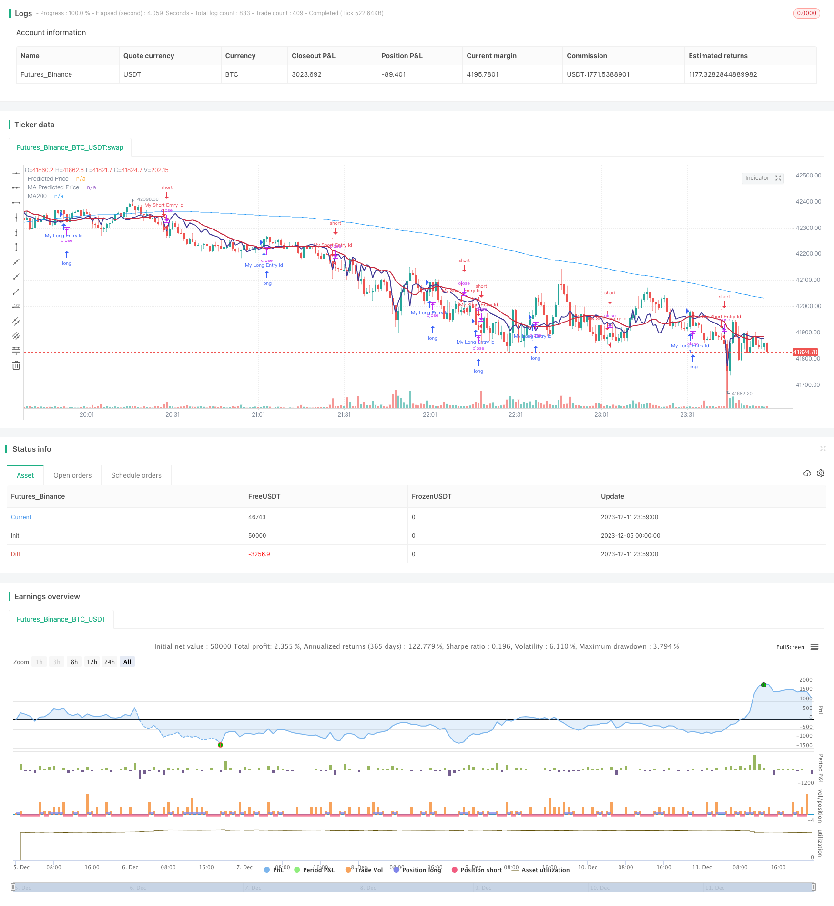

> Name

Dynamic Ideology Trend Reversal Strategy Dynamic-Pattern-Trend-Reversal-Strategy
> Author

ChaoZhang

> Strategy Description


[trans]

## Overview
The dynamic ideological trend reversal strategy uses linear regression to predict prices and combines the ideology formed by moving averages to generate trading signals. When the predicted price crosses the moving average from bottom to top, a buy signal is generated; when the predicted price crosses the moving average from top to bottom, a sell signal is generated to capture the trend reversal.
## Strategy Principle
1. Calculate the linear regression of the stock price based on the trading volume and obtain the predicted value of the price.
2. Calculate the moving average under diferentes conditions
3. When the predicted price crosses the moving average from bottom to top, a buy signal is generated
4. When the predicted price crosses the moving average from top to bottom, a sell signal is generated
5. Combine with MACD indicator to determine the timing of trend reversal
The above signals are combined with multiple confirmations to avoid false breakthroughs, thus improving the accuracy of the signals.
## Advantage Analysis
- Use linear regression to predict price trends and improve signal accuracy
- Combine moving averages to form ideologies and capture trend reversals
- Calculate linear regression based on transaction volume, which is more economically meaningful
- Combine MACD and other indicators for multiple confirmations to reduce false signals
## Risk Analysis
- Parameter settings of linear regression will have a great impact on the results
- Moving average settings also affect signal quality
- Although there is a confirmation mechanism, there is still the risk of false signals
- The code can be further optimized to reduce the number of transactions and increase profitability
## Optimization direction
- Optimize parameters of linear regression and moving averages
- Add confirmation conditions to reduce false signal rate
- Combine more factors to determine the quality of trend reversal
- Optimize the stop loss strategy to reduce the risk of a single transaction
## Summarize
The dynamic ideological trend reversal strategy integrates the ideology formed by linear regression prediction and moving average to capture the opportunity of trend reversal. Compared with a single indicator, it has higher reliability. At the same time, the strategy can further improve signal quality and profitability through parameter adjustment and confirmation condition optimization.
||
## Overview

The Dynamic Pattern Trend Reversal strategy uses linear regression to predict prices and moving average lines to form pattern for generating trading signals. It produces buy signals when the predicted price crosses above the moving average line upwards and sell signals when crossing below downwards, capturing trend reversals.  

## Strategy Logic

1. Calculate linear regression of stock price based on trading volume to obtain predicted price 
2. Compute moving averages under diferentes conditions
3. Generate buy signal when predicted price crosses moving average upwards  
4. Generate sell signal when predicted price crosses moving average downwards
5. Incorporate MACD indicator to determine timing of trend reversal

The combination of above signals with multiple confirmations avoids false breakouts and improves accuracy.

## Advantage Analysis 

- Utilize linear regression to predict price trend, enhancing signal accuracy
- Capture trend reversals via moving average patterns  
- Regression based on trading volume has better economics meaning  
- Multiple confirmations by MACD etc. reduce false signals  

## Risk Analysis

- Parameters of linear regression significantly impact results
- Moving average settings also affect signal quality 
- Despite having confirmations, false signals remain a risk
- Code can be further optimized to reduce trade frequency and improve profit rate  

## Optimization Directions

- Optimize parameters of linear regression and moving averages  
- Add more confirmation conditions to lower false signal rates 
- Incorporate more factors to judge quality of trend reversals
- Enhance stop loss strategies to reduce risks for individual trades   

## Conclusion  

The Dynamic Pattern Trend Reversal strategy integrates linear regression prediction and moving average patterns to capture trend reversals. Compared to single indicator strategies, it has higher reliability. Further improvements on parameters, confirmations and other optimizations can enhance signal quality and profitability.

[/trans]

> Strategy Arguments


|Argument|Default|Description|
|----|----|----|
|v_input_1|21|Strategy Length|
|v_input_2|9|Linear Lookback|


> Source (PineScript)

``` pinescript
/*backtest
start: 2023-12-05 00:00:00
end: 2023-12-12 00:00:00
period: 1m
basePeriod: 1m
exchanges: [{"eid":"Futures_Binance","currency":"BTC_USDT"}]
*/

// This source code is subject to the terms of the Mozilla Public License 2.0 at https://mozilla.org/MPL/2.0/
// © stocktechbot
//@version=5
strategy("Linear Cross", overlay=true, margin_long=100, margin_short=0)

//Linear Regression

vol = volume

// Function to calculate linear regression
linregs(y, x, len) =>
    ybar = math.sum(y, len)/len
    xbar = math.sum(x, len)/len
    b = math.sum((x - xbar)*(y - ybar),len)/math.sum((x - xbar)*(x - xbar),len)
    a = ybar - b*xbar
    [a, b]

// Historical stock price data
price = close

// Length of linear regression
len = input(defval = 21, title = 'Strategy Length')
linearlen=input(defval = 9, title = 'Linear Lookback')
[a, b] = linregs(price, vol, len)

// Calculate linear regression for stock price based on volume
//eps = request.earnings(syminfo.ticker, earnings.actual)
//MA For double confirmation

out = ta.sma(close, 200)
outf = ta.sma(close, 50)
outn = ta.sma(close, 90)
outt = ta.sma(close, 21)
outthree = ta.sma(close, 9)

// Predicted stock price based on volume
predicted_price = a + b*vol

// Check if predicted price is between open and close
is_between = open < predicted_price and predicted_price < close

//MACD
//[macdLine, signalLine, histLine] = ta.macd(close, 12, 26, 9)

// Plot predicted stock price
plot(predicted_price, color=color.rgb(65, 59, 150), linewidth=2, title="Predicted Price")
plot(ta.sma(predicted_price,linearlen), color=color.rgb(199, 43, 64), linewidth=2, title="MA Predicted Price")
//offset = input.int(title="Offset", defval=0, minval=-500, maxval=500)
plot(out, color=color.blue, title="MA200")
[macdLine, signalLine, histLine] = ta.macd(predicted_price, 12, 26, 9)

//BUY Signal

longCondition=false
mafentry =ta.sma(close, 50) > ta.sma(close, 90)
//matentry = ta.sma(close, 21) > ta.sma(close, 50)
matwohun = close > ta.sma(close, 200)
twohunraise = ta.rising(out, 2)
twentyrise = ta.rising(outt, 2)
macdrise = ta.rising(macdLine,2)
macdlong = ta.crossover(predicted_price, ta.wma(predicted_price,linearlen))  and (signalLine < macdLine)
if macdlong and macdrise
    longCondition := true

if (longCondition)
    strategy.entry("My Long Entry Id", strategy.long)
//Sell Signal
lastEntryPrice = strategy.opentrades.entry_price(strategy.opentrades - 1)
daysSinceEntry = len
daysSinceEntry := int((time - strategy.opentrades.entry_time(strategy.opentrades - 1)) / (24 * 60 * 60 * 1000))
percentageChange = (close - lastEntryPrice) / lastEntryPrice * 100
//trailChange = (ta.highest(close,daysSinceEntry) - close) / close * 100

//label.new(bar_index, high, color=color.black, textcolor=color.white,text=str.tostring(int(trailChange)))
shortCondition=false
mafexit =ta.sma(close, 50) < ta.sma(close, 90)
matexit = ta.sma(close, 21) < ta.sma(close, 50)
matwohund = close < ta.sma(close, 200)
twohunfall = ta.falling(out, 3)
twentyfall = ta.falling(outt, 2)
shortmafall = ta.falling(outthree, 1)
macdfall = ta.falling(macdLine,1)
macdsell = macdLine < signalLine
if macdfall and macdsell and (macdLine < signalLine) and ta.falling(low,2)
    shortCondition := true

if (shortCondition)
    strategy.entry("My Short Entry Id", strategy.short)


```

> Detail

https://www.fmz.com/strategy/435270

> Last Modified

2023-12-13 16:52:34
