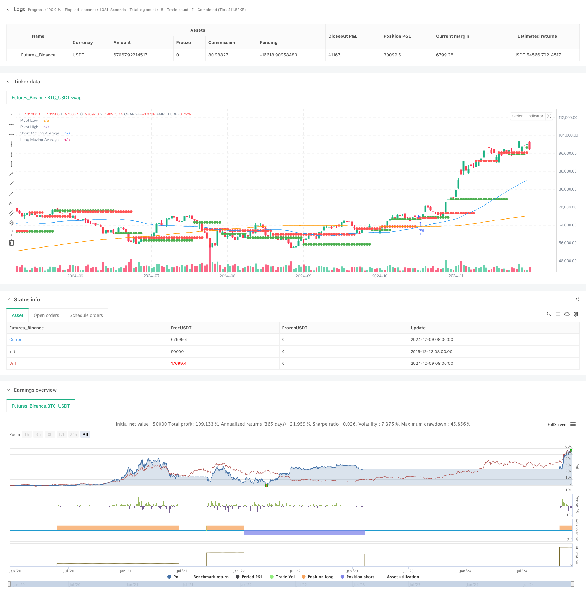

> Name

Dynamic-Pivot-Points-with-Golden-Cross-Optimization-System
> Author

ChaoZhang

> Strategy Description



[trans]
#### Overview
This strategy is a quantitative trading system that combines pivot point theory in technical analysis and moving average crossover signals. This strategy captures trading opportunities when market trends change by identifying key support and resistance levels in the market, combined with crossover signals from short-term and long-term moving averages. The system uses the 50-day and 200-day moving averages as the main indicators, and optimizes the timing of entry and exit by dynamically tracking pivot points.
#### Strategy Principle
The core logic of the strategy is based on two main components: pivot point analysis and moving average crossover signals. The system uses 5 periods as the pivot point calculation period, and dynamically identifies the high and low points of the market through the ta.pivothigh and ta.pivotlow functions. At the same time, the intersection of the 50-day and 200-day simple moving averages is used to form golden cross and death cross signals. When the short-term moving average crosses the long-term moving average and the price breaks through the recent pivot high, the system generates a long signal; when the short-term moving average crosses below the long-term moving average and the price falls below the recent pivot low, the system generates a short signal.
#### Strategic Advantages
1. High signal reliability: By combining the double confirmation of pivot points and moving average crossovers, the reliability of trading signals is greatly improved.
2. Strong dynamic adaptability: The dynamic calculation of pivot points enables the strategy to adapt to different market environments.
3. Improved risk control: Use long-term moving averages as trend filters to effectively reduce the risk of false breakthroughs.
4. The execution logic is clear: the entry and exit conditions are clear, which facilitates real-time operation and backtest verification.
5. Large space for parameter optimization: key parameters can be optimized and adjusted according to different market characteristics.
#### Strategy Risk
1. Risk of volatile market: Frequent false breakthrough signals may occur during the sideways consolidation phase.
2. Lagging risk: The moving average has a certain lag, which may cause delays in entry and exit opportunities.
3. Parameter sensitivity: The choice of pivot point period and moving average period has a greater impact on strategy performance.
4. Market environment dependence: The strategy performs better in strong trending markets, but may not be effective in volatile markets.
5. Retracement control risk: Additional stop loss mechanisms are needed to control the maximum retracement.
#### Strategy optimization direction
1. Introducing volatility filtering: It is recommended to add the ATR indicator to dynamically adjust the position size and stop loss position.
2. Optimize pivot point calculation: Consider using adaptive cycles to calculate pivot points to improve accuracy.
3. Add trend strength confirmation: It is recommended to add trend strength indicators such as ADX to filter weak market signals.
4. Improve fund management: It is recommended to dynamically adjust the position size based on market volatility.
5. Optimize the exit mechanism: you can add trailing stop loss to protect profits.
#### Summary
This strategy combines classic technical analysis methods to build a quantitative trading system with rigorous logic and controllable risks. The core advantage of the strategy is to improve the reliability of transactions through multiple signal confirmations, but at the same time, attention must be paid to adaptability issues in different market environments. Through the suggested optimization direction, the stability and profitability of the strategy are expected to be further improved. The strategy is suitable for application in markets with obvious trends, and investors need to optimize parameters according to specific market characteristics when using it. ||
#### Overview
This strategy is a quantitative trading system that combines pivot point theory and moving average crossover signals in technical analysis. The strategy identifies key support and resistance levels in the market, combined with crossover signals from short-term and long-term moving averages to capture trading opportunities during market trend changes. The system uses 50-day and 200-day moving averages as primary indicators, optimizing entry and exit timing through dynamic pivot point tracking.

#### Strategy Principles
The core logic of the strategy is based on two main components: pivot point analysis and moving average crossover signals. The system uses a 5-period cycle for pivot point calculation, dynamically identifying market highs and lows through ta.pivothigh and ta.pivotlow functions. Meanwhile, it generates golden cross and death cross signals using the crossover of 50-day and 200-day simple moving averages. Long signals are generated when the short-term moving average crosses above the long-term moving average and price breaks above recent pivot highs; short signals are generated when the short-term moving average crosses below the long-term moving average and price breaks below recent pivot lows.

#### Strategy Advantages
1. High signal reliability: Combines pivot points and moving average crossovers for double confirmation, significantly improving trading signal reliability.
2. Strong dynamic adaptability: Dynamic pivot point calculation allows the strategy to adapt to different market environments.
3. Comprehensive risk control: Uses long-term moving average as a trend filter, effectively reducing false breakout risks.
4. Clear execution logic: Entry and exit conditions are well-defined, facilitating live trading and backtesting verification.
5. Large parameter optimization space: Key parameters can be optimized according to different market characteristics.

#### Strategy Risks
1. Choppy market risk: May generate frequent false breakout signals during consolidation phases.
2. Lag risk: Moving averages have inherent lag, potentially causing delayed entry and exit timing.
3. Parameter sensitivity: Choice of pivot point period and moving average periods significantly impacts strategy performance.
4. Market environment dependency: Strategy performs better in strong trend markets but may underperform in ranging markets.
5. Drawdown control risk: Requires additional stop-loss mechanisms to control maximum drawdown.

#### Strategy Optimization Directions
1. Introduce volatility filtering: Recommend adding ATR indicator for dynamic position sizing and stop-loss placement.
2. Optimize pivot point calculation: Consider using adaptive periods for pivot point calculation to improve accuracy.
3. Add trend strength confirmation: Suggest incorporating ADX or similar trend strength indicators to filter weak market signals.
4. Improve money management: Recommend dynamic position sizing based on market volatility.
5. Enhance exit mechanism: Can add trailing stops to protect profits.

#### Summary
The strategy builds a logically rigorous and risk-controlled quantitative trading system by combining classical technical analysis methods. Its core advantage lies in improving trading reliability through multiple signal confirmations, while attention must be paid to adaptability in different market environments. Through the suggested optimization directions, the strategy's stability and profitability can be further enhanced. The strategy is suitable for markets with clear trends, and investors need to optimize parameters according to specific market characteristics when implementing.[/trans]


> Source (PineScript)

``` pinescript
/*backtest
start: 2019-12-23 08:00:00
end: 2024-12-10 08:00:00
period: 1d
basePeriod: 1d
exchanges: [{"eid":"Futures_Binance","currency":"BTC_USDT"}]
*/

//@version=5
strategy("Pivot Points & Golden Crossover Strategy", overlay=true)

// Inputs
length_short = input.int(50, title="Short Moving Average (Golden Cross)")
length_long = input.int(200, title="Long Moving Average (Golden Cross)")
pivot_length = input.int(5, title="Pivot Point Length")
lookback_pivots = input.int(20, title="Lookback Period for Pivots")

// Moving Averages
short_ma = ta.sma(close, length_short)
long_ma = ta.sma(close, length_long)

// Pivot Points
pivot_high = ta.valuewhen(ta.pivothigh(high, pivot_length, pivot_length), high, 0)
pivot_low = ta.valuewhen(ta.pivotlow(low, pivot_length, pivot_length), low, 0)

// Calculate golden crossover
golden_crossover = ta.crossover(short_ma, long_ma)
death_cross = ta.crossunder(short_ma, long_ma)

// Entry and Exit Conditions
long_entry = golden_crossover and close > pivot_high
short_entry = death_cross and close < pivot_low

// Exit conditions
long_exit = ta.crossunder(short_ma, long_ma)
short_exit = ta.crossover(short_ma, long_ma)

// Plot Moving Averages
plot(short_ma, color=color.blue, title="Short Moving Average")
plot(long_ma, color=color.orange, title="Long Moving Average")

// Plot Pivot Levels
plot(pivot_high, color=color.red, linewidth=1, style=plot.style_circles, title="Pivot High")
plot(pivot_low, color=color.green, linewidth=1, style=plot.style_circles, title="Pivot Low")

// Strategy Execution
if (long_entry)
    strategy.entry("Long", strategy.long)
if (long_exit)
    strategy.close("Long")

if (short_entry)
    strategy.entry("Short", strategy.short)
if (short_exit)
    strategy.close("Short")

```

> Detail

https://www.fmz.com/strategy/474869

> Last Modified

2024-12-12 16:12:42
