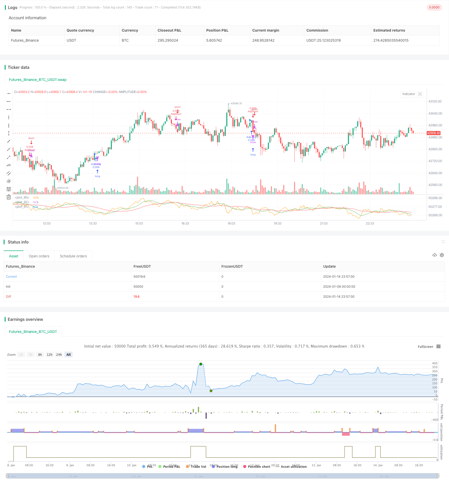

> Name

Dynamic-Position-Sizing-Strategy-Based-on-Equity-Curve
> Author

ChaoZhang

> Strategy Description


 [trans]

## Strategy Overview
The core idea of ​​this strategy is to dynamically adjust the position size according to the trend of the capital curve, increase the position when making profits, and reduce the position when losing money, so as to control the overall risk. This strategy also combines the Chande Momentum Indicator, SuperTrend Indicator and Momentum Indicator to identify trading signals.

## Strategy Principle
This strategy uses two methods to determine whether the capital curve is in a downward trend: 1) Calculate the fast and slow simple moving averages of the capital curve. If the fast SMA is lower than the slow SMA, it is judged to be downward; 2) Calculate the simple moving average of the capital curve and its longer period. If the capital curve is lower than the moving average, it is judged to be downward.
When it is judged that the capital curve is going downward, the position will be reduced or increased by a certain proportion according to the setting. For example, if the reduction is set to 50%, the original 10% position will be reduced to 5%. This strategy increases the position size when making profits and reduces the position size when losing money to control overall risk.
## Strategic Advantages
- Use the capital curve to judge the overall profit and loss of the system, and dynamically adjust positions to help control risks
- Combining multiple indicators to determine entry can increase the probability of profit
- Customizable position adjustment parameters to adapt to different risk preferences
## Strategy Risk
- When the position is enlarged, the loss will also be amplified.
- Improper parameter settings may lead to too aggressive position adjustments
- Position management cannot completely avoid systemic risks
## Optimization ideas
- Test the effects of different position adjustment parameters
- Try other indicator combinations to determine the trend of the capital curve
- Optimize entry conditions and increase winning rate
## Summarize
The overall idea of ​​this strategy is clear. Using the capital curve to dynamically adjust positions can effectively control risks and is worthy of further testing and optimization. Parameter settings and stop-loss strategies also need to be fully considered to avoid risks caused by radical operations.
||

## Strategy Overview

The core idea of this strategy is to dynamically adjust position size based on the trend of the equity curve - increase position size during profit and decrease size during loss to control overall risk. The strategy also combines Chande Momentum indicator, SuperTrend indicator and Momentum indicator to identify trading signals.  

## Strategy Name 

Dynamic Position Sizing Strategy Based on Equity Curve

## Strategy Logic

The strategy uses two methods to determine if the equity curve is in a downtrend: 1) Calculate fast and slow simple moving averages of the equity curve, if the fast SMA is below the slow one, it is considered a downtrend; 2) Calculate the equity curve against its own longer period simple moving average, if the equity is below the moving average line, it is considered a downtrend.

When equity curve downtrend is determined, the position size will be reduced or increased by a certain percentage based on the settings. For example, if 50% reduction is set, the original 10% position size will be reduced to 5%. This mechanism increases position size during profit and decreases size during loss to control overall risk.

## Advantages

- Uses equity curve to judge the overall profit/loss and dynamically adjusts position size to control risk 
- Combining multiple indicators to identify entry signals can improve win rate
- Customizable parameters for position adjustment suit different risk appetites  

## Risks

- Loss can be amplified with increased position size during profit
- Aggressive adjustment due to improper parameter settings
- Position sizing alone cannot completely avoid system risk

## Enhancement Directions 

- Test effectiveness of different position adjustment parameters
- Try other indicators to determine equity curve trend  
- Optimize entry conditions to improve win rate

## Conclusion

The overall logic of this strategy is clear - it dynamically adjusts position size based on equity curve, which helps effectively control risk. Further testing and optimization of parameters and stop loss strategies are needed to avoid the risk of aggressive maneuvers. 

[/trans]

> Strategy Arguments


|Argument|Default|Description|
|----|----|----|
|v_input_bool_1|true|Use Trading the Equity Curve Position Sizing|
|v_input_float_1|10|Initial % Equity|
|v_input_int_1|25|Slow SMA Period|
|v_input_int_2|9|Fast SMA Period|
|v_input_bool_2|true|Use Fast/Slow Avg|
|v_input_string_1|0|Position Size Adjustment: Reduce size by (%)|Increase size by (%)|
|v_input_int_3|50|Increase/Decrease % Equity by:|
|v_input_int_4|9|Chande Momentum Length|
|v_input_int_5|10|Chande Momentum Signal|
|v_input_int_6|10|SuperTrend ATR Length|
|v_input_float_2|3|SuperTrend Factor|
|v_input_int_7|12|Momentum Length|


> Source (PineScript)

``` pinescript
/*backtest
start: 2024-01-08 00:00:00
end: 2024-01-15 00:00:00
period: 3m
basePeriod: 1m
exchanges: [{"eid":"Futures_Binance","currency":"BTC_USDT"}]
*/

// This source code is subject to the terms of the Mozilla Public License 2.0 at https://mozilla.org/MPL/2.0/
// © shardison
//@version=5

//EXPLANATION
//"Trading the equity curve" as a risk management method is the 
//process of acting on trade signals depending on whether a system’s performance
//is indicating the strategy is in a profitable or losing phase.
//The point of managing equity curve is to minimize risk in trading when the equity curve is  in a downtrend. 
//This strategy has two modes to determine the equity curve downtrend:
//By creating two simple moving averages of a portfolio's equity curve - a short-term
//and a longer-term one - and acting on their crossings. If the fast SMA is below
//the slow SMA, equity downtrend is detected (smafastequity < smaslowequity).
//The second method is by using the crossings of equity itself with the longer-period SMA (equity < smasloweequity).
//When "Reduce size by %" is active, the position size will be reduced by a specified percentage
//if the equity is "under water" according to a selected rule. If you're a risk seeker, select "Increase size by %"
//- for some robust systems, it could help overcome their small drawdowns quicker.

strategy("Use Trading the Equity Curve Postion Sizing", shorttitle="TEC", default_qty_type = strategy.percent_of_equity, default_qty_value = 10, initial_capital = 100000)

//TRADING THE EQUITY CURVE INPUTS
useTEC           = input.bool(true, title="Use Trading the Equity Curve Position Sizing")
defulttraderule  = useTEC ? false: true
initialsize      = input.float(defval=10.0, title="Initial % Equity")
slowequitylength = input.int(25, title="Slow SMA Period")
fastequitylength = input.int(9, title="Fast SMA Period")
seedequity = 100000 * .10
if strategy.equity == 0
    seedequity
else
    strategy.equity
slowequityseed   = strategy.equity > seedequity ? strategy.equity : seedequity
fastequityseed   = strategy.equity > seedequity ? strategy.equity : seedequity
smaslowequity    = ta.sma(slowequityseed, slowequitylength)
smafastequity    = ta.sma(fastequityseed, fastequitylength)
equitycalc       = input.bool(true, title="Use Fast/Slow Avg", tooltip="Fast Equity Avg is below Slow---otherwise if unchecked uses Slow Equity Avg below Equity")
sizeadjstring    = input.string("Reduce size by (%)", title="Position Size Adjustment", options=["Reduce size by (%)","Increase size by (%)"])
sizeadjint       = input.int(50, title="Increase/Decrease % Equity by:")
equitydowntrendavgs = smafastequity < smaslowequity
slowequitylessequity = strategy.equity < smaslowequity

equitymethod = equitycalc ? equitydowntrendavgs : slowequitylessequity

if sizeadjstring == ("Reduce size by (%)")
    sizeadjdown = initialsize * (1 - (sizeadjint/100))
else
    sizeadjup = initialsize * (1 + (sizeadjint/100))
c = close
qty = 100000 * (initialsize / 100) / c
if useTEC and equitymethod
    if sizeadjstring == "Reduce size by (%)"
        qty := (strategy.equity * (initialsize / 100) * (1 - (sizeadjint/100))) / c
    else
        qty := (strategy.equity * (initialsize / 100) * (1 + (sizeadjint/100))) / c
    
//EXAMPLE TRADING STRATEGY INPUTS
CMO_Length = input.int(defval=9, minval=1, title='Chande Momentum Length')
CMO_Signal = input.int(defval=10, minval=1, title='Chande Momentum Signal')

chandeMO = ta.cmo(close, CMO_Length)
cmosignal = ta.sma(chandeMO, CMO_Signal)

SuperTrend_atrPeriod = input.int(10, "SuperTrend ATR Length")
SuperTrend_Factor = input.float(3.0, "SuperTrend Factor", step = 0.01)
Momentum_Length = input.int(12, "Momentum Length")
price = close

mom0 = ta.mom(price, Momentum_Length)
mom1 = ta.mom( mom0, 1)
[supertrend, direction] = ta.supertrend(SuperTrend_Factor, SuperTrend_atrPeriod)
stupind = (direction < 0 ? supertrend : na)
stdownind = (direction < 0? na : supertrend)

//TRADING CONDITIONS
longConditiondefault = ta.crossover(chandeMO, cmosignal) and (mom0 > 0 and mom1 > 0 and close > stupind) and defulttraderule
if (longConditiondefault)
    strategy.entry("DefLong", strategy.long, qty=qty)

shortConditiondefault = ta.crossunder(chandeMO, cmosignal) and (mom0 < 0 and mom1 < 0 and close < stdownind) and defulttraderule
if (shortConditiondefault)
    strategy.entry("DefShort", strategy.short, qty=qty)
    
longCondition = ta.crossover(chandeMO, cmosignal) and (mom0 > 0 and mom1 > 0 and close > stupind) and useTEC
if (longCondition)
    strategy.entry("AdjLong", strategy.long, qty = qty)

shortCondition = ta.crossunder(chandeMO, cmosignal) and (mom0 < 0 and mom1 < 0 and close < stdownind) and useTEC
if (shortCondition)
    strategy.entry("AdjShort", strategy.short, qty = qty)
plot(strategy.equity)
plot(smaslowequity, color=color.new(color.red, 0))
plot(smafastequity, color=color.new(color.green, 0))
```

> Detail

https://www.fmz.com/strategy/438939

> Last Modified

2024-01-16 15:06:39
