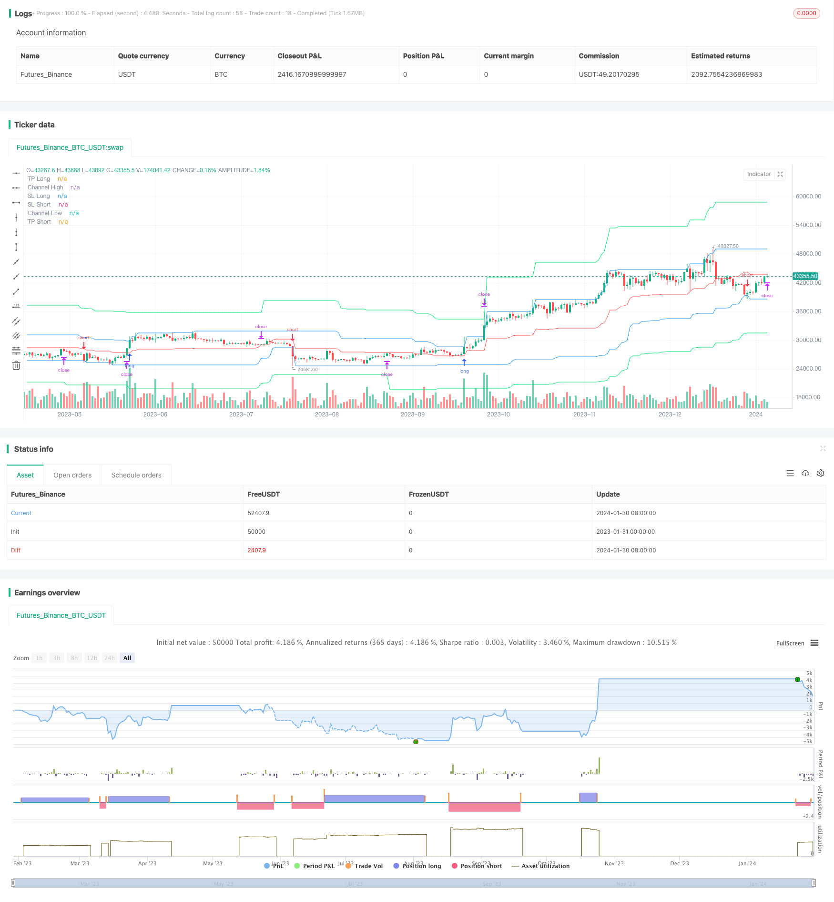

> Name

Dynamic-Price-Channel-with-Stop-Loss-Tracking-Strategy
> Author

ChaoZhang

> Strategy Description


[trans]

## Overview
This strategy is developed based on the Donchian Price Channel indicator. This indicator forms a price channel by calculating the highest price and lowest price within a certain period. The strategy uses price channels to achieve two-way trading and sets stop loss and take profit prices. The stop-loss price is fixed to the midline of the price channel, and the take-profit price is set to a certain percentage outside the upper and lower limits of the price channel. The strategy also implements take profit and stop loss tracking.
## Strategy Principle
First, the strategy calculates the upper limit h and lower limit l of the price channel based on the parameter pclen. The center line center is the average of the upper and lower limits of the price channel. Then based on the take-profit parameters tp of long and short positions, the take-profit prices tpl and tps are calculated. The stop loss price is fixed at the center line of the price channel. When the price breaks through the price channel, trading positions in different directions are calculated based on the risk size risklong and riskshort. The strategy will close the position when price re-enters the channel. In addition, time filtering is also set up to only trade within the specified date range.
The specific transaction logic is:
Signal for opening a long position: open a long position when the price is greater than the upper limit of the channel h and falls back into the channel
Signal for closing long positions: Close long positions when the price is lower than the center line of the channel (stop loss) or higher than the take profit price tpl (take profit)
Short position opening signal: Open a short position when the price is less than the lower limit of the channel l and falls back into the channel
Short position closing signal: short position is closed when the price is higher than the center line of the channel (stop loss) or lower than the take profit price tps (take profit)
## Advantage Analysis
This strategy has the following advantages:
1. Two-way trading can capture the reversal of price trends
2. Use the price channel to determine the trend direction and avoid false breakthroughs
3. Set stop-profit and stop-loss to control risks
4. Calculate the risk associated with the position size to achieve controllable risk
5. Implement stop-profit and stop-loss tracking to lock in more profits
## Risk Analysis
This strategy also has certain risks:
1. Improper setting of price channel parameters may lead to excessive trading frequency or missed trading opportunities.
2. Too lenient stop loss price may increase risk exposure
3. Trailing take profit may be triggered early during periods of high volatility
These risks can be reduced and controlled by adjusting parameters and manual monitoring.
## Optimization direction
This strategy can also be optimized from the following aspects:
1. Add more indicators to judge and filter to avoid frequent opening and closing of positions in volatile market conditions
2. You can test different take-profit and stop-loss algorithms, such as ATR stop-loss, etc.
3. Expand into a cross-time period trading system and use more advanced time periods to determine the trend direction
4. Add a position management module to adjust positions according to the fund usage ratio
5. Use machine learning models to determine the success rate of price breakthroughs and avoid false breakthroughs
## Summarize
Overall, this strategy is an effective way to achieve two-way trading using the price channel indicator. The stop-profit, stop-loss and position control modules are set up to control risks well. Through certain optimization and adjustment, it can become a powerful quantitative trading strategy.
||

## Overview

This strategy is developed based on the Donchian price channel indicator. The indicator forms a price channel by calculating the highest and lowest prices over a certain period. The strategy utilizes the price channel to implement two-way trading and sets stop loss and take profit prices. The stop loss price is fixed to the middle line of the price channel, and the take profit price is set to a certain percentage beyond the upper and lower limits of the price channel. The strategy also implements tracking of stop loss and take profit.

## Strategy Principle  

Firstly, the strategy calculates the upper limit h and lower limit l of the price channel based on the parameter pclen. The middle line center is the average of the upper and lower limits of the price channel. Then, take profit prices tpl and tps are calculated according to the take profit parameters tp for long and short positions. The stop loss price is fixed to the middle line center of the price channel. When the price breaks through the price channel, trading positions of different directions are calculated according to the risk sizes risklong and riskshort. The strategy will close positions when the price re-enters the channel. In addition, time filtering is set to only trade within the specified date range.

The specific trading logic is:

Long entry signal: open long when price is greater than the channel upper limit h and falls back into the channel  

Long exit signal: close long when price is lower than the channel middle line center (stop loss) or higher than take profit price tpl (take profit)

Short entry signal: open short when price is less than the channel lower limit l and falls back into the channel  

Short exit signal: close short when price is higher than the channel middle line center (stop loss) or lower than take profit price tps (take profit)

## Advantage Analysis

The advantages of this strategy are:

1. Two-way trading can capture reversals of price trends
2. Use price channel to determine trend direction and avoid false breakouts 
3. Set stop loss and take profit to control risks
4. Calculate position size associated with risk size to achieve controllable risks
5. Implement tracking of stop loss and take profit to lock in more profits

## Risk Analysis

There are also some risks in this strategy:

1. Improper parameter settings of price channel may lead to too high trading frequency or missing trading opportunities
2. Stop loss price set too wide may increase risk exposure  
3. Tracking take profit may trigger prematurely in high volatility periods

These risks can be reduced and controlled by adjusting parameters and manual monitoring.

## Optimization Directions   

This strategy can also be optimized in the following aspects:

1. Add more indicator filters to avoid frequent opening and closing in range-bound markets
2. Different stop loss and take profit algorithms can be tested, such as ATR stop loss
3. Expand to a cross-timeframe trading system using higher timeframe to determine trend direction  
4. Add position sizing module to adjust positions based on capital utilization ratio
5. Incorporate machine learning models to judge the success rate of price breakouts to avoid false breakouts

## Conclusion

In conclusion, this is an effective strategy to implement two-way trading using price channel indicators. With proper stop loss, take profit, and position sizing control modules, risks can be well controlled. With some optimizations and adjustments, it can become a powerful quantitative trading strategy.

[/trans]

> Strategy Arguments


|Argument|Default|Description|
|----|----|----|
|v_input_1|true|Long|
|v_input_2|true|Short|
|v_input_3|20|Take-profit, %|
|v_input_4|0|Take-profit type: 2. Fix|1. None|3. Trailing|
|v_input_5|0|Take-profit type: 2. Center|1. None|
|v_input_6|5|Risk size for long, %|
|v_input_7|5|Risk size for short, %|
|v_input_8|50|Price Channel Length|
|v_input_9|true|Show lines|
|v_input_10|false|Show Background|
|v_input_11|true|Show Offset|
|v_input_12|true|Show label|
|v_input_13|1900|From Year|
|v_input_14|2100|To Year|
|v_input_15|true|From Month|
|v_input_16|12|To Month|
|v_input_17|true|From day|
|v_input_18|31|To day|


> Source (PineScript)

``` pinescript
/*backtest
start: 2023-01-31 00:00:00
end: 2024-01-31 00:00:00
period: 1d
basePeriod: 1h
exchanges: [{"eid":"Futures_Binance","currency":"BTC_USDT"}]
*/

//Noro
//2020

//@version=4
strategy(title = "Noro's RiskDonchian Strategy", shorttitle = "RiskDonchian str", overlay = true, default_qty_type = strategy.percent_of_equity, initial_capital = 100, default_qty_value = 100, commission_value = 0.1)

//Settings
needlong = input(true, defval = true, title = "Long")
needshort = input(true, defval = true, title = "Short")
tp = input(defval = 20.0, minval = 1, title = "Take-profit, %")
tptype = input(defval = "2. Fix", options = ["1. None", "2. Fix", "3. Trailing"], title = "Take-profit type")
sltype = input(defval = "2. Center", options = ["1. None", "2. Center"], title = "Take-profit type")
risklong  = input(5.0, minval = 0.0, maxval = 99.9, title = "Risk size for long, %")
riskshort = input(5.0, minval = 0.0, maxval = 99.9, title = "Risk size for short, %")
pclen = input(50, minval = 1, title = "Price Channel Length")
showll = input(true, defval = true, title = "Show lines")
showbg = input(false, defval = false, title = "Show Background")
showof = input(true, defval = true, title = "Show Offset")
showlabel = input(true, defval = true, title = "Show label")
fromyear = input(1900, defval = 1900, minval = 1900, maxval = 2100, title = "From Year")
toyear = input(2100, defval = 2100, minval = 1900, maxval = 2100, title = "To Year")
frommonth = input(01, defval = 01, minval = 01, maxval = 12, title = "From Month")
tomonth = input(12, defval = 12, minval = 01, maxval = 12, title = "To Month")
fromday = input(01, defval = 01, minval = 01, maxval = 31, title = "From day")
today = input(31, defval = 31, minval = 01, maxval = 31, title = "To day")

//Price Channel
h = highest(high, pclen)
l = lowest(low, pclen)
center = (h + l) / 2

//Take-profit
tpl = 0.0
tpl := tptype == "2. Fix" and strategy.position_size > 0 ? tpl[1] : h * (100 + tp) / 100

//Stop-loss
tps = 0.0
tps := tptype == "2. Fix" and strategy.position_size < 0 ? tps[1] : l * (100 - tp) / 100

//Lines
tplcol = showll and needlong and tptype != "1. None" ? color.lime : na
pclcol = showll and needlong ? color.blue : na
sllcol = showll and needlong and sltype != "1. None" ? color.red : na
tpscol = showll and needshort and tptype != "1. None" ? color.lime : na
pcscol = showll and needshort ? color.blue : na
slscol = showll and needshort and sltype != "1. None" ? color.red : na
offset = showof ? 1 : 0
plot(tpl, offset = offset, color = tplcol, title = "TP Long")
plot(h, offset = offset, color = pclcol, title = "Channel High")
plot(center, offset = offset, color = sllcol, title = "SL Long")
plot(center, offset = offset, color = slscol, title = "SL Short")
plot(l, offset = offset, color = pcscol, title = "Channel Low")
plot(tps, offset = offset, color = tpscol, title = "TP Short")

//Background
size = strategy.position_size
bgcol = showbg == false ? na : size > 0 ? color.lime : size < 0 ? color.red : na
bgcolor(bgcol, transp = 70)

//Lot size
risksizelong = -1 * risklong
risklonga = ((center / h) - 1) * 100
coeflong = abs(risksizelong / risklonga)
lotlong = (strategy.equity / close) * coeflong
risksizeshort = -1 * riskshort
riskshorta = ((center / l) - 1) * 100
coefshort = abs(risksizeshort / riskshorta)
lotshort = (strategy.equity / close) * coefshort

//Trading
truetime = time > timestamp(fromyear, frommonth, fromday, 00, 00) and time < timestamp(toyear, tomonth, today, 23, 59)
mo = 0
mo := strategy.position_size != 0 ? 0 : high >= center[1] and low <= center[1] ? 1 : mo[1]

if h > 0
    longlimit = tptype == "1. None" ? na : tpl
    longstop = sltype == "1. None" ? na : center
    strategy.entry("Long", strategy.long, lotlong, stop = h, when = strategy.position_size <= 0 and needlong and truetime and mo)
    strategy.exit("TP Long", "Long", limit = longlimit, stop = longstop)
    shortlimit = tptype == "1. None" ? na : tps
    shortstop = sltype == "1. None" ? na : center
    strategy.entry("Short", strategy.short, lotshort, stop = l, when = strategy.position_size >= 0 and needshort and truetime and mo)
    strategy.exit("Exit Short", "Short", limit = shortlimit, stop = shortstop)
if time > timestamp(toyear, tomonth, today, 23, 59)
    strategy.close_all()
    strategy.cancel("Long")
    strategy.cancel("Short")
    
if showlabel

    //Drawdown
    max = 0.0
    max := max(strategy.equity, nz(max[1]))
    dd = (strategy.equity / max - 1) * 100
    min = 100.0
    min := min(dd, nz(min[1]))
    
    //Label
    min := round(min * 100) / 100
    labeltext = "Drawdown: " + tostring(min) + "%"
    var label la = na
    label.delete(la)
    tc = min > -100 ? color.white : color.red
    osx = timenow + round(change(time)*10)
    osy = highest(100)
```

> Detail

https://www.fmz.com/strategy/440687

> Last Modified

2024-02-01 10:52:33
