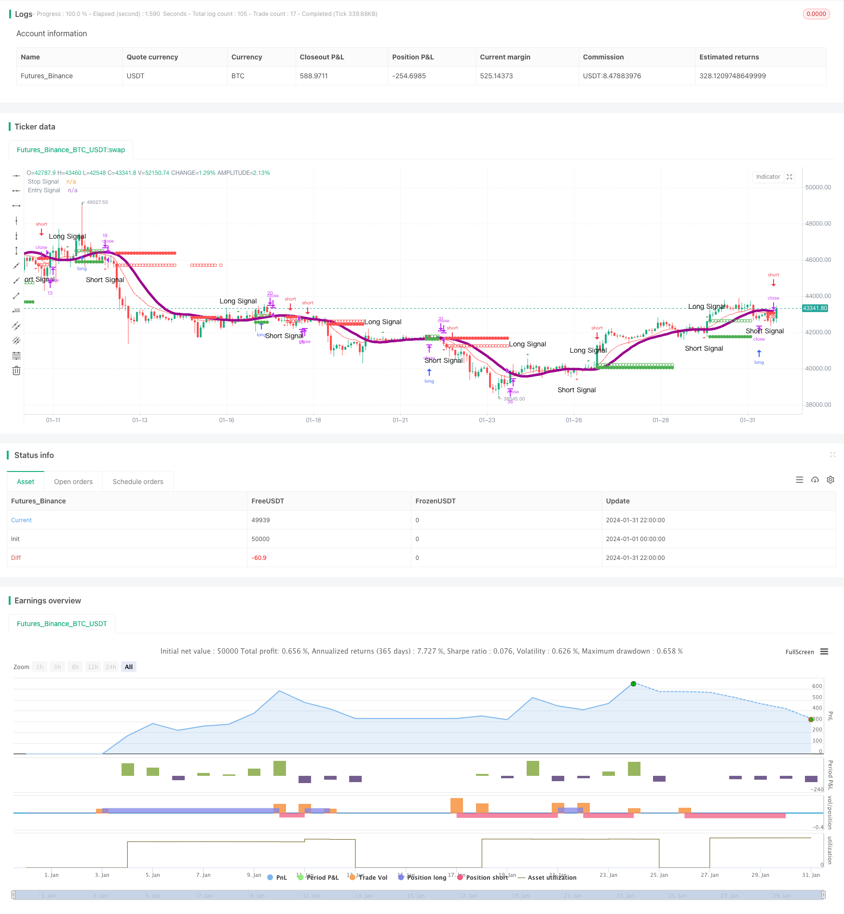

> Name

Dynamic-Regression-Channel-Strategy
> Author

ChaoZhang

> Strategy Description


[trans]
## Overview
The dynamic regression channel strategy is a quantitative trading strategy that uses linear regression to analyze price trends and combines dynamic stop loss to achieve trend tracking. This strategy uses linear regression to draw price channels, determines the signal when the price breaks through the channel, and issues buy and sell orders. At the same time, the strategy will track the price and update the stop loss position in real time to lock in profits.
## Strategy Principle
This strategy first calculates the linear regression curve of the price to determine whether the price breaks through the upward or downward regression channel. When the price exceeds the upper band of the channel, a buy signal is generated; when the price falls below the lower band of the channel, a sell signal is generated.
After entering the market, the strategy will track the price breaking through the stop-loss moving average in real time. If it is a long order and the price falls below the stop-loss moving average, a stop-loss sell order will be issued; if it is a short order and the price exceeds the stop-loss moving average, a stop-loss buy order will be issued. This way you can lock in profits and control risks.
It should be noted that if the price breaks through the channel again and implements reverse operation, the strategy will immediately close the original position and change to reverse trading.
## Advantage Analysis
This strategy combines trend and reversal trading ideas and can follow the overall price trend while seizing short-term adjustment opportunities. The real-time updated stop loss strategy can also effectively control risks and is a more balanced trading method.
Compared with the simple moving average strategy, the dynamic regression channel strategy is more sensitive to price changes and can reduce false trades. In addition, this strategy only takes action when the price breaks through the upper and lower rails of the channel, which is helpful to avoid disorderly aggressive trading.
## Risk Analysis
This strategy mainly faces the risk caused by inaccurate regression curve fitting. If the range of the regression channel is set improperly or is too broad, it will increase the probability of invalid transactions. If the channel is too narrow, trading opportunities will be missed.
In addition, the setting of stop loss position is also critical. A stop loss that is too close can be easily triggered by short-term price fluctuations; a stop loss that is too loose cannot achieve the effect of risk control. Parameters need to be adjusted according to different varieties.
## Optimization direction
You can consider automatically optimizing parameters according to different periods or varieties to make the return channel and stop loss line more in line with the price trend. For example, machine learning algorithms can be combined to train optimal parameters.
On the other hand, you can try different types of regression methods, such as polynomial regression, local weighted regression, etc., to make the fitting effect better. Or combine multiple regression indicators to construct trading rules to improve strategy stability.
## Summarize
The dynamic regression channel strategy comprehensively uses trend and reversal analysis methods to follow the overall price trend while seizing short-term adjustment opportunities for trading. The key return channel and stop loss position settings have an important impact on the strategy effect. Through parameter optimization and model iteration, the trading strategy can be further improved.
||

## Overview

The Dynamic Regression Channel strategy utilizes linear regression analysis of price trends combined with dynamic stop loss to implement trend following in quantitative trading. The strategy employs linear regression to plot a price channel and generate buy and sell signals when prices break out of the channel. At the same time, the strategy tracks prices in real-time to update stop loss levels to lock in profits.

## Strategy Logic  

The strategy first calculates a linear regression curve of prices to determine if prices break out above or below the regression channel. When prices rise above the upper rail of the channel, a buy signal is generated. When prices fall below the lower rail, a sell signal is triggered.  

After entering a position, the strategy keeps tracking if prices break the stop loss moving average line. For long orders, if prices fall below the stop loss line, a stop loss sell order will be issued. For short orders, if prices rise above the stop loss line, a stop loss buy order will be triggered. This locks in profits and controls risks.  

It is important to note that if prices break the channel again reversing direction, the strategy will immediately flatten the original position and switch to trade in the opposite direction.  

## Advantage Analysis

This strategy combines both trend following and mean reversion concepts, riding with the overall price trend while catching short-term reversals. The dynamic stop loss also effectively controls risks. As such, it is a balanced trading approach.  

Compared with simple moving average strategies, the Dynamic Regression Channel Strategy is more sensitive to price changes and can reduce mistrades. In addition, the strategy only trades on breakouts of the channel, avoiding unrestrained aggressive trades.  

## Risk Analysis  

The main risk lies in inaccurate fitting of the regression curve. If the channel range is set improperly, being too wide or too narrow, it will increase invalid trades or miss trading opportunities.  

In addition, proper stop loss positioning is critical. A stop loss too close to market prices is prone to premature liquidation by short-term volatility while a stop loss too far away cannot serve its purpose of risk control. Fine tuning is needed across different products.  

## Optimization  

Consider auto-optimizing parameters for different periods or products to make the regression channel and stop loss line fit better to price trends. For instance, machine learning algorithms can potentially be leveraged to train optimal parameters.  

Alternatively, different types of regression such as polynomial regression and locally weighted regression can be tested to improve fitting. Combining multiple regression metrics to construct trading rules may also enhance strategy stability.  

## Conclusion  

The Dynamic Regression Channel Strategy skillfully utilizes both trend following and mean reversion techniques, riding the overall price trend while capturing short-term reversals. Proper tuning of the key regression channel and stop loss parameters is vital to strategy performance. Further refinements can be made through parameter optimization and model iteration.

[/trans]

> Strategy Arguments


|Argument|Default|Description|
|----|----|----|
|v_input_int_1|21|Slope EMA|
|v_input_int_2|13|Stop EMA|
|v_input_int_3|21|Slope Lenght|


> Source (PineScript)

``` pinescript
/*backtest
start: 2024-01-01 00:00:00
end: 2024-01-31 23:59:59
period: 2h
basePeriod: 15m
exchanges: [{"eid":"Futures_Binance","currency":"BTC_USDT"}]
*/

//@version=5
strategy("Estratégia de Regressão Linear", shorttitle="Regressão Linear Estratégia", overlay=true, initial_capital = 100, default_qty_value = 10, default_qty_type = strategy.percent_of_equity)

// média móvel exponencial para definição de regressao linear
var SlopeEMASize = input.int(defval = 21, title = "Slope EMA" )
// ema_length = 21
slope_ema = ta.ema(close, SlopeEMASize)

// média móvel exponencial para definição de nivel de stop
var StopEMASize = input.int(defval = 13, title = "Stop EMA" )
stop_ema = ta.ema(close, StopEMASize)

// Variáveis para controle de posição
var float long_stop_level = na
var float long_entry_level = na
var bool long_signal = false
var bool long_order_open = false
var int long_order_id = 0


var float short_stop_level = na
var float short_entry_level = na
var bool short_signal = false
var bool short_order_open = false
var int short_order_id = 0

// Regressão linear para uso como sinal de entrada 
var SlopeLenght = input.int(defval = 21, title = "Slope Lenght" )
entry_signal = ta.linreg(slope_ema, SlopeLenght, 0)

//Variaveis com a indicação do pivot da regressao
long_entry_signal = ta.crossover(entry_signal, entry_signal[1])
short_entry_signal = ta.crossunder(entry_signal, entry_signal[1])

// Condição de entrada (reversão da regressão)
if long_entry_signal
    long_signal := true
    short_signal := false
    long_entry_level := high
    long_stop_level := low

if short_entry_signal
    short_signal := true
    long_signal := false
    short_entry_level := low
    short_stop_level := high


// Indica quando o preço cruzou o nível de stop 
price_cross_stop_ema_up = ta.crossover(close, stop_ema)
price_cross_stop_ema_down = ta.crossunder(close, stop_ema)

// Mover o stop quando o preço cruzar a nível stop e operação long ativa
if long_signal and long_order_open and price_cross_stop_ema_down
    if low > long_entry_level
        long_stop_level := high

// Mover o stop quando o preço cruzar a nível stop e operação short ativa
if short_signal and short_order_open and price_cross_stop_ema_up
    if high < short_stop_level
        short_stop_level := low

// Sair da posição se houver nova reversão da regressão
if long_order_open or short_order_open
    if long_entry_signal //and short_order_open
        strategy.close(str.tostring(short_order_id), comment ="Inversão Sinal("+str.tostring(short_order_id)+")")
        short_order_open:= false
    if short_entry_signal //and long_order_open
        strategy.close(str.tostring(long_order_id), comment = "Inversão Sinal("+str.tostring(long_order_id)+")")
        long_order_open:=false

// Sinais de compra e venda com base no stop
if long_signal and close > long_entry_level and not long_order_open
    if strategy.opentrades != 0
        strategy.cancel_all()

    long_order_id+=1
    // strategy.order(str.tostring(long_order_id), strategy.long, comment="Open Long("+str.tostring(long_order_id)+")", limit = long_entry_level) 
    strategy.entry(str.tostring(long_order_id), strategy.long, comment="Open Long("+str.tostring(long_order_id)+")", limit = long_entry_level)
    long_order_open := true
    // log.info("Open Long:"+str.tostring(long_order_id))

if short_signal and close < short_entry_level and not short_order_open
    if strategy.opentrades != 0
        strategy.cancel_all()

    short_order_id+=1
    // strategy.order(str.tostring(short_order_id), strategy.short, comment="Open Short("+str.tostring(short_order_id)+")", limit = short_entry_level)
    strategy.entry(str.tostring(short_order_id), strategy.short, comment="Open Short("+str.tostring(short_order_id)+")", limit = short_entry_level)
    short_order_open := true
    // log.info("Open Short:"+str.tostring(short_order_id))

// Sinais de compra e venda com base no stop
if long_signal and close < long_stop_level and long_order_open
    strategy.close(str.tostring(long_order_id), comment = "Stop Atingido("+str.tostring(long_order_id)+")", immediately = true)
    long_order_open := false

if short_signal and close > short_stop_level and short_order_open
    strategy.close(str.tostring(short_order_id),comment = "Stop Atingido("+str.tostring(short_order_id)+")", immediately = true)
    short_order_open := false

// Plotagem da regressão e do stop

plot(stop_ema, title="Stop Signal", color=color.red)
plot(entry_signal,"Entry Signal", linewidth = 5, color = color.rgb(155, 0, 140))

plotshape(long_order_open?long_stop_level:na, title = "Long Stop Level", color = color.green, location = location.absolute)
plotshape(long_order_open?long_entry_level:na, title="Long Entry Value",location=location.absolute, color = color.green, style = shape.circle)
plotshape(series=long_entry_signal, title="Long Signal", location=location.abovebar, color=color.green, style=shape.triangleup, size=size.small, text = "Long Signal")

plotshape(short_order_open?short_stop_level:na, title = "Short Stop Level", color = color.red, location = location.absolute)
plotshape(short_order_open?short_entry_level:na, title="Short Entry Value",location=location.absolute, color = color.red, style = shape.circle)

plotshape(series=short_entry_signal, title="Short Signal", location=location.belowbar, color=color.red, style=shape.triangledown, size=size.small, text="Short Signal")


```

> Detail

https://www.fmz.com/strategy/442622

> Last Modified

2024-02-23 12:14:49
