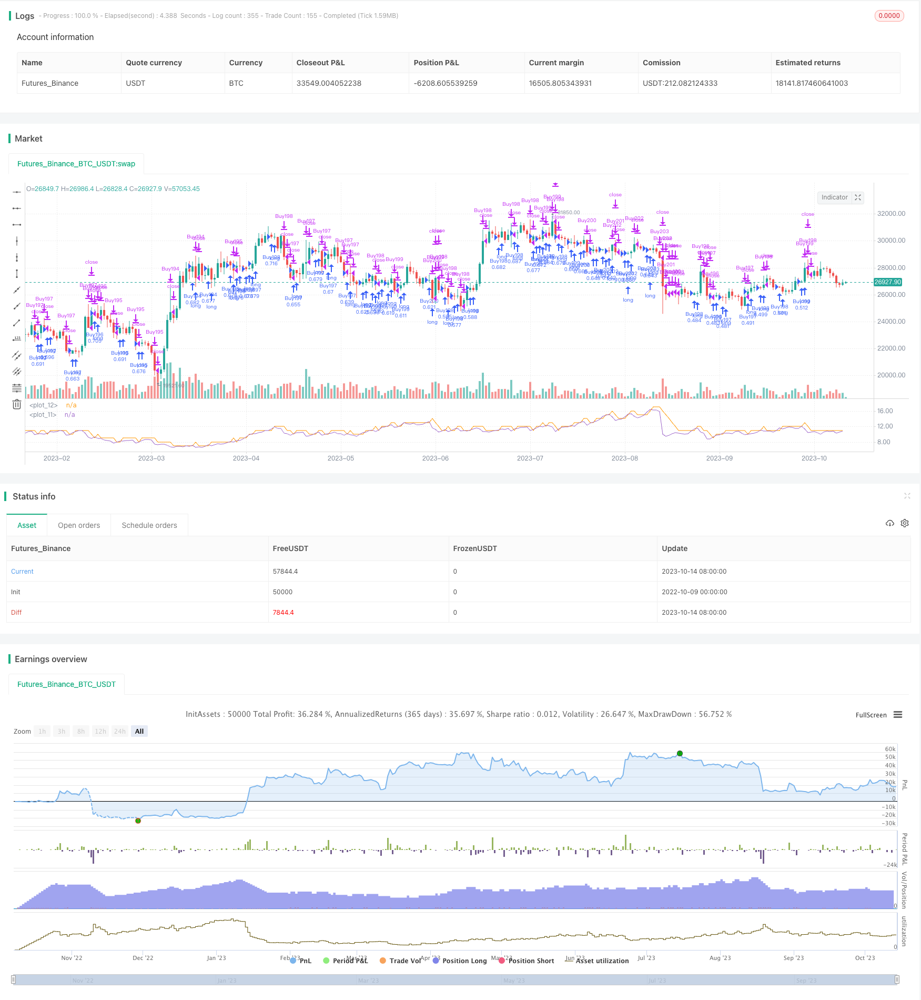

> Name

Dynamic-Risk-Adjusted-Leverage-Trading-System
> Author

ChaoZhang

> Strategy Description



[trans]

## Overview
The trading system, called the Dynamic Risk Adjusted Leveraged Trading System, is designed to manage trades based on current market volatility relative to its historical average. The system calculates the target opening quantity based on the ATR (Average True Range) indicator and adjusts the leverage accordingly. The system adopts the pyramid position opening method, allowing multiple positions to be opened at the same time.
## Strategy Principle
The specific steps of the system are as follows:
1. Calculate the ATR value of the 14-day ATR period and divide it by the current closing price for normalization.
2. Calculate the 100-day simple moving average (SMA) of the normalized ATR.
3. Calculate the ratio of the normalized ATR to its 100-day SMA.
4. Determine the target leverage based on the reciprocal of the ratio (2 / ratio).
5. Calculate the target opening quantity by multiplying the target leverage by 5.
6. Plot the target opening quantity and the current opening quantity on the chart.
7. Check whether there are buying opportunities (if the current open position is less than the target quantity) or closing opportunities (if the current open position is greater than the target quantity plus 1).
8. If there is a buying opportunity, open a long order and add the transaction to the openTrades array.
9. If there is an opportunity to close a position and there are transactions in the openTrades array, close the latest transaction and delete it from the array.
The system aims to capture market trends by dynamically adjusting the number of opening positions and leverage, and uses arrays to track openings, which can better control the opening and closing of a single transaction.
## Advantage Analysis
This strategy has the following advantages:
1. Dynamically adjust leverage and position quantity to adjust risk exposure according to changes in market volatility. When volatility is low, increase leverage and the number of positions; when volatility is high, reduce leverage and the number of positions to effectively control risks.
2. Use the ATR indicator to calculate the number of target positions. This indicator can reflect market volatility and is a reasonable indicator choice for dynamic position adjustment.
3. Use the pyramid method of adding positions and open multiple positions at the same time to make profits in the trend.
4. Use an array to record each opening transaction, which can clearly control the opening and closing of a single transaction and avoid unnecessary reverse operations.
5. This strategy has fewer parameters and is easy to implement and operate.
6. The strategic ideas are clear and easy to understand, the code structure is reasonable, and it is easy to optimize and iterate.
## Risk Analysis
There are also some risks with this strategy:
1. The ATR indicator only reflects the volatility in the past period, and future volatility changes are unpredictable, which may lead to improper leverage adjustment.
2. The pyramid method of adding positions may lead to accumulation of losses when the trend reverses.
3. Array record position opening is only suitable for simple opening and closing operations. If the position opening logic is complex, a more complex data structure is required.
4. The setting of target leverage and position quantity needs to be adjusted according to the characteristics of the variety and should not be limited to a fixed parameter.
5. A single indicator can easily be misleading. You can consider adding other volatility indicators or machine learning algorithms to improve robustness.
## Optimization direction
This strategy can be optimized from the following aspects:
1. Add a stop loss strategy and actively stop the loss when the loss reaches the stop loss point.
2. Optimize indicator parameters and test the effects of different ATR cycle parameters.
3. Try different position opening strategies, such as opening a fixed quantity position, etc., to test the effect.
4. Add other indicators to measure volatility, such as Bollinger Bands WIDTH, KD, RSI, etc., and use them in combination.
5. Use machine learning methods to predict volatility instead of simplex smoothing methods.
6. Optimize the calculation method of the opening quantity, and you can use methods such as ATR multiple or volatility function.
7. Record more opening details, such as opening price, time, etc., for strategy analysis and optimization.
8. Add parameter optimization function to automatically optimize and find the best parameter combination.
## Summarize
This strategy dynamically adjusts leverage and open positions based on ATR, and adjusts risk exposure during trends, which has certain advantages. However, there are also problems such as difficulty in parameter setting and index optimization space, which deserve further optimization. Overall, this strategy has clear ideas, is easy to operate and optimize, and is worthy of in-depth study and application.
||


## Overview

This trading system called “Dynamic Risk-Adjusted Leverage Trading System” aims to manage trades based on current market volatility relative to historical average. The system calculates target number of open trades based on ATR indicator and adjusts leverage accordingly. It opens and closes trades using pyramiding approach, allowing multiple positions at the same time.

## Strategy Logic  

The system follows steps below:

1. Calculate 14-period ATR and normalize it by dividing it by closing price.

2. Calculate 100-day Simple Moving Average (SMA) of normalized ATR.

3. Calculate the ratio of normalized ATR to its 100-day SMA.  

4. Determine target leverage based on inverse of the ratio (2/ratio).

5. Calculate target number of open trades by multiplying target leverage by 5.

6. Plot target and current open trades on chart.

7. Check if there is chance to buy (if current open trades less than target) or close trade (if current open trades greater than target plus 1).

8. If chance to buy, open long trade and add to openTrades array.

9. If chance to close trade and trades exist in openTrades array, close most recent trade by referencing array and remove from array.

The system aims to capture trends by dynamically adjusting open trades and leverage based on market volatility. It uses array to track open trades for better control.

## Advantage Analysis

The advantages of this strategy:

1. Dynamic adjustment of leverage and position size based on market volatility changes can effectively manage risk.

2. Using ATR indicator to calculate target position size, which reflects market volatility, is a reasonable choice. 

3. Pyramiding with multiple positions can profit from trends.

4. Recording each trade in array enables explicit control of opening and closing trades.

5. The strategy has few parameters and is easy to implement and operate. 

6. The logic is clear and code structure is well organized for easy optimization and iteration.

## Risk Analysis

The risks of this strategy:

1. ATR only reflects past volatility, unable to predict future changes, may lead to improper leverage adjustment.

2. Pyramiding may accumulate losses when trend reverses. 

3. Array recording trades only applies to simple open/close operations. More complex data structure needed for complex logic.

4. Target leverage and position size settings need adjustment based on symbol specifics rather than fixed parameters.

5. Reliance on single indicator can be misleading. Other volatility indicators or machine learning algorithms can improve robustness.

## Optimization Directions

The strategy can be optimized in aspects below:

1. Add stop loss to actively cut loss when reaching stop loss level.

2. Optimize indicator parameters by testing different ATR periods. 

3. Try other entry strategies like fixed quantity entries and test the results.

4. Add other volatility metrics like Bollinger Bands WIDTH, KD, RSI etc. for combinational use.

5. Use machine learning models to predict volatility instead of simple smoothing. 

6. Optimize calculation of position size, such as using ATR multiples or volatility functions. 

7. Record more entry details like entry price, time etc. for strategy analysis and optimization.  

8. Add parameter optimization for auto-optimization to find optimum parameter sets.

## Conclusion

The strategy dynamically adjusts leverage and position size based on ATR to manage risk exposure during trends, and has certain advantages. But challenges like parameter setting difficulty and indicator optimization space remain for further improvements. Overall, the logic is clear and easy to operate and optimize, worthy of in-depth research and application.

[/trans]


> Source (PineScript)

``` pinescript
/*backtest
start: 2022-10-09 00:00:00
end: 2023-10-15 00:00:00
period: 1d
basePeriod: 1h
exchanges: [{"eid":"Futures_Binance","currency":"BTC_USDT"}]
*/

//@version=5
strategy("I11L - Risk Adjusted Leveraging", overlay=false, pyramiding=25, default_qty_value=20, initial_capital=20000, default_qty_type=strategy.percent_of_equity,process_orders_on_close=false, calc_on_every_tick=false)

atr = ta.atr(14) / close
avg_atr = ta.sma(atr,100)
ratio = atr / avg_atr

targetLeverage = 2 / ratio
targetOpentrades = 5 * targetLeverage

plot(targetOpentrades)
plot(strategy.opentrades)
isBuy = strategy.opentrades < targetOpentrades
isClose = strategy.opentrades > targetOpentrades + 1

var string[] openTrades = array.new_string(0)

if(isBuy)
    strategy.entry("Buy"+str.tostring(array.size(openTrades)),strategy.long)
    array.push(openTrades, "Buy" + str.tostring(array.size(openTrades)))

if(isClose)
    if array.size(openTrades) > 0
        strategy.close(array.get(openTrades, array.size(openTrades) - 1))
        array.pop(openTrades)
```

> Detail

https://www.fmz.com/strategy/429387

> Last Modified

2023-10-16 16:00:52
