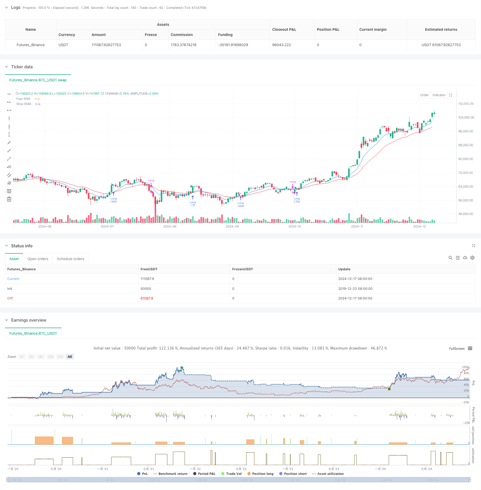

> Name

Exponential Moving Average Crossover Strategy for Dynamic Risk Management-Dynamic-Risk-Managed-Exponential-Moving-Average-Crossover-Strategy
> Author

ChaoZhang

> Strategy Description



[trans]
#### Overview
This strategy is a trend following system based on exponential moving average (EMA) crossovers that combines dynamic position management and risk control. The strategy uses cross signals of fast and slow EMAs to identify market trends, dynamically adjusts trade size through percentage risk calculations, and uses trailing stops to protect profits.
#### Strategy Principle
The core logic of the strategy is based on two exponential moving averages with different periods (9 and 21 by default). When the fast EMA crosses the slow EMA upwards, the system generates a long signal; when the fast EMA crosses the slow EMA downwards, the system closes the position. The size of each transaction is dynamically calculated based on a fixed risk ratio of the total account funds (default 1%), and a take-profit level and percentage trailing stop loss based on the risk-reward ratio are set.
#### Strategic Advantages
1. Dynamic position management ensures the consistency of risk in each transaction and avoids excessive risks that may be caused by fixed positions.
2. The trailing stop loss mechanism can effectively lock in profits and exit the market promptly when the trend reverses.
3. The risk-reward ratio setting ensures that each transaction has a clear profit and loss ratio.
4. EMA cross signals can effectively capture mid- to long-term trends and reduce false signals.
5. The system is fully automated, eliminating human emotional interference.
#### Strategy Risk
1. Frequent false cross signals may occur in a volatile market, resulting in continuous losses.
2. Trailing stop loss may be triggered prematurely in high-volatility markets and miss the general trend.
3. A fixed percentage risk setting may not be flexible enough when market volatility changes.
4. In a rapidly reversing market, the stop loss level may be jumped over and the actual loss exceeds expectations.
#### Strategy optimization direction
1. Introduce volatility indicators (such as ATR) to dynamically adjust stop loss and take profit levels.
2. Add a trend strength filter such as RSI or ADX to reduce false signals in volatile markets.
3. Develop a dynamic EMA cycle adjustment mechanism based on market volatility.
4. Add transaction volume confirmation indicators to improve signal reliability.
5. Implement a dynamic risk adjustment mechanism based on recent losses.
#### Summary
This is a complete trading system that combines classic technical analysis methods with modern risk management concepts. The strategy controls risk through dynamic position management and trailing stop loss, while using EMA crossover to capture trend opportunities. Although there are some inherent limitations, the robustness and adaptability of the strategy can be further improved through the suggested optimization directions. The strategy is particularly suitable for pursuing long-term trend trading with controllable risks. ||
#### Overview
This strategy is a trend-following system based on Exponential Moving Average (EMA) crossovers, incorporating dynamic position sizing and risk management. It uses fast and slow EMA crossover signals to identify market trends while dynamically adjusting trade sizes through percentage risk calculations and employing trailing stops to protect profits.

#### Strategy Principles
The core logic relies on two EMAs with different periods (default 9 and 21). A long entry signal is generated when the fast EMA crosses above the slow EMA, while positions are closed when the fast EMA crosses below the slow EMA. Each trade size is dynamically calculated based on a fixed percentage risk (default 1%) of total account equity, with take-profit levels set according to risk-reward ratios and percentage-based trailing stops.

#### Strategy Advantages
1. Dynamic position sizing ensures consistent risk per trade, avoiding the excessive risk of fixed position sizes.
2. Trailing stop mechanism effectively locks in profits and exits positions when trends reverse.
3. Risk-reward ratio settings ensure clear profit-loss ratios for each trade.
4. EMA crossover signals effectively capture medium to long-term trends, reducing false signals.
5. Fully automated system eliminates emotional interference.

#### Strategy Risks
1. May generate frequent false crossover signals in ranging markets, leading to consecutive losses.
2. Trailing stops might trigger too early in highly volatile markets, missing larger trends.
3. Fixed percentage risk settings may lack flexibility when market volatility changes.
4. Stop losses might be jumped over in quick reversal markets, resulting in larger than expected losses.

#### Optimization Directions
1. Incorporate volatility indicators (like ATR) to dynamically adjust stop-loss and take-profit levels.
2. Add trend strength filters, such as RSI or ADX, to reduce false signals in ranging markets.
3. Develop dynamic EMA period adjustment mechanisms based on market volatility.
4. Include volume confirmation indicators to improve signal reliability.
5. Implement dynamic risk adjustment mechanisms based on recent losses.

#### Summary
This is a complete trading system that combines classical technical analysis methods with modern risk management concepts. The strategy controls risk through dynamic position sizing and trailing stops while capturing trending opportunities using EMA crossovers. While there are some inherent limitations, the suggested optimization directions can further enhance the strategy's robustness and adaptability. The strategy is particularly suitable for long-term trend trading with controlled risk.[/trans]


> Source (PineScript)

``` pinescript
/*backtest
start: 2019-12-23 08:00:00
end: 2024-12-18 08:00:00
period: 1d
basePeriod: 1d
exchanges: [{"eid":"Futures_Binance","currency":"BTC_USDT"}]
*/

//@version=5
strategy("Bitcoin Exponential Profit Strategy", overlay=true)

// User settings
fastLength = input.int(9, title="Fast EMA Length", minval=1)
slowLength = input.int(21, title="Slow EMA Length", minval=1)
riskPercent = input.float(1, title="Risk % Per Trade", step=0.1) / 100
rewardMultiplier = input.float(2, title="Reward Multiplier (R:R)", step=0.1)
trailOffsetPercent = input.float(0.5, title="Trailing Stop Offset %", step=0.1) / 100

// Calculate EMAs
fastEMA = ta.ema(close, fastLength)
slowEMA = ta.ema(close, slowLength)

// Plot EMAs
plot(fastEMA, color=color.blue, title="Fast EMA")
plot(slowEMA, color=color.red, title="Slow EMA")

// Account balance and dynamic position sizing
capital = strategy.equity
riskAmount = capital * riskPercent

// Define Stop Loss and Take Profit Levels
stopLossLevel = close * (1 - riskPercent)
takeProfitLevel = close * (1 + rewardMultiplier * riskPercent)

// Trailing stop offset
trailOffset = close * trailOffsetPercent

// Entry Condition: Bullish Crossover
if ta.crossover(fastEMA, slowEMA)
    positionSize = riskAmount / math.max(close - stopLossLevel, 0.01)  // Prevent division by zero
    strategy.entry("Long", strategy.long, qty=positionSize)
    strategy.exit("TakeProfit", from_entry="Long", stop=stopLossLevel, limit=takeProfitLevel, trail_offset=trailOffset)

// Exit Condition: Bearish Crossunder
if ta.crossunder(fastEMA, slowEMA)
    strategy.close("Long")

// Labels for Signals
if ta.crossover(fastEMA, slowEMA)
    label.new(bar_index, low, "BUY", color=color.green, textcolor=color.white, style=label.style_label_up)
if ta.crossunder(fastEMA, slowEMA)
    label.new(bar_index, high, "SELL", color=color.red, textcolor=color.white, style=label.style_label_down)


```

> Detail

https://www.fmz.com/strategy/475589

> Last Modified

2024-12-20 14:08:39
