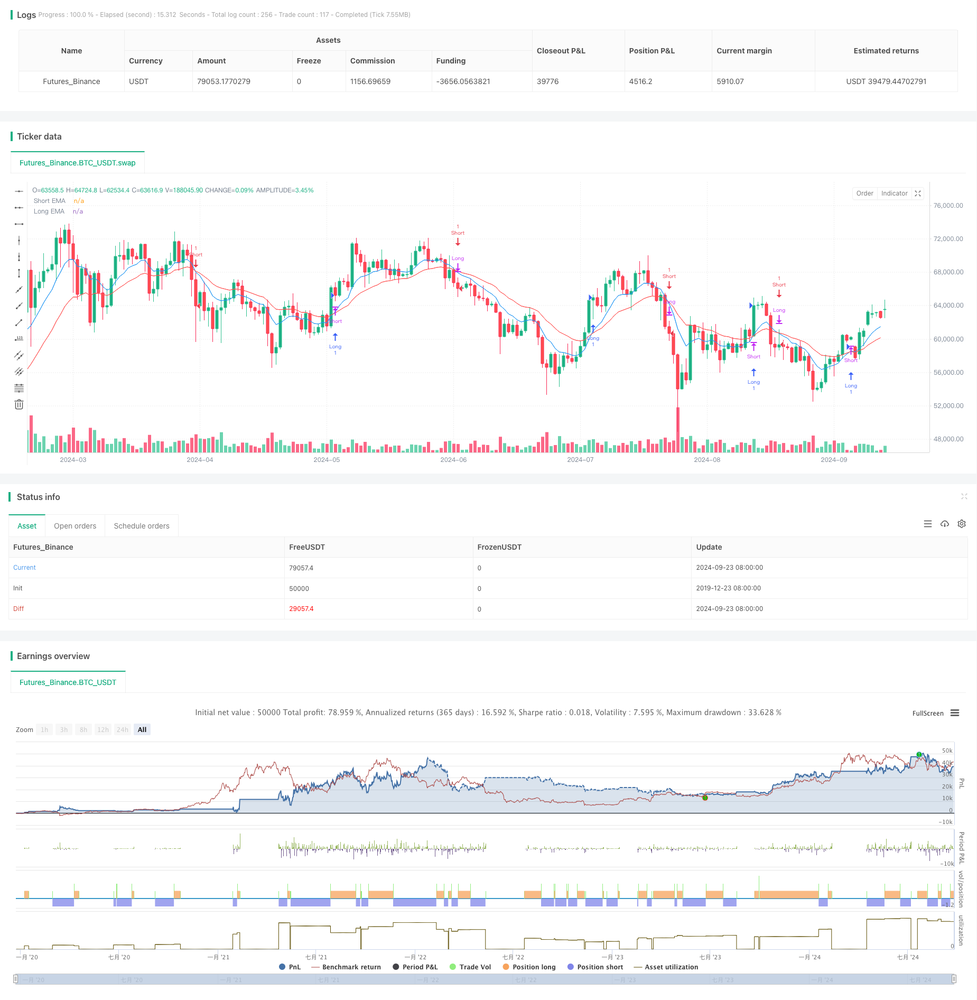

> Name

Moving Average Cross Dynamic Stop-Loss Strategy-Dynamic-Stop-Loss-Moving-Average-Crossover-Strategy
> Author

ChaoZhang

> Strategy Description


[trans]
#### Overview
The moving average crossover dynamic stop-profit and stop-loss strategy is a quantitative trading method based on technical analysis, which mainly uses the intersection of short-term and long-term moving averages to identify market trends and conduct transactions. This strategy combines multiple key elements such as moving average crossover, dynamic stop loss and fixed risk-to-return ratio, aiming to capture market trends while effectively controlling risks.
The core idea of ​​the strategy is to judge the conversion of market trends by observing the relative position changes of the short-term moving average (EMA) and the long-term moving average (EMA). When the short-term EMA crosses the long-term EMA from below, it is considered a long signal; conversely, when the short-term EMA crosses the long-term EMA from above, it is considered a short signal. In order to improve the reliability and profitability of the strategy, the strategy also introduces a dynamic stop-loss mechanism and a fixed risk-return ratio setting.
#### Strategy Principle
1. Moving average crossover:
   - Use 9-period and 21-period exponential moving averages (EMA)
   - When the 9-period EMA crosses the 21-period EMA, a long signal is generated
   - When the 9-period EMA crosses below the 21-period EMA, a short signal is generated
2. Entry logic:
   - Enter immediately after confirmation of moving average crossover
   - When going long, enter the market at the current market price
   - When short selling, enter the market at the current market price
3. Stop loss setting:
   - Use dynamic stop loss mechanism
   - When going long, set the stop loss at the lowest point of the last 5 periods
   - When going short, set the stop loss at the highest point of the last 5 periods
4. Profit target:
   - Adopt a fixed risk-return ratio (RR) of 1:3
   - When going long, profit target = entry price + (entry price - stop loss price) * 3
   - When short selling, profit target = entry price - (stop loss price - entry price) * 3
5. Position management:
   - Close existing reverse positions (if any) every time a trading signal appears
   - Open new positions with every trade
6. Trailing Stop:
   - Introduce a trailing stop loss mechanism to lock in profits and adapt to market fluctuations
   - The offset of the trailing stop can be adjusted by input parameters
#### Strategic Advantages
1. Trend following ability:
   By using moving average crossovers, the strategy can effectively capture changes in market trends, allowing traders to trade in line with the general trend. This method can help traders avoid frequent trading in sideways or volatile markets, thereby reducing unnecessary losses.
2. Risk control:
   The strategy adopts a dynamic stop-loss mechanism and sets the stop-loss point at the latest fluctuation extreme. This method can adjust the stop-loss position according to the actual market fluctuations, which can effectively control risks without being shaken out by market fluctuations prematurely.
3. Maximize revenue:
   By setting a risk-to-return ratio of 1:3, the strategy not only controls risks, but also sets a higher profit target for each transaction. This method can ensure that even if the winning rate is not high, as long as there are enough transactions, the overall profit can be achieved.
4. Strong adaptability:
   The strategy uses relatively common technical indicators and trading principles and can be applied to different markets and time periods. By adjusting the period and other parameters of the moving average, traders can optimize their strategy based on their trading style and target market.
5. Automation potential:
   The logic of the strategy is clear, easy to program and implement, and has strong automation potential. This not only eliminates the interference caused by artificial emotions, but also enables 7*24-hour market monitoring and transaction execution.
6. Trailing stop loss mechanism:
   The introduced trailing stop-loss mechanism allows the strategy to lock in more profits when the market continues to develop in a favorable direction, and at the same time stop losses in a timely manner when the market reverses, which greatly improves the profitability and risk management level of the strategy.
#### Strategy Risk
1. False breakthrough risk:
   In a volatile market, moving averages may cross frequently, resulting in many false signals. This can trigger a series of small losses that erode account funds.
   Solution: Consider introducing additional filtering conditions, such as trend strength indicators or volume confirmations, to reduce the impact of false signals.
2. Lag risk:
   Moving averages are essentially lagging indicators and may only give signals when the trend is nearing its end, resulting in late entry or missing most of the market.
   Solution: You can try to use a shorter period moving average, or combine it with other leading indicators to optimize entry timing.
3. Risk of large gap:
   When major news or a black swan event occurs, the market may jump sharply, causing the stop loss to be ineffective and causing unexpected losses.
   Solution: It is recommended to set a maximum loss limit and consider using derivatives such as options to hedge tail risks.
4. Excessive trading risk:
   Under certain market conditions, the strategy may generate too many trading signals, increasing trading costs and potentially leading to overtrading.
   Solution: You can set a trading interval limit, or add a signal confirmation mechanism to reduce trading frequency.
5. Parameter sensitivity risk:
   The performance of the strategy can be very sensitive to the moving average period and other parameters chosen, and small changes in parameters can cause significant differences in backtest results.
   Solution: It is recommended to conduct extensive parameter optimization and robustness testing to find parameter combinations that perform stably under different market conditions.
6. Risks of changes in market environment:
   Strategies may perform well in trending markets, but may underperform in range-bound or high-volatility environments.
   Solution: Consider introducing a market environment recognition mechanism and adopt different trading strategies or parameter settings under different market conditions.
#### Strategy optimization direction
1. Introduce trading volume analysis:
   Incorporating volume indicators into your strategy can help confirm the validity of price movements. For example, you can require that when the moving average crosses, trading volume also increases at the same time, so as to filter out some possible false breakthroughs. The reason for this is that a true trend shift is usually accompanied by a significant increase in trading volume.
2. Add trend strength filtering:
   Introduce trend strength indicators such as ADX (Average Trend Index) and execute trades only when the trend is strong enough. This can help avoid overtrading in sideways or weakly trending markets and improve the overall win rate of the strategy.
3. Optimize stop loss methods:
   Consider using ATR (average true range) to set a dynamic stop loss, which can better adapt the stop loss to the actual fluctuations in the market. ATR can provide an objective measure based on market volatility, making stop loss settings more flexible and effective.
4. Implement time filtering:
   Analyze market characteristics in different time periods and execute strategies during the best trading time periods. This is because financial markets may exhibit different characteristics in different time periods, such as differences in volatility and liquidity.
5. Incorporate fundamental factors:
   On the basis of pure technical analysis, consider introducing some fundamental factors, such as economic data releases, central bank policy changes, etc. This can help strategies make more informed decisions before and after major events.
6. Implement dynamic parameter adjustment:
   Develop a mechanism to dynamically adjust strategy parameters based on recent market conditions. This can be achieved through machine learning algorithms, allowing strategies to better adapt to changing market conditions.
7. Add multiple time frame analysis:
   Based on the current time frame, add analysis of longer-term time frames. For example, adding consideration to the weekly trend in the daily system. This ensures that the trading direction is aligned with the larger market trend.
8. Optimize position management:
   Implement more complex position management strategies, such as dynamically adjusting trade size based on account profit and loss, market volatility or signal strength. This can help maximize potential returns while keeping risks under control.
#### Summarize
The moving average crossover dynamic stop-profit and stop-loss strategy is a quantitative trading system that combines multiple mature technical analysis concepts. It captures market trends through moving average crossovers, uses dynamic stop loss and fixed risk-to-return ratios to manage risks and returns, and introduces a trailing stop-loss mechanism to adapt to market fluctuations. This strategy is designed to achieve effective control of risks and maximize potential returns while capturing market trends.
The main advantages of the strategy are its trend following capabilities, strict risk control, clear profit target setting, and strong adaptability and automation potential. However, it also faces potential risks such as false breakthroughs, lag, and large gaps. In order to deal with these challenges and further improve strategy performance, we have proposed multiple optimization directions, including introducing trading volume analysis, increasing trend intensity filtering, optimizing stop loss methods, implementing time filtering, incorporating fundamental factors, implementing dynamic parameter adjustment, adding multiple time frame analysis, and optimizing position management.
Overall, this strategy provides traders with a systematic, quantifiable trading approach that has the potential to achieve stable performance in a variety of market conditions. However, like all trading strategies, it is not one-size-fits-all. When traders use this strategy, they need to fully understand its principles, recognize potential risks, and make necessary adjustments and optimizations based on their own risk tolerance and investment goals. Through continuous backtesting, real-time verification and continuous improvement, this strategy is expected to become a powerful weapon in traders' toolbox, helping to achieve long-term stable trading returns.
|| 

#### Overview

The Dynamic Stop-Loss Moving Average Crossover Strategy is a quantitative trading method based on technical analysis, primarily utilizing the crossover of short-term and long-term moving averages to identify market trends and execute trades. This strategy combines several key elements, including moving average crossovers, dynamic stop-loss, and fixed risk-reward ratios, aiming to capture market trends while effectively controlling risk.

The core idea of the strategy is to determine market trend changes by observing the relative position changes between short-term Exponential Moving Average (EMA) and long-term EMA. When the short-term EMA crosses above the long-term EMA, it is considered a buy signal; conversely, when the short-term EMA crosses below the long-term EMA, it is seen as a sell signal. To enhance the strategy's reliability and profitability, it also incorporates a dynamic stop-loss mechanism and fixed risk-reward ratio settings.

#### Strategy Principles

1. Moving Average Crossover:
   - Uses 9-period and 21-period Exponential Moving Averages (EMA)
   - Generates a buy signal when the 9-period EMA crosses above the 21-period EMA
   - Generates a sell signal when the 9-period EMA crosses below the 21-period EMA

2. Entry Logic:
   - Enters the market immediately upon confirmation of the moving average crossover
   - For long positions, enters at the current market price
   - For short positions, enters at the current market price

3. Stop-Loss Setting:
   - Utilizes a dynamic stop-loss mechanism
   - For long positions, sets the stop-loss at the lowest point of the last 5 periods
   - For short positions, sets the stop-loss at the highest point of the last 5 periods

4. Profit Target:
   - Adopts a fixed risk-reward ratio (RR) of 1:3
   - For long positions, profit target = entry price + (entry price - stop-loss price) * 3
   - For short positions, profit target = entry price - (stop-loss price - entry price) * 3

5. Position Management:
   - Closes any existing opposite position when a new trading signal appears
   - Opens a new position for each trade

6. Trailing Stop:
   - Introduces a trailing stop mechanism to lock in profits and adapt to market fluctuations
   - The offset of the trailing stop can be adjusted through input parameters

#### Strategy Advantages

1. Trend Following Capability:
   By using moving average crossovers, the strategy can effectively capture changes in market trends, allowing traders to trade in line with major trends. This approach helps traders avoid frequent trading in sideways or choppy markets, thereby reducing unnecessary losses.

2. Risk Control:
   The strategy employs a dynamic stop-loss mechanism, setting the stop-loss point at recent volatility extremes. This method adjusts the stop-loss position according to actual market fluctuations, effectively controlling risk while avoiding premature exit due to market noise.

3. Profit Maximization:
   By setting a 1:3 risk-reward ratio, the strategy sets a high profit target for each trade while controlling risk. This method ensures that even with a lower win rate, overall profitability can be achieved given enough trades.

4. High Adaptability:
   The strategy uses relatively universal technical indicators and trading principles, making it applicable to different markets and time frames. Traders can optimize the strategy according to their trading style and target market by adjusting the periods of moving averages and other parameters.

5. Automation Potential:
   The strategy's logic is clear and well-defined, making it easy to implement programmatically and offering strong automation potential. This not only eliminates interference from human emotions but also enables 24/7 market monitoring and trade execution.

6. Trailing Stop Mechanism:
   The introduced trailing stop mechanism allows the strategy to lock in more profits when the market continues to move in a favorable direction, while timely stopping losses when the market reverses. This greatly enhances the strategy's profitability and risk management level.

#### Strategy Risks

1. False Breakout Risk:
   In choppy markets, moving averages may cross frequently, generating many false signals. This could lead to a series of small losses, eroding account capital.
   Solution: Consider introducing additional filtering conditions, such as trend strength indicators or volume confirmation, to reduce the impact of false signals.

2. Lag Risk:
   Moving averages are inherently lagging indicators and may give signals when the trend is already nearing its end, leading to late entries or missing most of the move.
   Solution: Try using shorter-period moving averages or combining with other leading indicators to optimize entry timing.

3. Large Gap Risk:
   In the event of major news or black swan events, the market may experience large gaps, causing stop-losses to fail and resulting in unexpected losses.
   Solution: It is recommended to set maximum loss limits and consider using derivatives such as options to hedge tail risks.

4. Overtrading Risk:
   Under certain market conditions, the strategy may generate too many trading signals, increasing transaction costs and potentially leading to overtrading.
   Solution: Set trading interval limits or add signal confirmation mechanisms to reduce trading frequency.

5. Parameter Sensitivity Risk:
   The strategy's performance may be very sensitive to the chosen moving average periods and other parameters. Small changes in parameters may lead to significant differences in backtesting results.
   Solution: It is recommended to conduct extensive parameter optimization and robustness testing to find parameter combinations that perform stably under different market conditions.

6. Market Environment Change Risk:
   The strategy may perform well in trending markets but may underperform in range-bound or high-volatility environments.
   Solution: Consider introducing a market environment identification mechanism to adopt different trading strategies or parameter settings in different market states.

#### Strategy Optimization Directions

1. Incorporate Volume Analysis:
   Integrating volume indicators into the strategy can help confirm the validity of price movements. For example, requiring volume to increase simultaneously with moving average crossovers can filter out some potential false breakouts. This is because real trend changes are usually accompanied by significant increases in trading volume.

2. Add Trend Strength Filtering:
   Introduce trend strength indicators such as ADX (Average Directional Index) and only execute trades when the trend is strong enough. This can help avoid overtrading in sideways or weak trend markets, improving the overall win rate of the strategy.

3. Optimize Stop-Loss Method:
   Consider using ATR (Average True Range) to set dynamic stop-losses, which can better adapt to actual market volatility. ATR provides an objective measure based on market volatility, making stop-loss settings more flexible and effective.

4. Implement Time Filtering:
   Analyze market characteristics during different time periods and execute the strategy during optimal trading hours. This is because financial markets may exhibit different characteristics, such as volatility and liquidity differences, at different times.

5. Incorporate Fundamental Factors:
   On the basis of pure technical analysis, consider introducing some fundamental factors, such as economic data releases or central bank policy changes. This can help the strategy make more informed decisions before and after major events.

6. Implement Dynamic Parameter Adjustment:
   Develop a mechanism that can dynamically adjust strategy parameters based on recent market conditions. This can be achieved through machine learning algorithms, allowing the strategy to better adapt to constantly changing market environments.

7. Add Multi-Timeframe Analysis:
   In addition to the current timeframe, include analysis of longer-term timeframes. For example, add consideration of weekly trends in a daily system. This ensures that the trading direction aligns with larger market trends.

8. Optimize Position Management:
   Implement more complex position management strategies, such as dynamically adjusting trade size based on account profit/loss status, market volatility, or signal strength. This can help maximize potential returns while keeping risks under control.

#### Summary

The Dynamic Stop-Loss Moving Average Crossover Strategy is a quantitative trading system that combines multiple mature technical analysis concepts. It captures market trends through moving average crossovers, manages risk and returns using dynamic stop-losses and fixed risk-reward ratios, and introduces a trailing stop mechanism to adapt to market fluctuations. This strategy design aims to effectively control risk and maximize potential returns while capturing market trends.

The main advantages of the strategy lie in its trend-following capability, strict risk control, clear profit target setting, and strong adaptability and automation potential. However, it also faces potential risks such as false breakouts, lag, and large gaps. To address these challenges and further enhance strategy performance, we have proposed multiple optimization directions, including incorporating volume analysis, adding trend strength filtering, optimizing stop-loss methods, implementing time filtering, incorporating fundamental factors, implementing dynamic parameter adjustment, adding multi-timeframe analysis, and optimizing position management.

Overall, this strategy provides traders with a systematic, quantifiable trading method with the potential to achieve stable performance under various market conditions. However, like all trading strategies, it is not infallible. When using this strategy, traders need to fully understand its principles, recognize potential risks, and make necessary adjustments and optimizations based on their risk tolerance and investment objectives. Through continuous backtesting, live trading verification, and ongoing improvements, this strategy has the potential to become a powerful tool in traders' toolkits, helping to achieve long-term stable trading returns.

[/trans]


> Source (PineScript)

``` pinescript
/*backtest
start: 2019-12-23 08:00:00
end: 2024-09-24 08:00:00
period: 1d
basePeriod: 1d
exchanges: [{"eid":"Futures_Binance","currency":"BTC_USDT"}]
*/

//@version=5
strategy("RAMZY CRYPTO-KING", overlay=true)

// Input for moving averages
shortMA = input(9, title="Short EMA Period")
longMA = input(21, title="Long EMA Period")
trailOffset = input(0, title="Trailing Drawdown Offset")

// Calculate moving averages
shortEMA = ta.ema(close, shortMA)
longEMA = ta.ema(close, longMA)

// Plot moving averages
plot(shortEMA, color=color.blue, title="Short EMA")
plot(longEMA, color=color.red, title="Long EMA")

// Identify recent swing high and low
swingHigh = ta.highest(high, 5)
swingLow = ta.lowest(low, 5)

// Buy condition: EMA crossover
longCondition = ta.crossover(shortEMA, longEMA)
if (longCondition)
    strategy.close("Short")  // Close any existing short position
    stopLoss = swingLow  // At swing low
    takeProfit = close + (3 * (close - stopLoss))  // 1:3 RR
    strategy.entry("Long", strategy.long)
    strategy.exit("TP/SL", "Long", limit=takeProfit, stop=stopLoss, trail_offset=trailOffset)

// Sell condition: EMA crossover
shortCondition = ta.crossunder(shortEMA, longEMA)
if (shortCondition)
    strategy.close("Long")  // Close any existing long position
    stopLoss = swingHigh  // At swing high
    takeProfit = close - (3 * (stopLoss - close))  // 1:3 RR
    strategy.entry("Short", strategy.short)
    strategy.exit("TP/SL", "Short", limit=takeProfit, stop=stopLoss, trail_offset=trailOffset)

// Debugging Labels
if (longCondition)
    label.new(bar_index, high, "Buy", style=label.style_label_down, color=color.green, textcolor=color.white)

if (shortCondition)
    label.new(bar_index, low, "Sell", style=label.style_label_up, color=color.red, textcolor=color.white)

```

> Detail

https://www.fmz.com/strategy/468305

> Last Modified

2024-09-26 14:47:09
