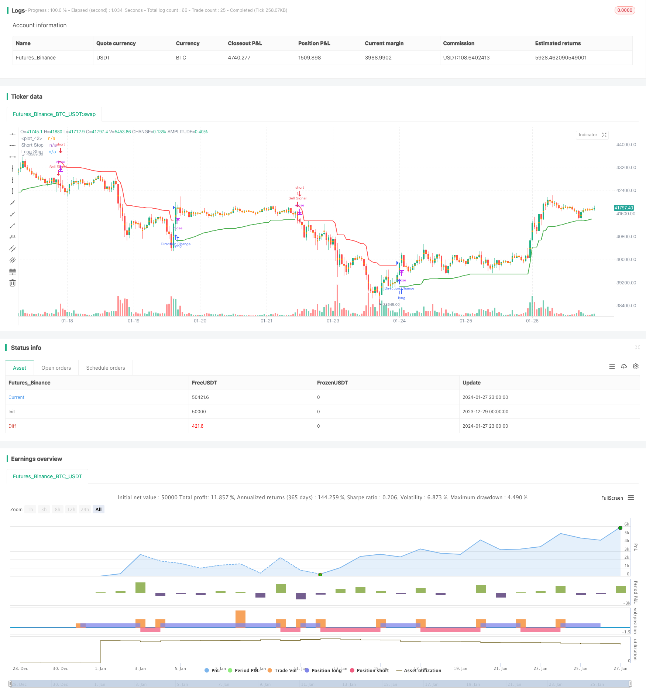

> Name

Dynamic-Stop-Loss-Moving-Average-Strategy
> Author

ChaoZhang

> Strategy Description


 [trans]
## Overview
This strategy uses the idea of ​​dynamic trailing stop to calculate the stop loss line for long and short positions based on ATR and price extremes. Combined with the idea of ​​Chandelier Exit, the direction of long and short positions is determined based on the direction of the stop loss line. When the stop-loss line breaks upward, it is judged to be bullish and long; when the stop-loss line breaks downward, it is judged bearish and short.
This strategy has the dual functions of stop loss and entry signal judgment.
## Strategy Principle
This strategy mainly consists of the following parts:
1. Calculate the stop loss line for long and short positions based on ATR
Based on the user-set ATR period length and multiple mult, ATR is calculated in real time. Then calculate the stop loss line for long and short positions based on ATR and price extremes:        
longStop = highest price - ATR
        shortStop = lowest price + ATR
2. Use breakthroughs to determine trading direction
Compare the stop loss line of the previous K line with the stop loss line of the current K line. If the stop loss line of the current K line breaks through, a trading signal will be issued:
Breakthrough above the long stop loss line, go long
        If the short position stop loss line breaks below, go short.
3. Set stop loss and take profit based on risk-reward ratio
Based on the risk-reward ratio riskRewardRatio set by the user, the stop-loss distance and take-profit distance are calculated from ATR.
    And set stop loss orders and take profit orders when opening a position.
## Advantage Analysis
This strategy has the following advantages:
1. Dynamic tracking stop loss and timely stop loss
This strategy uses dynamic tracking stop loss lines, which can stop losses in time and control downside risks.
2. It has both stop loss and entry judgment functions.
The stop loss line of this strategy also serves as the entry judgment condition, simplifying the strategy logic.
3. Risk-return ratio can be set
According to the set risk-reward ratio, pursue greater profits appropriately.
4. Easy to understand and expand
The strategy has a simple structure and is easy to understand and optimize and expand.
## Risk Analysis
There are also some risks with this strategy:
1. Bilateral risks
This strategy is a bilateral trading strategy, taking both long and short risks.
2. ATR parameter dependency
ATR parameter setting will directly affect the stop loss line and trading frequency. Improper setting may cause the stop loss to be too loose or the trading frequency to be too high.
3. Trend market adaptability
This strategy is more suitable for situations where the moving average breaks through after consolidation, and is not suitable for scenarios where the trend is too strong.
In view of the above risks, optimization can be carried out from the following aspects:
1. Combined with trend indicators
Combine with MA and other trend indicators to determine market trends and avoid counter-trend trading.
2. Optimize parameter combination
Optimize ATR parameters and risk-reward ratio parameters to make stop loss and take profit more reasonable.
3. Add filter conditions
Add filtering conditions for trading volume or volatility indicators to ensure trading quality.
## Optimization direction
There is room for further optimization of this strategy:
1. Combined with machine learning
Use machine learning models to predict price trends and improve entry accuracy.
2. Use Options to build a risk-free portfolio
Use options to hedge the price volatility of varieties and build a risk-free arbitrage portfolio.
3. Multi-species and cross-market arbitrage
Perform statistical arbitrage between different markets and different varieties to obtain stable Alpha.
4. Algorithmic Trading
Efficient strategy backtesting and live trading through algorithmic trading engines.
## Summarize
This article provides an in-depth analysis of a quantitative trading strategy based on dynamic trailing stop loss. This strategy has both stop loss management and trading signal judgment functions, which can effectively control risks. We also analyzed the advantages, possible risks, and subsequent optimization ideas of the strategy. This strategy is a very practical trading strategy and deserves further research and application.
||

## Overview  

This strategy adopts the idea of dynamic trailing stop based on ATR and price extremes to calculate long and short stop-loss lines. Combined with the Chandelier Exit idea, it judges the long/short direction based on the stop-loss line breakout. When the stop-loss line breaks out upwards, it is judged as bullish and long entry. When the stop-loss line breaks out downwards, it is judged as bearish and short entry.  

The strategy has both stop-loss management and entry signal judgment functionalities.

## Strategy Logic   

The strategy consists of the following main parts:

1. Calculate long/short stop-loss lines based on ATR  

    Based on user defined ATR period length and multiplier mult, real-time ATR is calculated. Then the long/short stop-loss lines are calculated with ATR and price extremes:   
    
        longStop = Highest - ATR  
        shortStop = Lowest + ATR

2. Judge the trading direction by breakout

    Compare the stop-loss lines between the previous bar and the current bar. If the current bar's stop-loss line breaks out, trading signals are triggered:  

        Long stop-loss line breakout upwards, long entry  
        Short stop-loss line breakout downwards, short entry   

3. Set stop loss and take profit based on risk-reward ratio  

    Based on the user defined risk-reward ratio riskRewardRatio, stop loss distance and take profit distance are calculated from ATR. 
    Stop loss order and take profit order are set when opening positions.

## Advantage Analysis

The advantages of this strategy include:

1. Dynamic trailing stop loss

    Adopting dynamic trailing stop loss lines helps timely stop loss and control downside risk.

2. Dual functions  

    The stop loss line serves as both stop loss management tool and entry condition judge, reducing strategy complexity.  

3. Customizable risk-reward ratio

    Pursue higher profit with predefined risk-reward ratio.

4. Easy to understand and extend 

    Simple structure, easy to understand and optimize for extension.

## Risk Analysis   

Some risks may exist for this strategy:

1. Two-way risks  

    As a dual-direction trading strategy, it undertakes both long and short risks.

2. ATR parameter dependency

    ATR parameters directly impact the stop loss lines and trading frequency. Improper settings may result in either too wide stop loss or too high trading frequency.  

3. Trend adaptiveness  

    The strategy fits better for range-bound scenarios with sudden breakouts. Not suitable for strong trending scenarios.

The optimizations to address the above risks are:  

1. Incorporate trend indicators  

    Incorporate MA and other trend indicators to determine market trend, avoid trading against trends.   

2. Parameter optimization   

    Optimize the combinations of ATR parameters and risk-reward ratio for more reasonable stop loss and take profit.  

3. Additional filters

    Add trading volume or volatility condition filters to ensure trading quality.

## Optimization Directions   

There are still rooms to optimize the strategy further:

1. Incorporate machine learning

    Adopt machine learning models to predict price trend for higher entry accuracy.  

2. Construct risk-free portfolio with Options

    Use Options to hedge the price fluctuation of underlying assets and construct risk-free arbitrage portfolios.

3. Cross market multi-asset arbitrage 

    Conduct statistical arbitrage cross different markets and asset classes to obtain steady alpha.  

4. Algorithm trading

    Leverage algorithm trading engines to efficiently backtest strategies and trade.

## Conclusion  

This article thoroughly analyzes a quantitative trading strategy based on dynamic trailing stop loss. The strategy simultaneously has stop loss management functionality and trading signal determination, which effectively controls risks. We also discussed the advantages, potential risks and future optimizations of the strategy. It is a very practical trading strategy worth further research and application.  

[/trans]

> Strategy Arguments


|Argument|Default|Description|
|----|----|----|
|v_input_int_1|22|ATR Period|
|v_input_float_1|3|ATR Multiplier|
|v_input_bool_1|true|Use Close Price for Extremums|
|v_input_int_2|true|Risk-Reward Ratio|


> Source (PineScript)

``` pinescript
/*backtest
start: 2023-12-29 00:00:00
end: 2024-01-28 00:00:00
period: 1h
basePeriod: 15m
exchanges: [{"eid":"Futures_Binance","currency":"BTC_USDT"}]
*/

//@version=5
strategy("Chandelier Exit with 1-to-1 Risk-Reward", shorttitle='CE', overlay=true)

// Chandelier Exit Logic
length = input.int(title='ATR Period', defval=22)
mult = input.float(title='ATR Multiplier', step=0.1, defval=3.0)
useClose = input.bool(title='Use Close Price for Extremums', defval=true)

atr = mult * ta.atr(length)

longStop = (useClose ? ta.highest(close, length) : ta.highest(length)) - atr
longStopPrev = nz(longStop[1], longStop)
longStop := close[1] > longStopPrev ? math.max(longStop, longStopPrev) : longStop

shortStop = (useClose ? ta.lowest(close, length) : ta.lowest(length)) + atr
shortStopPrev = nz(shortStop[1], shortStop)
shortStop := close[1] < shortStopPrev ? math.min(shortStop, shortStopPrev) : shortStop

var int dir = 1
dir := close > shortStopPrev ? 1 : close < longStopPrev ? -1 : dir

// Risk-Reward Ratio
riskRewardRatio = input.int(1, title="Risk-Reward Ratio", minval=1, maxval=10, step=1)

// Calculate Take Profit and Stop Loss Levels
takeProfitLevel = atr * riskRewardRatio
stopLossLevel = atr

// Entry Conditions
longCondition = dir == 1 and dir[1] == -1
shortCondition = dir == -1 and dir[1] == 1

// Entry Signals
if (longCondition)
    strategy.entry("Long", strategy.long, stop=close - stopLossLevel, limit=close + takeProfitLevel)
if (shortCondition)
    strategy.entry("Short", strategy.short, stop=close + stopLossLevel, limit=close - takeProfitLevel)

longStopPlot = plot(dir == 1 ? longStop : na, title='Long Stop', style=plot.style_linebr, linewidth=2, color=color.green)
shortStopPlot = plot(dir == 1 ? na : shortStop, title='Short Stop', style=plot.style_linebr, linewidth=2, color=color.red)

midPricePlot = plot(ohlc4, title='', style=plot.style_circles, linewidth=0, display=display.none, editable=false)

fill(midPricePlot, longStopPlot, color=color.new(color.green, 90), title='Long State Filling')
fill(midPricePlot, shortStopPlot, color=color.new(color.red, 90), title='Short State Filling')

// Alerts
if (dir != dir[1])
    strategy.entry("Direction Change", strategy.long, comment="Chandelier Exit has changed direction!")
if (longCondition)
    strategy.entry("Buy Signal", strategy.long, comment="Chandelier Exit Buy!")
if (shortCondition)
    strategy.entry("Sell Signal", strategy.short, comment="Chandelier Exit Sell!")

```

> Detail

https://www.fmz.com/strategy/440360

> Last Modified

2024-01-29 15:52:43
