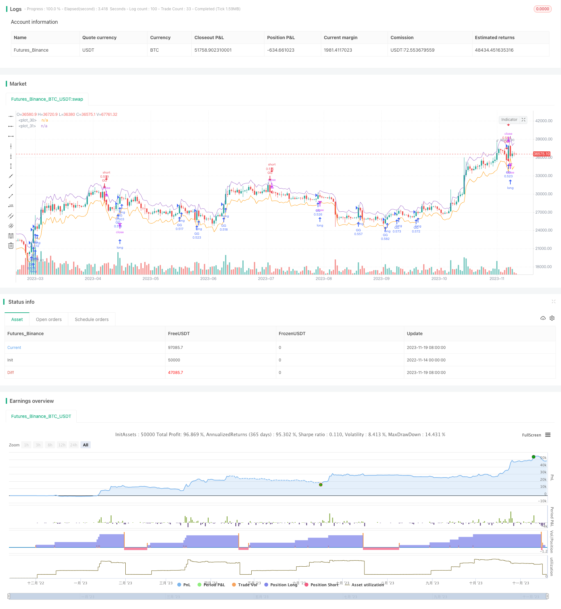

> Name

Dynamic-Stop-Loss-Trail-Strategy
> Author

ChaoZhang

> Strategy Description



[trans]

## Overview
The dynamic stop-loss and chase-up strategy calculates the average true fluctuation range ATR of the stock as a benchmark, and dynamically sets the stop-loss line and chase-up line based on the ATR coefficient set by the user to achieve the purpose of stop-loss chase. When the stock price breaks through the chasing line, a traditional trend following strategy is used to establish a long position; when the stock price falls below the stop loss line, a reversal strategy is used to establish a short position and two-way trading is used to make profits.
## Strategy Principle
This strategy mainly uses the ATR technical indicator to calculate the average true fluctuation range of the stock price, and combines the ATR coefficient input by the user as the basis for stock breakthrough buying and stop-loss selling. Specifically, the strategy first calculates the ATR value of the stock in the past 120 days, then multiplies it by the selling ATR coefficient set by the user to get the stop-loss selling reference price, which is the stop-loss line; multiplies it by the buying ATR coefficient to get the buying reference price, which is the chasing line. When today's highest price breaks through the chasing line, a trend following strategy is adopted to establish a long position; when today's lowest price falls below the stop loss line and a long position is held, a reversal strategy is adopted to establish a short position.
This strategy draws a stop-loss line and a chasing line at the same time. The positions of these two lines will change according to the fluctuation of the stock price, and have a certain dynamic tracking function. The ATR indicator can better reflect the average true volatility of a stock. Using the ATR indicator to set a stop loss and pursuit line can avoid losses caused by huge stock fluctuations to a certain extent.
## Advantage Analysis
- Use the ATR indicator to calculate the stock price fluctuation range, and the position of the stop loss and pursuit line is reasonable;
- The stop loss line and the pursuit line change dynamically, and have certain trend tracking capabilities;
- Be long and short at the same time, two-way trading, with large profit potential;
- Suitable for stocks with high volatility and control risk through ATR indicator.
## Risk Analysis
- The ATR indicator does not respond enough to emergencies and cannot completely avoid risks;
- The basis for judging whether to buy after rising or sell for stop loss is only to break through the ATR line, which means there is a certain degree of blindness and over-trading may occur;
- The rationality of the ATR coefficient input by the user directly affects the strategy effect, and improper setting may cause losses;
- When stock volatility decreases, stop-loss chasing occurs frequently, and excessive transaction fees increase.
## Optimization direction
- Combine with other indicators to determine buying and selling opportunities to avoid blind tracking;
- Set the ratio of opening a position and the rules for adding a position to control risks;
- Add trading volume or volatility filters to avoid over-trading;
- Dynamically adjust ATR parameters to optimize the stop loss and chase effect.
## Summarize
Generally speaking, this strategy is a typical stop-loss and chase-up strategy. The core idea is to set the stop-loss line and chase-up line based on the ATR indicator to follow the trend. The advantage of this strategy is that it can trade in both directions and has flexible position holdings; it uses the ATR indicator to control risks and is suitable for stocks with high volatility. However, because the buying and selling rules are relatively simple, there is a certain risk of blind tracking; improper parameter setting will also affect the strategy effect. In the future, optimization can be carried out from aspects such as improving the judgment of buying and selling timing, controlling the position size, and reducing excessive trading, so as to make the strategy effect more stable.

|| 

## Overview

The dynamic stop loss trail strategy calculates the average true range (ATR) of stocks as a benchmark, combined with ATR coefficients set by users to dynamically set stop loss lines and trail lines to achieve the purpose of stop loss trail. When the stock price breaks through the trail line, a long position is established using a traditional trend tracking strategy; when the stock price falls below the stop loss line, a short position is established using a reversal strategy to make profits through two-way trading. 

## Strategy Principle

The strategy mainly uses the ATR technical indicator to calculate the average true range of stock prices, and combines ATR coefficients entered by users as benchmarks for stock breakout purchases and stop loss sells. Specifically, the strategy first calculates the ATR value of the stock over the past 120 days, then multiplies by the sell ATR coefficient set by the user to obtain the stop loss sell reference price, i.e. the stop loss line; multiplies by the buy ATR coefficient to obtain the buy reference price, i.e. the trail line. When today's highest price breaks through the trail line, a long position is established using a trend tracking strategy; when today's lowest price falls below the stop loss line and holds a long position, a short position is established using a reversal strategy.

The strategy also draws stop loss lines and trail lines. The positions of these two lines will change according to fluctuations in stock prices, with some dynamic tracking capabilities. The ATR indicator can better reflect the average true fluctuation range of a stock. Using the ATR indicator to set stop loss trail lines can help avoid losses caused by huge stock fluctuations to some extent.  

## Advantage Analysis

- Use ATR indicators to calculate stock price fluctuation range, stop loss trail line position is reasonable;
- Stop loss lines and trail lines change dynamically, with some trend tracking capability;
- Go long and short at the same time, two-way trading, more profit space;
- Suitable for highly volatile stocks, ATR indicators help control risks.

## Risk Analysis  

- ATR indicators react inadequately to emergencies, cannot completely avoid risks;
- Trailing buy-ins and stop loss sells are solely based on breaking ATR lines, there is some blind obedience, over-trading may occur;  
- The rationality of user-entered ATR coefficients directly affects strategy efficacy, improper settings may cause losses;
- When stock fluctuation decreases, frequent stop loss trail may increase trading costs.  

## Optimization

- Combine other indicators to determine trading time, avoid blind tracking;
- Set position sizing rules and pyramiding rules to control risks;
- Add trading volume or volatility filters to avoid excessive trading;
- Dynamically adjust ATR parameters to optimize stop loss trail effect.

## Summary  

In summary, this is a typical stop loss trail strategy. The core idea is to set stop loss lines and trail lines based on ATR indicators for trend tracking. The advantages of this strategy are that two-way trading is enabled and positions are flexible; ATR indicators help control risks making it suitable for highly volatile stocks. However, there are some blind tracking risks due to rather simple trading rules; improper parameter settings also affect strategy efficacy. Future optimizations may focus on improving trade timing, controlling position sizes, reducing excess trading, etc. to make strategy performance more robust.

[/trans]

> Strategy Arguments


|Argument|Default|Description|
|----|----|----|
|v_input_1|120|Days Back|
|v_input_2|1.5|Selling Coefficent For ATR|
|v_input_3|1.2|Buying Coefficent For ATR|


> Source (PineScript)

``` pinescript
/*backtest
start: 2022-11-14 00:00:00
end: 2023-11-20 00:00:00
period: 1d
basePeriod: 1h
exchanges: [{"eid":"Futures_Binance","currency":"BTC_USDT"}]
*/

// This source code is subject to the terms of the Mozilla Public License 2.0 at https://mozilla.org/MPL/2.0/
// © phobo3s

//@version=4
strategy("ATR Stop Buy Strategy",shorttitle="ATR-ST",initial_capital=1000, overlay = true, default_qty_type = strategy.percent_of_equity, pyramiding = 5, default_qty_value = 20, commission_type = strategy.commission.cash_per_order, commission_value = 1, calc_on_every_tick = true)

daysBack = input(defval=120, title="Days Back", type=input.integer)
sellCoeff = input(defval=1.5, title="Selling Coefficent For ATR", type=input.float, minval= 0.01, step=0.1)
buyCoeff = input(defval=1.2, title = "Buying Coefficent For ATR", type=input.float, minval= 0.01, step=0.1)

fromDate = timenow - (daysBack*24*60*60*1000)
toDate = timenow 

ATR = atr(14)
stopLossPoint = ATR * sellCoeff
buyPoint = ATR * buyCoeff

StoplossLine =  close[1] - stopLossPoint[1]
BuyLine = close[1] + buyPoint[1]

if (high > BuyLine and time >= fromDate and time <= toDate )
    strategy.entry("GG", strategy.long, comment="Gir")
if (low < StoplossLine and strategy.position_avg_price < close and time >= fromDate and time <= toDate )
    strategy.entry("GG", strategy.short, comment="Çık")

//longFlags = close < StoplossLine
//shortFlags = close > BuyLine
//plotshape(shortFlags, style=shape.triangledown, location=location.abovebar, color=color.red)
//plotshape(longFlags, style=shape.triangleup, location=location.belowbar, color=color.blue)
plot(StoplossLine)
plot(BuyLine)
```

> Detail

https://www.fmz.com/strategy/432794

> Last Modified

2023-11-21 15:22:44
