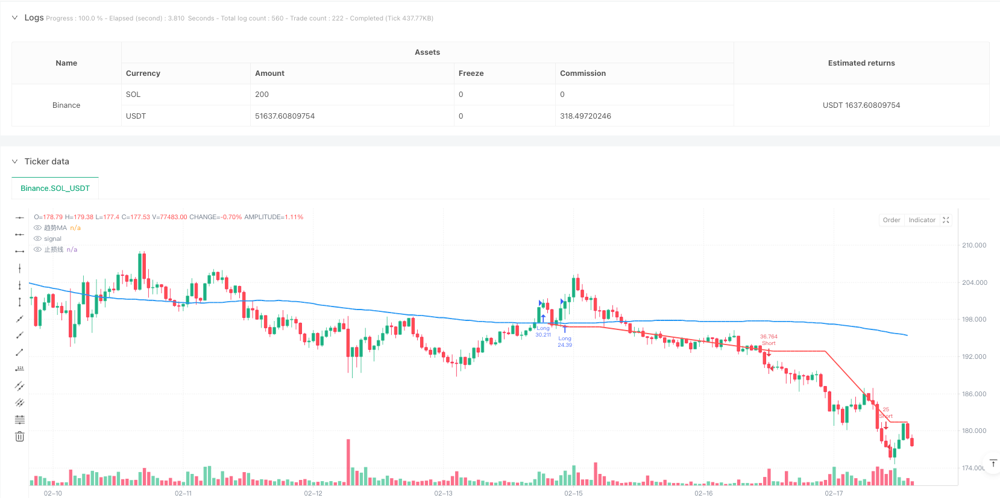
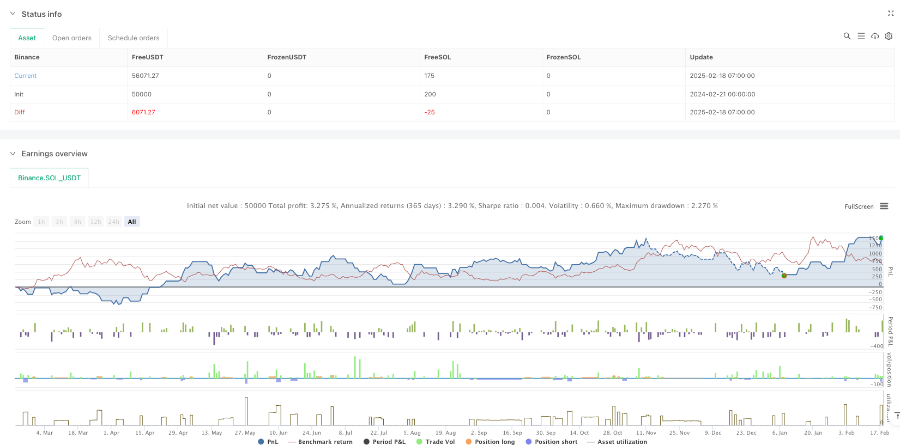

> Name

Dynamic-Support-Resistance-Breakout-Trading-Strategy-with-Trend-Filtering-and-Risk-Management-System
> Author

ianzeng123

> Strategy Description





[trans]
#### Overview
This is a trading strategy based on support and resistance area breakouts, combined with a trend filter and risk management system. The strategy identifies potential trading opportunities by dynamically identifying key price levels and uses moving averages to confirm market trend direction. This strategy adopts a conservative fund management method, limiting the risk of each transaction to less than 1% of the account funds, and using a 2:1 return-to-risk ratio to set a profit-taking position.
#### Strategy Principle
The core logic of the strategy includes the following key components:
1. Use pivot highs and lows to identify potential areas of support and resistance
2. Create support and resistance zones by setting price deviation percentages
3. Use the 200-day moving average as a trend filter
4. Confirm the validity of the breakout through candlestick patterns
5. Implement strict fund management rules to control the risk of each transaction
When the price breaks through the resistance area and the trend is upward, the system opens a long position; when the price falls below the support area and the trend is downward, the system opens a short position.
#### Strategic Advantages
1. Dynamically identify market structure - the strategy can automatically identify and update important price levels to adapt to market changes
2. Multiple confirmation mechanism - combines trend filtering and candle chart confirmation to reduce the risk of false breakthroughs
3. Complete risk management - adopt fixed risk rules to protect account funds
4. Clear profit target - use a profit-to-risk ratio of 2:1 to set a take-profit position
5. Visual trading signals - clearly display support, resistance areas and stop loss lines on the chart
#### Strategy Risk
1. Market volatility risk - Slippage may occur during periods of high volatility, affecting actual trading results
2. Trend reversal risk - the market may reverse quickly after a breakthrough, leading to stop-loss exits
3. Risks of parameter optimization - over-optimizing parameters may lead to overfitting
4. Fund management risk - continuous stop loss may affect account growth
It is recommended to manage these risks by backtesting different market environments and adjusting parameter settings.
#### Strategy optimization direction
1. Dynamically adjust the support and resistance area width - automatically adjust the area range based on market volatility
2. Add volume confirmation - add volume filters to breakout signals
3. Optimize trend filters - consider using multi-period trend confirmations
4. Improve the take-profit strategy - implement dynamic take-profit and adjust profit targets according to market conditions
5. Add time filtering - avoid trading during periods of greater market volatility
#### Summary
This is a well-structured trading strategy that provides a systematic approach to trading by combining technical analysis and risk management principles. The advantage of the strategy lies in its comprehensive trading guidelines and strict risk control, but it also requires traders to understand its limitations and make appropriate optimization and adjustments based on actual trading conditions. Through continuous improvement and verification, the strategy is expected to maintain stable performance in different market environments. ||
#### Overview
This is a trading strategy based on support and resistance zone breakouts, incorporating trend filtering and risk management systems. The strategy dynamically identifies key price levels to determine potential trading opportunities and uses moving averages to confirm market trend direction. It employs a conservative money management approach, limiting risk to 1% of account capital per trade, while using a 2:1 reward-to-risk ratio for profit targets.

#### Strategy Principles
The core logic includes several key components:
1. Using pivot highs and lows to identify potential support and resistance zones
2. Creating support/resistance zones through price offset percentages
3. Utilizing a 200-day moving average as a trend filter
4. Confirming breakout validity through candlestick patterns
5. Implementing strict money management rules to control risk per trade
The system enters long positions when price breaks above resistance in an uptrend and short positions when price breaks below support in a downtrend.

#### Strategy Advantages
1. Dynamic Market Structure Recognition - Automatically identifies and updates important price levels, adapting to market changes
2. Multiple Confirmation Mechanisms - Combines trend filtering and candlestick confirmation to reduce false breakout risks
3. Comprehensive Risk Management - Uses fixed risk rules to protect account capital
4. Clear Profit Objectives - Implements 2:1 reward-to-risk ratio for profit targets
5. Visualized Trading Signals - Clearly displays support/resistance zones and stop-loss levels on charts

#### Strategy Risks
1. Market Volatility Risk - Slippage during high volatility periods may affect actual trading results
2. Trend Reversal Risk - Market might quickly reverse after breakout, triggering stop-loss
3. Parameter Optimization Risk - Over-optimization may lead to overfitting
4. Money Management Risk - Consecutive losses may impact account growth
Suggested to manage these risks through backtesting different market conditions and adjusting parameters accordingly.

#### Strategy Optimization Directions
1. Dynamic Zone Width Adjustment - Automatically adjust zone ranges based on market volatility
2. Add Volume Confirmation - Incorporate volume filters in breakout signals
3. Enhance Trend Filter - Consider multi-timeframe trend confirmation
4. Improve Profit-Taking Strategy - Implement dynamic profit targets based on market conditions
5. Add Time Filters - Avoid trading during highly volatile market periods

#### Summary
This is a well-structured trading strategy that combines technical analysis and risk management principles to provide a systematic trading approach. Its strengths lie in comprehensive trading rules and strict risk control, but traders need to understand its limitations and make appropriate optimizations based on actual trading conditions. Through continuous improvement and validation, the strategy has the potential to maintain stable performance across different market environments.[/trans]


> Source (PineScript)

``` pinescript
/*backtest
start: 2024-02-21 00:00:00
end: 2025-02-18 08:00:00
period: 1h
basePeriod: 1h
exchanges: [{"eid":"Binance","currency":"SOL_USDT"}]
*/

//@version=5
strategy("支撑/阻力区域突破策略(2倍止盈 + 蜡烛确认 + 趋势过滤)", overlay=true, initial_capital=10000, currency=currency.USD, pyramiding=0, calc_on_order_fills=true, calc_on_every_tick=true)

// 用户输入设置
pivotLen = input.int(title="枢轴识别窗口长度", defval=5, minval=1)
zoneOffsetPercent = input.float(title="区域偏移百分比 (%)", defval=0.1, step=0.1)
maLength = input.int(200, title="移动平均线周期")

// 趋势指标: 简单移动平均线(SMA)
trendMA = ta.sma(close, maLength)

// 识别高点和低点(枢轴高点/低点)
ph = ta.pivothigh(high, pivotLen, pivotLen)
pl = ta.pivotlow(low, pivotLen, pivotLen)

// 存储最近的阻力位和支撑位
var float resistanceLevel = na
var int resistanceBar = na
if not na(ph)
    resistanceLevel := ph
    resistanceBar := bar_index - pivotLen

var float supportLevel = na
var int supportBar = na
if not na(pl)
    supportLevel := pl
    supportBar := bar_index - pivotLen

// 将阻力和支撑区域绘制为区域框
if not na(resistanceLevel)
    resOffset = resistanceLevel * (zoneOffsetPercent / 100)
    resTop = resistanceLevel + resOffset
    resBottom = resistanceLevel - resOffset


if not na(supportLevel)
    supOffset = supportLevel * (zoneOffsetPercent / 100)
    supTop = supportLevel + supOffset
    supBottom = supportLevel - supOffset


// 风险管理: 定义资金、风险百分比和计算风险金额
riskCapital = 10000.0
riskPercent = 0.01
riskAmount = riskCapital * riskPercent   // 1% of $10,000 = $100

// activeStop变量用于显示止损位
var float activeStop = na
if strategy.position_size == 0
    activeStop := na

// 确定趋势方向
isUptrend = close > trendMA   // 上升趋势(价格在MA之上)
isDowntrend = close < trendMA  // 下降趋势(价格在MA之下)

// 定义突破蜡烛和确认蜡烛
var bool breakoutUp = false
var bool breakoutDown = false

if not na(resistanceLevel) and close[1] > resistanceLevel and open[1] < resistanceLevel
    breakoutUp := true
else
    breakoutUp := false

if not na(supportLevel) and close[1] < supportLevel and open[1] > supportLevel
    breakoutDown := true
else
    breakoutDown := false

// 突破确认: 下一根蜡烛必须在突破方向收盘
confirmLong = breakoutUp and close > close[1] and strategy.position_size == 0 and isUptrend
confirmShort = breakoutDown and close < close[1] and strategy.position_size == 0 and isDowntrend

// 做多入场: 确认蜡烛 + 在突破蜡烛低点设置止损
if confirmLong
    entryPrice = close
    stopLevelLong = low[1]
    riskPerUnit = entryPrice - stopLevelLong
    if riskPerUnit > 0
        qty = riskAmount / riskPerUnit
        activeStop := stopLevelLong
        takeProfitLong = entryPrice + (riskPerUnit * 2)  // 止盈设为止损的2倍
        strategy.entry("Long", strategy.long, qty=qty)
        strategy.exit("Exit Long", from_entry="Long", stop=stopLevelLong, limit=takeProfitLong)

// 做空入场: 确认蜡烛 + 在突破蜡烛高点设置止损
if confirmShort
    entryPrice = close
    stopLevelShort = high[1]
    riskPerUnit = stopLevelShort - entryPrice
    if riskPerUnit > 0
        qty = riskAmount / riskPerUnit
        activeStop := stopLevelShort
        takeProfitShort = entryPrice - (riskPerUnit * 2)  // 止盈设为止损的2倍
        strategy.entry("Short", strategy.short, qty=qty)
        strategy.exit("Exit Short", from_entry="Short", stop=stopLevelShort, limit=takeProfitShort)

// 当有持仓时在图表上显示止损线(水平线)
plot(strategy.position_size != 0 ? activeStop : na, title="止损线", color=color.red, linewidth=2, style=plot.style_line)

// 在图表上显示移动平均线
plot(trendMA, title="趋势MA", color=color.blue, linewidth=2)
```

> Detail

https://www.fmz.com/strategy/482866

> Last Modified

2025-02-27 17:33:24
