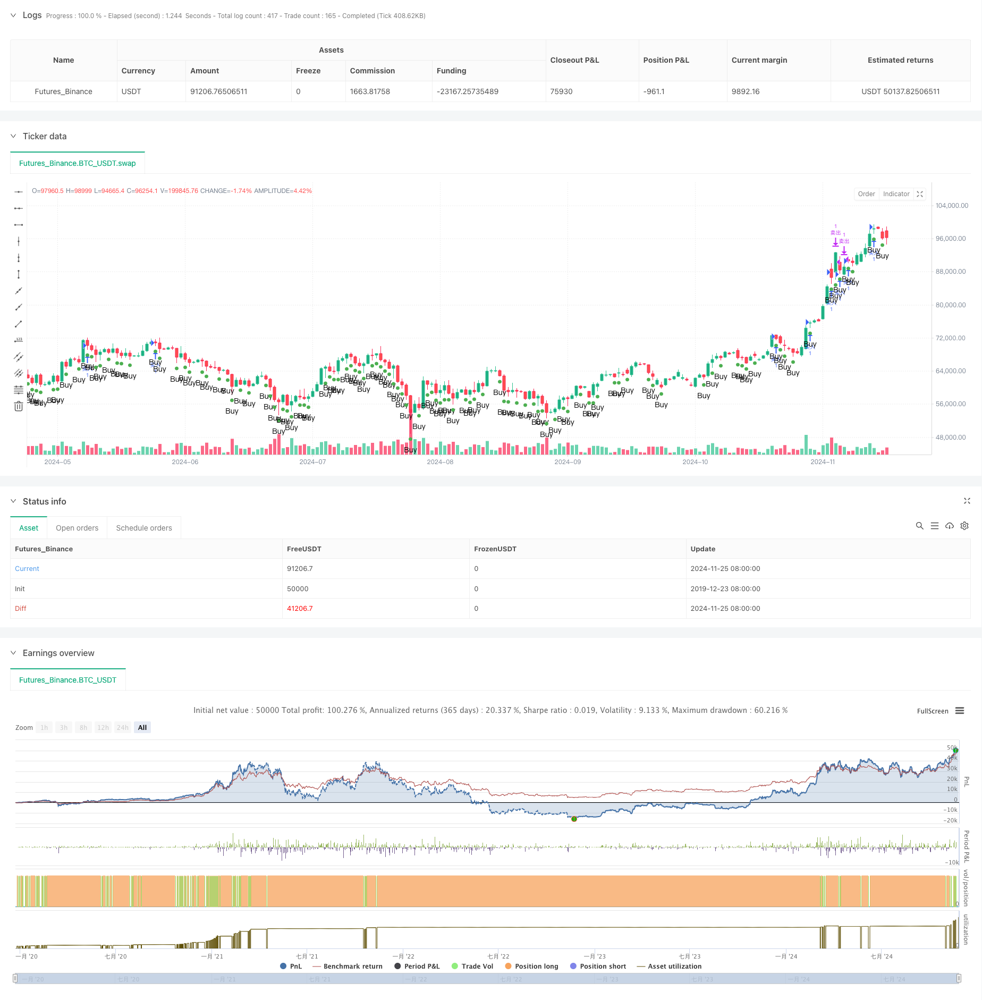

> Name

Dynamic-Take-Profit-Smart-Trailing-Strategy
> Author

ChaoZhang

> Strategy Description



[trans]
#### Overview
This strategy is an intelligent trading system based on falling price signals that combines dynamic take-profit and trailing stop-loss functions. The strategy identifies potential buying opportunities by monitoring the extent of price declines, while employing flexible take-profit plans and trailing stop-loss mechanisms to protect profits. The core idea of ​​the strategy is to enter the market when prices decline significantly and maximize returns through intelligent position management.
#### Strategy Principle
The operating mechanism of the strategy mainly includes three core parts: First, the buy signal is identified by setting the price drop percentage threshold (default is -0.98%). When the lowest price of a certain K line is lower than the opening price multiplied by (1 + drop percentage), the buy signal is triggered. Secondly, use a fixed percentage (default is 1.23%) as the target profit to set the take-profit price. Finally, a trailing stop mechanism (default 0.6%) is introduced to protect already-earned profits in the event of a price retracement. The strategy also contains a visual component that displays buy signals through differently shaped markers.
#### Strategic Advantages
1. Accurate signal identification: Identify potential buying opportunities through accurate price drop calculations to avoid interference from false signals.
2. Perfect risk management: Combining fixed take-profit and trailing stop-loss not only ensures profit margins, but also effectively controls risks.
3. Flexible and adjustable parameters: The main parameters can be adjusted according to market conditions and transaction needs, and are highly adaptable.
4. Good visualization effect: The buy signal is clearly visible, which facilitates traders to make quick judgments and decisions.
5. Clear execution logic: clear entry and exit conditions to avoid uncertainty caused by subjective judgment.
#### Strategy Risk
1. Risk of false breakthrough: In a volatile market, frequent false breakthrough signals may appear. It is recommended to increase trading volume and other auxiliary indicators for confirmation.
2. Risk of stop loss setting: If the trailing stop loss ratio is set too small, it may lead to premature exit; if it is too large, it may cause too much profit loss. It needs to be adjusted according to actual fluctuations.
3. Market environment dependence: The strategy performs better in markets with obvious trends, but in volatile markets, frequent trading may lead to losses.
4. Parameter sensitivity: The strategy effect is relatively sensitive to parameter settings, and the optimal parameter combination needs to be found through backtesting.
#### Strategy optimization direction
1. Signal filtering optimization: Add trading volume, volatility and other indicators as auxiliary judgment conditions to improve signal quality.
2. Dynamic parameter adjustment: Dynamically adjust the stop-profit and stop-loss parameters according to market fluctuations to improve strategy adaptability.
3. Time period optimization: Add multi-time period analysis to improve signal reliability.
4. Position management optimization: Introduce a dynamic position management mechanism and adjust the opening ratio according to signal strength and market conditions.
5. Market environment judgment: Add a market environment judgment mechanism and adopt different parameter settings under different market conditions.
#### Summary
This strategy builds a complete trading system by combining price drop signal recognition, dynamic take-profit and trailing stop-loss mechanisms. The advantage of the strategy lies in accurate signal identification and perfect risk management, but it is also necessary to pay attention to risks such as false breakthroughs and parameter sensitivity. By adding auxiliary indicators and optimizing the parameter adjustment mechanism, the stability and profitability of the strategy can be further improved. This is a strategic framework with good practical value, suitable for in-depth research and optimization.
|| 

#### Overview
This strategy is an intelligent trading system based on price drop signals, combining dynamic take-profit and trailing stop-loss features. The strategy identifies potential buying opportunities by monitoring price drops while employing flexible profit-taking schemes and trailing stop mechanisms to protect profits. The core idea is to enter positions during significant price drops and maximize returns through intelligent position management.

#### Strategy Principles
The strategy operates through three core components: First, it identifies buy signals by setting a price drop percentage threshold (default -0.98%), triggering when a candle's low price falls below the opening price multiplied by (1 + drop percentage). Second, it uses a fixed percentage (default 1.23%) as the target profit for setting take-profit levels. Finally, it incorporates a trailing stop mechanism (default 0.6%) to protect profits during price retracements. The strategy includes visualization components, displaying buy signals through various marker shapes.

#### Strategy Advantages
1. Precise Signal Identification: Accurately identifies potential buying opportunities through precise price drop calculations, avoiding false signals.
2. Comprehensive Risk Management: Combines fixed take-profit and trailing stop-loss, ensuring profit potential while effectively controlling risk.
3. Flexible Parameters: Main parameters can be adjusted according to market conditions and trading requirements, providing high adaptability.
4. Excellent Visualization: Buy signals are clearly visible, facilitating quick judgment and decision-making.
5. Clear Execution Logic: Entry and exit conditions are well-defined, eliminating uncertainty from subjective judgment.

#### Strategy Risks
1. False Breakout Risk: Frequent false signals may occur in ranging markets. Consider adding volume indicators for confirmation.
2. Stop-Loss Setting Risk: Too tight trailing stops may result in premature exits, while too loose stops might sacrifice profits. Adjustment based on actual volatility is necessary.
3. Market Environment Dependency: Strategy performs better in trending markets but may incur losses due to frequent trading in ranging markets.
4. Parameter Sensitivity: Strategy effectiveness is sensitive to parameter settings, requiring backtesting to find optimal combinations.

#### Strategy Optimization Directions
1. Signal Filtering: Add volume and volatility indicators as auxiliary conditions to improve signal quality.
2. Dynamic Parameter Adjustment: Dynamically adjust take-profit and stop-loss parameters based on market volatility.
3. Timeframe Optimization: Incorporate multiple timeframe analysis to enhance signal reliability.
4. Position Management: Introduce dynamic position sizing based on signal strength and market conditions.
5. Market Environment Assessment: Add market condition evaluation to adapt parameters to different market states.

#### Summary
This strategy builds a complete trading system by combining price drop signal identification, dynamic take-profit, and trailing stop-loss mechanisms. Its strengths lie in accurate signal identification and comprehensive risk management, though attention must be paid to false breakouts and parameter sensitivity risks. The strategy's stability and profitability can be further enhanced by adding auxiliary indicators and optimizing parameter adjustment mechanisms. It provides a valuable strategic framework suitable for in-depth research and optimization.[/trans]


> Source (PineScript)

``` pinescript
/*backtest
start: 2019-12-23 08:00:00
end: 2024-11-26 00:00:00
period: 1d
basePeriod: 1d
exchanges: [{"eid":"Futures_Binance","currency":"BTC_USDT"}]
*/

//@version=5
strategy("Price Drop Buy Signal Strategy", overlay=true)

// 输入参数
percentDrop = input.float(defval=-0.98, title="Price Drop Percentage", minval=-100, step=0.01) / 100
plotShapeStyle = input.string("shape_triangle_up", "Shape", options=["shape_xcross", "shape_cross", "shape_triangle_up", "shape_triangle_down", "shape_flag", "shape_circle", "shape_arrow_up", "shape_arrow_down", "shape_label_up", "shape_label_down", "shape_square", "shape_diamond"], tooltip="Choose the shape of the buy signal marker")
targetProfit = input.float(1.23, title="目标利润百分比", step=0.01) / 100
trailingStopPercent = input.float(0.6, title="Trailing Stop Percentage", step=0.01) / 100

// 计算每根K线的涨跌幅
priceDrop = open * (1.0 + percentDrop)
isBuySignal = low <= priceDrop

// 在当前K线下方标注买入信号（可选）
plotshape(series=isBuySignal, location=location.belowbar, color=color.green, style=plotShapeStyle, size=size.small, title="Buy Signal", text="Buy")

// 显示信息
if bar_index == na
    label.new(x=bar_index, y=na, text=str.tostring(percentDrop * 100, format.mintick) + "% Drop", xloc=xloc.bar_index, yloc=yloc.price, style=label.style_label_down, color=color.new(color.green, 0))
else
    label.delete(na)

// 策略逻辑
if (isBuySignal)
    strategy.entry("买入", strategy.long)

// 目标卖出价
if (strategy.position_size > 0)
    targetSellPrice = strategy.position_avg_price * (1 + targetProfit)
    strategy.exit("卖出", from_entry="买入", limit=targetSellPrice, trail_offset=strategy.position_avg_price * trailingStopPercent)

```

> Detail

https://www.fmz.com/strategy/473155

> Last Modified

2024-11-27 16:41:16
